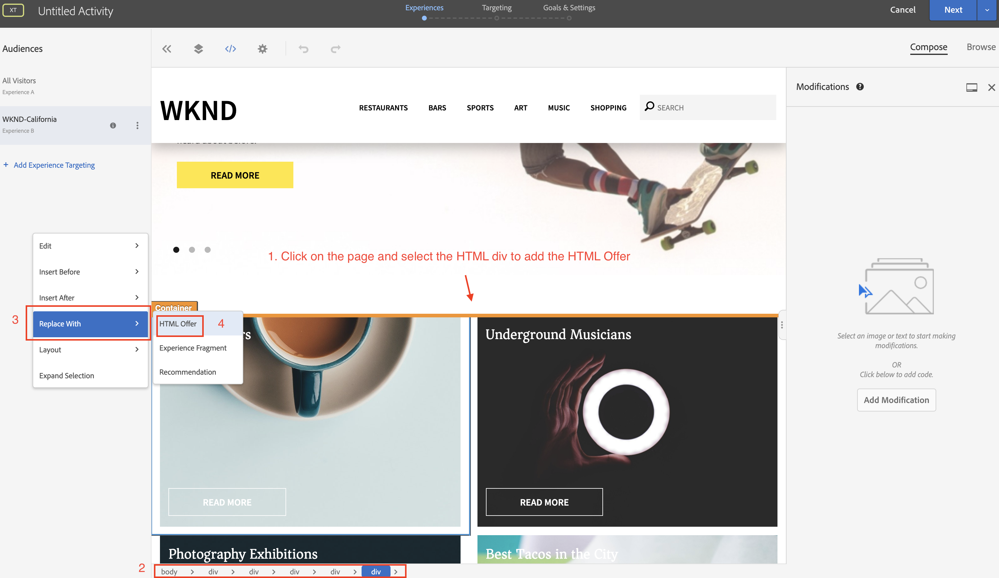
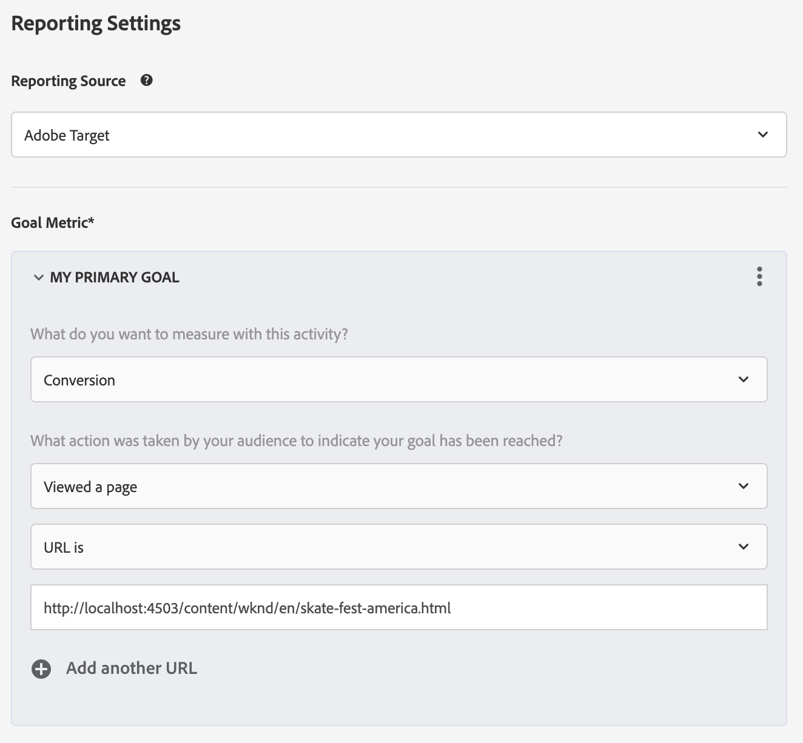
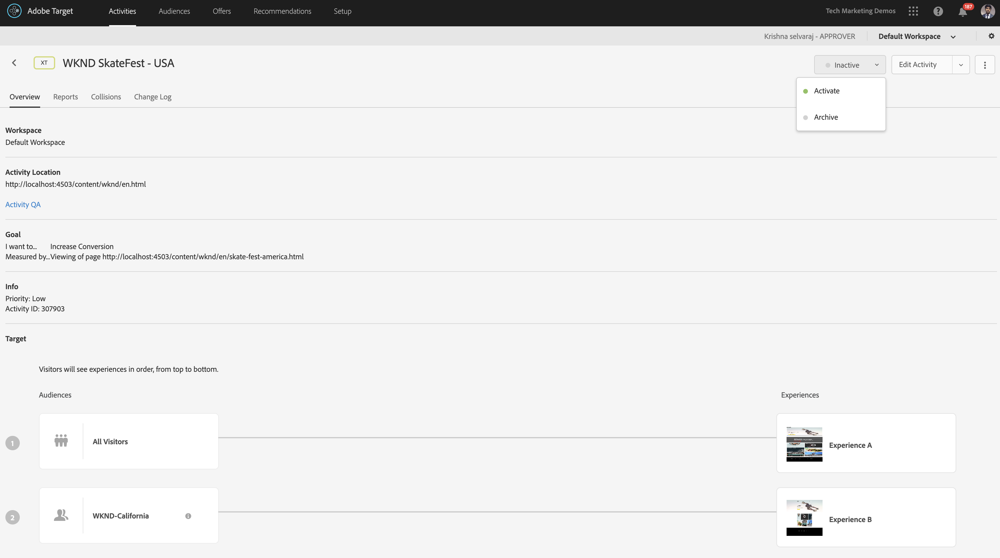

# Personalisering med AEM Experience Fragments och Adobe Target

Med möjligheten att exportera AEM Experience Fragments till Adobe Target som HTML-erbjudanden kan ni kombinera lättanvända och kraftfulla AEM med kraftfulla funktioner för Automated Intelligence (AI) och Machine Learning (ML) i Target för att testa och personalisera upplevelser i stor skala.

AEM samlar allt innehåll och alla resurser på en central plats för att understödja er personaliseringsstrategi. AEM gör det enkelt att skapa innehåll för datorer, surfplattor och mobila enheter på en och samma plats utan att behöva skriva kod. Du behöver inte skapa sidor för alla enheter. AEM justerar automatiskt varje upplevelse med ditt innehåll.

Med Target kan ni leverera personaliserade upplevelser i stor skala baserat på en kombination av regelbaserade och AI-drivna maskininlärningsstrategier som innehåller beteendevariabler, sammanhangsbaserade variabler och offlinevariabler.  Med Target kan ni enkelt konfigurera och köra A/B- och Multivariate-aktiviteter (MVT) för att fastställa de bästa erbjudandena, innehållet och upplevelserna.

Upplevelsefragment är ett stort steg framåt när det gäller att länka innehållsskapare till marknadsförare som driver affärsresultaten med Target.

## Scenarioöversikt

WKND planerar att lansera en **SkateFest Challenge** i hela Amerika via deras webbplats och vill att deras webbplatsanvändare ska registrera sig för en provspelning som utförs i respektive stat. Som marknadsförare har du tilldelats uppgiften att köra en kampanj på WKND-webbplatsens hemsida, med bannermeddelanden som är relevanta för användarens plats och en länk till sidan med händelseinformation. Låt oss utforska WKND:s hemsida och lära oss hur man skapar och levererar en personaliserad upplevelse som bygger på användarens aktuella plats.

### Berörda användare

För den här övningen måste följande användare vara involverade och för att kunna utföra vissa uppgifter måste du ha administratörsbehörighet.

* **Content Producer/Content Editor** (Adobe Experience Manager)
* **Marknadsförare** (Adobe Target/optimeringsteamet)

### Förutsättningar

* **AEM**
   * [AEM författare och publicera instans](./implementation.md#getting-aem) som körs på localhost 4502 respektive 4503.
* **Experience Cloud**
   * Tillgång till er organisation Adobe Experience Cloud - `https://<yourcompany>.experiencecloud.adobe.com`
   * Experience Cloud tillhandahålls med följande lösningar
      * [Adobe Target](https://experiencecloud.adobe.com)

### Startsida för WKND-webbplats

1. Marketer initierar WKND SkateFest-kampanjdiskussionen med AEM Content Editor och redogör för kraven.
   * ***Krav***: Marknadsför WKND SkateFest-kampanjen på WKND:s hemsida med personaliserat innehåll för besökare från alla delstater i USA. Lägg till ett nytt innehållsblock under Home Page Carousel som innehåller en bakgrundsbild, text och en knapp.
      * **Bakgrundsbild**: Bilden ska vara relevant för det tillstånd från vilket användaren besöker WKND-webbplatssidan.
      * **Text**:&quot;Registrera dig för Audition&quot;
      * **Knapp**:&quot;Händelseinformation&quot; som pekar på WKND SkateFest-sidan
      * **WKND SkateFest Page**: en ny sida med händelseinformation, inklusive auditionsplats, datum och tid.
1. AEM Content Editor skapar en Experience Fragment för innehållsblocket och exporterar det till Adobe Target som ett erbjudande. Om du vill leverera anpassat innehåll för alla lägen i USA kan innehållsförfattaren skapa en Experience Fragment-huvudvariant och sedan skapa 50 andra varianter, en för varje läge. Innehåll för varje lägesvariation med relevanta bilder och text kan sedan redigeras manuellt. När du redigerar ett Experience Fragment kan redigerare snabbt få tillgång till alla resurser som finns i AEM Assets med hjälp av alternativet Resurssökning. När en Experience Fragment exporteras till Adobe Target skickas alla dess varianter också till Adobe Target som erbjudanden.

1. Efter att ha exporterat Experience Fragment från AEM till Adobe Target som erbjudanden kan marknadsförarna skapa aktiviteter i Target med dessa erbjudanden. Baserat på SkateFest-kampanjen på WKND-webbplatsen måste marknadsföraren skapa och leverera en personaliserad upplevelse till WKND-webbplatsbesökare från varje stat. För att skapa en Experience Targeting-aktivitet måste marknadsföraren identifiera målgrupperna. För vår WKND SkateFest-kampanj måste vi skapa 50 separata målgrupper utifrån deras plats på WKND:s webbplats.
   * [Målgrupper](https://experienceleague.adobe.com/docs/target/using/introduction/target-key-concepts.html#section_3F32DA46BDF947878DD79DBB97040D01) Definiera målet för din aktivitet och används var som helst där målinriktning finns tillgänglig. Målgrupper är en definierad uppsättning besökskriterier. Erbjudandena kan riktas till specifika målgrupper (eller segment). Det är bara besökare som tillhör den målgruppen som ser upplevelsen som är riktad till dem.  Du kan till exempel leverera ett erbjudande till en publik som består av besökare som använder en viss webbläsare eller från en viss geografisk plats.
   * An [Erbjudande](https://experienceleague.adobe.com/docs/target/using/introduction/target-key-concepts.html#section_973D4CC4CEB44711BBB9A21BF74B89E9) är det innehåll som visas på dina webbsidor under kampanjer eller aktiviteter. När du testar dina webbsidor mäter du framgången för varje upplevelse med olika erbjudanden på dina platser. Ett erbjudande kan innehålla olika typer av innehåll, bland annat:
      * Bild
      * Text
      * **HTML**
         * *HTML-erbjudanden används för det här scenariots aktivitet*
      * Länk
      * Knapp

## Innehållsredigeringsaktiviteter

>[!VIDEO](https://video.tv.adobe.com/v/28596?quality=12&learn=on)

>[!NOTE]
>
>Publicera Experience Fragment innan du exporterar det till Adobe Target.

## Marknadsföringsaktiviteter

### Skapa en målgrupp med geolokalisering {#marketer-audience}

1. Navigera till dina organisationer [Adobe Experience Cloud](https://experiencecloud.adobe.com/) (`<https://<yourcompany>.experiencecloud.adobe.com`)
1. Logga in med din Adobe ID och kontrollera att du är i rätt organisation.
1. Klicka på **Mål** och sedan **starta** Adobe Target.

   

1. Navigera till **Erbjudanden** och söka efter&quot;WKND&quot;. Du bör kunna se listan över Experience Fragments-variationer, som exporteras från AEM som HTML Offers. Varje erbjudande motsvarar ett läge. Till exempel: *WKND SkateFest California* är erbjudandet som skickas till en WKND Site-besökare från Kalifornien.

   

1. I huvudnavigeringen klickar du på **Målgrupper**.

   En marknadsförare måste skapa 50 separata målgrupper för WKND:s webbplatsbesökare som kommer från varje delstat i USA.

1. Om du vill skapa en målgrupp klickar du på **Skapa publik** och ange ett namn för målgruppen.

   **Målgruppsnamnformat: WKND-\&lt;*läge*\>**

   

1. Klicka **Lägg till regel > Geo**.
1. Klicka **Välj** väljer du sedan något av följande alternativ:
   * Land
   * **Läge** *(Välj tillstånd för WKND Site SkateFest Campaign)*
   * Ort
   * Postnummer
   * Latitude
   * Longitud
   * DMA
   * Mobiloperatör

   **Geo** - Använd målgrupper för att rikta in er på användare baserat på deras geografiska plats, inklusive land, stat/provins, ort, postnummer, DMA eller mobiloperatör. Med geopositioneringsparametrar kan ni inrikta er på aktiviteter och upplevelser baserat på besökarnas geografiska läge. Dessa data skickas med varje Target-begäran och baseras på besökarens IP-adress. Välj de här parametrarna precis som andra målvärden.

   >[!NOTE]
   >En besökares IP-adress skickas med en mbox-begäran, en gång per besök (session), för att matcha parametrar för geomål för den besökaren.

1. Välj operatorn som **matchar**, ange ett lämpligt värde (t.ex. Kalifornien) och **Spara** dina ändringar. Ange i så fall delstatens namn.

   

   >[!NOTE]
   >Du kan ha flera regler tilldelade till en målgrupp.

1. Upprepa steg 6-9 för att skapa målgrupper för de andra lägena.

   

I nuläget har vi skapat målgrupper för alla WKND Site-besökare i olika delstater i USA och även motsvarande HTML-erbjudande för respektive delstat. Låt oss nu skapa en Experience Targeting-aktivitet för att rikta in oss på målgruppen med ett motsvarande erbjudande för WKND Site Home Page.

### Skapa en aktivitet med geolokalisering

1. I Adobe Target-fönstret går du till **Verksamhet** -fliken.
1. Klicka **Skapa aktivitet** och väljer **Experience Targeting** aktivitetstyp.
1. Välj **Webb** kanal och välj **Visual Experience Composer**.
1. Ange **Aktivitets-URL** och klicka **Nästa** för att öppna Visual Experience Composer.

   Publicerings-URL för WKND-hemsida: http://localhost:4503/content/wknd/en.html

   

1. För **Visual Experience Composer** att läsa in, aktivera **Tillåt inläsning av osäkra skript** i webbläsaren och läsa in sidan igen.

   

1. Observera att WKND-webbplatsens hemsida är öppen i Visual Experience Composer-redigeraren.

   

1. Om du vill lägga till en publik i din VEC klickar du på **Lägg till Experience Targeting** under Publiker och välj WKND-California-målgrupp och klicka på **Nästa**.

   

1. Klicka på WKND-webbsidan i VEC, markera HTML-elementet för att lägga till erbjudandet för WKND-Kalifornien och välj **Ersätt med** och sedan väljer **HTML**.

   

1. Välj **WKND SkateFest California** HTML erbjuder **WKND-Kalifornien** välj användargränssnitt och klicka **Klar**.
1. Nu bör du kunna se **WKND SkateFest California** HTML Erbjudandet har lagts till på WKND Site-sidan för WKND-California-målgruppen.
1. Upprepa steg 7-10 för att lägga till Experience Targeting för de andra lägena och välj motsvarande HTML-erbjudande.
1. Klicka **Nästa** för att fortsätta, och ni kan se en mappning för målgrupper till upplevelser.
1. Klicka **Nästa** för att gå över till mål och inställningar.
1. Välj rapportkälla och identifiera ett primärt mål för din aktivitet. I vårt scenario väljer vi rapportkällan som **Adobe Target**, mäta aktivitet som **Konvertering**, åtgärd som visad på en sida och URL som pekar på sidan WKND SkateFest Details.

   

   >[!NOTE]
   >Du kan också välja Adobe Analytics som rapportkälla.

1. Håll muspekaren över det aktuella aktivitetsnamnet så kan du byta namn på det till **WKND SkateFest - USA** och sedan **Spara och stäng** dina ändringar.
1. På skärmen Aktivitetsinformation ser du till att **Aktivera** din aktivitet.

   

1. Din WKND SkateFest-kampanj är nu tillgänglig för alla WKND-webbplatsbesökare.
1. Navigera till [Startsida för WKND-webbplats](http://localhost:4503/content/wknd/en.html)och du bör kunna se WKND SkateFest-erbjudandet baserat på din geografiska plats (*delstat: Kalifornien*).

   

### Målaktivitet, QA

1. Under **Aktivitetsinformation > Översikt** klickar du på **Aktivitets-QA** så kan ni få en direkt QA-länk till alla era upplevelser.

   

1. Navigera till [Startsida för WKND-webbplats](http://localhost:4503/content/wknd/en.html)och du bör kunna se WKND SkateFest-erbjudandet baserat på din geografiska plats (läge).
1. Titta på videon nedan för att förstå hur ett erbjudande levereras till din sida, hur du anpassar svarstoken och för att utföra en kvalitetskontroll.

>[!VIDEO](https://video.tv.adobe.com/v/28658?quality=12&learn=on)

## Sammanfattning

I det här kapitlet kunde en innehållsredigerare skapa allt innehåll som kunde stödja WKND SkateFest-kampanjen i Adobe Experience Manager och exportera det till Adobe Target som HTML Offers för att skapa Experience Targeting, baserat på användarnas geografiska plats.
