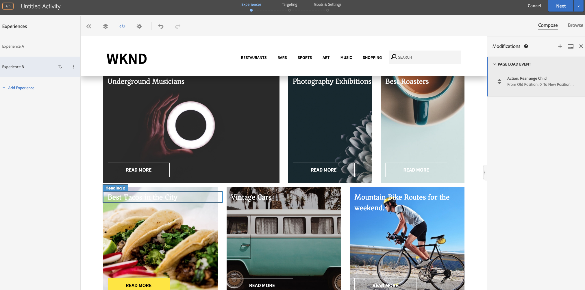

# Personalisering med Visual Experience Composer

I det här kapitlet ska vi utforska hur du skapar upplevelser med **Visual Experience Composer** genom att dra och släppa, byta och ändra layouten och innehållet på en webbsida inifrån Target.

## Scenarioöversikt

På WKND:s hemsida visas lokala aktiviteter eller det bästa att göra runt en stad i form av kortlayouter. Som marknadsförare har du tilldelats uppgiften att ändra hemsidan genom att ordna om kortlayouterna för att se hur det påverkar användarengagemanget och driver konverteringen.

### Berörda användare

För den här övningen måste följande användare vara involverade och för att kunna utföra vissa uppgifter måste du ha administratörsbehörighet.

* **Content Producer/Content Editor** (Adobe Experience Manager)
* **Marknadsförare** (Adobe Target/optimeringsteamet)

### Startsida för WKND-webbplats


### Förutsättningar

* **AEM**
   * [AEM publiceringsinstans](./implementation.md#getting-aem) som körs på 4503
   * [AEM integrerat med Adobe Target med Adobe Experience Platform Launch](./using-launch-adobe-io.md#aem-target-using-launch-by-adobe)
* **Experience Cloud**
   * Tillgång till dina organisationer Adobe Experience Cloud - <https://>`<yourcompany>`.experienceCloud.adobe.com
   * Experience Cloud som tillhandahålls med [Adobe Target](https://experiencecloud.adobe.com)

## Marknadsföringsaktiviteter

1. Marketern skapar en A/B-målaktivitet inom Adobe Target.
   1. Gå till fliken **Verksamheter** i Adobe Target-fönstret.
   2. Klicka på **Skapa aktivitet** och välj aktivitetstypen som **A/B-test**

      
   3. Markera **webbkanalen** och välj **Visual Experience Composer**.
   4. Ange **aktivitets-URL** och klicka på **Nästa** för att öppna Visual Experience Composer.
      
   5. Aktivera **Tillåt inläsning av osäkra skript** i webbläsaren och läs in sidan igen för att **Visual Experience Composer** ska kunna läsas in.
      
   6. Observera att WKND-webbplatsens hemsida är öppen i Visual Experience Composer-redigeraren.
      
   7. **Experience A** innehåller WKND:s standardhemsida och vi redigerar innehållslayouten för **Experience B**.
      
   8. Klicka på en av kortlayoutbehållarna (*Bästa roasters*) och välj alternativet **Ordna** om.
      
   9. Klicka på behållaren som du vill ändra ordning på och dra och släpp den till önskad plats. Vi ordnar om behållaren *Bästa roasters* från första raden i kolumn 1 till tredje raden. Nu kommer behållaren *Best Roasters* att finnas bredvid *Photography Exhibition* container.
      

      **Efter växling**
      
   10. Du kan även ordna om positionerna för de andra kortbehållarna.
      
   11. Låt oss också lägga till en rubriktext under karusellkomponenten och ovanför kortlayouten.
   12. Klicka på karusellbehållaren och välj alternativet **Lägg till efter > HTML** för att lägga till HTML.
      

      ```html
      <h1 style="text-align:center">Check Out the Hot Spots in Town</h1>
      ```

      
   13. Klicka på **Nästa** för att fortsätta med din aktivitet.
   14. Välj **Traffic Allocation Method** som manual och tilldela 100 % trafik till **Experience B**.
      
   15. Klicka på **Nästa**.
   16. Ange **målvärden** för aktiviteten och spara och stäng A/B-testet.
      
   17. Ange ett namn (**WKND Home Page Refresh**) för aktiviteten och spara ändringarna.
   18. På skärmen Aktivitetsinformation ser du till att du **aktiverar** din aktivitet.
      
   19. Navigera till WKND-hemsida (http://localhost:4503/content/wknd/en.html) och se ändringarna vi lade till i aktiviteten Uppdatera A/B-test för WKND-hemsidan.
      
   20. Öppna webbläsarkonsolen och kontrollera nätverksfliken för att se efter målsvaret för aktiviteten Uppdatera A/B-test på WKND-startsidan.
      

## Sammanfattning

I det här kapitlet kunde en marknadsförare skapa en upplevelse med Visual Experience Composer genom att dra och släppa, byta och ändra layouten och innehållet på en webbsida utan att ändra någon kod för att köra ett test.
