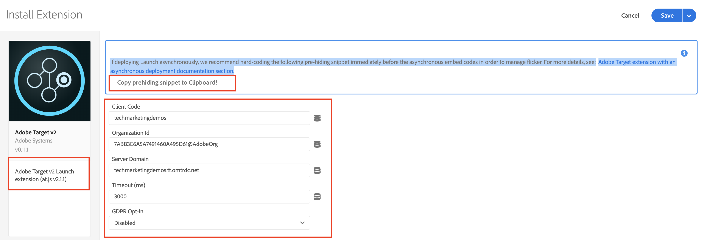

# Använda Adobe Experience Platform Launch via Adobe Developer Console

## Förutsättningar

* [AEM författare och publicera instans](./implementation.md#set-up-aem) körs på localhost-port 4502 respektive 4503
* **Experience Cloud**
   * Tillgång till er organisation Adobe Experience Cloud - `https://<yourcompany>.experiencecloud.adobe.com`
   * Tillhandahållande av Experience Cloud med följande lösningar
      * [Adobe Experience Platform Launch](https://experiencecloud.adobe.com)
      * [Adobe Target](https://experiencecloud.adobe.com)
      * [Adobe Developer Console](https://developer.adobe.com/console/)

     >[!NOTE]
     >Du bör ha behörighet att utveckla, godkänna, publicera, hantera tillägg och hantera miljöer i Launch. Om du inte kan slutföra något av dessa steg eftersom du inte har tillgång till gränssnittsalternativen ber du Experience Cloud-administratören att få åtkomst. Mer information om startbehörigheter finns i [se dokumentationen](https://experienceleague.adobe.com/docs/experience-platform/tags/admin/user-permissions.html).

* **Webbläsarplugin**
   * Adobe Experience Cloud Debugger ([Krom](https://chrome.google.com/webstore/detail/adobe-experience-platform/bfnnokhpnncpkdmbokanobigaccjkpob))
   * Launch and DTM Switch ([Krom](https://chrome.google.com/webstore/detail/launch-and-dtm-switch/nlgdemkdapolikbjimjajpmonpbpmipk))

## Berörda användare

För den här integreringen måste följande målgrupper vara inblandade, och för att kunna utföra vissa uppgifter kan du behöva administrativ åtkomst.

* Developer
* AEM
* Experience Cloud Administrator

## Introduktion

AEM erbjuder en färdig integrering med Experience Platform Launch. Tack vare den här integreringen kan AEM enkelt konfigurera Experience Platform Launch via ett användarvänligt gränssnitt, vilket minskar antalet fel och arbetsinsatser när dessa två verktyg konfigureras. Och bara genom att lägga till Adobe Target-tillägget i Experience Platform Launch kan vi använda alla funktioner i Adobe Target på AEM webbsida/webbsidor.

I det här avsnittet ska vi ta upp följande integreringssteg:

* Starta
   * Skapa en startegenskap
   * Lägger till måltillägg
   * Skapa ett dataelement
   * Skapa en sidregel
   * Konfigurera miljöer
   * Bygg och publicera
* AEM
   * Skapa en Cloud Service
   * Skapa

### Starta

#### Skapa en startegenskap

En egenskap är en behållare som du fyller med tillägg, regler, dataelement och bibliotek när du distribuerar taggar till webbplatsen.

1. Navigera till dina organisationer [Adobe Experience Cloud](https://experiencecloud.adobe.com/) (`https://<yourcompany>.experiencecloud.adobe.com`)
2. Logga in med din Adobe ID och kontrollera att du är i rätt organisation.
3. Klicka på **Starta** och sedan väljer **Gå till Starta** -knappen.

   

4. Se till att du är i rätt organisation och fortsätt sedan att skapa en Launch-egenskap.
   

   *Mer information om hur du skapar egenskaper finns i [Skapa en egenskap](https://experienceleague.adobe.com/docs/experience-platform/tags/admin/companies-and-properties.html?lang=en#create-or-configure-a-property) i produktdokumentationen.*
5. Klicka på **Ny egenskap** knapp
6. Ange ett namn för egenskapen (till exempel *AEM Target Tutorial*)
7. Som domän anger du *localhost.com* eftersom det är den domän där WKND-demowebbplatsen körs. Trots att *Domän* fältet är obligatoriskt. Launch-egenskapen fungerar på alla domäner där det är implementerat. Det främsta syftet med det här fältet är att förifylla menyalternativ i regelbyggaren.
8. Klicka på **Spara** -knappen.

   

9. Öppna egenskapen som du nyss skapade och klicka på fliken Tillägg.

#### Lägger till måltillägg

Adobe Target-tillägget stöder implementeringar på klientsidan med Target JavaScript SDK för den moderna webben, `at.js`. Kunder som fortfarande använder det äldre målbiblioteket, `mbox.js`, [bör uppgradera till at.js](https://experienceleague.adobe.com/docs/target-dev/developer/client-side/at-js-implementation/upgrading-from-atjs-1x-to-atjs-20.html) för att använda Launch.

Tillägget Mål består av två huvuddelar:

* Tilläggskonfigurationen, som hanterar huvudbiblioteksinställningarna
* Regelåtgärder för att göra följande:
   * Load Target (at.js)
   * Lägg till parametrar i alla rutor
   * Lägg till parametrar i global Mbox
   * Fire Global Mbox

1. Under **Tillägg** visas en lista med tillägg som redan är installerade för Launch-egenskapen. ([Experience Platform Launch Core Extension](https://exchange.adobe.com/apps/ec/100223/adobe-launch-core-extension) installeras som standard)
2. Klicka på **Tilläggskatalog** och söka efter Mål i filtret.
3. Välj den senaste versionen av Adobe Target at.js och klicka på **Installera** alternativ.
   

4. Klicka på **Konfigurera** och du kan se konfigurationsfönstret med dina Target-kontoinloggningsuppgifter importerade och at.js-versionen för det här tillägget.
   

   När Target distribueras via asynkrona Launch-inbäddningskoder bör du hårdkoda ett fragment som döljs på sidorna före Launch-inbäddningskoderna för att hantera innehållsflimret. Vi kommer att lära oss mer om den fördolda snipparen senare. Du kan hämta det fördolda fragmentet [här](assets/using-launch-adobe-io/prehiding.js)

5. Klicka **Spara** om du vill lägga till måltillägget till din Launch-egenskap, och du bör nu kunna se måltillägget som listas under **Installerad** tilläggslista.

6. Upprepa stegen ovan om du vill söka efter tillägget Experience Cloud ID-tjänst och installera det.
   

#### Konfigurera miljöer

1. Klicka på **Miljö** -fliken för platsegenskapen, och du kan se listan över miljöer som skapas för platsegenskapen. Som standard har vi en instans som skapats för utveckling, staging och produktion.

#### Bygg och publicera

1. Klicka på **Publicering** -fliken för din webbplatsegenskap, och vi skapar ett bibliotek för att bygga och driftsätta våra ändringar (dataelement, regler) i en utvecklingsmiljö.
   >[!VIDEO](https://video.tv.adobe.com/v/28412?quality=12&learn=on)
2. Publicera dina ändringar från utvecklingsmiljön till en mellanlagringsmiljö.
   >[!VIDEO](https://video.tv.adobe.com/v/28419?quality=12&learn=on)
3. Kör **Alternativet Bygg för mellanlagring**.
4. Kör när bygget är klart **Godkänn för publicering**, som flyttar dina ändringar från en mellanlagringsmiljö till en produktionsmiljö.
   
5. Till sist kör du **Bygg och publicera i produktion** för att göra produktionsförändringar.
   

### Adobe Experience Manager

>[!VIDEO](https://video.tv.adobe.com/v/28416?quality=12&learn=on)

>[!NOTE]
>
> Ge Adobe Developer-integreringen åtkomst till utvalda arbetsytor med lämplig [roll som gör det möjligt för ett centralt team att göra API-drivna ändringar på bara ett fåtal arbetsytor](https://experienceleague.adobe.com/docs/target/using/administer/manage-users/enterprise/configure-adobe-io-integration.html).

1. Skapa IMS-integrering i AEM med inloggningsuppgifter från Adobe Developer. (01:12 till 03:55)
2. Skapa en egenskap i Experience Platform Launch. (täckt [ovan](#create-launch-property))
3. Använd IMS-integreringen från steg 1 för att skapa integrering med Experience Platform Launch för att importera Launch-egenskapen.
4. I AEM mappar du Experience Platform Launch-integreringen till en webbplats med webbläsarkonfigurationen. (05:28 till 06:14)
5. Validera integreringen manuellt. (06:15 till 06:33)
6. Använda Launch/DTM-webbläsarplugin. (06:34 till 06:50)
7. Använda webbläsarplugin-programmet Adobe Experience Cloud Debugger. (06:51 till 07:22)

Nu har du lyckats integrera [AEM med Adobe Target med Adobe Experience Platform Launch](./using-aem-cloud-services.md#integrating-aem-target-options) enligt vad som anges i alternativ 1.

Om du använder AEM Experience Fragment-erbjudanden för att ge dig möjlighet att anpassa dina aktiviteter går vi vidare till nästa kapitel och integrerar AEM med Adobe Target med hjälp av de gamla molntjänsterna.
