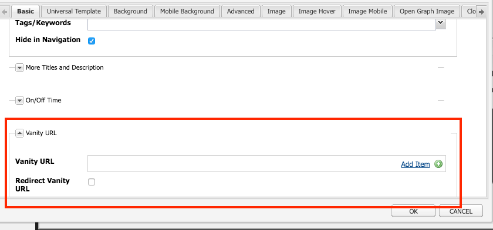

# Dispatcher Vanity URL:er

[Innehållsförteckning](./overview.md)

[&lt;- Föregående: Dispatcher Flushing](./disp-flushing.md)

## Ökning

Det här dokumentet hjälper dig att förstå hur AEM hanterar vanlighetsadresser och vissa andra tekniker med hjälp av omskrivningsregler för att mappa innehåll närmare leveranskanterna

## Vad är Vanity-URL:er?

När du har innehåll som finns i en mappstruktur som är vettig finns det inte alltid i en URL som är enkel att referera till. Vanity-URL:er fungerar som genvägar. Kortare eller unika URL:er som refererar till det verkliga innehållet.

Ett exempel: `/aboutus` pekade på `/content/we-retail/us/en/about-us.html`

AEM författare har ett alternativ för att ange egenskaper för målarens URL för ett visst innehåll i AEM och publicera det.

För att den här funktionen ska fungera måste du justera Dispatcher-filtren så att de klarar av fåfängligheten. Det här är orimligt om du justerar Dispatcher konfigurationsfiler i den takt som författare måste ställa in dessa poster för hjälpsidan.

Därför har Dispatcher-modulen en en funktion för att automatiskt tillåta allt som anges som en fågel i innehållsträdet.


## Så här fungerar det

### URL för redigering av Vanity

Författaren besöker en sida i AEM, klickar på sidegenskaperna och lägger till poster i avsnittet _Vanity URL_ . När du sparar ändringarna och aktiverar sidan tilldelas sidans huvudnamn till sidan.

Författare kan också markera kryssrutan _Omdirigera Vanity URL_ när du lägger till _Vanity URL_ -poster, vilket gör att Vanity URL:er fungerar som 302 omdirigeringar. Det innebär att webbläsaren uppmanas att gå till den nya URL-adressen (via `Location`-svarshuvudet) och att webbläsaren gör en ny begäran till den nya URL-adressen.

#### Pekgränssnitt:


Dialogrutan 

#### Classic Content Finder:





>[!NOTE]
>
>Förstå att det här ofta är ett namn på utrymmesproblem. Vanity-tävlingsbidragen är globala till alla sidor. Det här är bara ett av de korta brister du måste planera för tillfälliga lösningar. Vi kommer att förklara några av dem senare.


## Resurslösningar/mappning

Alla poster i vanity är sling map-post för en intern omdirigering.

Kartorna visas genom att gå till AEM Felix-konsolen ( `/system/console/jcrresolver` )

Här är en skärmbild av ett kartinlägg som skapats av ett värde för vanity:


I exemplet ovan, när vi ber den AEM instansen att besöka `/aboutus`, tolkas den som `/content/we-retail/us/en/about-us.html`

## Dispatcher-filter för att tillåta automatiskt

Dispatcher i ett säkert läge filtrerar bort begäranden på sökvägen `/` via Dispatcher eftersom det är roten i JCR-trädet.

Det är viktigt att se till att utgivare bara tillåter innehåll från `/content` och andra säkra sökvägar och så vidare, och inte sökvägar som `/system`.

Här är rub, vanity-URL:er som finns i basmappen för `/`, så hur kan vi låta dem nå utgivare samtidigt som de förblir säkra?

Enkel Dispatcher har en autofilterfunktion och du måste installera ett AEM och sedan konfigurera Dispatcher så att det pekar på den paketsidan.

[https://experience.adobe.com/#/downloads/content/software-distribution/en/aem.html?package=/content/software-distribution/en/details.html/content/dam/aem/public/adobe/packages/granite/vanityurls-components](https://experience.adobe.com/#/downloads/content/software-distribution/en/aem.html?package=/content/software-distribution/en/details.html/content/dam/aem/public/adobe/packages/granite/vanityurls-components)

Dispatcher har ett konfigurationsavsnitt i sin servergruppsfil:

```
/vanity_urls { 
    /url    "/libs/granite/dispatcher/content/vanityUrls.html" 
    /file   "/tmp/vanity_urls" 
    /delay  300 
}
```

Parametern `/delay`, mätt i sekunder, fungerar inte med ett fast intervall utan i stället med en villkorsbaserad kontroll. Dispatcher utvärderar tidsstämpeln för ändringen av `/file` (som lagrar listan över kända URL:er) när en begäran om en URL som inte finns med på listan tas emot. `/file` kommer inte att uppdateras om tidsskillnaden mellan den aktuella tidpunkten och den senaste ändringen av `/file` är mindre än `/delay`-varaktigheten. Uppdatering av `/file` sker under två förhållanden:

1. Den inkommande begäran gäller en URL som inte är cachelagrad eller listad i `/file`.
1. Minst `/delay` sekunder har gått sedan `/file` senast uppdaterades.

Denna mekanism är utformad för att skydda mot DoS-attacker (Denial of Service) som annars skulle kunna överbelasta Dispatcher med förfrågningar och utnyttja Vanity URL:er.

I enklare termer uppdateras `/file` med överordnade URL:er bara om en begäran kommer för en URL som inte redan finns i `/file` och om `/file`:s senaste ändring var längre än `/delay` -perioden.

Om du vill utlösa en uppdatering av `/file` explicit kan du begära en URL som inte finns efter att ha kontrollerat att den obligatoriska `/delay`-tiden har passerat sedan den senaste uppdateringen. Exempel-URL:er för detta ändamål är:

- `https://dispatcher-host-name.com/this-vanity-url-does-not-exist`
- `https://dispatcher-host-name.com/please-hand-me-that-planet-maestro`
- `https://dispatcher-host-name.com/random-vanity-url`

Den här metoden tvingar Dispatcher att uppdatera `/file`, förutsatt att det angivna `/delay`-intervallet har gått sedan den senaste ändringen.

Den lagrar sin cache för svaret i argumentet `/file` så i det här exemplet `/tmp/vanity_urls`

Så om du besöker den AEM instansen på URI:n ser du vad den hämtar:


Det är bokstavligen en lista, superenkel

## Skriv om regler som vanlighetsregler

Varför skulle vi använda omskrivningsregler istället för standardmekanismen som är inbyggd i AEM som beskrivs ovan?

Förklara enkelt namnutrymmesproblem, prestanda och logik på högre nivå som kan hanteras bättre.

Låt oss gå igenom ett exempel på vanity-posten `/aboutus` för dess innehåll `/content/we-retail/us/en/about-us.html` med Apache `mod_rewrite`-modulen för att uppnå detta.

```
RewriteRule ^/aboutus /content/we-retail/us/en/about-us.html [PT,L,NC]
```

Den här regeln söker efter huvudrollen `/aboutus` och hämtar den fullständiga sökvägen från renderaren med PT-flaggan (Pass Through).

Den slutar också att bearbeta alla andra regler L-flaggan (sista), vilket innebär att den inte behöver gå igenom en stor lista med regler som JCR Resolving måste göra.

Förutom att du inte behöver göra någon proxy för begäran, och vänta på att den AEM utgivaren ska svara på dessa två element i den här metoden, gör den mycket bättre.

Sedan är ikonen på tårtan här NC-flaggan (ingen skiftlägeskänslig), vilket innebär att om en kund skriver URI:n med `/AboutUs` i stället för `/aboutus` fungerar den fortfarande.

Om du vill skapa en omskrivningsregel för att göra detta skapar du en konfigurationsfil på Dispatcher (exempel: `/etc/httpd/conf.d/rewrites/examplevanity_rewrite.rules`) och tar med den i `.vhost`-filen som hanterar domänen som behöver dessa ogiltiga URL:er.

Här är ett exempel på ett kodfragment som innehåller `/etc/httpd/conf.d/enabled_vhosts/we-retail.vhost`

```
<VirtualHost *:80> 
 ServerName weretail.com 
 ServerAlias www.weretail.com 
        ........ SNIP ........ 
 <IfModule mod_rewrite.c> 
  ReWriteEngine on 
  LogLevel warn rewrite:info 
  Include /etc/httpd/conf.d/rewrites/examplevanity_rewrite.rules 
 </IfModule> 
        ........ SNIP ........ 
</VirtualHost>
```

## Vilken metod och var

Att använda AEM för att kontrollera poster i vanity har följande fördelar

- Författare kan skapa dem direkt
- De lever med innehållet och kan paketeras ihop med innehållet

Om du använder `mod_rewrite` för att kontrollera poster för immunitet har det följande fördelar

- Snabbare lösning av innehåll
- Nära gränsen mellan förfrågningar om slutanvändarinnehåll
- Mer utbyggbarhet och alternativ för att styra hur innehåll mappas under andra förhållanden
- Kan vara skiftlägeskänsligt

Använd båda metoderna, men här följer råd och kriterier som ska användas när:

- Om huvudrollen är tillfällig och har låg planerad trafik ska du använda den AEM inbyggda funktionen
- Om ovanligheten är en stapelslutpunkt som inte ändras ofta och ofta används, ska du använda en `mod_rewrite`-regel.
- Om huvudnamnutrymmet (till exempel: `/aboutus`) måste återanvändas för många varumärken i samma AEM ska du använda omskrivningsregler.

>[!NOTE]
>
>Om du vill använda AEM-funktionen och undvika namnutrymme kan du göra en namnkonvention. Använder mål-URL:er som är kapslade som `/brand1/aboutus`, `brand2/aboutus`, `brand3/aboutus`.

[Nästa -> Vanlig loggning](./common-logs.md)
