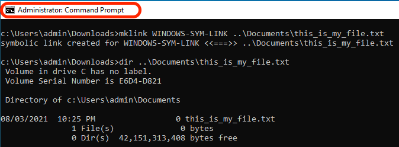

# Lägga till symboler i GIT

[Innehållsförteckning](./overview.md)

[&lt;- Föregående: Dispatcher Health Check](./health-check.md)

I AMS får du en färdigfylld GIT-databas som innehåller källkoden för din dispatcher och är klar att börja utveckla och anpassa.

När du skapat din första `.vhost` eller översta nivån `farm.any` filen som du måste skapa en symbolisk länk från `available_*` till `enabled_*` katalog. Att använda rätt länktyp är avgörande för en lyckad distribution via molnhanterarens pipeline. På den här sidan får du hjälp att göra detta.

## Dispatcher Archetype

AEM startar sitt projekt vanligtvis från [AEM](https://github.com/adobe/aem-project-archetype)

Här följer ett exempel på området i källkoden där du kan se de symboler som används:

```
$ tree dispatcher
dispatcher
└── src
   ├── conf.d
.....SNIP.....
    │   └── available_vhosts
    │   │   ├── 000_unhealthy_author.vhost
    │   │   ├── 000_unhealthy_publish.vhost
    │   │   ├── aem_author.vhost
    │   │   ├── aem_flush.vhost
    │   │   ├── aem_health.vhost
    │   │   ├── aem_lc.vhost
    │   │   └── aem_publish.vhost
    └── dispatcher_vhost.conf
    │   └── enabled_vhosts
    │   │   ├── aem_author.vhost -> ../available_vhosts/aem_author.vhost
    │   │   ├── aem_flush.vhost -> ../available_vhosts/aem_flush.vhost
    │   │   ├── aem_health.vhost -> ../available_vhosts/aem_health.vhost
    │   │   └── aem_publish.vhost -> ../available_vhosts/aem_publish.vhost
.....SNIP.....
    └── conf.dispatcher.d
    │   ├── available_farms
    │   │   ├── 000_ams_author_farm.any
    │   │   ├── 001_ams_lc_farm.any
    │   │   └── 002_ams_publish_farm.any
.....SNIP.....
    │   └── enabled_farms
    │   │   ├── 000_ams_author_farm.any -> ../available_farms/000_ams_author_farm.any
    │   │   └── 002_ams_publish_farm.any -> ../available_farms/002_ams_publish_farm.any
.....SNIP.....
17 directories, 60 files
```

Som ett exempel `/etc/httpd/conf.d/available_vhosts/` katalogen innehåller den mellanlagrade potentialen `.vhost` filer som vi kan använda i vår konfigurering som körs.

Den aktiverade `.vhost` filer visas som en relativ sökväg `symlinks` innanför `/etc/httpd/conf.d/enabled_vhosts/` katalog.

## Skapa en länk

Vi använder symboliska länkar till filen så att Apache Webserver hanterar målfilen som samma fil.  Vi vill inte duplicera filen i båda katalogerna.  I stället är det bara en genväg från en katalog (symbolisk länk) till en annan.

Känn igen att dina distribuerade konfigurationer har en Linux-värd som mål.  Om du skapar en länk som inte är kompatibel med målsystemet kommer det att leda till fel och oönskade resultat.

Om din arbetsstation inte är en Linux-dator kommer du antagligen att undra vilka kommandon som ska användas för att skapa länkarna på rätt sätt så att de kan implementera dem i GIT.

> `TIP:` Det är viktigt att använda relativa länkar eftersom länkarna fortfarande fungerar om du har installerat en lokal kopia av Apache Webserver och en annan installationsbas.  Om du använder en absolut sökväg måste arbetsstationen eller andra system matcha samma exakta katalogstruktur.

### OSX/Linux

Symbollänkar är inbyggda i dessa operativsystem och här är några exempel på hur du skapar länkarna.  Öppna ditt favoritterminalprogram och använd följande exempelkommandon för att skapa länken:

```
$ cd <LOCATION OF CLONED GIT REPO>\src\conf.d\enabled_vhosts
$ ln -s ../available_vhosts/<Destination File Name> <Target File Name>
```

Här följer ett ifyllt kommandoexempel för referens:

```
$ git clone https://github.com/adobe/aem-project-archetype.git
$ cd aem-project-archetype/src/main/archetype/dispatcher.ams/src/conf.d/enabled_vhosts/
$ ln -s ../available_vhosts/aem_flush.vhost aem_flush.vhost
```

Här är ett exempel på länken nu, om du listar filen med `ls` kommando:

```
ls -l
total 0
lrwxrwxrwx. 1 root root 35 Oct 13 21:38 aem_flush.vhost -> ../available_vhosts/aem_flush.vhost
```

### Windows

> `Note:` MS Windows (bättre, NTFS) har stöd för symboliska länkar sedan ... Windows Vista!


> `Warning:` Kommandot mklink för att skapa symboler kräver administratörsbehörighet för att kunna köras korrekt. Även som ett administratörskonto måste du köra Kommandotolken &quot;Som administratör&quot; om inte utvecklarläget är aktiverat
> <br/>Felaktiga behörigheter:
> 
> <br/>Rätt behörigheter:
> 

Här är kommandona som skapar länken:

```
C:\<PATH TO SRC>\enabled_vhosts> mklink <Target File Name> ..\available_vhosts\<Destination File Name>
```


Här följer ett ifyllt kommandoexempel för referens:

```
C:\> git clone https://github.com/adobe/aem-project-archetype.git
C:\> cd aem-project-archetype\src\main\archetype\dispatcher.ams\src\conf.d\enabled_vhosts\
C:\aem-project-archetype\src\main\archetype\dispatcher.ams\src\conf.d\enabled_vhosts> mklink aem_flush.vhost ..\available_vhost\aem_flush.vhost
symbolic link created for aem_flush.vhost <<===>> ..\available_vhosts\aem_flush.vhost
```

#### Utvecklarläge ( Windows 10 )

Vid inläggning på [Utvecklarläge](https://docs.microsoft.com/en-us/windows/apps/get-started/enable-your-device-for-development)I Windows 10 kan du enklare testa appar som du utvecklar, använda Ubuntu Bash-gränssnittsmiljön, ändra en mängd inställningar för utvecklare och göra andra saker.

Microsoft verkar fortsätta lägga till funktioner i utvecklarläget, eller aktivera vissa av dessa funktioner som standard när de har blivit mer spridda och betraktas som stabila (t.ex. med Creators Update, Ubuntu Bash Shell-miljö behöver inte längre vara i utvecklarläget).

Symboler då? När utvecklarläget är aktiverat behöver du inte köra en kommandotolk med utökad behörighet för att kunna skapa symboler. När utvecklarläget är aktiverat kan alla användare därför skapa länkar.

> När du har aktiverat Developer Mode bör du logga ut/logga in för att ändringarna ska börja gälla.

Nu kan du se kommandot fungera utan att köra som administratör


#### Alternativ/programmatisk metod

Det finns en specifik princip som kan tillåta vissa användare att skapa symboliska länkar → [Skapa symboliska länkar (Windows 10) - Windows-säkerhet | Microsoft Docs](https://docs.microsoft.com/en-us/windows/security/threat-protection/security-policy-settings/create-symbolic-links)

PRO:
- Detta kan utnyttjas av kunder för att programmatiskt tillåta att symboliska länkar skapas för alla utvecklare i deras organisation (t.ex. Active Directory) utan att behöva aktivera Developer Mode manuellt på varje enhet.
- Dessutom bör den här principen vara tillgänglig i tidigare versioner av MS Windows som inte har något utvecklarläge.

CON:
- Den här principen verkar inte ha någon effekt på användare som tillhör gruppen Administratörer. Administratörer måste fortfarande köra kommandotolken med förhöjd behörighet. Konstigt.

> Användarutloggning/inloggning krävs för att ändringarna av den lokala principen/gruppprincipen ska börja gälla.

Kör `gpedit.msc`, lägg till/ändra användare efter behov. Administratörer finns där som standard


#### Aktivera symboler i GIT

Git hanterar symboler enligt alternativet core.symlinks

Källa: [Git - git-config Documentation](https://git-scm.com/docs/git-config#Documentation/git-config.txt-coresymlinks)

*Om core.symbollinks är false checkas symboliska länkar ut som små oformaterade filer som innehåller länktexten. `git-update-index[1]` och `git-add[1]` ändrar inte den inspelade typen till vanlig fil. Användbart i filsystem som FAT som inte stöder symboliska länkar.
Standardvärdet är true, förutom `git-clone[1]` eller `git-init[1] will probe and set core.symlinks false if appropriate when the repository is created.` I de flesta fall antar Git att Windows inte är bra för symboler och att det är false.*

Beteendet för Git i Windows förklaras här: Symboliska länkar ・ Git-for-windows/git Wiki ・ GitHub

> `Info`: De antaganden som anges i den dokumentation som är länkad ovan verkar vara OK med en möjlig AEM Developer&#39;s Setup i Windows, främst NTFS, och det faktum att vi bara har filsymboler jämfört med katalogsymboler

Här är de goda nyheterna, sedan [Git för Windows version 2.10.2](https://github.com/git-for-windows/git/releases/tag/v2.10.2.windows.1) installationsprogrammet har en [explicit alternativ för att aktivera stöd för symboliska länkar.](https://github.com/git-for-windows/git/issues/921)

> `Warning`: Alternativet core.symlink kan anges vid körning när databasen klonas, eller kan på annat sätt lagras som en global konfiguration.


Git för Windows lagrar globala inställningar i `"C:\Program Files\Git\etc\gitconfig"` . De här inställningarna kanske inte beaktas av andra Git-klientprogram.
Här är haken, alla utvecklare kommer inte att använda Git-klienten (t.ex. Git Cmd, Git Bash), och vissa av Git-skrivbordsapparna (t.ex. GitHub Desktop, Atlassian SourceTree) kan ha olika inställningar/standardinställningar för att använda System eller ett inbäddat Git

Här är ett exempel på vad som finns i `gitconfig` fil

```
[diff "astextplain"]
    textconv = astextplain
[filter "lfs"]
    clean = git-lfs clean -- %f
    smudge = git-lfs smudge -- %f
    process = git-lfs filter-process
    required = true
[http]
    sslBackend = openssl
    sslCAInfo = C:/Program Files/Git/mingw64/ssl/certs/ca-bundle.crt
[core]
    autocrlf = true
    fscache = true
    symlinks = true
[pull]
    rebase = false
[credential]
    helper = manager-core
[credential "https://dev.azure.com"]
    useHttpPath = true
[init]
    defaultBranch = master
```

#### Git-kommandoradstips

Det kan finnas scenarier där du måste skapa nya symboliska länkar (t.ex. lägga till en ny värd eller en ny servergrupp).

I dokumentationen ovan har vi sett att Windows erbjuder ett&quot;mklink&quot;-kommando för att skapa symboliska länkar.

Om du arbetar i en Git Bash-miljö kan du i stället använda standardkommandot Bash `ln -s` men den måste föregås av en specialinstruktion som i exemplet här:

```
MSYS=winsymlinks:nativestrict ln -s test_vhost_symlink ../dispatcher/src/conf.d/available_vhosts/default.vhost
```

#### Sammanfattning

För att få Git-hanteringssymboler på rätt sätt (åtminstone för omfånget för den aktuella AEM dispatcher-konfigurationsbaslinjen) på ett Microsoft Windows-operativsystem behöver du:

| Objekt | Minsta version/konfiguration | Rekommenderad version/konfiguration |
|------|---------------------------------|-------------------------------------|
| Operativsystem | Windows Vista eller senare | Windows 10 Creator Update eller senare |
| Filsystem | NTFS | NTFS |
| Möjlighet att hantera symboler för Windows-användare | `"Create symbolic links"` grupp/lokal princip `under "Group Computer Configuration\Windows Settings\Security Settings\Local Policies\User Rights Assignment"` | Windows 10 Developer Mode är aktiverat |
| GIT | Inbyggd klientversion 1.5.3 | Inbyggd klientversion 2.10.2 eller senare |
| Git-konfiguration | `--core.symlinks=true` alternativ när du gör en Git-klon från kommandoraden | Git global konfiguration<br/>`[core]`<br/>    symbols = true <br/> Sökväg till Git-klientkonfiguration: `C:\Program Files\Git\etc\gitconfig` <br/>Standardplats för Git Desktop-klienter: `%HOMEPATH%\.gitconfig` |

> `Note:` Om du redan har en lokal databas måste du klona om från ursprungsläget. Du kan klona till en ny plats och manuellt sammanfoga dina ej genomförda/ej mellanlagrade lokala ändringar i den nya klonade databasen.
