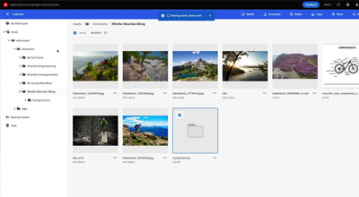

# Assets Essentials-videor

Experience Manager Assets Essentials har ett smidigt användargränssnitt för enklare filhantering och samarbete.

Kolla in de här videofilmerna om hur du använder Assets Essentials för att hantera ditt material och hur du kan integrera det med Adobe Workfront och Adobe Journey Orchestrator!

## Läs mer om Assets Essentials

<table>
<td>
   
   

      <a href="./basics/managing.md">
      <strong>Komma igång med Assets Essentials </strong>
      </a>
   

   

      <em>Lär dig grunderna i Assets Essentials!</em>
   

</td>
<td>
   
   

      <a href="https://experienceleague.adobe.com/docs/experience-manager-assets-essentials/help/introduction.html">
      <strong>Assets Essentials dokumentation</strong>
      </a>
   

   

      <em>Läs produktdokumentationen för Assets Essentials!</em>
   

</td>
<td>
   
   

      <a href="https://experienceleague.adobe.com/docs/journey-optimizer-learn/tutorials/create-messages/create-email-content-with-the-message-editor.html">
      <strong> Integrering med Adobe Journey Optimizer </strong>
      </a>
   

   

      <em>Lär dig hur Assets Essentials kan integreras med Adobe Journey Optimizer!</em>
   

</td>
</table>
