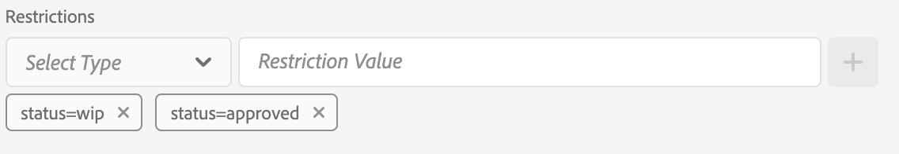

# Metadatadrivna behörigheter{#metadata-driven-permissions}

Metadatadrivna behörigheter är en funktion som gör att åtkomstkontrollsbeslut i AEM Assets Author kan baseras på objektinnehåll eller metadataegenskaper i stället för på mappstruktur. Med den här funktionen kan du definiera åtkomstkontrollprinciper som utvärderar attribut som resursstatus, typ eller andra anpassade egenskaper som du definierar.

Låt oss se ett exempel. Kreatörerna överför sitt arbete till AEM Assets till den kampanjrelaterade mappen. Det kan vara en pågående resurs som inte har godkänts för användning. Vi vill försäkra oss om att marknadsförarna bara ser godkända mediefiler för den här kampanjen. Vi kan använda en metadataegenskap för att ange att en mediefil har godkänts och kan användas av marknadsförarna.

## Så här fungerar det

Om du aktiverar metadatadrivna behörigheter måste du definiera vilket resursinnehåll eller metadataegenskaper som styr åtkomstbegränsningar, till exempel&quot;status&quot; eller&quot;varumärke&quot;. Dessa egenskaper kan sedan användas för att skapa åtkomstkontrollposter som anger vilka användargrupper som har åtkomst till resurser med specifika egenskapsvärden.

## Förutsättningar

Åtkomst till en AEM as a Cloud Service-miljö som uppdaterats till den senaste versionen krävs för att skapa metadatadrivna behörigheter.

## OSGi-konfiguration {#configure-permissionable-properties}

För att implementera metadatadrivna behörigheter måste utvecklaren distribuera en OSGi-konfiguration till AEM as a Cloud Service, som möjliggör specifikt resursinnehåll eller metadataegenskaper för att hantera metadatadrivna behörigheter.

1. Avgör vilket resursinnehåll eller vilka metadataegenskaper som ska användas för åtkomstkontroll. Egenskapsnamnen är JCR-egenskapsnamnen på resursen `jcr:content` eller `jcr:content/metadata`. I vårt fall blir det en egenskap med namnet `status`.
1. Skapa en OSGi-konfiguration `com.adobe.cq.dam.assetmetadatarestrictionprovider.impl.DefaultRestrictionProviderConfiguration.cfg.json` i ditt AEM Maven-projekt.
1. Klistra in följande JSON i den skapade filen:

   ```json
   {
     "restrictionPropertyNames":[
       "status",
       "brand"
     ],
     "restrictionContentPropertyNames":[],
     "enabled":true
   }
   ```

1. Ersätt egenskapsnamnen med obligatoriska värden.  Konfigurationsegenskapen `restrictionContentPropertyNames` används för att aktivera behörigheter för `jcr:content`-resursegenskaper, medan konfigurationsegenskapen `restrictionPropertyNames` aktiverar behörigheter för `jcr:content/metadata`-resursegenskaper för resurser.

## Återställ behörigheter för basresurs

Innan du lägger till restriktionsbaserade åtkomstkontrollposter bör en ny post på den översta nivån läggas till för att först neka läsåtkomst till alla grupper som är föremål för behörighetsutvärdering för Assets (t.ex.&quot;medarbetare&quot; eller liknande):

1. Navigera till skärmen __Verktyg → Säkerhet → Behörigheter__
1. Markera gruppen __Medarbetare__ (eller någon annan anpassad grupp som alla användargrupper tillhör)
1. Klicka på __Lägg till ACE__ i skärmens övre högra hörn
1. Välj `/content/dam` för __Bana__
1. Ange `jcr:read` som __privilegier__
1. Välj `Deny` som __behörighetstyp__
1. Under Begränsningar väljer du `rep:ntNames` och anger `dam:Asset` som __begränsningsvärde__
1. Klicka på __Spara__


## Bevilja åtkomst till resurser via metadata

Åtkomstkontrollposter kan nu läggas till för att ge läsåtkomst till användargrupper baserat på de [konfigurerade egenskapsvärdena för tillgångsmetadata](#configure-permissionable-properties).

1. Navigera till skärmen __Verktyg → Säkerhet → Behörigheter__
1. Välj de användargrupper som ska ha åtkomst till resurserna
1. Klicka på __Lägg till ACE__ i skärmens övre högra hörn
1. Välj `/content/dam` (eller en undermapp) för __Sökväg__
1. Ange `jcr:read` som __privilegier__
1. Välj `Allow` som __behörighetstyp__
1. Under __Begränsningar__ väljer du ett av de [konfigurerade egenskapsnamnen för resursmetadata i OSGi-konfigurationen](#configure-permissionable-properties)
1. Ange det obligatoriska egenskapsvärdet för metadata i fältet __Begränsningsvärde__
1. Klicka på ikonen __+__ för att lägga till begränsningen i åtkomstkontrollposten
1. Klicka på __Spara__


## Metadatadrivna behörigheter används

Exempelmappen innehåller några resurser.


När du har konfigurerat behörigheter och angett metadataegenskaperna för resursen i enlighet med detta, kommer användare (marknadsföringsanvändare i vårt fall) endast att se godkända resurser.


## Fördelar och överväganden

Fördelarna med metadatadrivna behörigheter är:

- Detaljerad kontroll över åtkomsten till materialet baserat på specifika attribut.
- Frikoppling av åtkomstkontrollprinciper från mappstrukturen, vilket ger en mer flexibel resursorganisation.
- Möjlighet att definiera komplexa åtkomstkontrollsregler baserade på flera innehålls- eller metadataegenskaper.

>[!NOTE]
>
> Observera:
> 
> - Egenskaperna utvärderas mot begränsningarna med __Stränglikhet__ (`=`) (andra datatyper eller operatorer stöds ännu inte, för större egenskaper än (`>`) eller Date)
> - Om du vill tillåta flera värden för en begränsningsegenskap kan du lägga till ytterligare begränsningar i åtkomstkontrollposten genom att välja samma egenskap i listrutan &quot;Välj typ&quot; och ange ett nytt begränsningsvärde (t.ex. `status=approved`, `status=wip`) och klicka på &quot;+&quot; för att lägga till begränsningen i posten
> 
> - __AND-begränsningar__ stöds, via flera begränsningar i en enda åtkomstkontrollpost med olika egenskapsnamn (t.ex. `status=approved`, `brand=Adobe`) utvärderas som ett AND-villkor, vilket innebär att den valda användargruppen beviljas läsåtkomst till resurser med `status=approved AND brand=Adobe`
> 
> - __OR-begränsningar__ stöds genom att en ny Access Control-post med en metadataegenskapsbegränsning lägger till ett OR-villkor för posterna, t.ex. en enskild post med restriktionen `status=approved` och en enskild post med `brand=Adobe` utvärderas som `status=approved OR brand=Adobe`
> 
