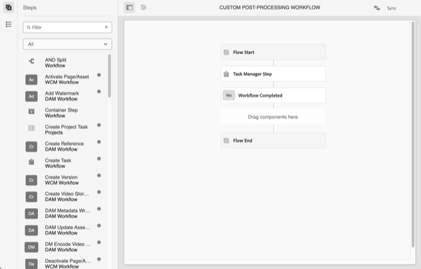

# Starta arbetsflöden automatiskt

Autostart-arbetsflöden utökar materialbearbetningen i AEM as a Cloud Service genom att automatiskt starta ett anpassat arbetsflöde vid överföring eller ombearbetning när resursbearbetningen är klar.

>[!VIDEO](https://video.tv.adobe.com/v/37323?quality=12&learn=on)

>[!NOTE]
>
>Använd Automatisk start av arbetsflöden för att anpassa efterbearbetning av resurser i stället för att använda Workflow Launcher. Autostart-arbetsflöden anropas _endast_ när en resurs har bearbetats, i stället för startprogram, som kan anropas flera gånger under bearbetning av resurser.

## Anpassa arbetsflödet för Post-bearbetning

Om du vill anpassa arbetsflödet för Post-bearbetning kopierar du standardarbetsflödesmodellen [för Post-bearbetning](../../foundation/workflow/use-the-workflow-editor.md) i Assets Cloud.

1. Börja på skärmen Arbetsflödesmodeller genom att gå till _Verktyg_ > _Arbetsflöde_ > _Modeller_
2. Hitta och välj arbetsflödesmodellen _Assets Cloud Post-Processing_ 
   
3. Välj knappen _Kopiera_ för att skapa ett anpassat arbetsflöde
4. Markera din arbetsflödesmodell nu (som kallas _Assets Cloud Post-Processing1_) och klicka på knappen _Redigera_ för att redigera arbetsflödet
5. Ge ditt anpassade Post-bearbetningsarbetsflöde ett beskrivande namn   i Egenskaper för arbetsflöde.
   
6. Lägg till stegen för att uppfylla dina verksamhetskrav, i det här fallet lägga till en uppgift när resurserna är klara. Kontrollera att det sista steget i arbetsflödet alltid är _Slutför arbetsflöde_  
   

   >[!NOTE]
   >
   >Automatisk start av arbetsflöden körs vid varje överföring eller ombearbetning av resurser. Fundera därför noga på skalförändringen i arbetsflödesstegen, särskilt för gruppåtgärder som [Massimporter](../../cloud-service/migration/bulk-import.md) eller migreringar.

7. Välj knappen _Synkronisera_ om du vill spara ändringarna och synkronisera arbetsflödesmodellen

## Använda ett anpassat arbetsflöde för Post-bearbetning

Anpassad Post-bearbetning är konfigurerad för mappar. Så här konfigurerar du ett anpassat Post-bearbetningsarbetsflöde för en mapp:

1. Markera mappen som du vill konfigurera arbetsflödet för och redigera mappegenskaperna
2. Växla till fliken _Resursbearbetning_
3. Välj ditt anpassade arbetsflöde för Post-bearbetning i _valrutan_ Starta arbetsflöde automatiskt 
   
4. Spara ändringarna

Nu kommer ditt anpassade arbetsflöde för Post-bearbetning att köras för alla resurser som överförts eller bearbetats i den mappen.
