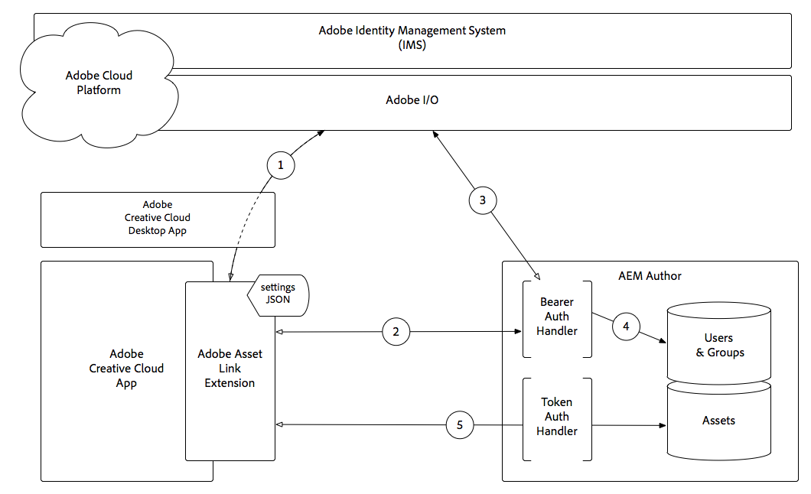

# Adobe Asset Link 3.0

Adobe Experience Manager resurser kan användas av designers och kreativa användare i Adobe Creative Cloud favoritprogram.

Tillägget Adobe Asset Link för Adobe Creative Cloud for enterprise ger möjlighet att söka efter och bläddra bland, sortera, förhandsgranska, ladda upp material, checka ut, ändra, checka in och visa metadata för AEM resurser i Creative Cloud-program.

>[!TIP]
>
> Läs mer om hur [Adobe XD Premium Training Program](https://helpx.adobe.com/support/xd.html) kan hjälpa dig att integrera Asset Link med ditt Adobe Experience Manager-arbetsflöde.

## Adobe Asset Link och AEM kreativa arbetsflöden

I följande video visas ett vanligt arbetsflöde som används av kreatörer som arbetar i Adobe Creative Cloud-program och som integreras direkt med AEM som använder Adobe Asset Link.

>[!VIDEO](https://video.tv.adobe.com/v/335927?quality=12&learn=on)

## Adobe Asset Link-funktioner

+ Adobe Asset Link kan integreras med AEM Assets och Assets Essentials.
+ Adobe Asset Link konfigurerar automatiskt anslutning till molnbaserade AEM (AEM Assets as a Cloud Service och Assets Essentials)
+ Adobe Asset Link är ett tillägg som fungerar i Adobe Creative Cloud-program:

   + Adobe XD
   + Adobe Photoshop
   + Adobe Illustrator
   + Adobe InDesign

+ Automatisk autentisering till AEM med hjälp av Enterprise ID Adobe eller Federated ID
+ Sök efter digitalt material i AEM
+ Få åtkomst till filinformation för resurser i AEM från panelen:
   + Miniatyrbild
   + Grundläggande metadata
   + Versioner
+ Montera, ladda ned eller dra-och-släpp-material i layouten
+ Ändra resurser genom att checka ut dem från AEM och arbeta med dem (PIA) på Creative Cloud Assets-kontot
+ Checka in en resurs i AEM när de har ändrat den och den nya versionen visas i AEM
+ Söka efter resurser i AEM från Adobe-resurslänkpanelen i appen
+ Bläddra bland AEM Assets-samlingar och smarta samlingar direkt från panelen Resurslänk
+ Lägg till nyskapade resurser i AEM direkt från panelen
+ Dra-och-släpp material direkt i InDesignen

## Placera resurser i InDesign

Adobe Asset Link har stöd för direktlänkning mellan Adobe Asset Link och AEM. Med stöd för direktlänkning av InDesign kan du montera (__Montera länkat__ eller __Montera kopia__) eller dra-och-släppa digitala resurser till InDesign från AEM via panelen Adobe-resurslänk. Dessutom introduceras återgivningen av *For Placement Only+ (FPO).

>[!VIDEO](https://video.tv.adobe.com/v/28988?quality=12&learn=on)

>[!NOTE]
>
>Använd endast Adobe Creative Cloud-Enterprise ID eller Federated ID. Se till att du [konfigurerar AEM för Adobe Asset Link](https://helpx.adobe.com/enterprise/using/adobe-asset-link.html).

Du kan montera en resurs i InDesignen med något av följande alternativ:

+ **Montera kopia** - Bädda in en resurs (med alternativet Montera kopia) placerar en kopia av den ursprungliga resursen i InDesignens layout när binärfilerna har hämtats till ditt lokala system. Adobe Asset Link bevarar ingen länk mellan den inbäddade kopian och den ursprungliga resursen. Om den ursprungliga resursen har ändrats i AEM måste du ta bort den inbäddade resursen från InDesignen och bädda in resursen på nytt från AEM.

+ **Montera länkad** - När du arbetar med InDesigner kan du referera till resurser från AEM förutom att bädda in resurserna direkt (med alternativet Montera kopia på snabbmenyn). Genom att referera till resurser kan du samarbeta med andra användare och införliva uppdateringar som gjorts i den ursprungliga resursen i AEM. Om du vill referera till en resurs från AEM använder du alternativet Montera länkad på snabbmenyn.

### Endast för placeringsbilder

När stora resursfiler placeras i InDesign Dokument från AEM med Adobe Asset Link, måste användare vänta några sekunder efter att monteringsåtgärden initierats. Detta påverkar den övergripande användarupplevelsen. Med Adobe Asset Link kan du tillfälligt montera en lågupplöst bild av den ursprungliga resursen från AEM, vilket minskar tiden det tar att montera en bild. Samtidigt ökar det användarupplevelsen och produktiviteten. Bilden med lägre upplösning placeras tillfälligt och när den slutliga utskriften krävs för utskrift eller publicering måste du ersätta FPO-återgivningarna med originalen. Om du vill ersätta flera FPO-bilder med respektive originalbilder går du till panelen **_Fönster > Länkar_** och hämtar sedan originalresurserna. När originalbilderna har laddats ned väljer du Ersätt alla FPO:er med original.

FPO-återgivningar är enkla ersättningar av de ursprungliga resurserna. De har samma proportioner, men har mindre storlek än originalbilderna. För närvarande stöder InDesign import av FPO-renderingar endast för följande bildtyper:

+ JPEG
+ GIF
+ PNG
+ TIFF
+ PSD
+ BMP

Om en FPO-återgivning inte är tillgänglig för en viss resurs i AEM refereras den ursprungliga högupplösta resursen i stället. För FPO-bilder visas status FPO på panelen InDesign-länkar.

## Adobe Asset Link-autentisering med AEM Assets

Hur Adobe Asset Link-autentisering fungerar i samband med Adobe Identity Management Services (IMS) och Adobe Experience Manager Author.

1. Tillägget Adobe Asset Link skickar en auktoriseringsbegäran via Adobe Creative Cloud-datorprogrammet till IMS-tjänsten (Adobe Identity Manage Service) och får en Bearer-token när den lyckas.
1. Tillägget Adobe Asset Link ansluter till AEM Author via HTTP(S), inklusive den Bearer-token som fås i **Steg 1**, med schemat (HTTP/HTTPS), värd och port som finns i tilläggets JSON-inställningar.
1. AEM Bearer Authentication Handler extraherar Bearer-token från begäran och validerar den med Adobe IMS.
1. När Adobe IMS validerar Bearer-token skapas en användare i AEM (om den inte redan finns) och synkroniserar profil- och grupp-/medlemskapsdata från Adobe IMS. Den AEM användaren får en AEM inloggningstoken som skickas tillbaka till tillägget Adobe Asset Link som cookie i HTTP(S)-svaret.
1. Efterföljande interaktioner (t.ex. söka, söka, checka in/ut resurser osv.) med tillägget Adobe Asset Link resulterar i HTTP(S)-begäranden till AEM Author som valideras med AEM inloggningstoken med hjälp av AEM Token Authentication Handler.

>[!NOTE]
>
>När inloggningstoken har upphört att gälla anropas **steg 1-5** automatiskt, tillägget Adobe Asset Link autentiseras med Bearer-token och en ny giltig inloggningstoken utfärdas på nytt.

## Ytterligare resurser

+ [Adobe Asset Link-webbplatsen](https://www.adobe.com/creativecloud/business/enterprise/adobe-asset-link.html)
