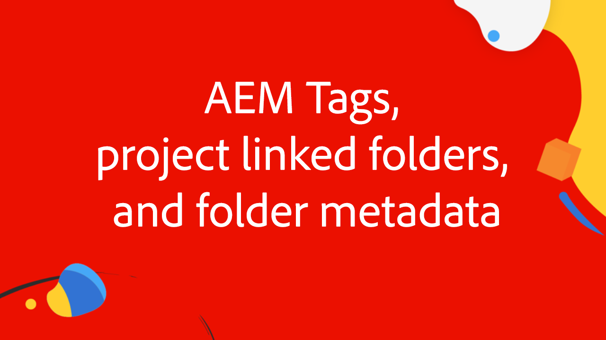

# Integrera Workfront och AEM Assets med den förbättrade kontakten

Delta i Adobe Workfront- och Experience Manager Assets-experterna i den här videoserien, där de demonstrerar och diskuterar allt de behöver för att integrera Workfront och AEM Assets med hjälp av den förbättrade kontakten.

Denna fyra expertserie följer en grupp från Adobe experter - från produktchefer till konsulter och Adobe-partners - som diskuterar:

1. [Utföra de första konfigurationerna i Workfront och AEM](./setup.md)
2. [Konfigurera metadatasynkronisering mellan Workfront anpassade formulär och AEM](./custom-forms.md)
3. [Använda AEM taggar, projektlänkade mappar, Adobe Asset Link och metadatamatcheman för att maximera värdet](./aem-tags-project-linked-folders-and-folder-metadata.md)
4. [Använda avancerat AEM för att effektivisera affärsprocesserna i hela AEM och Workfront samt andra avancerade inställningar](./advanced-settings-and-workflows.md)

<table>
  <td>
      
      

         <a href="./setup.md"><strong>Konfigurera och initiera konfiguration</strong></a>
          <em>Del 1/4</em>
      

      

         
         Lär dig hur du konfigurerar och utför den första konfigurationen av den förbättrade anslutningen för Workfront för Experience Manager.
      

   </td>
   <!-- Workfront custom forms and metadata mapping -->
   <td>
      
      

         <a href="./custom-forms.md"><strong>Workfront anpassade blanketter och metadatamappning</strong></a>
          <em>Del 2/4</em>
      

      

         
         Lär dig mer om Workfront anpassade formulär och hur de mappas till Experience Manager Assets metadatamatcheman för att synkronisera data.
      

    </td>
    <!-- AEM Tags, project linked folders, and folder metadata -->
    <td>
      
      

         <a href="./aem-tags-project-linked-folders-and-folder-metadata.md"><strong>AEM, projektlänkade mappar och mappmetadata</strong></a>
          <em>Del 3/4</em> 
      

      

         
            Lär dig att driva AEM taxonomi från Workfront, använda projektlänkade mappar och data för att AEM metadata för resursmappar.
      

   </td>   
   <!-- Advanced workflows -->
    <td>
      
      

         <a href="./advanced-settings-and-workflows.md"><strong>Avancerade inställningar och arbetsflöden</strong></a>
          <em>Del 4/4</em>
      

      

         
            Lär dig mer om avancerade inställningar för Workfront för AEM förbättrade anslutningsprogram, hantera datasynkronisering med avancerade arbetsflöden.
      

   </td>
  </tr>  
</tbody></table>
