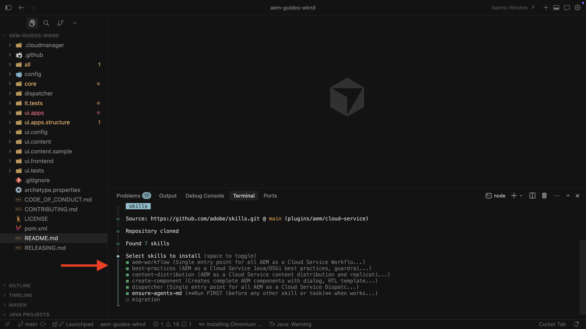

# Konfigurera AEM Agent Skills

Lär dig hur du konfigurerar AEM Agent Skills för AI-assisterad utveckling.

När du ber en kodningsagent via en AI-styrd IDE att arbeta med AEM-utvecklingsuppgifter kan den använda **AEM Agent Skills** -procedurvägledning från Adobe i stället för att bara förlita sig på allmän modellutbildning eller något annat som kan härledas enbart från din databas.

Adobe tillhandahåller AEM Agent Skills via databasen [Adobe Skills](https://github.com/adobe/skills). Se även [AI-assisterad utveckling](../overview.md) för hur Adobe hjälper till med AI-assisterad utveckling.

I den här självstudiekursen installerar du kunskaperna på en lokal klon av [WKND Sites Project](https://github.com/adobe/aem-guides-wknd). Du kan använda samma steg för ditt eget AEM as a Cloud Service-projekt.

## Förutsättningar

Om du vill följa den här självstudiekursen behöver du följande:

- En lokal klon av [WKND Sites Project](https://github.com/adobe/aem-guides-wknd) eller ditt eget AEM as a Cloud Service-projekt.
- En AI-driven IDE som Cursor eller Visual Studio Code med GitHub Copilot.

## Installera AEM Agent Skills

Installera AEM Agent Skills med kommandot `npx` (kräver [&#x200B; Node.js](https://nodejs.org/) så att `npx` är tillgängligt). Andra installationsalternativ, till exempel Claude Code-plugin-program eller GitHub CLI-tillägg, finns i avsnittet [Installation](https://github.com/adobe/skills/tree/main#installation) i Adobe Skills-databasen.

1. Klona [WKND-webbplatsprojektet](https://github.com/adobe/aem-guides-wknd) lokalt:

   ```shell
   $ git clone https://github.com/adobe/aem-guides-wknd.git
   ```

1. Öppna det klonade projektet i den AI-baserade utvecklingsmiljön (till exempel Cursor) och öppna den integrerade terminalen.
   

1. Kör följande kommando för att lägga till AEM Agent Skills for Cursor:

   ```shell
   $ npx skills add https://github.com/adobe/skills/tree/main/plugins/aem/cloud-service --agent cursor
   ```

   För andra agenttyper, se avsnittet [Installation](https://github.com/adobe/skills/tree/main#installation) i Adobe Skills-databasen.

1. Välj vilka AEM Agent Skills som ska installeras när du uppmanas till detta.
   

   Välj **ensure-agent-md** -kompetensen så att installationsprogrammet kan skapa **AGENTS.md** - och **CLAUDE.md** -filer i databasroten. Bootstrap-kompetensen inspekterar ditt projekt, till exempel roten `pom.xml` och modulerna, och genererar anpassad agentvägledning.

   Om **AGENTS.md** redan finns skrivs den **inte** över.

1. Välj installationsomfång. För den här genomgången är omfattningen **Projekt** typisk, vilket innebär att kunskapsfilerna finns i svaret.
   

1. Bekräfta installationen under `.agents/skills`. Du bör se **SKILLS.md** och relaterade referens- och resursmappar.
   

1. När Adobe lägger till eller uppdaterar kunskaper använder du CLI för att lägga till, uppdatera, ta bort eller lista dem. Om du vill visa alla kommandon:

   ```shell
   $ npx skills --help
   ```

   

## Användningsexempel

<!-- 
CARDS
{target = _self}

* ../use-cases/component-development.md    
    {title = Create AEM Component with AI-assisted development}
    {description = Learn how to use AI-assisted development to develop AEM components.}
    {image = ../assets/component-development/review-generated-code.png}
    {cta = Create AEM Component}
-->
<!-- START CARDS HTML - DO NOT MODIFY BY HAND -->
<div class="columns">
    <div class="column is-half-tablet is-half-desktop is-one-third-widescreen" aria-label="Create AEM Component with AI-assisted development">
        <div class="card" style="height: 100%; display: flex; flex-direction: column; height: 100%;">
            <div class="card-image">
                <figure class="image x-is-16by9">
                    <a href="../use-cases/component-development.md" title="Skapa AEM Component med AI-stödd utveckling" target="_self" rel="referrer">
                        
                    </a>
                </figure>
            </div>
            <div class="card-content is-padded-small" style="display: flex; flex-direction: column; flex-grow: 1; justify-content: space-between;">
                <div class="top-card-content">
                    <p class="headline is-size-6 has-text-weight-bold">
                        <a href="../use-cases/component-development.md" target="_self" rel="referrer" title="Skapa AEM Component med AI-stödd utveckling">Skapa AEM-komponent med AI-assisterad utveckling</a>
                    </p>
                    <p class="is-size-6">Lär dig hur du använder AI-assisterad utveckling för att utveckla AEM-komponenter.</p>
                </div>
                <a href="../use-cases/component-development.md" target="_self" rel="referrer" class="spectrum-Button spectrum-Button--outline spectrum-Button--primary spectrum-Button--sizeM" style="align-self: flex-start; margin-top: 1rem;">
                    <span class="spectrum-Button-label has-no-wrap has-text-weight-bold"> Skapa AEM-komponent </span>
                </a>
            </div>
        </div>
    </div>
</div>
<!-- END CARDS HTML - DO NOT MODIFY BY HAND -->

## Ytterligare resurser

- [Local Development with AI Tools](https://experienceleague.adobe.com/en/docs/experience-manager-cloud-service/content/ai-in-aem/local-development-with-ai-tools)

- [Adobe Skills for AI Coding Agents](https://github.com/adobe/skills)

- [AGENTS.md](https://agents.md/)

- [Agentfärdigheter](https://agentskills.io/home)
