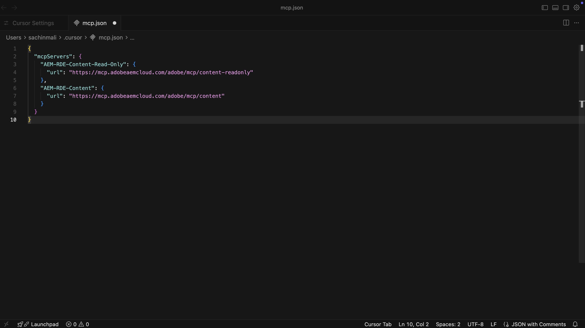
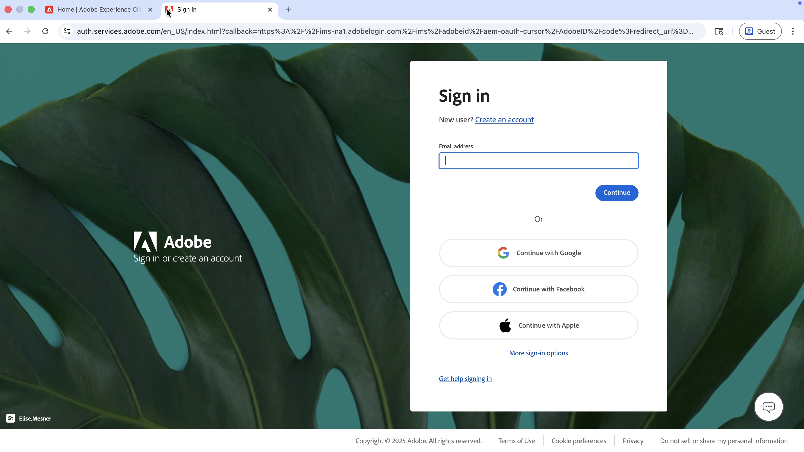
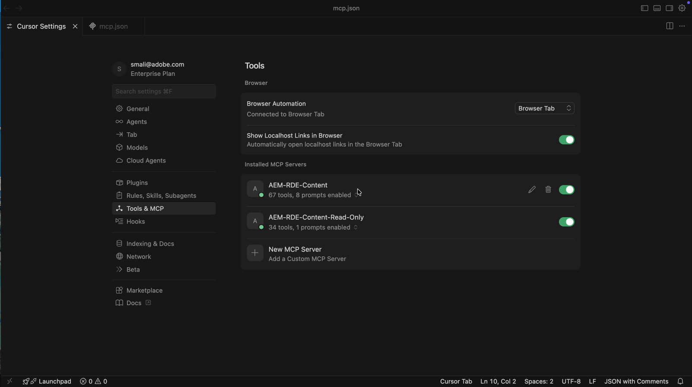

# Snabba upp AEM Content Operations med Content MCP Server

Använd **Content MCP-servern** från en AI-driven IDE som [Cursor IDE](https://www.cursor.com/) för att arbeta med AEM-innehåll på naturligt språk, ingen API-kod på låg nivå eller gränssnittsnavigering.

I den här självstudiekursen _granskar_ Adventure-innehållets fragmentinformation, _uppdaterar_ ett fragment (till exempel priset på ett äventyr) och _verifierar_ ändringen i [WKND Adventures React-appen](https://github.com/adobe/aem-guides-wknd-graphql/tree/main/react-app) från din utvecklingsmiljö mot en _lägre AEM-miljö_ (RDE eller Development) utan att lämna MCP-flödet.

## Ökning

AEM as a Cloud Service tillhandahåller _MCP-servrar_ så att din IDE- eller chattapp kan fungera med AEM på ett säkert sätt. **Content MCP-servern** stöder sidor, fragment och resurser. Mer information finns i [MCP-servrar i AEM](./overview.md).

## Så här kan utvecklare använda den

Anslut [Cursor IDE](https://www.cursor.com/) till Content MCP-servern och kör scenariot nedan.

### Installation - Content MCP Server in Cursor

Låt oss konfigurera Content MCP Server i Cursor med dessa steg.

1. Öppna markören på datorn.

1. Gå till **Inställningar** > **Markörinställningar** på markörmenyn för att öppna inställningsfönstret.
   

1. Öppna den panelen genom att klicka på **Verktyg och MCP** i det vänstra sidofältet.
   

1. Klicka på **Lägg till anpassad MCP** eller **ny MCP-server** för att öppna `mcp.json` och klistra sedan in i den här konfigurationen:

   ```json
   {
       "mcpServers": {
           // Use this for create, read, update, and delete operations
           "AEM-RDE-Content": {
               "url": "https://mcp.adobeaemcloud.com/adobe/mcp/content"
           },
           //Use this for read-only operations
           "AEM-RDE-Content-Read-Only": {
               "url": "https://mcp.adobeaemcloud.com/adobe/mcp/content-readonly"
           }
       }
   }
   ```

   >[!CAUTION]
   >
   > I självstudiekursen lägger konfigurationen ovan till både **Innehåll** och **Innehåll (skrivskyddat)** för den här självstudien. I praktiken innehåller **Innehåll** redan allt som **Innehåll (skrivskyddat)** erbjuder, plus verktyg för att skapa/uppdatera/ta bort.
   >
   >
   > Om du vill undvika möjligheten att skapa, ändra eller ta bort innehåll konfigurerar du bara **Innehåll (skrivskyddat)** (`/content-readonly`) och utelämnar **Innehåll** (`/content`). På så sätt undviker du oavsiktliga ändringar.

   

1. Klicka på **Anslut** i fönstret Marginalinställningar för att initiera autentiseringsprocessen. Den använder OAuth 2.0 PKCE-flödet för att hämta **användarspecifik åtkomsttoken** för åtkomst till AEM MCP-servern.
   

1. Logga in med din Adobe ID och gå sedan tillbaka till fönstret Markörinställningar.
   

1. Bekräfta att **AEM-RDE-Content-Read-Only** och **AEM-RDE-Content** visas som anslutna. Du kan expandera varje server för att se dess verktyg.

   

### Installation - WKND Adventures React App

Konfigurera sedan [WKND Adventures React App](https://github.com/adobe/aem-guides-wknd-graphql/tree/main/react-app) i Cursor.

1. Klona de här två reporna på din dator:

   ```bash
   ## WKND GraphQL repo, the `react-app` folder is the WKND Adventures app
   $ git clone git@github.com:adobe/aem-guides-wknd-graphql.git
   
   ## WKND Site repo, you deploy this to RDE so the app can use its content fragments data via GraphQL
   $ git clone git@github.com:adobe/aem-guides-wknd.git
   ```

1. Distribuera projektet [WKND Site](https://github.com/adobe/aem-guides-wknd) till din RDE. Detaljerade steg finns i [Så här använder du snabbutvecklingsmiljön](https://experienceleague.adobe.com/sv/docs/experience-manager-learn/cloud-service/developing/rde/how-to-use#deploy-aem-artifacts-using-the-aem-rde-plugin).

1. Öppna mappen `react-app` i din utvecklingsmiljö.

1. Redigera `.env.development` och ange:
   - `REACT_APP_HOST_URI`: din URL för RDE-författare
   - `REACT_APP_AUTH_METHOD`: ska vara `basic`
   - `REACT_APP_BASIC_AUTH_USER` och `REACT_APP_AEM_AUTH_PASSWORD`: att vara `aem-headless` (skapa den här användaren i RDE och lägg till den i gruppen `administrators`)

1. Kör:

   ```bash
   $ cd aem-guides-wknd-graphql/react-app
   $ npm install
   $ npm start
   ```

1. Gå till [http://localhost:3000](http://localhost:3000) i webbläsaren för att visa appen WKND Adventures.

   

### Produktivitetsscenario - AEM Content Review and Update

Anta att du måste visa en _HOT DEAL_-banderoll på Adventure-kort när en enkel regel uppfylls. Det vanliga är:

- Titta på komponentkoden för Adventure-kort
- Lägg till logiken för när bannern ska visas
- Kontrollera Adventure-innehållets fragmentmodell i AEM
- Ändra en eller flera Adventure-fragmentegenskaper för att testa regeln

För att hålla saker och ting enkla kan vi visa banderollen _HOT DEAL_ när äventyrets pris är under 100 dollar.

Eftersom React-appen hämtar data från din RDE-miljö måste du känna till Adventure-innehållets fragmentmodell och sedan uppdatera rätt fragmentegenskaper. Det är precis vad AEM Content MCP Server kan hjälpa till med. Så här gör du.

1. Öppna en ny chatt och skriv:

   ```text
   I want to review my Content Fragment Models from AEM RDE, can you list the Adventure Content Fragment details.
   ```

   


   Innan du anropar innehålls-MCP-servern uppmanas du att bekräfta åtgärden. På så sätt behåller du kontrollen över innehållsåtgärderna.

   AI använder Content MCP Server för att hämta data och sedan presentera dem på ett tydligt, strukturerat sätt. Det innehåller information om innehållsfragmentmodellen, antalet fragment och sammanfattningsinformation.

1. Uppdatera priset för ett äventyr om du vill utlösa bannern _HOT DEAL_. I samma chatt kan du försöka:

   ```text
   Can you update adventure Beervana in Portland's price to 99.99
   ```

   

   På samma sätt ber AI om bekräftelse innan innehållet uppdateras. Innehållsåtgärden sammanfattas även före och efter uppdateringen.

1. Bekräfta att Beervana-kortet nu visar bannern _HOT DEAL_ i appen React.

   

### Ytterligare frågor

Testa de här innehållsinriktade prompterna i din utvecklingsmiljö (med Content MCP Server ansluten) för att utforska fler arbetsflöden och funktioner.

- Upptäck innehåll:

  ```text
  List all content fragments in the WKND Adventures folder
  
  List all WKND Site pages from US English site
  
  Can you give me page metadata for Tahoe Skiing English page? 
  
  List assets of Bali Surf camp
  
  What Content Fragment models are available in this environment?
  ```

- Sök efter innehåll:

  ```text
  Search for content fragments that mention 'cycling'
  
  Do we have a magazine page in US English site with "Camping" in it
  ```

- Uppdatera innehåll:

  ```text
  In WKND US English create a copy of Downhill Skiing Wyoming as "Test Downhill Skiing Wyoming"
  
  In newly created "Test Downhill Skiing Wyoming" please change title to "Duplicated Page"
  ```

- Publicera eller avpublicera:

  ```text
  Can you publish the page at /us/en/adventures/test-downhill-skiing-wyoming and give me publish page URL
  
  Can you unpublish the test-downhill-skiing-wyoming page
  ```

## Sammanfattning

Du konfigurerar AEM Content MCP Server i Cursor och kopplar den till din RDE-miljö (eller utvecklingsmiljö). Sedan använde du appen WKND Adventures React och chattade på naturligt språk för att granska Adventure-innehållets fragmentinformation. Du har även uppdaterat priset på ett fragment med hjälp av AI-filen som ber om din bekräftelse före varje innehållsåtgärd. Du verifierade ändringen i det program som körs. Du kan använda samma användarorienterade flöde från din utvecklingsmiljö för att granska, uppdatera och skapa AEM-innehåll utan att behöva växla till AEM användargränssnitt eller skriva API-kod på låg nivå.
