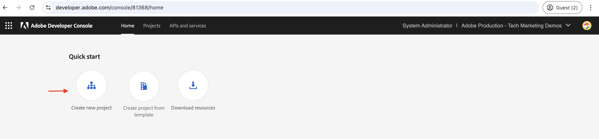
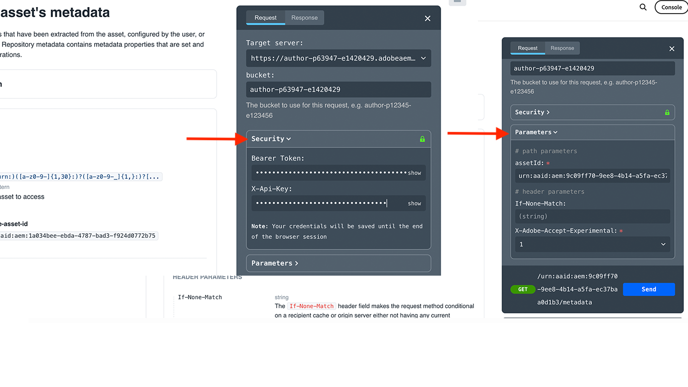

# Anropa OpenAPI-baserade AEM-API:er för server-till-server-autentisering{#invoke-openapi-based-aem-apis}

Lär dig hur du konfigurerar och anropar OpenAPI-baserade AEM-API:er på AEM as a Cloud Service från anpassade program med hjälp av _OAuth Server-till-Server_-autentisering.

OAuth Server-till-Server-autentiseringen är idealisk för backend-tjänster som behöver API-åtkomst utan användarinteraktion. Den använder tilldelningstypen _client_credentials_ för OAuth 2.0 för att autentisera klientprogrammet.

>[!AVAILABILITY]
>
>OpenAPI-baserade AEM API:er är tillgängliga som en del av ett program för tidig åtkomst. Om du är intresserad av att få tillgång till dem bör du skicka ett e-postmeddelande till [aem-apis@adobe.com](mailto:aem-apis@adobe.com) med en beskrivning av ditt användningsfall.

I den här självstudiekursen får du lära dig att:

- Aktivera åtkomst till OpenAPI-baserade AEM API:er för din AEM as a Cloud Service-miljö.
- Skapa och konfigurera ett Adobe Developer Console-projekt (ADC) för att komma åt AEM API:er med _OAuth Server-till-Server-autentisering_.
- Utveckla ett exempel på ett NodeJS-program som anropar Assets Author API för att hämta metadata för en viss resurs.

Innan du börjar bör du kontrollera att du har granskat avsnittet [Åtkomst till Adobe-API:er och relaterade koncept](overview.md#accessing-adobe-apis-and-related-concepts).

## Förutsättningar

För att kunna genomföra den här självstudiekursen behöver du:

- Moderniserad AEM as a Cloud Service-miljö med följande:
   - AEM version `2024.10.18459.20241031T210302Z` eller senare.
   - Nya produktprofiler (om miljön skapades före november 2024)

- Exempelprojektet [WKND Sites](https://github.com/adobe/aem-guides-wknd?#aem-wknd-sites-project) måste distribueras till det.

- Åtkomst till [Adobe Developer Console](https://developer.adobe.com/developer-console/docs/guides/getting-started/).

- Installera [Node.js](https://nodejs.org/en/) på den lokala datorn för att köra exempelprogrammet NodeJS.

## Utvecklingssteg

Utvecklingsstegen på hög nivå är följande:

1. Modernisering av AEM as a Cloud Service-miljön.
1. Aktivera åtkomst AEM API:er.
1. Skapa Adobe Developer Console-projekt (ADC).
1. Konfigurera ADC-projekt
   1. Lägg till önskade AEM-API:er
   1. Konfigurera autentiseringen
   1. Associera produktprofil med autentiseringskonfigurationen
1. Konfigurera AEM för att aktivera ADC-projektkommunikation
1. Utveckla ett exempel på ett NodeJS-program
1. Verifiera flödet från början till slut

## Modernisering av AEM as a Cloud Service miljö

Vi börjar med att modernisera AEM as a Cloud Service-miljön. Det här steget behövs bara om miljön inte har moderniserats.

Modernisering av AEM as a Cloud Service-miljön är en tvåstegsprocess.

- Uppdatera till den senaste versionen av AEM
- Lägg till nya produktprofiler i den.

### Uppdatera AEM

Om du vill uppdatera den AEM instansen väljer du _ellipsikonen_ bredvid miljönamnet i Adobe [Cloud Manager](https://my.cloudmanager.adobe.com/)s _Environment_ och sedan alternativet **Update** .


Klicka sedan på knappen **Skicka** och kör den föreslagna helstackspipelinen.


I det här fallet är namnet på fullständigt stackförlopp _Dev :: Fullstack-Deploy_ och AEM miljönamn är _wknd-program-dev_. Det kan variera i ditt fall.

### Lägg till nya produktprofiler

Om du vill lägga till nya produktprofiler i AEM-instansen väljer du ikonen _ellips_ bredvid miljönamnet i Adobe [Cloud Manager](https://my.cloudmanager.adobe.com/)s _Environment_ och väljer alternativet **Lägg till produktprofiler** .


Du kan granska de nya produktprofilerna genom att klicka på ikonen _ellips_ bredvid miljönamnet och välja **Hantera åtkomst** > **Författarprofiler**.

Fönstret _Admin Console_ visar de nya produktprofilerna.


Ovanstående steg avslutar moderniseringen av AEM as a Cloud Service-miljön.

## Aktivera åtkomst AEM API:er

Nya produktprofiler möjliggör åtkomst till OpenAPI-baserade AEM API i Adobe Developer Console (ADC).

De nya produktprofilerna är kopplade till _tjänsterna_ som representerar AEM användargrupper med fördefinierade åtkomstkontrollistor (ACL). _Tjänsterna_ används för att styra åtkomstnivån för AEM API:er.

Du kan också markera eller avmarkera de _tjänster_ som är kopplade till produktprofilen för att minska eller öka åtkomstnivån.

Granska associationen genom att klicka på ikonen _Visa detaljer_ bredvid produktprofilens namn.


Som standard är **AEM Assets API-användartjänsten** inte kopplad till någon produktprofil. Låt oss associera det med de nya **AEM administratörerna - författare - Program XXX - Miljö XXX** produktprofil. Efter den här associationen kan ADC-projektets _API för tillgångsförfattare_ konfigurera OAuth Server-till-server-autentiseringen och associera autentiseringskontot med produktprofilen.


Det är viktigt att komma ihåg att det fanns två produktprofiler tillgängliga i AEM Author-instansen innan moderniseringen: **AEM Administrators-XXX** och **AEM Users-XXX**. Det går också att koppla dessa befintliga produktprofiler till de nya tjänsterna.

## Skapa Adobe Developer Console-projekt (ADC)

Skapa sedan ett ADC-projekt för att komma åt AEM API:er.

1. Logga in på [Adobe Developer Console](https://developer.adobe.com/console) med din Adobe ID.

   

1. I avsnittet _Snabbstart_ klickar du på knappen **Skapa nytt projekt** .

   

1. Ett nytt projekt med standardnamnet skapas.

   

1. Redigera projektnamnet genom att klicka på knappen **Redigera projekt** i det övre högra hörnet. Ange ett beskrivande namn och klicka på **Spara**.

   

## Konfigurera ADC-projekt

Konfigurera sedan ADC-projektet för att lägga till AEM-API:er, konfigurera autentiseringen och associera produktprofilen.

1. Om du vill lägga till AEM API:er klickar du på knappen **Lägg till API** .

   

1. I dialogrutan _Lägg till API_ filtrerar du efter _Experience Cloud_, markerar **AEM Assets Author API**-kortet och klickar på **Nästa**.

   

1. I dialogrutan _Konfigurera API_ väljer du autentiseringsalternativet **Server-till-server** och klickar på **Nästa**. Server-till-server-autentiseringen är idealisk för backend-tjänster som behöver API-åtkomst utan användarinteraktion.

   

1. Byt namn på autentiseringsuppgifterna för enklare identifiering (om det behövs) och klicka på **Nästa**. I demosyfte används standardnamnet.

   

1. Välj **AEM Administratörer - författare - Program XXX - Miljö XXX** Produktprofil och klicka på **Spara**. Som du ser kan du bara välja den produktprofil som är kopplad till AEM Assets API-användartjänst.

   

1. Granska AEM API och autentiseringskonfigurationen.

   

   


## Konfigurera AEM instans för att aktivera ADC-projektkommunikation

Om du vill att ADC-projektets klient-ID för OAuth Server-till-Server-autentiseringsuppgifter ska kunna kommunicera med AEM måste du konfigurera AEM.

Det görs genom att definiera konfigurationen i filen `config.yaml` i AEM. Distribuera sedan filen `config.yaml` med Config Pipeline i Cloud Manager.

1. I AEM Project letar du reda på eller skapar filen `config.yaml` från mappen `config`.

   

1. Lägg till följande konfiguration i filen `config.yaml`.

   ```yaml
   kind: "API"
   version: "1.0"
   metadata: 
       envTypes: ["dev", "stage", "prod"]
   data:
       allowedClientIDs:
           author:
           - "<ADC Project's OAuth Server-to-Server credential ClientID>"
   ```

   Ersätt `<ADC Project's OAuth Server-to-Server credential ClientID>` med det faktiska klient-ID:t för ADC-projektets autentiseringsuppgifter för OAuth Server-till-Server. API-slutpunkten som används i den här självstudiekursen är bara tillgänglig på författarnivån, men för andra API:er kan yaml-konfigurationen också ha en _publish_ - eller _preview_ -nod.

1. Bekräfta konfigurationsändringarna i Git-databasen och skicka ändringarna till fjärrdatabasen.

1. Distribuera ovanstående ändringar med Config Pipeline i Cloud Manager. Observera att filen `config.yaml` också kan installeras i en RDE med kommandoradsverktyg.

   

## Utveckla ett exempel på ett NodeJS-program

Låt oss utveckla ett exempel på ett NodeJS-program som anropar Assets Author API.

Du kan använda andra programmeringsspråk som Java, Python osv. för att utveckla programmet.

I testsyfte kan du använda [Postman](https://www.postman.com/), [curl](https://curl.se/) eller någon annan REST-klient för att anropa AEM API:er.

### Granska API

Innan vi utvecklar programmet ska vi granska [den angivna resursens metadata](https://developer.adobe.com/experience-cloud/experience-manager-apis/api/experimental/assets/author/#operation/getAssetMetadata)-slutpunkt från _Assets Author API_. API-syntaxen är:

```http
GET https://{bucket}.adobeaemcloud.com/adobe/assets/{assetId}/metadata
```

Om du vill hämta metadata för en viss resurs behöver du värdena `bucket` och `assetId`. `bucket` är det AEM instansnamnet utan Adobe-domännamnet (.adobeaemcloud.com), till exempel `author-p63947-e1420428`.

`assetId` är JCR UUID för resursen med prefixet `urn:aaid:aem:`, till exempel `urn:aaid:aem:a200faf1-6d12-4abc-bc16-1b9a21f870da`. Det finns flera sätt att hämta `assetId`:

- Lägg till tillägget AEM resurssökväg `.json` för att hämta metadata för resursen. Till exempel `https://author-p63947-e1420429.adobeaemcloud.com/content/dam/wknd-shared/en/adventures/cycling-southern-utah/adobestock-221043703.jpg.json` och leta efter egenskapen `jcr:uuid`.

- Du kan också hämta `assetId` genom att inspektera resursen i webbläsarens elementkontroll. Leta efter attributet `data-id="urn:aaid:aem:..."`.

  

### Anropa API:t med webbläsaren

Innan vi utvecklar programmet måste vi anropa API:t med funktionen **Prova** i [API-dokumentationen](https://developer.adobe.com/experience-cloud/experience-manager-apis/api/experimental/assets/author/#operation/getAssetMetadata).

1. Öppna [Assets Author API-dokumentationen](https://developer.adobe.com/experience-cloud/experience-manager-apis/api/experimental/assets/author) i webbläsaren.

1. Expandera avsnittet _Metadata_ och klicka på alternativet **Levererar den angivna resursens metadata**.

1. Klicka på knappen **Testa** i den högra rutan.
   

1. Ange följande värden:
   1. Värdet `bucket` är det AEM instansnamnet utan Adobe-domännamnet (.adobeaemcloud.com), till exempel `author-p63947-e1420428`.

   1. Värdena **Säkerhet** relaterat `Bearer Token` och `X-Api-Key` hämtas från ADC-projektets autentiseringsuppgifter för OAuth Server-till-server. Klicka på **Generera åtkomsttoken** om du vill hämta `Bearer Token`-värdet och använda `ClientID`-värdet som `X-Api-Key`.
      

   1. Värdet **Parametrar** för avsnittet relaterat `assetId` är den unika identifieraren för resursen i AEM. `X-Adobe-Accept-Experimental` är inställd på 1.

      

1. Klicka på **Skicka** för att anropa API:t.

1. Granska fliken **Svar** för att se API-svaret.

   

Stegen ovan bekräftar moderniseringen av AEM as a Cloud Service-miljön och ger åtkomst till AEM API:er. Det bekräftar också den lyckade konfigurationen av ADC-projektet och kommunikationen mellan klient-ID för OAuth Server-till-Server-autentiseringsuppgifter och den AEM författarinstansen.

### Exempel på NodeJS-program

Låt oss utveckla ett exempel på ett NodeJS-program.

Om du vill utveckla programmet kan du antingen använda instruktionerna _Kör-the-sample-application_ eller _Steg-för-steg-utveckling_ .


>[!BEGINTABS]

>[!TAB Kör-the-sample-application]

1. Hämta exempelfilen [demo-nodatums-app-to-invoke-aem-openapi](assets/demo-nodejs-app-to-invoke-aem-openapi.zip) för programmet och extrahera den.

1. Navigera till den extraherade mappen och installera beroendena.

   ```bash
   $ npm install
   ```

1. Ersätt platshållarna i filen `.env` med de faktiska värdena från ADC-projektets autentiseringsuppgifter för OAuth Server-till-server.

1. Ersätt `<BUCKETNAME>` och `<ASSETID>` i filen `src/index.js` med de faktiska värdena.

1. Kör programmet NodeJS.

   ```bash
   $ node src/index.js
   ```

>[!TAB Steg-för-steg-utveckling]

1. Skapa ett nytt NodeJS-projekt.

   ```bash
   $ mkdir demo-nodejs-app-to-invoke-aem-openapi
   $ cd demo-nodejs-app-to-invoke-aem-openapi
   $ npm init -y
   ```

1. Installera biblioteket _fetch_ och _dotenv_ om du vill göra HTTP-begäranden och läsa miljövariablerna.

   ```bash
   $ npm install node-fetch
   $ npm install dotenv
   ```

1. Öppna projektet i din favoritkodredigerare och uppdatera filen `package.json` för att lägga till filen `type` i `module`.

   ```json
   {
       ...
       "version": "1.0.0",
       "type": "module",
       "main": "index.js",
       ...
   }
   ```

1. Skapa filen `.env` och lägg till följande konfiguration. Ersätt platshållarna med de faktiska värdena från ADC-projektets autentiseringsuppgifter för OAuth Server-till-Server.

   ```properties
   CLIENT_ID=<ADC Project OAuth Server-to-Server credential ClientID>
   CLIENT_SECRET=<ADC Project OAuth Server-to-Server credential Client Secret>
   SCOPES=<ADC Project OAuth Server-to-Server credential Scopes>
   ```

1. Skapa filen `src/index.js` och lägg till följande kod och ersätt `<BUCKETNAME>` och `<ASSETID>` med de faktiska värdena.

   ```javascript
   // Import the dotenv configuration to load environment variables from the .env file
   import "dotenv/config";
   
   // Import the fetch function to make HTTP requests
   import fetch from "node-fetch";
   
   // REPLACE THE FOLLOWING VALUES WITH YOUR OWN
   const bucket = "<BUCKETNAME>"; // Bucket name is the AEM instance name (e.g. author-p63947-e1420428)
   const assetId = "<ASSETID>"; // Asset ID is the unique identifier for the asset in AEM (e.g. urn:aaid:aem:a200faf1-6d12-4abc-bc16-1b9a21f870da). You can get it by inspecting the asset in browser's element inspector, look for data-id="urn:aaid:aem:..."
   
   // Load environment variables for authentication
   const clientId = process.env.CLIENT_ID; // Adobe IMS client ID
   const clientSecret = process.env.CLIENT_SECRET; // Adobe IMS client secret
   const scopes = process.env.SCOPES; // Scope for the API access
   
   // Adobe IMS endpoint for obtaining an access token
   const adobeIMSV3TokenEndpointURL =
   "https://ims-na1.adobelogin.com/ims/token/v3";
   
   // Function to obtain an access token from Adobe IMS
   const getAccessToken = async () => {
       console.log("Getting access token from IMS"); // Log process initiation
       //console.log("Client ID: " + clientId); // Display client ID for debugging purposes
   
       // Configure the HTTP POST request to fetch the access token
       const options = {
           method: "POST",
           headers: {
           "Content-Type": "application/x-www-form-urlencoded", // Specify form data content type
           },
           // Send client ID, client secret, and scopes as the request body
           body: `grant_type=client_credentials&client_id=${clientId}&client_secret=${clientSecret}&scope=${scopes}`,
       };
   
       // Make the HTTP request to fetch the access token
       const response = await fetch(adobeIMSV3TokenEndpointURL, options);
   
       //console.log("Response status: " + response.status); // Log the HTTP status for debugging
   
       const responseJSON = await response.json(); // Parse the JSON response
   
       console.log("Access token received"); // Log success message
   
       // Return the access token
       return responseJSON.access_token;
   };
   
   // Function to retrieve metadata for a specific asset from AEM
   const getAssetMetadat = async () => {
       // Fetch the access token using the getAccessToken function
       const accessToken = await getAccessToken();
   
       console.log("Getting asset metadata from AEM");
   
       // Invoke the Assets Author API to retrieve metadata for a specific asset
       const resp = await fetch(
           `https://${bucket}.adobeaemcloud.com/adobe/assets/${assetId}/metadata`, // Construct the URL with bucket and asset ID
           {
           method: "GET",
           headers: {
               "If-None-Match": "string", // Header to handle caching (not critical for this tutorial)
               "X-Adobe-Accept-Experimental": "1", // Header to enable experimental Adobe API features
               Authorization: "Bearer " + accessToken, // Provide the access token for authorization
               "X-Api-Key": clientId, // Include the OAuth S2S ClientId for identification
           },
           }
       );
   
       const data = await resp.json(); // Parse the JSON response
   
       console.log("Asset metadata received"); // Log success message
       console.log(data); // Display the retrieved metadata
   };
   
   // Call the getAssets function to start the process
   getAssetMetadat();
   ```

1. Kör programmet NodeJS.

   ```bash
   $ node src/index.js
   ```

>[!ENDTABS]

### API-svar

När körningen är klar visas API-svaret i konsolen. Svaret innehåller metadata för angiven resurs.

```json
{
  "assetId": "urn:aaid:aem:9c09ff70-9ee8-4b14-a5fa-ec37baa0d1b3",
  "assetMetadata": {    
    ...
    "dc:title": "A Young Mountain Biking Couple Takes A Minute To Take In The Scenery",
    "xmp:CreatorTool": "Adobe Photoshop Lightroom Classic 7.5 (Macintosh)",
    ...
  },
  "repositoryMetadata": {
    ...
    "repo:name": "adobestock-221043703.jpg",
    "repo:path": "/content/dam/wknd-shared/en/adventures/cycling-southern-utah/adobestock-221043703.jpg",
    "repo:state": "ACTIVE",
    ...
  }
}
```

Grattis! Du har anropat de OpenAPI-baserade AEM-API:erna från ditt anpassade program med OAuth Server-till-Server-autentisering.

### Granska programkoden

Huvudpratbubblorna från exemplet NodeJS-programkod är:

1. **IMS-autentisering**: Hämtar en åtkomsttoken med hjälp av inställningarna för OAuth Server-till-Server-autentiseringsuppgifter i ADC-projektet.

   ```javascript
   // Function to obtain an access token from Adobe IMS
   const getAccessToken = async () => {
   
       // Configure the HTTP POST request to fetch the access token
       const options = {
           method: "POST",
           headers: {
           "Content-Type": "application/x-www-form-urlencoded", // Specify form data content type
           },
           // Send client ID, client secret, and scopes as the request body
           body: `grant_type=client_credentials&client_id=${clientId}&client_secret=${clientSecret}&scope=${scopes}`,
       };
   
       // Make the HTTP request to fetch the access token from Adobe IMS token endpoint https://ims-na1.adobelogin.com/ims/token/v3
       const response = await fetch(adobeIMSV3TokenEndpointURL, options);
   
       const responseJSON = await response.json(); // Parse the JSON response
   
       // Return the access token
       return responseJSON.access_token;
   };
   ...
   ```

1. **API-anrop**: Anropar Assets Author API för att hämta metadata för en viss resurs genom att ange åtkomsttoken för auktorisering.

   ```javascript
   // Function to retrieve metadata for a specific asset from AEM
   const getAssetMetadat = async () => {
       // Fetch the access token using the getAccessToken function
       const accessToken = await getAccessToken();
   
       console.log("Getting asset metadata from AEM");
   
       // Invoke the Assets Author API to retrieve metadata for a specific asset
       const resp = await fetch(
           `https://${bucket}.adobeaemcloud.com/adobe/assets/${assetId}/metadata`, // Construct the URL with bucket and asset ID
           {
           method: "GET",
           headers: {
               "If-None-Match": "string", // Header to handle caching (not critical for this tutorial)
               "X-Adobe-Accept-Experimental": "1", // Header to enable experimental Adobe API features
               Authorization: "Bearer " + accessToken, // Provide the access token for authorization
               "X-Api-Key": clientId, // Include the OAuth S2S ClientId for identification
           },
           }
       );
   
       const data = await resp.json(); // Parse the JSON response
   
       console.log("Asset metadata received"); // Log success message
       console.log(data); // Display the retrieved metadata
   };
   ...
   ```

## Sammanfattning

I den här självstudiekursen lärde du dig att anropa OpenAPI-baserade AEM-API:er från anpassade program. Du har aktiverat åtkomst AEM API:er, skapat och konfigurerat ett Adobe Developer Console-projekt (ADC).
I ADC-projektet lade du till AEM API:er, konfigurerade autentiseringstypen och kopplade till produktprofilen. Du har även konfigurerat AEM för att aktivera ADC-projektkommunikation och utvecklat ett exempel-NodeJS-program som anropar Assets Author API.
