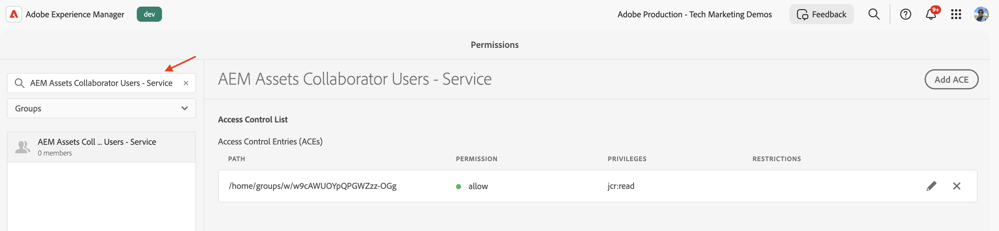

# Behörighetshantering för produktprofil och tjänster

Lär dig hur du hanterar behörigheter för användargrupperna för produktprofiler och tjänster i AEM as a Cloud Service.

I den här självstudiekursen lär du dig:

- Produktprofil och dess koppling till tjänster.
- Uppdaterar behörigheter för tjänstanvändargruppen.

## Bakgrund

När du använder ett AEM-API måste du tilldela _produktprofilen_ till _Credentials_ i Adobe Developer Console-projektet (eller ADC-projektet). _Produktprofilen_ (och den tillhörande tjänsten) ger behörighet _eller behörighet_ till autentiseringsuppgifterna för åtkomst till AEM-resurserna. På följande skärmbild kan du se _Autentiseringsuppgifter_ och _produktprofil_ för ett AEM Assets Author API:


En produktprofil är associerad med en eller flera _tjänster_. I AEM as a Cloud Service representerar en _tjänst_ användargrupper med fördefinierade åtkomstkontrollistor (ACL) för databasnoder, vilket möjliggör detaljerad behörighetshantering.


När API-anropet lyckades skapas en användare som representerar ADC-projektets autentiseringsuppgifter i AEM Author-tjänsten tillsammans med användargrupperna som matchar produktprofilen och tjänstkonfigurationen.


I ovanstående scenario skapas användaren `1323d2...` i AEM Author-tjänsten och är medlem i användargrupperna `AEM Assets Collaborator Users - Service` och `AEM Assets Collaborator Users - author - Program XXX - Environment XXX`.

## Uppdatera användargruppbehörigheter för tjänster

De flesta _tjänster_ ger behörighet _READ_ till AEM-resurserna, via användargrupperna i AEM-instansen som har samma namn som _tjänsten_.

Det finns tillfällen när autentiseringsuppgifterna (även tekniska kontoanvändare) behöver ytterligare behörigheter, som _Skapa, Uppdatera, Ta bort_ (CUD) för AEM-resurser. I så fall kan du uppdatera behörigheterna för användargrupperna _Services_ i AEM-instansen.

Om AEM Assets Author API-anrop till ett [403-fel för icke-GET-begäranden](../use-cases/invoke-api-using-oauth-s2s.md#403-error-for-non-get-requests) kan du uppdatera behörigheterna för användargruppen _AEM Assets Collaborator Users - Service_ i AEM-instansen.

Med hjälp av användargränssnittet för behörigheter eller skriptet [Sling Repository Initialization](https://sling.apache.org/documentation/bundles/repository-initialization.html) kan du uppdatera behörigheterna för användargrupperna som finns i körklart läge i AEM-instansen.

### Uppdatera behörigheter med användargränssnittet för behörigheter

Så här uppdaterar du behörigheter för tjänstanvändargruppen (till exempel `AEM Assets Collaborator Users - Service`) med hjälp av användargränssnittet för behörigheter:

- Navigera till **Verktyg** > **Säkerhet** > **Behörigheter** i AEM-instansen.

- Sök efter tjänstanvändargruppen (till exempel `AEM Assets Collaborator Users - Service`).

  

- Klicka på **Lägg till ACE** för att lägga till en ny åtkomstkontrollpost (ACE) för användargruppen.

  

### Uppdatera behörigheter med databasens initieringsskript

Så här uppdaterar du behörigheter för tjänstanvändargruppen (till exempel `AEM Assets Collaborator Users - Service`) med hjälp av databasinitieringsskriptet:

- Öppna AEM-projektet i din favoritutvecklingsmiljö.

- Navigera till modulen `ui.config`

- Skapa en fil i `ui.config/src/main/content/jcr_root/apps/<PROJECT-NAME>/osgiconfig/config.author` med namnet `org.apache.sling.jcr.repoinit.RepositoryInitializer-services-group-acl-update.cfg.json`, med följande innehåll:

  ```json
  {
      "scripts": [
          "set ACL for \"AEM Assets Collaborator Users - Service\" (ACLOptions=ignoreMissingPrincipal)",
          "    allow jcr:read,jcr:versionManagement,crx:replicate,rep:write on /content/dam",
          "end"
      ]
  }
  ```

- Verkställ och skicka ändringarna till databasen.

- Distribuera ändringarna till AEM-instansen med [Cloud Manager-pipeline i full hög](https://experienceleague.adobe.com/en/docs/experience-manager-cloud-service/content/implementing/using-cloud-manager/cicd-pipelines/introduction-ci-cd-pipelines#full-stack-pipeline).

- Du kan också verifiera användargruppens behörigheter i vyn **Behörigheter**. Navigera till **Verktyg** > **Säkerhet** > **Behörigheter** i AEM-instansen.

  

### Verifiera behörigheterna

När du har uppdaterat behörigheterna med någon av ovanstående metoder bör PATCH begäran om att uppdatera metadata för resursen nu fungera utan några problem.


## Sammanfattning

Du lärde dig att hantera behörigheter för användargrupperna för produktprofiler och tjänster i AEM as a Cloud Service. Du kan uppdatera behörigheterna för tjänstanvändargrupperna i AEM-instansen med hjälp av behörighetsgränssnittet eller databasinitieringsskriptet.
