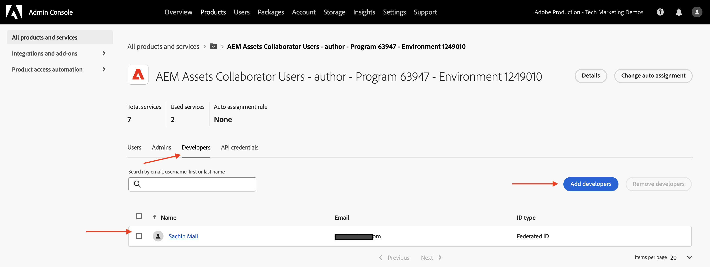
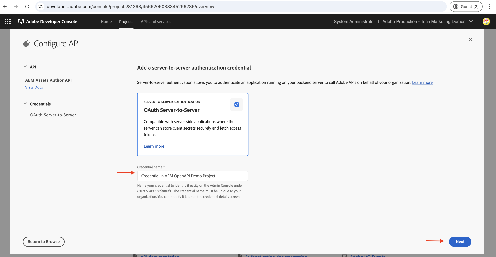

# Konfigurera OpenAPI-baserade AEM API:er

Lär dig hur du konfigurerar AEM as a Cloud Service-miljön för att ge åtkomst till OpenAPI-baserade AEM API:er.

I det här exemplet används **AEM Assets API** med autentiseringsmetoden **Server-till-server** för att demonstrera den OpenAPI-baserade installationsprocessen för AEM API:er. Liknande steg kan följas för att konfigurera [andra OpenAPI-baserade AEM API:er](https://developer.adobe.com/experience-cloud/experience-manager-apis/#openapi-based-apis).

>[!VIDEO](https://video.tv.adobe.com/v/3457510?quality=12&learn=on)

Konfigurationsprocessen på hög nivå omfattar följande steg:

1. Modernisering av AEM as a Cloud Service-miljön.
1. Aktivera åtkomst till AEM API:er.
1. Skapa Adobe Developer Console-projekt (ADC).
1. Konfigurera ADC-projekt.
1. Konfigurera AEM-instansen för att aktivera ADC-projektkommunikation.

## Förutsättningar

- Tillgång till Cloud Manager- och AEM as a Cloud Service-miljön
- Tillgång till Adobe Developer Console (ADC).
- AEM-projekt för att lägga till eller uppdatera API-konfigurationen i filen `api.yaml`.

## Modernisering av AEM as a Cloud Service miljö{#modernization-of-aem-as-a-cloud-service-environment}

Moderniseringen av AEM as a Cloud Service-miljön är en **engångsåtgärd per miljöaktivitet** som omfattar följande steg. Om du redan har moderniserat din AEM as a Cloud Service-miljö kan du hoppa över det här steget.

- Uppdatera till AEM-utgåvan **2024.10.18459.20241031T210302Z** eller senare.
- Lägg till nya produktprofiler i den om miljön skapades före utgåvan 2024.10.18459.20241031T210302Z.

### Uppdatera AEM-instans{#update-aem-instance}

- När du har loggat in på Adobe [Cloud Manager](https://my.cloudmanager.adobe.com/) och vill uppdatera AEM-instansen går du till avsnittet _Miljö_, markerar ikonen _ellips_ bredvid miljönamnet och väljer alternativet **Uppdatera** .


- Klicka sedan på knappen **Skicka** och kör den _föreslagna_ kompletta stackpipeline.


I det här fallet heter Pipeline i helhög **Dev :: Fullstack-Deploy** och AEM-miljön kallas **wknd-program-dev**. Dina namn kan vara olika.

### Lägg till nya produktprofiler{#add-new-product-profiles}

- Om du vill lägga till nya produktprofiler i AEM-instansen går du till avsnittet [Miljö](https://my.cloudmanager.adobe.com/) för Adobe _Cloud Manager_ och markerar ikonen _ellips_ bredvid miljönamnet. Välj sedan alternativet **Lägg till produktprofiler** .


- Granska de nya produktprofilerna genom att klicka på ikonen _ellips_ bredvid miljönamnet och välja **Hantera åtkomst** > **Författarprofiler**.

- Fönstret _Admin Console_ visar de nya produktprofilerna. Beroende på dina AEM-rättigheter som AEM Assets, AEM Sites, AEM Forms osv. kan du se olika produktprofiler. I mitt fall har jag till exempel AEM Assets- och Sites-rättigheter, så jag ser följande produktprofiler.


- Ovanstående steg avslutar moderniseringen av AEM as a Cloud Service-miljön.

## Aktivera åtkomst till AEM API:er{#enable-aem-apis-access}

Förekomsten av de _nya produktprofilerna_ aktiverar OpenAPI-baserad AEM API-åtkomst i [Adobe Developer Console (ADC)](https://developer.adobe.com/). Utan dessa produktprofiler kan du inte konfigurera de OpenAPI-baserade AEM-API:erna i Adobe Developer Console (ADC).

De nya produktprofilerna är kopplade till _tjänsterna_ som representerar _AEM-användargrupper med fördefinierade åtkomstkontrollistor_. _Tjänsterna_ används för att styra åtkomstnivån för AEM API:er. Du kan också markera eller avmarkera de _tjänster_ som är kopplade till produktprofilen för att minska eller öka åtkomstnivån.

Granska associationen genom att klicka på ikonen _Visa detaljer_ bredvid produktprofilens namn. På följande skärmbild ser du kopplingen mellan **AEM Sites Content Managers - author - Program XXX - Environment XXX** och **AEM Sites Content Managers** Service. Granska andra produktprofiler och deras associationer med tjänsterna.


### Aktivera åtkomst till AEM Assets API:er{#enable-aem-assets-apis-access}

I det här exemplet används **AEM Assets-API:t** för att demonstrera den OpenAPI-baserade installationsprocessen för AEM-API:er. Som standard är dock **AEM Assets API-användartjänsten** inte kopplad till någon produktprofil. Du måste associera den med den önskade produktprofilen.

Låt oss associera det med den nya produktprofilen **AEM Assets Collaborator Users - författare - Program XXX - Miljö XXX** eller någon annan produktprofil som du vill använda för AEM Assets API-åtkomst.


### Aktivera autentisering från server till server

Om du vill aktivera autentisering från server till server för de OpenAPI-baserade AEM-API:erna måste användaren som konfigurerar integrering med Adobe Developer Console (ADC) läggas till som utvecklare i _produktprofilen_ där _tjänsten_ är associerad.

Om du till exempel vill aktivera autentisering från server till server för AEM Assets API måste användaren läggas till som utvecklare i **AEM Assets Collaborator Users - författare - Program XXX - Miljö XXX** _Produktprofil_.



Efter den här associationen kan ADC-projektets _API för tillgångsförfattare_ ställa in önskad server-till-server-autentisering och associera autentiseringskontot från ADC-projektet (som skapades i nästa steg) med produktprofilen.

>[!IMPORTANT]
>
>Ovanstående steg är viktigt för att aktivera autentisering från server till server för önskat AEM API. Utan den här associationen kan AEM API inte användas med autentiseringsmetoden Server-till-server.

Genom att utföra alla ovanstående steg har du förberett AEM as a Cloud Service-miljön för att aktivera OpenAPI-baserad åtkomst till AEM API:er. Sedan måste du skapa Adobe Developer Console-projektet (ADC) för att konfigurera OpenAPI-baserade AEM API:er.

## Skapa Adobe Developer Console-projekt (ADC){#adc-project}

Adobe Developer Console-projektet (ADC) används för att konfigurera OpenAPI-baserade AEM API:er. Kom ihåg att [Adobe Developer Console (ADC)](./overview.md#accessing-adobe-apis-and-related-concepts) är utvecklarnavet för åtkomst till Adobe API:er, SDK:er, realtidshändelser, serverlösa funktioner med mera.

ADC-projektet används för att lägga till önskade API:er, konfigurera autentiseringen och associera autentiseringskontot med produktprofilen.

Så här skapar du ett ADC-projekt:

1. Logga in på [Adobe Developer Console](https://developer.adobe.com/console) med din Adobe ID.

   

1. I avsnittet _Snabbstart_ klickar du på knappen **Skapa nytt projekt** .

   

1. Ett nytt projekt med standardnamnet skapas.

   

1. Redigera projektnamnet genom att klicka på knappen **Redigera projekt** i det övre högra hörnet. Ange ett beskrivande namn och klicka på **Spara**.

   

## Konfigurera ADC-projekt{#configure-adc-project}

När du har skapat ADC-projektet måste du lägga till de AEM-API:er du vill använda, konfigurera autentiseringen och associera autentiseringskontot med produktprofilen.

I det här fallet används **AEM Assets-API:t** för att demonstrera den OpenAPI-baserade installationsprocessen för AEM-API:er. Du kan dock följa de här stegen för att lägga till andra OpenAPI-baserade AEM-API:er som **AEM Sites API**, **AEM Forms API** osv. AEM-berättigandena avgör vilka API:er som är tillgängliga i Adobe Developer Console (ADC).

1. Om du vill lägga till AEM API:er klickar du på knappen **Lägg till API** .

   

1. I dialogrutan _Lägg till API_ filtrerar du efter _Experience Cloud_ och väljer önskat AEM-API. I det här fallet har till exempel _API:t för resursförfattare_ valts.

   

   >[!TIP]
   >
   >    Om **AEM API-kortet** är inaktiverat och _Varför är det inaktiverat?_ information visar meddelandet **Licens krävs**. En av orsakerna kan vara att du INTE har moderniserat din AEM as a Cloud Service-miljö. Mer information finns i [Modernisering av AEM as a Cloud Service-miljön](#modernization-of-aem-as-a-cloud-service-environment).

1. I dialogrutan _Konfigurera API_ väljer du sedan önskat autentiseringsalternativ. I det här fallet är autentiseringsalternativet **Server-till-server** markerat.

   

   Server-till-server-autentiseringen är idealisk för backend-tjänster som behöver API-åtkomst utan användarinteraktion. Autentiseringsalternativen Web App och Single Page App är lämpliga för program som behöver API-åtkomst åt användarna. Mer information finns i [Skillnaden mellan autentiseringsuppgifter för OAuth Server-to-Server och Web App respektive Single Page App &#x200B;](./overview.md#difference-between-oauth-server-to-server-vs-web-app-vs-single-page-app-credentials).

   >[!TIP]
   >
   >Om du inte ser autentiseringsalternativet Server-till-server betyder det att användaren som ställer in integreringen inte läggs till som utvecklare i den produktprofil där tjänsten är kopplad. Mer information finns i [Aktivera autentisering från server till server](#enable-server-to-server-authentication).


1. Om det behövs kan du byta namn på API:t för enklare identifiering. I demosyfte används standardnamnet.

   

1. I det här fallet är autentiseringsmetoden **OAuth Server-to-Server** så du måste associera autentiseringskontot med produktprofilen. Välj **AEM Assets Collaborator Users - författare - Program XXX - Miljö XXX** Produktprofil och klicka på **Spara**.

   

1. Granska AEM API och autentiseringskonfigurationen.

   

   

Om du väljer autentiseringsmetoden **OAuth Web App** eller **OAuth Single Page App** uppmanas inte associationen för produktprofilen, men en omdirigerings-URI krävs. Omdirigerings-URI för programmet används för att dirigera om användaren till programmet efter autentisering med en auktoriseringskod. De relevanta självstudiekurserna för användningsfall beskriver sådana autentiseringsspecifika konfigurationer.

## Konfigurera AEM-instansen för att aktivera ADC-projektkommunikation{#configure-aem-instance}

Därefter måste du konfigurera AEM-instansen så att den aktiverar ovanstående ADC-projektkommunikation.

Utan den här konfigurationen kan ADC-projektets ClientID INTE kommunicera med AEM-instansen och resulterar i ett 403-otillåtet fel. Tänk på den här konfigurationen som en brandväggsregel så att bara de klient-ID:n som tillåts kan kommunicera med AEM-instansen.

Låt oss följa stegen för att konfigurera AEM-instansen så att den aktiveras ovanför ADC Project-kommunikationen.

1. Navigera till AEM-projektet (eller klona det om du inte redan gjort det) på den lokala datorn och leta upp mappen `config`.

1. Leta reda på eller skapa filen `api.yaml` från mappen `config` i AEM Project. I mitt fall används [AEM WKND Sites Project](https://github.com/adobe/aem-guides-wknd) för att demonstrera den OpenAPI-baserade installationsprocessen för AEM API:er.

   

1. Lägg till följande konfiguration i filen `api.yaml` så att ADC-projektets ClientID kan kommunicera med AEM-instansen.

   ```yaml
   kind: "API"
   version: "1.0"
   metadata: 
       envTypes: ["dev", "stage", "prod"]
   data:
       allowedClientIDs:
           author:
           - "<ADC Project's Credentials ClientID>"
   ```

   Ersätt `<ADC Project's Credentials ClientID>` med det faktiska klient-ID:t för ADC-projektets autentiseringsuppgifter-värde. API-slutpunkten som används i den här självstudiekursen är bara tillgänglig på författarnivån, men för andra API:er kan yaml-konfigurationen också ha en _publish_ - eller _preview_ -nod.

   >[!CAUTION]
   >
   > För demoändamål används samma ClientID för alla miljöer. Vi rekommenderar att du använder ett separat ClientID per miljö (dev, stage, prod) för bättre säkerhet och kontroll.

1. Bekräfta konfigurationsändringarna och skicka ändringarna till Git-fjärrdatabasen som Cloud Manager pipeline är ansluten till.

1. Distribuera ovanstående ändringar med [konfigurationsförloppet](https://experienceleague.adobe.com/en/docs/experience-manager-cloud-service/content/implementing/using-cloud-manager/cicd-pipelines/introduction-ci-cd-pipelines#config-deployment-pipeline) i Cloud Manager.

   

Observera att filen `api.yaml` också kan installeras i en [RDE](https://experienceleague.adobe.com/en/docs/experience-manager-learn/cloud-service/developing/rde/overview), [med kommandoradsverktyg](https://experienceleague.adobe.com/en/docs/experience-manager-learn/cloud-service/developing/rde/how-to-use#deploy-configuration-yaml-files). Detta är användbart när du vill testa konfigurationsändringarna innan du distribuerar dem till produktionsmiljön.

>[!CAUTION]
>
>YAML-filen (`api.yaml`) är det enda sättet att konfigurera AEM-instansen så att den kan kommunicera med ADC-projektet. Andra metoder, till exempel att använda miljövariabler, stöds inte för den här konfigurationen.


## Nästa steg

När AEM-instansen har konfigurerats för att aktivera ADC-projektkommunikation kan du börja använda de OpenAPI-baserade AEM-API:erna. Lär dig hur du använder OpenAPI-baserade AEM API:er med olika OAuth-autentiseringsmetoder:

<!-- CARDS
{target = _self}

* ./use-cases/invoke-api-using-oauth-s2s.md
  {title = Invoke API using Server-to-Server authentication}
  {description = Learn how to invoke OpenAPI-based AEM APIs from a custom NodeJS application using OAuth Server-to-Server authentication.}
  {image = ./assets/s2s/OAuth-S2S.png}
* ./use-cases/invoke-api-using-oauth-web-app.md
  {title = Invoke API using Web App authentication}
  {description = Learn how to invoke OpenAPI-based AEM APIs from a custom web application using OAuth Web App authentication.}
  {image = ./assets/web-app/OAuth-WebApp.png}
* ./use-cases/invoke-api-using-oauth-single-page-app.md
  {title = Invoke API using Single Page App authentication}
  {description = Learn how to invoke OpenAPI-based AEM APIs from a custom Single Page App (SPA) using OAuth 2.0 PKCE flow.}
  {image = ./assets/spa/OAuth-SPA.png}  
-->
<!-- START CARDS HTML - DO NOT MODIFY BY HAND -->
<div class="columns">
    <div class="column is-half-tablet is-half-desktop is-one-third-widescreen" aria-label="Invoke API using Server-to-Server authentication">
        <div class="card" style="height: 100%; display: flex; flex-direction: column; height: 100%;">
            <div class="card-image">
                <figure class="image x-is-16by9">
                    <a href="./use-cases/invoke-api-using-oauth-s2s.md" title="Anropa API med autentisering från server till server" target="_self" rel="referrer">
                        
                    </a>
                </figure>
            </div>
            <div class="card-content is-padded-small" style="display: flex; flex-direction: column; flex-grow: 1; justify-content: space-between;">
                <div class="top-card-content">
                    <p class="headline is-size-6 has-text-weight-bold">
                        <a href="./use-cases/invoke-api-using-oauth-s2s.md" target="_self" rel="referrer" title="Anropa API med autentisering från server till server">Anropa API med autentisering från server till server</a>
                    </p>
                    <p class="is-size-6">Lär dig hur du anropar OpenAPI-baserade AEM-API:er från ett anpassat NodeJS-program med OAuth Server-till-Server-autentisering.</p>
                </div>
                <a href="./use-cases/invoke-api-using-oauth-s2s.md" target="_self" rel="referrer" class="spectrum-Button spectrum-Button--outline spectrum-Button--primary spectrum-Button--sizeM" style="align-self: flex-start; margin-top: 1rem;">
                    <span class="spectrum-Button-label has-no-wrap has-text-weight-bold">Läs mer</span>
                </a>
            </div>
        </div>
    </div>
    <div class="column is-half-tablet is-half-desktop is-one-third-widescreen" aria-label="Invoke API using Web App authentication">
        <div class="card" style="height: 100%; display: flex; flex-direction: column; height: 100%;">
            <div class="card-image">
                <figure class="image x-is-16by9">
                    <a href="./use-cases/invoke-api-using-oauth-web-app.md" title="Anropa API med autentisering i webbapp" target="_self" rel="referrer">
                        
                    </a>
                </figure>
            </div>
            <div class="card-content is-padded-small" style="display: flex; flex-direction: column; flex-grow: 1; justify-content: space-between;">
                <div class="top-card-content">
                    <p class="headline is-size-6 has-text-weight-bold">
                        <a href="./use-cases/invoke-api-using-oauth-web-app.md" target="_self" rel="referrer" title="Anropa API med autentisering i webbapp">Anropa API med autentisering via webbapp</a>
                    </p>
                    <p class="is-size-6">Lär dig hur du anropar OpenAPI-baserade AEM-API:er från ett anpassat webbprogram med OAuth Web App-autentisering.</p>
                </div>
                <a href="./use-cases/invoke-api-using-oauth-web-app.md" target="_self" rel="referrer" class="spectrum-Button spectrum-Button--outline spectrum-Button--primary spectrum-Button--sizeM" style="align-self: flex-start; margin-top: 1rem;">
                    <span class="spectrum-Button-label has-no-wrap has-text-weight-bold">Läs mer</span>
                </a>
            </div>
        </div>
    </div>
    <div class="column is-half-tablet is-half-desktop is-one-third-widescreen" aria-label="Invoke API using Single Page App authentication">
        <div class="card" style="height: 100%; display: flex; flex-direction: column; height: 100%;">
            <div class="card-image">
                <figure class="image x-is-16by9">
                    <a href="./use-cases/invoke-api-using-oauth-single-page-app.md" title="Anropa API med autentisering för Single Page App" target="_self" rel="referrer">
                        
                    </a>
                </figure>
            </div>
            <div class="card-content is-padded-small" style="display: flex; flex-direction: column; flex-grow: 1; justify-content: space-between;">
                <div class="top-card-content">
                    <p class="headline is-size-6 has-text-weight-bold">
                        <a href="./use-cases/invoke-api-using-oauth-single-page-app.md" target="_self" rel="referrer" title="Anropa API med autentisering för Single Page App">Anropa API med autentisering för Single Page-app</a>
                    </p>
                    <p class="is-size-6">Lär dig hur du anropar OpenAPI-baserade AEM-API:er från en anpassad Single Page App (SPA) med OAuth 2.0 PKCE-flöde.</p>
                </div>
                <a href="./use-cases/invoke-api-using-oauth-single-page-app.md" target="_self" rel="referrer" class="spectrum-Button spectrum-Button--outline spectrum-Button--primary spectrum-Button--sizeM" style="align-self: flex-start; margin-top: 1rem;">
                    <span class="spectrum-Button-label has-no-wrap has-text-weight-bold">Läs mer</span>
                </a>
            </div>
        </div>
    </div>
</div>
<!-- END CARDS HTML - DO NOT MODIFY BY HAND -->
