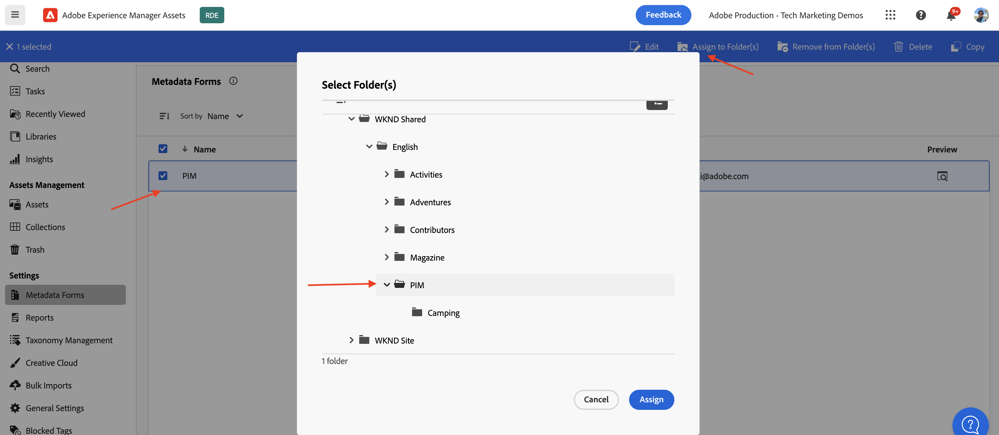
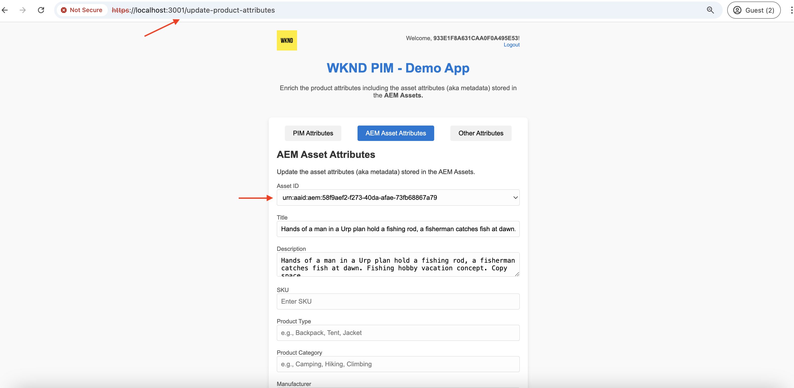

# Anropa OpenAPI-baserade AEM API:er med OAuth Web App-autentisering

Lär dig hur du anropar OpenAPI-baserade AEM API:er på AEM as a Cloud Service med användarbaserad autentisering från en anpassad webbapp som använder OAuth Web App.

OAuth Web App-autentiseringen är idealisk för webbprogram med klientkomponenter och _backend_ -komponenter som behöver **komma åt AEM API:er för en användares räkning**. Den använder OAuth 2.0-anslagstypen _permission_code_ för att få en åtkomsttoken åt användaren för att få åtkomst till AEM API:er. Mer information finns i [Skillnad mellan autentiseringsuppgifter för OAuth Server-till-Server och OAuth Web App/Single Page App](../overview.md#difference-between-oauth-server-to-server-and-oauth-web-appsingle-page-app-credentials).

>[!AVAILABILITY]
>
>OpenAPI-baserade AEM API:er är tillgängliga som en del av ett program för tidig åtkomst. Om du är intresserad av att få tillgång till dem bör du skicka ett e-postmeddelande till [aem-apis@adobe.com](mailto:aem-apis@adobe.com) med en beskrivning av ditt användningsfall.

## Vad du lär dig{#what-you-learn}

I den här självstudiekursen får du lära dig att:

- Konfigurera ett Adobe Developer Console-projekt (ADC) så att du får åtkomst till Assets Author API med _OAuth Web App_ -autentisering.

- Implementera autentiseringsflödet för OAuth Web App i en anpassad webbapp.
   - IMS-användarautentisering och appauktorisering.
   - Användarspecifik hämtning av åtkomsttoken.
   - Åtkomst till OpenAPI-baserade AEM API:er med användarspecifik åtkomsttoken.

Innan du börjar bör du kontrollera följande:

- [Åtkomst till Adobe API:er och relaterade koncept](../overview.md#accessing-adobe-apis-and-related-concepts)-avsnitt.
- [Konfigurera OpenAPI-baserade AEM API:er](../setup.md)-artiklar.

## Exempel på webbprogram: WKND-PIM - översikt och funktionsflöde

Låt oss förstå exempelwebbprogrammet, WKND Product Information Management (PIM) och dess funktionella flöde.

WKND PIM-appen är ett exempelwebbprogram som är utformat för att hantera produktattribut och metadata för resurser som lagras i AEM as a Cloud Service. I det här exemplet visas hur webbprogram kan integreras smidigt med Adobe API:er för att leverera effektiva, användarcentrerade arbetsflöden.

Adobe Developer Console-projektet (ADC) har konfigurerats för åtkomst till Assets Author API med hjälp av OAuth Web App-autentisering. Den tillhandahåller nödvändiga _client_id_ och _client_secrets_ till WKND-PIM-webbprogrammet för att initiera _permission_code_-anslagsflödet.

>[!VIDEO](https://video.tv.adobe.com/v/3442757?quality=12&learn=on)


Följande diagram visar det funktionella flödet för WKND-PIM-webbprogrammet _som hämtar användarspecifika åtkomsttoken för interaktion med Assets Author API_.


1. Webbprogrammet initierar processen genom att dirigera om användaren till Adobe Identity Management System (IMS) för autentisering.
1. Tillsammans med omdirigeringen skickar webbprogrammet den begärda _client_id_ och _redirect_uri_ till IMS-programmet.
1. IMS autentiserar användaren och skickar tillbaka dem till angiven _redirect_uri_ med en _authentication_code_.
1. Webbprogrammet byter ut _permission_code_ mot IMS för en användarspecifik åtkomsttoken, med hjälp av dess _client_id_ och _client_secrets_.
1. Vid lyckad validering utfärdar IMS den användarspecifika _åtkomsttoken_.
1. Webbappen använder _åtkomsttoken_ säkert för att interagera med Assets Author API, vilket gör att användaren kan hämta eller uppdatera metadata för produktresurser.

WKND-PIM-webbappen har utvecklats med [Node.js](https://nodejs.org/en) och [Express](https://expressjs.com/). Express fungerar som den server som på ett säkert sätt hanterar privata hemligheter och användarspecifika åtkomsttoken.

Andra webbstackar (Java, Python, .NET-baserade osv.) kan användas för att skapa webbappar som integreras med Adobe API:er med de metoder som illustreras i den här självstudiekursen.

## Så här använder du den här självstudien{#how-to-use-this-tutorial}

Du kan antingen [Granska kodfragment för webbprogram](#review-web-app-key-code-snippets) för att förstå autentiseringsflödet för OAuth-webbprogram och API-anropa kodfragment som används i WKND-PIM-webbprogrammet. Eller gå direkt till avsnittet [Konfigurera och kör webbprogrammet](#setup-run-web-app) för att konfigurera och köra webbappen WKND-PIM på den lokala datorn för att förstå autentiseringsflödet för OAuth-webbappen och API-anropen.

## Granska kodfragment för webbprogramnycklar{#review-web-app-key-code-snippets}

Låt oss granska de kodfragment som används i WKND-PIM-webbappen för att förstå autentiseringsflödet i OAuth Web App och API-anrop.

### Hämta WKND-PIM-webbprogramkoden

1. Hämta zip-filen [WKND-PIM-webbprogrammet](../assets/web-app/wknd-pim-demo-web-app.zip) och extrahera den.

1. Navigera till den extraherade mappen och öppna filen `.env.example` i din favoritkodredigerare. Granska de konfigurationsparametrar som krävs.

   ```plaintext
   ########################################################################
   # Adobe IMS, Adobe Developer Console (ADC), and AEM Assets Information
   ########################################################################
   # Adobe IMS OAuth endpoints
   ADOBE_IMS_AUTHORIZATION_ENDPOINT=https://ims-na1.adobelogin.com/ims/authorize/v2
   ADOBE_IMS_TOKEN_ENDPOINT=https://ims-na1.adobelogin.com/ims/token/v3
   ADOBE_IMS_USERINFO_ENDPOINT=https://ims-na1.adobelogin.com/ims/userinfo/v2
   
   # Adobe Developer Console (ADC) Project's OAuth Web App credential
   ADC_CLIENT_ID=<ADC Project OAuth Web App credential ClientID>
   ADC_CLIENT_SECRET=<ADC Project OAuth Web App credential Client Secret>
   ADC_SCOPES=<ADC Project OAuth Web App credential credential Scopes>
   
   # AEM Assets Information
   AEM_ASSET_HOSTNAME=<AEM Assets Hostname, e.g., https://author-p63947-e1502138.adobeaemcloud.com/>
   AEM_ASSET_IDS=< AEM Asset IDs Comma Seperated, e.g., urn:aaid:aem:9f20a8ce-934a-4560-8720-250e529fbb17,urn:aaid:aem:6e0123cd-8a67-4d1f-b721-1b3da987d831>
   
   ################################################
   # Web App Information
   ################################################
   # The port number on which this server (web app) will run
   PORT = 3000
   
   # The URL to which the user will be redirected after the OAuth flow is complete
   REDIRECT_URI=https://localhost:3001/callback
   
   # The Express (express-session) uses this secret to encrypt and verify the authenticity of that cookie
   EXPRESS_SESSION_SECRET=<Express Session Secret>
   ```

   Du måste ersätta platshållarna med de faktiska värdena från Adobe Developer Console (ADC) Project och AEM as a Cloud Service Assets.

### IMS-användarautentisering och appauktorisering

Låt oss granska koden som initierar IMS-användarautentisering och appauktorisering. Om du vill granska eller uppdatera metadata för resursen måste användaren autentisera mot Adobe IMS och godkänna WKND-PIM-webbappen så att den får åtkomst till API:t för Assets Author för sina räkning.

Vid det allra första inloggningsförsöket måste användaren ge sitt medgivande för att tillåta att WKND-PIM-webbprogrammet får åtkomst till Assets Author API åt dem.


1. Filen `routes/update-product-attributes.js` verifierar om användarens [Express-session](https://www.npmjs.com/package/express-session) har en åtkomsttoken. Annars dirigeras användaren om till `/auth`-vägen.

   ```javascript
   ...
   // The update-product-attributes route, shows the product attributes form with tabs
   router.get("/update-product-attributes", async (req, res) => {
     // Check if the user is authenticated, if not redirect to the auth route
     if (!req.session.accessToken) {
         return res.redirect("/auth");
     }
     ...
   });
   ```

1. I filen `routes/adobe-ims-auth.js` initierar vägen `/auth` IMS-användarautentisering och appauktorisering. Observera parametrarna _client_id_, _redirect_uri_ och _response_type_ som skickas till Adobe IMS-auktoriseringsslutpunkten.

   ```javascript
   ...
   // Route to initiate Adobe IMS user authentication
   router.get("/auth", (req, res) => {
     // Redirect user to Adobe IMS authorization endpoint
     try {
         // Constructing the authorization URL
         const params = new URLSearchParams({
         client_id: adobeADCConfig.clientId,
         redirect_uri: redirectUri,
         response_type: "code",
         });
   
         // Append scopes if defined in configuration
         if (adobeADCConfig?.scopes) params.append("scope", adobeADCConfig.scopes);
   
         // Redirect user to Adobe IMS authorization URL
         const imsAuthorizationUrl = `${
         adobeIMSConfig.authorizationEndpoint
         }?${params.toString()}`;
   
         res.redirect(imsAuthorizationUrl);
     } catch (error) {
         console.error("Error initiating Adobe IMS authentication:", error);
         res.status(500).send("Unable to initiate authentication");
     }
   });
   ...
   ```

Om användaren inte är autentiserad mot Adobe IMS visas inloggningssidan för Adobe ID där användaren uppmanas att autentisera.

Om den redan är autentiserad omdirigeras användaren tillbaka till angivet _redirect_uri_ för WKND-PIM-webbprogrammet med en _permission_code_.

### Hämtning av åtkomsttoken

WKND-PIM-webbprogrammet utbyter _permission_code_ med Adobe IMS på ett säkert sätt mot en användarspecifik åtkomsttoken med hjälp av _client_id_ och _client_secrets_ i ADC-projektets OAuth Web App-autentiseringsuppgifter.

I filen `routes/adobe-ims-auth.js` byter `/callback`-vägen _permission_code_ med Adobe IMS för en användarspecifik åtkomsttoken.

```javascript
...
// Callback route to exchange authorization code for access token
router.get("/callback", async (req, res) => {
  // Extracting authorization code from the query parameters
  const authorizationCode = req.query.code;

  if (!authorizationCode) {
    return res.status(400).send("Missing authorization code");
  }

  // Exchange authorization code for access token
  try {
    // Fetch access token from Adobe IMS token endpoint
    const response = await fetch(adobeIMSConfig.tokenEndpoint, {
      method: "POST",
      headers: {
        "Content-Type": "application/x-www-form-urlencoded",
        Authorization: `Basic ${Buffer.from(
          `${adobeADCConfig.clientId}:${adobeADCConfig.clientSecret}`
        ).toString("base64")}`,
      },
      body: new URLSearchParams({
        code: authorizationCode,
        grant_type: "authorization_code",
      }),
    });

    if (!response.ok) {
      console.error("Failed to fetch access token:", response.statusText);
      return res.status(500).send("Failed to fetch access token");
    }

    const data = await response.json();

    if (!data.access_token) {
      console.error("Access token missing in the response:", data);
      return res.status(500).send("Invalid response from token endpoint");
    }

    // For debugging purposes
    console.log("Access token:", data.access_token);

    // Store the access token in the session
    req.session.accessToken = data.access_token;

    // Redirect user to update product attributes
    res.redirect("/update-product-attributes");
  } catch (error) {
    console.error("Error exchanging authorization code:", error);
    res.status(500).send("Error during token exchange");
  }
});
```

Åtkomsttoken lagras i [Express-sessionen](https://www.npmjs.com/package/express-session) för efterföljande begäranden till Assets Author API.

### Åtkomst till OpenAPI-baserade AEM API:er med åtkomsttoken

Webbprogrammet WKND-PIM använder på ett säkert sätt den användarspecifika åtkomsttoken för att interagera med API:t för Assets Author, vilket gör att användaren kan hämta eller uppdatera metadata för produktresurser.

I filen `routes/invoke-aem-apis.js` anropar vägarna `/api/getAEMAssetMetadata` och `/api/updateAEMAssetMetadata` API:erna för Assets Author med hjälp av åtkomsttoken.

```javascript
...
// API Route: Get AEM Asset Metadata
router.get("/api/getAEMAssetMetadata", async (req, res) => {
  const assetId = req.query.assetId;
  const bucketName = getBucketName(aemAssetsConfig.hostname);

  if (!assetId || !bucketName) {
    return res.status(400).json({ error: "Missing AEM Information" });
  }

  // Get the access token from the session
  const accessToken = req.session.accessToken;

  if (!accessToken) {
    return res.status(401).json({ error: "Not Authenticated with Adobe IMS" });
  }

  try {
    const assetMetadata = await invokeGetAssetMetadataAPI(
      bucketName,
      assetId,
      accessToken
    );

    const filteredMetadata = getFilteredMetadata(JSON.parse(assetMetadata));
    res.status(200).json(filteredMetadata);
  } catch (error) {
    console.error("Error getting asset metadata:", error.message);
    res.status(500).json({ error: `Internal Server Error: ${error.message}` });
  }
});

// Helper function to invoke the AEM API to get asset metadata
async function invokeGetAssetMetadataAPI(bucketName, assetId, accessToken) {
  const apiUrl = `https://${bucketName}.adobeaemcloud.com/adobe/assets/${assetId}/metadata`;


  // For debugging purposes
  console.log("API URL:", apiUrl);
  console.log("Access Token:", accessToken);
  console.log("API Key:", adobeADCConfig.clientId);

  try {
    const response = await fetch(apiUrl, {
      method: "GET",
      headers: {
        "If-None-Match": "string",
        "X-Adobe-Accept-Experimental": "1",
        Authorization: `Bearer ${accessToken}`,
        "X-Api-Key": adobeADCConfig.clientId,
      },
    });

    console.log("Response Status:", response.status);

    if (!response.ok) {
      throw new Error(`AEM API Error: ${response.statusText}`);
    }

    return await response.text();
  } catch (error) {
    throw new Error(`Failed to fetch asset metadata: ${error.message}`);
  }
}

// Helper function to filter the metadata properties like pim: and dc:
function getFilteredMetadata(data) {
  if (!data || !data.assetMetadata) {
    throw new Error("Invalid metadata structure received from API");
  }

  const properties = data.assetMetadata;
  return Object.keys(properties).reduce((filtered, key) => {
    if (
      key.startsWith("pim:") ||
      key === "dc:title" ||
      key === "dc:description"
    ) {
      filtered[key] = properties[key];
    }
    return filtered;
  }, {});
}

// API Route: Update AEM Asset Metadata
router.post("/api/updateAEMAssetMetadata", async (req, res) => {
  const { assetId, metadata } = req.body;

  if (!assetId || !metadata || typeof metadata !== "object") {
    return res.status(400).json({ error: "Invalid or Missing Metadata" });
  }

  const bucketName = getBucketName(aemAssetsConfig.hostname);
  if (!bucketName) {
    return res.status(400).json({ error: "Missing AEM Information" });
  }

  const accessToken = req.session.accessToken;
  if (!accessToken) {
    return res.status(401).json({ error: "Not Authenticated with Adobe IMS" });
  }

  try {
    const updatedMetadata = await invokePatchAssetMetadataAPI(
      bucketName,
      assetId,
      metadata,
      accessToken
    );
    res.status(200).json(updatedMetadata);
  } catch (error) {
    console.error("Error updating asset metadata:", error.message);
    res.status(500).json({ error: `Internal Server Error: ${error.message}` });
  }
});

// Helper function to invoke the AEM API to update asset metadata
async function invokePatchAssetMetadataAPI(
  bucketName,
  assetId,
  metadata,
  accessToken
) {
  const apiUrl = `https://${bucketName}.adobeaemcloud.com/adobe/assets/${assetId}/metadata`;
  const headers = {
    "Content-Type": "application/json-patch+json",
    "If-Match": "*",
    "X-Adobe-Accept-Experimental": "1",
    Authorization: `Bearer ${accessToken}`,
    "X-Api-Key": adobeADCConfig.clientId,
  };

  try {
    const response = await fetch(apiUrl, {
      method: "PATCH",
      headers,
      body: JSON.stringify(getTransformedMetadata(metadata)),
    });

    if (!response.ok) {
      throw new Error(`AEM API Error: ${response.statusText}`);
    }

    return await response.json();
  } catch (error) {
    throw new Error(`Failed to update asset metadata: ${error.message}`);
  }
}

// Helper function to transform metadata into JSON Patch format, e.g. [{ op: "add", path: "dc:title", value: "New Title" }]
function getTransformedMetadata(metadata) {
  return Object.keys(metadata).map((key) => ({
    op: "add",
    path: `/${key}`,
    value: metadata[key],
  }));
}
```

De OpenAPI-baserade AEM API-anropen görs från serversidan (Express-mellanvara) och inte direkt från klientsidan (webbläsare) för att säkerställa att åtkomsttoken hanteras på ett säkert sätt och inte exponeras för klientsidan.

### Uppdaterar åtkomsttoken

Om du vill uppdatera åtkomsttoken innan den upphör att gälla kan du implementera uppdateringstokenflödet. För att göra självstudiekursen enkel implementerar inte webbprogrammet WKND-PIM uppdateringstokenflödet.


>[!TIP]
>
>Du kan följa nästa avsnitt för att testa WKND-PIM-webbappen på din lokala dator och få en praktisk upplevelse av autentiseringsflödet i OAuth Web App och API-anrop.

## Konfigurera och köra webbprogram

Låt oss konfigurera och köra WKND-PIM-webbprogrammet på din lokala dator för att förstå autentiseringsflödet för OAuth-webbappen och API-anrop.

### Förutsättningar

För att kunna genomföra den här självstudiekursen behöver du:

- Moderniserad AEM as a Cloud Service-miljö med följande:
   - AEM version `2024.10.18459.20241031T210302Z` eller senare.
   - Nya produktprofiler (om miljön skapades före november 2024)

  Mer information finns i artikeln [Konfigurera OpenAPI-baserade AEM API:er](../setup.md).

- Exempelprojektet [WKND Sites](https://github.com/adobe/aem-guides-wknd?#aem-wknd-sites-project) måste distribueras till det.

- Åtkomst till [Adobe Developer Console](https://developer.adobe.com/developer-console/docs/guides/getting-started/).

- Installera [Node.js](https://nodejs.org/en/) på den lokala datorn för att köra exempelprogrammet NodeJS.

- Installera en [lokal-ssl-proxy](https://www.npmjs.com/package/local-ssl-proxy#local-ssl-proxy) på den lokala datorn om du vill skapa en lokal SSL HTTP-proxy med hjälp av ett självsignerat certifikat.


### Utvecklingssteg

Utvecklingsstegen på hög nivå är följande:

1. Konfigurera ADC-projekt
   1. Lägg till Assets Author API
   1. Konfigurera autentiseringsuppgifter för OAuth Web App
1. Konfigurera AEM-instansen för att aktivera ADC-projektkommunikation
1. Skapa och använd schema för metadata för resurser i AEM
1. Konfigurera och kör webbprogrammet WKND-PIM
1. Verifiera flödet från början till slut

### Konfigurera ADC-projekt

Konfigurationssteget för ADC-projekt är _upprepat_ från [Konfigurera OpenAPI-baserade AEM-API:er](../setup.md). Det upprepas att lägga till Assets Author API och konfigurera autentiseringsmetoden som OAuth Web App.

1. Öppna önskat projekt från [Adobe Developer Console](https://developer.adobe.com/console/projects).

1. Om du vill lägga till AEM API:er klickar du på knappen **Lägg till API** .

   

1. I dialogrutan _Lägg till API_ filtrerar du efter _Experience Cloud_, markerar **AEM Assets Author API**-kortet och klickar på **Nästa**.

   

1. I dialogrutan _Konfigurera API_ väljer du autentiseringsalternativet **Användarautentisering** och klickar på **Nästa**.

   

1. I nästa dialogruta _Konfigurera API_ väljer du autentiseringsalternativet **OAuth Web App** och klickar på **Nästa**.

   

1. Ange följande information i dialogrutan _Konfigurera OAuth-webbapp_ och klicka på **Nästa**.
   - Standardomdirigerings-URI: `https://localhost:3001/callback`
   - Omdirigerings-URI-mönster: `https://localhost:3001/callback`

   

1. Granska de tillgängliga scopen och klicka på **Spara konfigurerad API**.

   

1. Granska AEM API och autentiseringskonfigurationen.

   

   

### Konfigurera AEM-instans för att aktivera ADC-projektkommunikation

Följ instruktionerna i artikeln [Konfigurera OpenAPI-baserade AEM API:er](../setup.md#configure-the-aem-instance-to-enable-adc-project-communication) för att konfigurera AEM-instansen så att ADC-projektkommunikation aktiveras.

### Skapa och tillämpa metadatamatchemat för resurser

Som standard har WKND Sites-projektet inte det nödvändiga metadata-schemat för resurser för att visa produktattributen. Låt oss skapa och använda metadatamatchemat för resurser i AEM-instansen.

1. Logga in på instansen AEM as a Cloud Service Asset. Navigera med [resursvyn](https://experienceleague.adobe.com/en/docs/experience-manager-learn/assets/authoring/switch-views) till mappen `/content/dam/wknd-shared/en`.

   

1. Skapa en **PIM** och skapa mappen **Camping** i den. Överför sedan [exempelbilder](../assets/web-app/camping-gear-imgs.zip) i mappen **Camping**.

   

Låt oss sedan skapa det PIM-attributspecifika metadataschemat och använda det i mappen **PIM**.

1. Navigera till alternativet **Inställningar** > **Metadata Forms** från den vänstra listen och klicka på **Skapa** .

1. Ange följande information i dialogrutan **Skapa metadataformulär** och klicka på **Skapa**.
   - Namn: `PIM`
   - Använd befintlig formulärstruktur som mall: `Check`
   - Välj bland: `default`

   

1. Klicka på ikonen **+** för att lägga till en ny **PIM**-flik och lägga till **enkelradstext** i den. Egenskapsnamnen för metadata ska börja med prefixet `pim:`.

   

   | Etikett | Platshållare | Metadataegenskap |
   | --- | --- | --- |
   | SKU | Ange SKU-ID | `pim:sku` |
   | Produkttyp | t.ex. ryggsäck, tält, stödraster | `pim:productType` |
   | Produktkategori | t.ex. camping, vandring, klättring | `pim:productCategory` |
   | Tillverkare | Ange tillverkarens namn | `pim:manufacturer` |
   | Modell | Ange modellnamn | `pim:model` |
   | Märkesnamn | Ange varumärkesnamn | `pim:brandName` |

1. Klicka på **Spara** och **Stäng** för att spara metadataformuläret.

1. Till sist använder du metadatamateschemat **PIM** i mappen **PIM**.

   

Med ovanstående steg kan resurserna i mappen **PIM** lagra metadata för produktattribut.

### Konfigurera och kör webbprogrammet WKND-PIM

1. Hämta zip-filen [WKND-PIM-webbprogrammet](../assets/web-app/wknd-pim-demo-web-app.zip) och extrahera den.

1. Navigera till den extraherade mappen och kopiera filen `.env.example` till `.env`.

1. Uppdatera filen `.env` med de konfigurationsparametrar som krävs från Adobe Developer Console (ADC) Project och AEM as a Cloud Service Assets-instansen.

   ```plaintext
   ########################################################################
   # Adobe IMS, Adobe Developer Console (ADC), and AEM Assets Information
   ########################################################################
   # Adobe IMS OAuth endpoints
   ADOBE_IMS_AUTHORIZATION_ENDPOINT=https://ims-na1.adobelogin.com/ims/authorize/v2
   ADOBE_IMS_TOKEN_ENDPOINT=https://ims-na1.adobelogin.com/ims/token/v3
   ADOBE_IMS_USERINFO_ENDPOINT=https://ims-na1.adobelogin.com/ims/userinfo/v2
   
   # Adobe Developer Console (ADC) Project OAuth Web App credential
   ADC_CLIENT_ID=e1adsfsd59384320bbe4f9298f00b7ab
   ADC_CLIENT_SECRET=p8e-Mdfgfdsg43RHugVRTEOyWlmEU5m
   ADC_SCOPES=AdobeID,openid,aem.folders,aem.assets.author
   
   # AEM Assets Information
   AEM_ASSET_HOSTNAME=https://author-p3947-e1542138.adobeaemcloud.com/
   AEM_ASSET_IDS=urn:aaid:aem:aa689a9f-04da-4fbb-b460-74a5b6a69090,urn:aaid:aem:e4fdb6f6-1007-4e84-9726-a9522931786a
   
   ################################################
   # Web App Information
   ################################################
   # The port number on which this server (web app) will run
   PORT = 3000
   
   # The URL to which the user will be redirected after the OAuth flow is complete
   REDIRECT_URI=http://localhost:3000/auth/callback
   
   # The Express (express-session) uses this secret to encrypt and verify the authenticity of that cookie
   # For demonstration purposes, this is a simple secret. In production, you should use a strong secret
   EXPRESS_SESSION_SECRET=1234554321
   ```

   `AEM_ASSET_IDS` är egenskapsvärdet `jcr:uuid` för de överförda bilderna i mappen **Camping**. Mer information finns i det här [avsnittet](./invoke-api-using-oauth-s2s.md#review-the-api).

1. Öppna en terminal och navigera till den extraherade mappen. Installera nödvändiga beroenden med följande kommando.

   ```bash
   $ npm install
   ```

1. Starta WKND-PIM-webbprogrammet med följande kommando.

   ```bash
   $ npm start
   ```

1. Kör den lokala SSL HTTP-proxyn med följande kommando.

   ```bash
   $ local-ssl-proxy --source 3001 --target 3000 --cert ./ssl/server.crt --key ./ssl/server.key
   ```

   Den lokala SSL HTTP-proxyn används som IMS kräver att omdirigerings-URI är HTTPS.

### Verifiera flödet från början till slut

1. Öppna en webbläsare och gå till `https://localhost:3001` för att komma åt WKND-PIM-webbappen. Acceptera den självsignerade certifikatvarningen.

   

1. Klicka på **Testa nu** om du vill granska och uppdatera metadata för produktattribut. Det initierar IMS-användarautentiserings- och appauktoriseringsflödet.

1. Logga in med dina Adobe ID-inloggningsuppgifter och ge ditt medgivande till att WKND-PIM-webbappen får åtkomst till Assets Author API åt dig.

1. Klicka på fliken **AEM-resursattribut** på vägen/sidan `https://localhost:3001/update-product-attributes`. Välj ett resurs-ID i listrutan **Resurs-ID** för att visa metadata för resursen.

   

1. Uppdatera resursmetadata och klicka på **Uppdatera AEM-resursattribut** för att uppdatera resursmetadata.

   

>[!IMPORTANT]
>
>Om den autentiserade användaren saknar de behörigheter som krävs för att granska eller uppdatera metadata för resurser, returnerar de OpenAPI-baserade AEM-API:erna ett 403 Forbidden-fel. Även om användaren är autentiserad och har en giltig IMS-åtkomsttoken kan han eller hon inte få åtkomst till AEM-resurser utan den behörighet som krävs.


### Granska programkoden

Låt oss granska den övergripande kodstrukturen och de viktigaste startpunkterna i WKND-PIM-webbprogrammet. Programmet utvecklas med Node.js + Express.

1. `app.js` är programmets huvudstartpunkt. Express-appen initieras, sessionen konfigureras och rutterna monteras.

1. Mappen `public` innehåller statiska resurser som CSS, JavaScript och bilder. Filen `script.js` innehåller klientsidans JavaScript-kod för interaktion med Express `/api/getAEMAssetMetadata`- och `/api/updateAEMAssetMetadata`-rutterna.

1. Mappen `routes` innehåller Express-vägar:
   1. `index.js`: Huvudvägen som återger startsidan.
   1. `update-product-attributes.js`: Den väg som återger produktattributsformuläret med flikar verifierar även Express-sessionen för åtkomsttoken.
   1. `adobe-ims-auth.js`: Den väg som initierar Adobe IMS-användarautentisering och appauktoriseringsflöde.
   1. `invoke-aem-apis.js`: Den väg som anropar de OpenAPI-baserade AEM-API:erna med den användarspecifika åtkomsttoken.

1. Mappen `views` innehåller EJS-mallarna för återgivning av HTML-sidorna.

1. Mappen `utils` innehåller verktygsfunktionerna.

1. Mappen `ssl` innehåller det självsignerade certifikatet och nyckelfilerna som ska köra den lokala SSL HTTP-proxyn.

Du kan utveckla eller integrera det befintliga webbprogrammet med Adobe API:er med andra servertekniker som Java, Python eller .NET.

## Sammanfattning

I den här självstudiekursen lärde du dig att anropa OpenAPI-baserade AEM API:er på AEM as a Cloud Service från en anpassad webbapp med hjälp av OAuth Web App-autentisering. Du har granskat de kodfragment som används i WKND-PIM-webbappen för att förstå autentiseringsflödet för OAuth-webbappen.

Du kan använda självstudiekursen som referens för att integrera de OpenAPI-baserade AEM-API:erna med dina anpassade webbprogram för att leverera effektiva, användarcentrerade arbetsflöden.

## Ytterligare resurser

- [Implementeringshandbok för användarautentisering](https://developer.adobe.com/developer-console/docs/guides/authentication/UserAuthentication/implementation/)
- [Auktorisera begäran](https://developer.adobe.com/developer-console/docs/guides/authentication/UserAuthentication/IMS/#authorize-request)
- [Hämtar åtkomsttoken](https://developer.adobe.com/developer-console/docs/guides/authentication/UserAuthentication/IMS/#fetching-access-tokens)
- [Uppdaterar åtkomsttoken](https://developer.adobe.com/developer-console/docs/guides/authentication/UserAuthentication/IMS/#refreshing-access-tokens)
