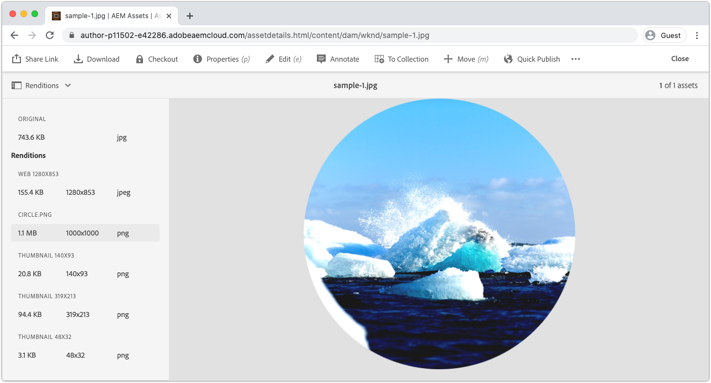

# Integrera med AEM bearbetningsprofiler

För att Asset compute-arbetare ska kunna generera anpassade renderingar på AEM as a Cloud Service måste de vara registrerade i AEM as a Cloud Service Author-tjänsten via Bearbeta profiler. För alla resurser som omfattas av den bearbetningsprofilen anropas arbetaren vid överföring eller ombearbetning, och den anpassade återgivningen genereras och görs tillgänglig via resursens återgivningar.

## Definiera en bearbetningsprofil

Skapa först en ny bearbetningsprofil som anropar arbetaren med konfigurerbara parametrar.

1. Logga in på AEM as a Cloud Service Author-tjänst som en __AEM__. Eftersom det här är en självstudiekurs rekommenderar vi att du använder en Dev-miljö eller en miljö i en sandlåda.
1. Navigera till __Verktyg > Resurser > Bearbeta profiler__
1. Tryck __Skapa__ knapp
1. Namnge bearbetningsprofilen, `WKND Asset Renditions`
1. Tryck på __Egen__ och trycka på __Lägg till ny__
1. Definiera den nya tjänsten
   + __Återgivningsnamn:__ `Circle`
      + Återgivningens filnamn som användes för att identifiera återgivningen i AEM Assets
   + __Tillägg:__ `png`
      + Tillägget för den återgivning som skapas. Ange till `png` eftersom detta är det utdataformat som stöds av arbetarens webbtjänst, och ger en genomskinlig bakgrund bakom cirkeln som klipps ut.
   + __Slutpunkt:__ `https://...adobeioruntime.net/api/v1/web/wkndAemAssetCompute-0.0.1/worker`
      + Det här är URL:en till arbetaren som hämtas via `aio app get-url`. Kontrollera URL-punkterna på rätt arbetsyta baserat på den AEM as a Cloud Service miljön.
      + Kontrollera att arbetarens URL pekar på rätt arbetsyta. AEM as a Cloud Service Stage bör använda arbetsytans URL, och AEM as a Cloud Service Production bör använda arbetsytans URL.
   + __Tjänsteparametrar__
      + Tryck __Lägg till parameter__
         + Nyckel: `size`
         + Värde: `1000`
      + Tryck __Lägg till parameter__
         + Nyckel: `contrast`
         + Värde: `0.25`
      + Tryck __Lägg till parameter__
         + Nyckel: `brightness`
         + Värde: `0.10`
      + Dessa nyckel-/värdepar som skickas till arbetaren i Asset compute och är tillgängliga via `rendition.instructions` JavaScript-objekt.
   + __Mime-typer__
      + __Innehåller:__ `image/jpeg`, `image/png`, `image/gif`, `image/bmp`, `image/tiff`
         + Dessa MIME-typer är de enda som arbetarens npm-moduler är. Den här listan begränsar vilka som bearbetas av den anpassade arbetaren.
      + __Exkluderar:__ `Leave blank`
         + Bearbeta aldrig resurser med dessa MIME-typer med den här tjänstkonfigurationen. I det här fallet använder vi bara tillåtelselista.
1. Tryck __Spara__ längst upp till höger

## Tillämpa och anropa en bearbetningsprofil

1. Välj den nya bearbetningsprofilen, `WKND Asset Renditions`
1. Tryck __Använd profil för mapp(ar)__ i det övre åtgärdsfältet
1. Välj en mapp som bearbetningsprofilen ska användas på, till exempel `WKND` och knacka __Använd__
1. Navigera till mappen som bearbetningsprofilen inte tillämpades på via __AEM > Assets > Files__ och `WKND`.
1. Överför några nya bildresurser ([sample-1.jpg](../assets/samples/sample-1.jpg), [sample-2.jpg](../assets/samples/sample-2.jpg)och [sample-3.jpg](../assets/samples/sample-3.jpg)) i alla mappar i mappen där Bearbetningsprofilen används och väntar på att den överförda resursen ska bearbetas.
1. Tryck på resursen för att öppna dess information
   + Standardåtergivningar kan generera och visas snabbare i AEM än anpassade återgivningar.
1. Öppna __Återgivningar__ vy från vänster sidospalt
1. Tryck på resursen med namnet `Circle.png` och granska den genererade renderingen

   

## Klart!

Grattis! Du är klar med [självstudiekurs](../overview.md) om hur AEM as a Cloud Service Asset compute-mikrotjänster kan utökas! Nu bör du ha möjlighet att konfigurera, utveckla, testa, felsöka och distribuera anpassade Asset compute-arbetare som kan användas av AEM as a Cloud Service författartjänst.

### Granska den fullständiga projektkällkoden på Github

Det slutliga Asset compute-projektet finns på Github:

+ [aem-guides-wknd-asset-compute](https://github.com/adobe/aem-guides-wknd-asset-compute)

_Github innehåller projektets sluttillstånd, som är fullt ifyllt med arbetaren och testfall, men som inte innehåller några autentiseringsuppgifter, t.ex. `.env`, `.config.json` eller `.aio`._

## Felsökning

+ [Anpassad återgivning saknas för resurs i AEM](../troubleshooting.md#custom-rendition-missing-from-asset)
+ [Resursbearbetning misslyckas i AEM](../troubleshooting.md#asset-processing-fails)
