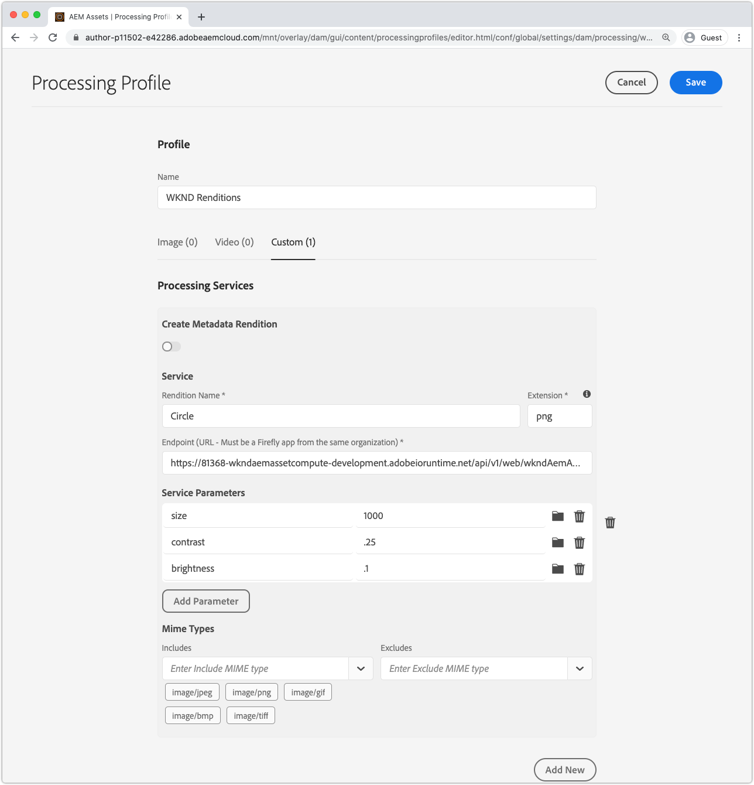

# Integrera med AEM bearbetningsprofiler

För att resursberäkningspersonal ska kunna generera anpassade återgivningar i AEM som en Cloud Service måste de registreras i AEM som en författartjänst för Cloud Servicen via Bearbeta profiler. För alla resurser som omfattas av den bearbetningsprofilen anropas arbetaren vid överföring eller ombearbetning, och den anpassade återgivningen genereras och görs tillgänglig via resursens återgivningar.

## Definiera en bearbetningsprofil

Skapa först en ny bearbetningsprofil som anropar arbetaren med konfigurerbara parametrar.

1. Logga in på AEM som Cloud Service Author-tjänst som __AEM Administrator__. Eftersom det här är en självstudiekurs rekommenderar vi att du använder en Dev-miljö eller en miljö i en sandlåda.
1. Navigera till __Verktyg > Resurser > Bearbeta profiler__
1. Tryck på __knappen Skapa__
1. Namnge bearbetningsprofilen, `WKND Asset Renditions`
1. Tryck på fliken __Egen__ och tryck sedan på __Lägg till ny__
1. Definiera den nya tjänsten
   + __Återgivningsnamn:__ `Circle`
      + Filnamnsrenderingen som ska användas för att identifiera den här renderingen i AEM Assets
   + __Tillägg:__ `png`
      + Tillägget för den återgivning som ska genereras. Anges till `png` eftersom detta är det utdataformat som stöds av arbetarens webbtjänst, och ger en genomskinlig bakgrund bakom cirkeln som klipps ut.
   + __Slutpunkt:__ `https://...adobeioruntime.net/api/v1/web/wkndAemAssetCompute-0.0.1/worker`
      + Det här är URL:en till arbetaren som hämtas via `aio app get-url`. Kontrollera URL-punkterna på rätt arbetsyta baserat på AEM som en Cloud Service.
      + Kontrollera att arbetarens URL pekar på rätt arbetsyta. AEM som Cloud Service ska använda arbetsytans URL och AEM som Cloud Service Production bör använda arbetsytans URL.
   + __Tjänsteparametrar__
      + Tryck på __Lägg till parameter__
         + Nyckel: `size`
         + Värde: `1000`
      + Tryck på __Lägg till parameter__
         + Nyckel: `contrast`
         + Värde: `0.25`
      + Tryck på __Lägg till parameter__
         + Nyckel: `brightness`
         + Värde: `0.10`
      + Dessa nyckel-/värdepar som skickas till Asset Compute-arbetaren och är tillgängliga via `rendition.instructions` JavaScript-objektet.
   + __Mime-typer__
      + __Innehåller:__ `image/jpeg`, `image/png`, `image/gif`, `image/bmp`, `image/tiff`
         + Dessa MIME-typer är de enda som arbetarens npm-moduler är. Den här listan begränsar vilka resurser som ska bearbetas av den anpassade arbetaren.
      + __Exkluderar:__ `Leave blank`
         + Bearbeta aldrig resurser med dessa MIME-typer med den här tjänstkonfigurationen. I det här fallet använder vi bara tillåtelselista.
1. Tryck på __Spara__ längst upp till höger

## Tillämpa och anropa en bearbetningsprofil

1. Välj den nya bearbetningsprofilen, `WKND Asset Renditions`
1. Tryck på __Använd profil för__ mapp(ar) i det övre åtgärdsfältet
1. Välj en mapp som bearbetningsprofilen ska användas på, till exempel `WKND` och tryck på __Använd__
1. Navigera till den mapp där bearbetningsprofilen inte tillämpades via __AEM > Resurser > Filer__ och tryck på `WKND`.
1. Överför några nya bildresurser ([sample-1.jpg](../assets/samples/sample-1.jpg), [sample-2.jpg](../assets/samples/sample-2.jpg)och [sample-3.jpg](../assets/samples/sample-3.jpg)) till en mapp under mappen där Bearbeta profil används, och vänta tills den överförda resursen har bearbetats.
1. Tryck på resursen för att öppna dess information
   + Standardåtergivningar kan generera och visas snabbare i AEM än anpassade återgivningar.
1. Öppna vyn __Återgivningar__ från vänster sidofält
1. Tryck på resursen med namnet `Circle.png` och granska den genererade återgivningen

   

## Klart!

Grattis! Du är klar med [självstudiekursen](../overview.md) om hur du utökar AEM som Cloud Service Asset Compute-mikrotjänster! Nu bör du ha möjlighet att konfigurera, utveckla, testa, felsöka och distribuera anpassade tillgångsberäkningarbetare för användning av din AEM som Cloud Service Author-tjänst.

### Granska den fullständiga projektkällkoden på Github

Det slutliga projektet Asset Compute finns på Github:

+ [aem-guides-wknd-asset-compute](https://github.com/adobe/aem-guides-wknd-asset-compute)

_Github innehåller projektets sluttillstånd, som är fullt ifyllt med arbetaren och testfall, men som inte innehåller några autentiseringsuppgifter, t.ex. `.env`, `.config.json` eller `.aio`._

## Felsökning

+ [Anpassad återgivning saknas för resurs i AEM](../troubleshooting.md#custom-rendition-missing-from-asset)
+ [Resursbearbetning misslyckas i AEM](../troubleshooting.md#asset-processing-fails)
