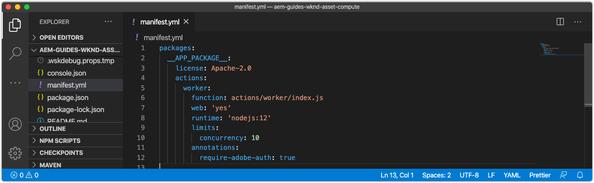

# Konfigurera manifest.yml

The `manifest.yml`, som finns i Asset compute-projektets rot, beskriver alla arbetare i det här projektet som ska distribueras.



## Standarddefinition för arbetare

Arbetare definieras som Adobe I/O Runtime åtgärdsposter under `actions`och består av en uppsättning konfigurationer.

Arbetare som har åtkomst till andra Adobe I/O-integreringar måste ange `annotations -> require-adobe-auth` egenskap till `true` som [visar arbetarens Adobe I/O-uppgifter](https://experienceleague.adobe.com/docs/asset-compute/using/extend/develop-custom-application.html#access-adobe-apis) via `params.auth` -objekt. Detta är vanligtvis nödvändigt när arbetaren anropar Adobe I/O-API:er som Adobe Photoshop, Lightroom eller Sensei API:er och kan växlas per arbetare.

1. Öppna och granska den automatiskt genererade arbetaren `manifest.yml`. Projekt som innehåller flera Asset compute-arbetare måste definiera en post för varje arbetare under `actions` array.

```yml
packages:
  __APP_PACKAGE__:
    license: Apache-2.0
    actions: # the array of workers, since we have a single worker there is only one entry beneath actions
      worker: # the auto-generated worker definition
        function: actions/worker/index.js # the entry point to the worker 
        web: 'yes'  # as our worker is invoked over HTTP from AEM Author service
        runtime: 'nodejs:12' # the target nodejs runtime (only 10 and 12 are supported)
        limits:
          concurrency: 10
        annotations:
          require-adobe-auth: true # set to true, to pass through Adobe I/O access token/client id via params.auth in the worker, typically required when the worker calls out to Adobe I/O APIs such as the Adobe Photoshop, Lightroom or Sensei APIs.
```

## Definiera gränser

Varje arbetare kan konfigurera [gränser](https://www.adobe.io/apis/experienceplatform/runtime/docs.html#!adobedocs/adobeio-runtime/master/guides/system_settings.md) för dess körningskontext i Adobe I/O Runtime. Dessa värden bör justeras för att ge optimal storlek för arbetaren, baserat på volymen, hastigheten och typen av resurser som den beräknar samt vilken typ av arbete den utför.

Granska [Vägledning om storleksändring för Adobe](https://experienceleague.adobe.com/docs/asset-compute/using/extend/develop-custom-application.html#sizing-workers) innan du anger gränser. Asset compute kan få slut på minne när resurser bearbetas, vilket kan leda till att körningen av Adobe I/O Runtime avbryts, så att arbetaren har rätt storlek för att hantera alla resurser som kan användas som kandidater.

1. Lägg till en `inputs` till nya `wknd-asset-compute` åtgärdspost. På så sätt kan du justera Asset compute arbetarens totala prestanda och resursallokering.

```yml
packages:
  __APP_PACKAGE__:
    license: Apache-2.0
    actions: 
      worker:
        function: actions/worker/index.js 
        web: 'yes' 
        runtime: 'nodejs:12'
        limits: # Allows for the tuning of the worker's performance
          timeout: 60000 # timeout in milliseconds (1 minute)
          memorySize: 512 # memory allocated in MB; if the worker offloads heavy computational work to other Web services this number can be reduced
          concurrency: 10 # adjust based on expected concurrent processing and timeout 
        annotations:
          require-adobe-auth: true
           
```

## Den färdiga manifest.yml

Den slutliga `manifest.yml` ser ut som:

```yml
packages:
  __APP_PACKAGE__:
    license: Apache-2.0
    actions: 
      worker:
        function: actions/worker/index.js 
        web: 'yes' 
        runtime: 'nodejs:12'
        limits:
          timeout: 60000 # in ms
          memorySize: 512 # in MB
          concurrency: 10 
        annotations:
          require-adobe-auth: true
```

## manifest.yml på Github

Den slutliga `.manifest.yml` finns på Github:

+ [aem-guides-wknd-asset-compute/manifest.yml](https://github.com/adobe/aem-guides-wknd-asset-compute/blob/master/manifest.yml)


## Verifierar manifest.yml

När den genererade Asset compute `manifest.yml` uppdateras, kör det lokala utvecklingsverktyget och se till att starterna slutförs korrekt med den uppdaterade `manifest.yml` inställningar.

Så här startar du Asset compute Development Tool för projektet Asset compute:

1. Öppna en kommandorad i Asset compute projektroten (i VS-koden kan du öppna den direkt i IDE via Terminal > New Terminal) och köra kommandot:

   ```
   $ aio app run
   ```

1. Det lokala utvecklingsverktyget i Asset compute öppnas i standardwebbläsaren på __http://localhost:9000__.

   

1. Se kommandoradsutdata och webbläsaren för felmeddelanden när utvecklingsverktyget initieras.
1. Stoppa utvecklingsverktyget i Asset compute genom att trycka på `Ctrl-C` i det fönster som kördes `aio app run` för att avsluta processen.

## Felsökning

+ [Felaktigt YAML-indrag](../troubleshooting.md#incorrect-yaml-indentation)
+ [gränsen för memorySize är för låg](../troubleshooting.md#memorysize-limit-is-set-too-low)
