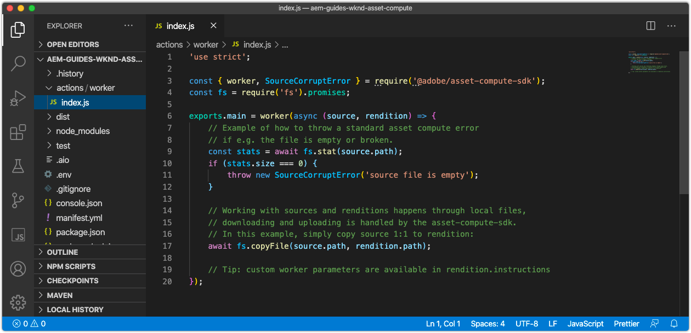
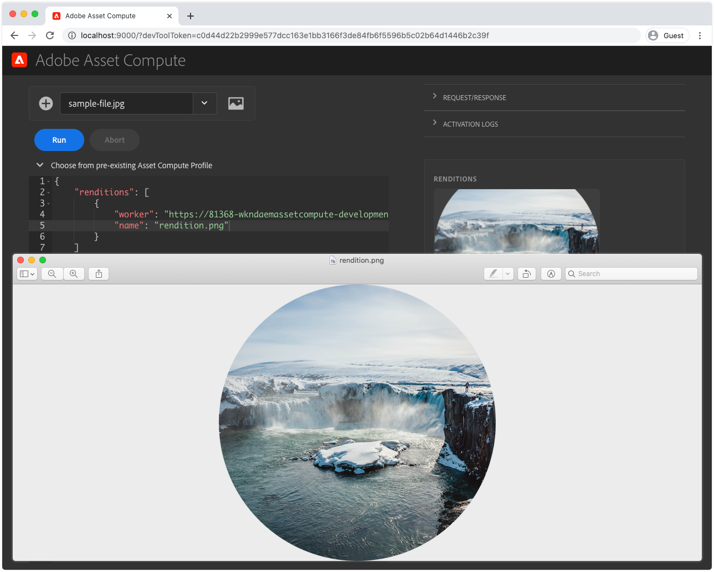

# Utveckla en Asset compute-arbetare

Arbetare i asset compute är kärnan i ett Asset compute-projekt och tillhandahåller anpassade funktioner som utför, eller koordinerar, det arbete som utförs på en resurs för att skapa en ny rendering.

Asset compute-projektet genererar automatiskt en enkel arbetare som kopierar resursens ursprungliga binärfil till en namngiven återgivning, utan några omformningar. I den här självstudiekursen ska vi modifiera den här arbetaren för att göra en intressantare rendering, för att illustrera Asset compute arbetares styrka.

Vi kommer att skapa en Asset compute-arbetare som genererar en ny vågrät bildåtergivning, som omfattar tomt utrymme till vänster och höger om resursåtergivningen med en oskarp version av resursen. Bredden, höjden och oskärpan för den slutliga återgivningen parametriseras.

## Logiskt flöde för ett anrop till en Asset compute-arbetare

Asset compute-arbetare implementerar Asset compute SDK-arbetarens API-kontrakt i `renditionCallback(...)` funktion, vilket är begreppsmässigt:

+ __Indata:__ En AEM ursprungliga binära parametrar och parametrar för Bearbetningsprofil
+ __Utdata:__ En eller flera återgivningar som ska läggas till i AEM


1. AEM Author anropar Asset compute-arbetaren, förutsatt att tillgångens __(1a)__ original binary (`source` parameter), och __(1b)__ alla parametrar som definierats i Bearbetningsprofilen (`rendition.instructions` parameter).
1. Asset compute SDK hanterar körningen av den anpassade Asset compute-metadataarbetarens `renditionCallback(...)` funktion, generera en ny binär återgivning baserat på resursens ursprungliga binära __(1a)__ och alla parametrar __(1b)__.

   + I den här självstudiekursen skapas återgivningen&quot;i arbete&quot;, vilket innebär att arbetaren komponerar återgivningen, men källbinärfilen kan även skickas till andra webbtjänstAPI:er för att återge återgivningen.

1. Arbetaren i Asset compute sparar den nya återgivningens binära data till `rendition.path`.
1. Binära data skrivna till `rendition.path` transporteras via Asset compute SDK till AEM Author Service och exponeras som __(4a)__ en textåtergivning och __(4b)__ beständig till resursens metadatanod.

Diagrammet ovan redogör för de problem som Asset compute utvecklare står inför och det logiska flödet till Asset compute arbetares anrop. För nybörjaren är [intern information om exekvering av Asset compute](https://experienceleague.adobe.com/docs/asset-compute/using/extend/custom-application-internals.html) är tillgängliga, men bara Asset compute SDK API-kontrakt kan vara beroende av.

## Anatomi för en arbetare

Alla Asset compute-arbetare följer samma grundläggande struktur och in-/utdatakontrakt.

```javascript
'use strict';

// Any npm module imports used by the worker
const { worker, SourceCorruptError } = require('@adobe/asset-compute-sdk');
const fs = require('fs').promises;

/**
Exports the worker implemented by a custom rendition callback function, which parametrizes the input/output contract for the worker.
 + `source` represents the asset's original binary used as the input for the worker.
 + `rendition` represents the worker's output, which is the creation of a new asset rendition.
 + `params` are optional parameters, which map to additional key/value pairs, including a sub `auth` object that contains Adobe I/O access credentials.
**/
exports.main = worker(async (source, rendition, params) => {
    // Perform any necessary source (input) checks
    const stats = await fs.stat(source.path);
    if (stats.size === 0) {
        // Throw appropriate errors whenever an erring condition is met
        throw new SourceCorruptError('source file is empty');
    }

    // Access any custom parameters provided via the Processing Profile configuration
    let param1 = rendition.instructions.exampleParam;

    /** 
    Perform all work needed to transform the source into the rendition.
    
    The source data can be accessed:
        + In the worker via a file available at `source.path`
        + Or via a presigned GET URL at `source.url`
    **/
    if (success) {
        // A successful worker must write some data back to `renditions.path`. 
        // This example performs a trivial 1:1 copy of the source binary to the rendition
        await fs.copyFile(source.path, rendition.path);
    } else {
        // Upon failure an Asset Compute Error (exported by @adobe/asset-compute-commons) should be thrown.
        throw new GenericError("An error occurred!", "example-worker");
    }
});

/**
Optionally create helper classes or functions the worker's rendition callback function invokes to help organize code.

Code shared across workers, or to complex to be managed in a single file, can be broken out across supporting JavaScript files in the project and imported normally into the worker. 
**/
function customHelperFunctions() { ... }
```

## Öppnar arbetarens index.js



1. Kontrollera att Asset compute-projektet är öppet i VS-kod
1. Navigera till `/actions/worker` mapp
1. Öppna `index.js` fil

Det här är den JavaScript-fil för arbetare som vi kommer att ändra i den här självstudiekursen.

## Installera och importera stödda npm-moduler

Asset compute-projekt är baserade på Node.js och utnyttjar den robusta [ekosystem för npm-modul](https://npmjs.com). För att kunna utnyttja npm-moduler måste vi först installera dem i vårt Asset compute-projekt.

I den här arbetaren använder vi [jimp](https://www.npmjs.com/package/jimp) för att skapa och ändra återgivningsbilden direkt i Node.js-koden.

>[!WARNING]
>
>Alla NPM-moduler för tillgångsändring stöds inte av Asset compute. NPM-moduler som är beroende av program som ImageMagick eller andra OS-beroende bibliotek stöds inte. Det är bäst att begränsa användningen av npm-moduler som bara är för JavaScript.

1. Öppna kommandoraden i roten av ditt Asset compute-projekt (detta kan göras i VS-koden via __Terminal > New Terminal__) och köra kommandot:

   ```
   $ npm install jimp
   ```

1. Importera `jimp` till arbetskoden så att den kan användas via `Jimp` JavaScript-objekt.
Uppdatera `require` direktiv överst på arbetarens `index.js` för att importera `Jimp` objekt från `jimp` modul:

   ```javascript
   'use strict';
   
   const Jimp = require('jimp');
   const { worker, SourceCorruptError } = require('@adobe/asset-compute-sdk');
   const fs = require('fs').promises;
   
   exports.main = worker(async (source, rendition, params) => {
       // Check handle a corrupt input source
       const stats = await fs.stat(source.path);
       if (stats.size === 0) {
           throw new SourceCorruptError('source file is empty');
       }
   
       // Do work here
   });
   ```

## Läsa parametrar

Asset compute-arbetare kan läsa in parametrar som kan skickas via Bearbeta profiler som definierats i AEM as a Cloud Service Author-tjänsten. Parametrarna skickas till arbetaren via `rendition.instructions` -objekt.

Dessa kan läsas med hjälp av `rendition.instructions.<parameterName>` i arbetarkoden.

Här läser vi i de konfigurerbara renderingarna `SIZE`, `BRIGHTNESS` och `CONTRAST`, med standardvärden om inga har angetts via bearbetningsprofilen. Observera att `renditions.instructions` skickas som strängar när de anropas från AEM as a Cloud Service bearbetningsprofiler, så att de omformas till rätt datatyper i arbetskoden.

```javascript
'use strict';

const Jimp = require('jimp');
const { worker, SourceCorruptError } = require('@adobe/asset-compute-sdk');
const fs = require('fs').promises;

exports.main = worker(async (source, rendition, params) => {
    const stats = await fs.stat(source.path);
    if (stats.size === 0) {
        throw new SourceCorruptError('source file is empty');
    }

    // Read in parameters and set defaults if parameters are provided
    // Processing Profiles pass in instructions as Strings, so make sure to parse to correct data types
    const SIZE = parseInt(rendition.instructions.size) || 800; 
    const CONTRAST = parseFloat(rendition.instructions.contrast) || 0;
    const BRIGHTNESS = parseFloat(rendition.instructions.brightness) || 0;

    // Do work here
}
```

## Utlösande fel{#errors}

Asset compute-arbetare kan stöta på situationer som leder till fel. Adobe Asset compute SDK tillhandahåller [en uppsättning fördefinierade fel](https://github.com/adobe/asset-compute-commons#asset-compute-errors) som kan kastas när sådana situationer uppstår. Om ingen specifik feltyp finns, `GenericError` kan användas, eller en specifik anpassad `ClientErrors` kan definieras.

Innan du börjar bearbeta återgivningen bör du kontrollera att alla parametrar är giltiga och stöds i den här arbetarens kontext:

+ Kontrollera återgivningsinstruktionsparametrarna för `SIZE`, `CONTRAST`och `BRIGHTNESS` är giltiga. Om inte, returnerar du ett anpassat fel `RenditionInstructionsError`.
   + En anpassad `RenditionInstructionsError` klass som utökar `ClientError` definieras längst ned i den här filen. Användning av ett specifikt, anpassat fel är användbart när [skriva tester](../test-debug/test.md) för arbetaren.

```javascript
'use strict';

const Jimp = require('jimp');
// Import the Asset Compute SDK provided `ClientError` 
const { worker, SourceCorruptError, ClientError } = require('@adobe/asset-compute-sdk');
const fs = require('fs').promises;

exports.main = worker(async (source, rendition, params) => {
    const stats = await fs.stat(source.path);
    if (stats.size === 0) {
        throw new SourceCorruptError('source file is empty');
    }

    // Read in parameters and set defaults if parameters are provided
    const SIZE = parseInt(rendition.instructions.size) || 800; 
    const CONTRAST = parseFloat(rendition.instructions.contrast) || 0;
    const BRIGHTNESS = parseFloat(rendition.instructions.brightness) || 0;

    if (SIZE <= 10 || SIZE >= 10000) {
        // Ensure size is within allowable bounds
        throw new RenditionInstructionsError("'size' must be between 10 and 1,0000");
    } else if (CONTRAST <= -1 || CONTRAST >= 1) {
        // Ensure contrast is valid value
        throw new RenditionInstructionsError("'contrast' must between -1 and 1");
    } else if (BRIGHTNESS <= -1 || BRIGHTNESS >= 1) {
        // Ensure contrast is valid value
        throw new RenditionInstructionsError("'brightness' must between -1 and 1");
    }

    // Do work here
}

// Create a new ClientError to handle invalid rendition.instructions values
class RenditionInstructionsError extends ClientError {
    constructor(message) {
        // Provide a:
        // + message: describing the nature of this erring condition
        // + name: the name of the error; usually same as class name
        // + reason: a short, searchable, unique error token that identifies this error
        super(message, "RenditionInstructionsError", "rendition_instructions_error");

        // Capture the strack trace
        Error.captureStackTrace(this, RenditionInstructionsError);
    }
}
```

## Skapa återgivningen

När parametrarna har lästs, sanerats och validerats skrivs koden för att generera återgivningen. Pseudokoden för återgivningsgenereringen är följande:

1. Skapa ett nytt `renditionImage` arbetsytan i fyrkantiga mått som anges via `size` parameter.
1. Skapa en `image` objekt från källresursens binära
1. Använd __Jimp__ bibliotek för att omforma bilden:
   + Beskär originalbilden till en centrerad kvadrat
   + Klipp ut en cirkel från mitten av bilden med fyrkant
   + Anpassa till de dimensioner som definieras av `SIZE` parametervärde
   + Justera kontrast baserat på `CONTRAST` parametervärde
   + Justera intensiteten baserat på `BRIGHTNESS` parametervärde
1. Placera den omformade `image` i mitten av `renditionImage` som har en genomskinlig bakgrund
1. Skriv det sammansatta, `renditionImage` till `rendition.path` så att den kan sparas i AEM som en resursrendering.

Den här koden använder [Jimp API:er](https://github.com/oliver-moran/jimp#jimp) för att utföra dessa bildomformningar.

Asset compute måste arbeta synkront, och `rendition.path` måste skrivas tillbaka helt till innan arbetarens `renditionCallback` slutförs. Detta kräver att asynkrona funktionsanrop görs synkrona med `await` -operator. Om du inte är bekant med asynkrona JavaScript-funktioner och hur de kan köras synkront, bör du bekanta dig med [JavaScript-operatorn await](https://developer.mozilla.org/en-US/docs/Web/JavaScript/Reference/Operators/await).

Den färdiga arbetaren `index.js` ska se ut så här:

```javascript
'use strict';

const Jimp = require('jimp');
const { worker, SourceCorruptError, ClientError } = require('@adobe/asset-compute-sdk');
const fs = require('fs').promises;

exports.main = worker(async (source, rendition, params) => {
    const stats = await fs.stat(source.path);
    if (stats.size === 0) {
        throw new SourceCorruptError('source file is empty');
    }

    // Read/parse and validate parameters
    const SIZE = parseInt(rendition.instructions.size) || 800; 
    const CONTRAST = parseFloat(rendition.instructions.contrast) || 0;
    const BRIGHTNESS = parseFloat(rendition.instructions.brightness) || 0;

    if (SIZE <= 10 || SIZE >= 10000) {
        throw new RenditionInstructionsError("'size' must be between 10 and 1,0000");
    } else if (CONTRAST <= -1 || CONTRAST >= 1) {
        throw new RenditionInstructionsError("'contrast' must between -1 and 1");
    } else if (BRIGHTNESS <= -1 || BRIGHTNESS >= 1) {
        throw new RenditionInstructionsError("'brightness' must between -1 and 1");
    }

    // Create target rendition image 
    let renditionImage =  new Jimp(SIZE, SIZE, 0x0);

    // Read and perform transformations on the source binary image
    let image = await Jimp.read(source.path);

    // Crop a circle from the source asset, and then apply contrast and brightness
    image.crop(
            image.bitmap.width < image.bitmap.height ? 0 : (image.bitmap.width - image.bitmap.height) / 2,
            image.bitmap.width < image.bitmap.height ? (image.bitmap.height - image.bitmap.width) / 2 : 0,
            image.bitmap.width < image.bitmap.height ? image.bitmap.width : image.bitmap.height,
            image.bitmap.width < image.bitmap.height ? image.bitmap.width : image.bitmap.height
        )   
        .circle()
        .scaleToFit(SIZE, SIZE)
        .contrast(CONTRAST)
        .brightness(BRIGHTNESS);

    // Place the transformed image onto the transparent renditionImage to save as PNG
    renditionImage.composite(image, 0, 0)

    // Write the final transformed image to the asset's rendition
    await renditionImage.writeAsync(rendition.path);
});

// Custom error used for renditions.instructions parameter checking
class RenditionInstructionsError extends ClientError {
    constructor(message) {
        super(message, "RenditionInstructionsError", "rendition_instructions_error");
        Error.captureStackTrace(this, RenditionInstructionsError);
    }
}
```

## Arbetaren körs

Nu när arbetskoden är klar och har registrerats och konfigurerats i [manifest.yml](./manifest.md), kan den utföras med det lokala utvecklingsverktyget i Asset compute för att se resultatet.

1. Från Asset compute-projektets rot
1. Kör `aio app run`
1. Vänta tills Asset compute Development Tool öppnas i ett nytt fönster
1. I __Välj en fil..__ listruta, välj en exempelbild att bearbeta
   + Välj en exempelbildfil som ska användas som källresursens binärfil
   + Om det inte finns någon ännu trycker du på __(+)__ till vänster och ladda upp en [exempelbild](../assets/samples/sample-file.jpg) och uppdatera webbläsarfönstret för utvecklingsverktyg
1. Uppdatera `"name": "rendition.png"` som den här arbetaren skapar en genomskinlig PNG.
   + Observera att den här&quot;name&quot;-parametern bara används för utvecklingsverktyget och inte ska förlita sig på.

   ```json
   {
       "renditions": [
           {
               "worker": "...",
               "name": "rendition.png"
           }
       ]
   }
   ```

1. Tryck __Kör__ och vänta på att återgivningen ska generera
1. The __Återgivningar__ -avsnittet förhandsvisar den genererade återgivningen. Tryck på renderingsförhandsvisningen för att hämta den fullständiga renderingen

   

### Kör arbetaren med parametrar

Parametrar, som skickas via Bearbeta profilkonfigurationer, kan simuleras i Asset compute Development Tools genom att tillhandahålla dem som nyckel/värde-par i återgivningsparametern JSON.

>[!WARNING]
>
>Vid lokal utveckling kan värden skickas med olika datatyper, när de skickas från AEM som Cloud Service Processing Profiles as strings, så se till att rätt datatyper analyseras om det behövs.
> Jimp&#39;s `crop(width, height)` funktionen kräver att dess parametrar `int`&#39;s. If `parseInt(rendition.instructions.size)` inte tolkas till ett int-värde, sedan anropet till `jimp.crop(SIZE, SIZE)` misslyckas eftersom parametrarna är inkompatibla med typen String.

I vår kod accepteras parametrar för:

+ `size` definierar återgivningens storlek (höjd och bredd som heltal)
+ `contrast` definierar kontrastjusteringen, måste vara mellan -1 och 1, som flyttal
+ `brightness`  definierar den ljusa justeringen, måste vara mellan -1 och 1, som flyttal

De här läses i arbetaren `index.js` via:

+ `const SIZE = parseInt(rendition.instructions.size) || 800`
+ `const CONTRAST = parseFloat(rendition.instructions.contrast) || 0`
+ `const BRIGHTNESS = parseFloat(rendition.instructions.brightness) || 0`

1. Uppdatera återgivningsparametrarna för att anpassa storlek, kontrast och intensitet.

   ```json
   {
       "renditions": [
           {
               "worker": "...",
               "name": "rendition.png",
               "size": "450",
               "contrast": "0.30",
               "brightness": "0.15"
           }
       ]
   }
   ```

1. Tryck __Kör__ igen
1. Tryck på förhandsvisningen av återgivningen för att hämta och granska den genererade återgivningen. Observera dess dimensioner och hur kontrast och intensitet har ändrats jämfört med standardåtergivningen.

   

1. Överför andra bilder till __Källfil__ och försök köra arbetaren mot dem med olika parametrar!

## Worker index.js on Github

Den slutliga `index.js` finns på Github:

+ [aem-guides-wknd-asset-compute/actions/worker/index.js](https://github.com/adobe/aem-guides-wknd-asset-compute/blob/master/actions/worker/index.js)

## Felsökning

+ [Återgivningen returnerade delvis ritad/skadad](../troubleshooting.md#rendition-returned-partially-drawn-or-corrupt)
