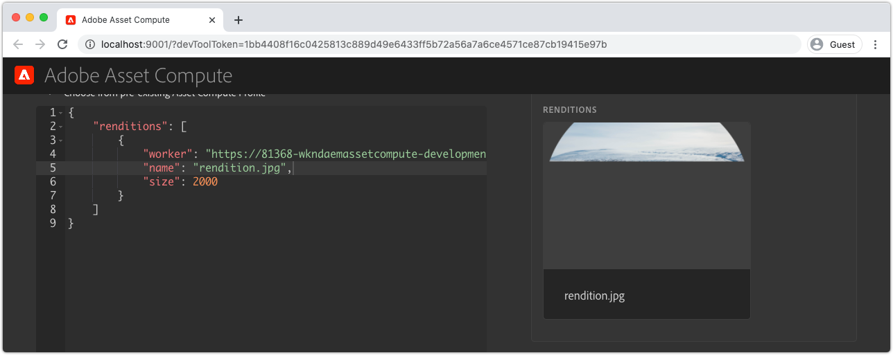

# Felsöka utbyggbarhet för Asset Compute

Nedan följer ett index över vanliga problem och fel, samt lösningar som kan uppstå när du utvecklar och distribuerar anpassade Asset compute-arbetare för AEM Assets.

## Utveckla{#develop}

### Återgivningen returneras delvis ritad/skadad{#rendition-returned-partially-drawn-or-corrupt}

+ __Fel__: Återgivningen återges ofullständigt (när en bild) eller är skadad och kan inte öppnas.

  

+ __Orsak__: Arbetarens `renditionCallback`-funktion avslutas innan återgivningen kan skrivas till `rendition.path`.
+ __Upplösning__: Granska den anpassade arbetskoden och se till att alla asynkrona anrop görs synkrona med `await`.

## Utvecklingsverktyg{#development-tool}

### Console.json-filen saknas i Asset Compute-projektet{#missing-console-json}

+ __Fel:__ Fel: Nödvändiga filer saknas vid validate (`.../node_modules/@adobe/asset-compute-client/lib/integrationConfiguration.js:XX:YY`) vid async setupAssetCompute (`.../node_modules/@adobe/asset-compute-devtool/src/assetComputeDevTool.js:XX:YY`)
+ __Orsak:__ Filen `console.json` saknas i roten för Asset compute-projektet
+ __Upplösning:__ Hämta ett nytt `console.json` från ditt Adobe I/O-projekt
   1. I console.adobe.io öppnar du det Adobe I/O-projekt som Asset compute har konfigurerats att använda
   1. Tryck på knappen __Hämta__ i det övre högra hörnet
   1. Spara den hämtade filen i roten av ditt Asset compute-projekt med filnamnet `console.json`

### Ogiltig YAML-indrag i manifest.yml{#incorrect-yaml-indentation}

+ __Fel:__ YAMLException: felaktigt indrag för en mappningspost på rad X, kolumn Y:(via standard ut från `aio app run`-kommando)
+ __Orsak:__ Yaml-filer är känsliga med vitt mellanrum, det är troligt att indraget är felaktigt.
+ __Upplösning:__ Granska `manifest.yml` och se till att allt indrag är korrekt.

### gränsen för memorySize är för låg{#memorysize-limit-is-set-too-low}

+ __Fel:__ OpenWhiskError för den lokala Dev-servern: PUT https://adobeioruntime.net/api/v1/namespaces/xxx-xxx-xxx/actions/xxx-0.0.1/__secured_workeroverwrite=true Returned HTTP 400 (Ogiltig begäran) —> &quot;Innehållet i begäran hade fel format:krav misslyckades: minne 64 MB under det tillåtna tröskelvärdet 134217728 B&quot;
+ __Orsak:__ En `memorySize`-gräns för arbetaren i `manifest.yml` angavs till under det lägsta tillåtna tröskelvärdet som rapporterades av felmeddelandet i byte.
+ __Upplösning:__ Granska `memorySize`-gränserna i `manifest.yml` och se till att alla är stora än det lägsta tillåtna tröskelvärdet.

### Utvecklingsverktyget kan inte starta eftersom private.key saknas{#missing-private-key}

+ __Fel:__ Local Dev ServerError: Nödvändiga filer saknas vid validatePrivateKeyFile... (via kommandot `aio app run` som standard ut)
+ __Orsak:__ Värdet `ASSET_COMPUTE_PRIVATE_KEY_FILE_PATH` i filen `.env` pekar inte på `private.key` eller `private.key` kan inte läsas av den aktuella användaren.
+ __Upplösning:__ Granska värdet `ASSET_COMPUTE_PRIVATE_KEY_FILE_PATH` i filen `.env` och kontrollera att den innehåller den fullständiga, absoluta sökvägen till `private.key` i filsystemet.

### Felaktig listruta för Source-filer{#source-files-dropdown-incorrect}

Asset Compute Development Tool kan försättas i ett läge där inaktuella data hämtas och är mest märkbart i listrutan __Source-fil__ med felaktiga objekt.

+ __Fel:__ Felaktiga objekt visas i listrutan med Source-filer.
+ __Orsak:__ Inaktuellt cachelagrat webbläsartillstånd orsakar
+ __Upplösning:__ I webbläsaren rensar du webbläsarflikens &quot;programtillstånd&quot;, webbläsarens cache, lokal lagring och servicearbetare.

### Frågeparametern devToolToken saknas eller är ogiltig{#missing-or-invalid-devtooltoken-query-parameter}

+ __Fel:__ Meddelande om obehörig i Asset Compute Development Tool
+ __Orsak:__ `devToolToken` saknas eller är ogiltig
+ __Upplösning:__ Stäng webbläsarfönstret Asset Compute Development Tool, avsluta alla processer som körs med Development Tool som initierats via kommandot `aio app run` och starta om Development Tool (med `aio app run`).

### Det går inte att ta bort källfiler{#unable-to-remove-source-files}

+ __Fel:__ Det går inte att ta bort tillagda källfiler från utvecklingsverktygets användargränssnitt
+ __Orsak:__ Den här funktionen har inte implementerats
+ __Upplösning:__ Logga in på din molnlagringsleverantör med de autentiseringsuppgifter som definieras i `.env`. Leta upp behållaren som används av utvecklingsverktygen (anges också i `.env`), navigera till mappen __source__ och ta bort alla källbilder. Du kan behöva utföra de steg som beskrivs i [Source-filerna är felaktiga](#source-files-dropdown-incorrect) om de borttagna källfilerna fortfarande visas i listrutan eftersom de kan cachas lokalt i utvecklingsverktygets &quot;programtillstånd&quot;.

  

## Testa{#test}

### Ingen återgivning genererades under testkörningen{#test-no-rendition-generated}

+ __Fel:__ Fel: Ingen återgivning genererades.
+ __Orsak:__ Det gick inte att generera en återgivning på grund av ett oväntat fel, till exempel ett syntaxfel i JavaScript.
+ __Upplösning:__ Granska testkörningens `test.log` på `/build/test-results/test-worker/test.log`. Leta reda på avsnittet i den här filen som motsvarar det misslyckade testfallet och granska felen.

  

### Testet genererar felaktig återgivning vilket gör att testet misslyckas{#tests-generates-incorrect-rendition}

+ __Fel:__ Fel: Återgivningen &#39;rendition.xxx&#39; är inte som förväntad.
+ __Orsak:__ Arbetaren returnerade en återgivning som inte var densamma som `rendition.<extension>` som angavs i testfallet.
   + Om den förväntade `rendition.<extension>`-filen inte skapas på exakt samma sätt som den lokalt genererade återgivningen i testfallet, kan testet misslyckas eftersom det kan finnas vissa skillnader i bitarna. Om Asset compute-arbetaren till exempel ändrar kontrasten med hjälp av API:er och det förväntade resultatet skapas genom att justera kontrasten i Adobe Photoshop CC, kan filerna se likadana ut, men mindre bitvariationer kan vara annorlunda.
+ __Upplösning:__ Granska återgivningsutdata från testet genom att navigera till `/build/test-worker/<worker-name>/<test-run-timestamp>/<test-case>/rendition.<extension>` och jämföra det med den förväntade återgivningsfilen i testfallet. Så här skapar du en exakt förväntad resurs:
   + Använd utvecklingsverktyget för att generera en återgivning, verifiera att den är korrekt och använd den som den förväntade återgivningsfilen
   + Eller validera den testgenererade filen på `/build/test-worker/<worker-name>/<test-run-timestamp>/<test-case>/rendition.<extension>`, verifiera att den är korrekt och använd den som den förväntade återgivningsfilen

## Felsök

### Felsökaren är inte kopplad{#debugger-does-not-attach}

+ __Fel__: Det gick inte att starta: Fel: Det gick inte att ansluta till felsökningsmålet på..
+ __Orsak__: Docker Desktop körs inte på det lokala systemet. Verifiera detta genom att granska VS Code Debug Console (Visa > Debug Console) och bekräfta att felet har rapporterats.
+ __Upplösning__: Starta [Docker Desktop och kontrollera att nödvändiga Docker-bilder är installerade](./set-up/development-environment.md#docker).

### Brytpunkter pausas inte{#breakpoints-no-pausing}

+ __Fel__: VS-koden pausar inte vid brytpunkter när Asset compute-arbetaren körs från det felsökningsbara utvecklingsverktyget.

#### Felsökning för VS-kod är inte bifogad{#vs-code-debugger-not-attached}

+ __Orsak:__ Felsökaren för VS-kod har stoppats/kopplats från.
+ __Upplösning:__ Starta om felsökaren för VS-kod och verifiera den genom att titta på konsolen för VS-kodsfelsökning (Visa > Felsökningskonsol)

#### VS-kodfelsökning bifogad efter att körningen av arbetaren påbörjats{#vs-code-debugger-attached-after-worker-execution-began}

+ __Orsak:__ VS-kodsfelsökaren anslöts inte innan användaren knackade på __Kör__ i utvecklingsverktyget.
+ __Upplösning:__ Kontrollera att felsökaren har bifogats genom att granska VS-kodens felsökningskonsol (Visa > Felsökningskonsol) och kör sedan Asset compute-arbetaren igen från utvecklingsverktyget.

### Arbetarens timeout vid felsökning{#worker-times-out-while-debugging}

+ __Fel__: Felsökningskonsolen rapporterar &quot;Åtgärd kommer att timeout i -XXX millisekunder&quot; eller [Återgivningsförhandsvisningen i Asset Compute Development Tool](./develop/development-tool.md) snurrar oändligt eller
+ __Orsak__: Arbetarens timeout som definieras i [manifest.yml](./develop/manifest.md) överskreds under felsökning.
+ __Upplösning__: Öka arbetarens timeout tillfälligt i [manifest.yml](./develop/manifest.md) eller snabba upp felsökningsaktiviteterna.

### Det går inte att avsluta felsökningsprocessen{#cannot-terminate-debugger-process}

+ __Fel__: `Ctrl-C` på kommandoraden avslutar inte felsökningsprocessen (`npx adobe-asset-compute devtool`).
+ __Orsak__: Ett fel i `@adobe/aio-cli-plugin-asset-compute` 1.3.x gör att `Ctrl-C` inte känns igen som ett avslutningskommando.
+ __Upplösning__: Uppdatera `@adobe/aio-cli-plugin-asset-compute` till version 1.4.1+

  ```
  $ aio update
  ```

  

## Distribuera{#deploy}

### Anpassad återgivning saknas för resurs i AEM{#custom-rendition-missing-from-asset}

+ __Fel:__ Ny och ombearbetad resursprocess lyckades, men den anpassade återgivningen saknas

#### Bearbetningsprofilen används inte för den överordnade mappen

+ __Orsak:__ Resursen finns inte i en mapp med bearbetningsprofilen som använder den anpassade arbetaren
+ __Upplösning:__ Använd bearbetningsprofilen på en överordnad mapp för resursen

#### Bearbetningsprofil ersatt av en lägre bearbetningsprofil

+ __Orsak:__ Resursen finns under en mapp där den anpassade arbetarbearbetningsprofilen används, men en annan bearbetningsprofil som inte använder kundarbetaren har tillämpats mellan den mappen och resursen.
+ __Upplösning:__ Kombinera, eller på annat sätt stämma av, de två bearbetningsprofilerna och ta bort den mellanliggande bearbetningsprofilen

### Resursbearbetning misslyckas i AEM{#asset-processing-fails}

+ __Fel:__ Märket för resursbearbetning misslyckades visas för resursen
+ __Orsak:__ Ett fel uppstod när den anpassade arbetaren kördes
+ __Upplösning:__ Följ anvisningarna för [felsökning av Adobe I/O Runtime-aktiveringar](./test-debug/debug.md#aio-app-logs) med `aio app logs`.
