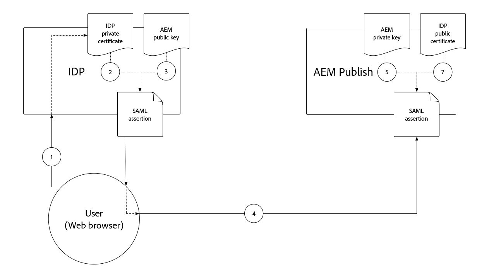

# SAML 2.0-autentisering{#saml-2-0-authentication}

Lär dig hur du konfigurerar och autentiserar slutanvändare (inte författare till AEM) till en SAML 2.0-kompatibel IDP som du väljer.

## Vilken SAML för AEM as a Cloud Service?

SAML 2.0-integrering med AEM Publish (eller Preview) gör att slutanvändare av en AEM-baserad webbupplevelse kan autentisera till en icke-Adobe IDP (Identity Provider) och få tillgång till AEM som namngiven, behörig användare.

|                       | AEM Author | AEM Publish |
|-----------------------|:----------:|:-----------:|
| Stöd för SAML 2.0 | ✘ | ✔ |

+++ Förstå SAML 2.0-flödet med AEM

Det typiska flödet av en AEM Publish SAML-integration är följande:

1. Användaren skickar en begäran till AEM Publish om att autentisering krävs.
   + Användaren begär en CUG/ACL-skyddad resurs.
   + Användaren begär en resurs som är föremål för ett autentiseringskrav.
   + Användaren följer en länk till AEM inloggningsslutpunkt (dvs. `/system/sling/login`) som uttryckligen begär inloggningsåtgärden.
1. AEM skickar en AuthnRequest till IDP och begär att IDP ska starta autentiseringsprocessen.
1. Användaren autentiserar mot IDP.
   + Användaren uppmanas att ange autentiseringsuppgifter av IDP:n.
   + Användaren är redan autentiserad med IDP och behöver inte ange ytterligare autentiseringsuppgifter.
1. IDP genererar en SAML-försäkran som innehåller användarens data och signerar den med IDP:s privata certifikat.
1. IDP skickar SAML-försäkran via HTTP POST via användarens webbläsare (RESPECTIVE_PROTECTED_PATH/saml_login) till AEM Publish.
1. AEM Publish tar emot SAML-försäkran och validerar SAML-intygets integritet och autenticitet med IDP:s offentliga certifikat.
1. AEM Publish hanterar AEM användarpost baserat på SAML 2.0 OSGi-konfigurationen och innehållet i SAML Assertion.
   + Skapar användare
   + Synkroniserar användarattribut
   + Uppdaterar AEM användargruppsmedlemskap
1. AEM Publish anger AEM `login-token`-cookien på HTTP-svaret, som används för att autentisera efterföljande begäranden till AEM Publish.
1. AEM Publish dirigerar om användaren till en URL i AEM Publish enligt specifikationen i cookien `saml_request_path`.

+++

## Genomgång av konfiguration

>[!VIDEO](https://video.tv.adobe.com/v/3455337?quality=12&learn=on&captions=swe)

I den här videon går vi igenom hur man konfigurerar SAML 2.0-integrering med AEM as a Cloud Service Publish Service och använder Okta som IDP.

## Förutsättningar

Följande krävs när du konfigurerar SAML 2.0-autentisering:

+ Tillgång till Cloud Manager för Distributionshanteraren
+ AEM Administrator-åtkomst till AEM as a Cloud Service-miljön
+ Administratörsåtkomst till IDP:n
+ Tillgång till ett offentligt/privat nyckelpar som används för att kryptera SAML-nyttolaster

SAML 2.0 stöds endast för att autentisera användning av AEM Publish eller Preview. Om du vill hantera autentiseringen av AEM Author med hjälp av och IDP [integrerar du IDP med Adobe IMS](https://helpx.adobe.com/se/enterprise/using/set-up-identity.html).


## Installera det offentliga IDP-certifikatet på AEM

IDP:s offentliga certifikat läggs till i AEM Global Trust Store och används för att validera att SAML-försäkran som skickas av IDP är giltig.

+++SAML-kontrollsigneringsflöde


1. Användaren autentiserar mot IDP.
1. IDP genererar en SAML-försäkran som innehåller användarens data.
1. IDP signerar SAML-försäkran med IDP:s privata certifikat.
1. IDP initierar en HTTP POST på klientsidan till AEM Publish SAML-slutpunkt (`.../saml_login`) som innehåller den signerade SAML-kontrollen.
1. AEM Publish tar emot HTTP POST som innehåller den signerade SAML-försäkran och kan validera signaturen med det offentliga IDP-certifikatet.

+++


1. Hämta filen __public certificate__ från IDP:n. Det här certifikatet gör att AEM kan validera SAML-försäkran som tillhandahålls AEM av IDP.

   Certifikatet är i PEM-format och bör likna:

   ```
   -----BEGIN CERTIFICATE-----
   MIIC4jCBAcoCCQC33wnybT5QZDANBgkqhkiG9w0BAQsFADAyMQswCQYDVQQGEwJV
   ...
   m0eo2USlSRTVl7QHRTuiuSThHpLKQQ==
   -----END CERTIFICATE-----
   ```

1. Logga in på AEM Author som AEM Administrator.
1. Navigera till __Verktyg > Säkerhet > Lita på butik__.
1. Skapa eller öppna Global Trust Store. Om du skapar en Global Trust Store ska du spara lösenordet på ett säkert ställe.
1. Expandera __Lägg till certifikat från CER-fil__.
1. Välj __Välj certifikatfil__ och överför certifikatfilen från IDP:n.
1. Lämna __mappningscertifikatet till användaren__ tomt.
1. Välj __Skicka__.
1. Det nya certifikatet visas ovanför avsnittet __Lägg till certifikat från CRT-fil__.
1. Observera __alias__, eftersom det här värdet används i [SAML 2.0 Authentication Handler OSGi-konfigurationen](#saml-2-0-authentication-handler-osgi-configuration).
1. Välj __Spara och stäng__.

Global Trust Store har konfigurerats med IDP:s offentliga certifikat på AEM Author, men eftersom SAML bara används på AEM Publish måste Global Trust Store replikeras till AEM Publish för att IDP:s offentliga certifikat ska vara tillgängligt där.


1. Navigera till __Verktyg > Distribution > Paket__.
1. Skapa ett paket
   + Paketnamn: `Global Trust Store`
   + Version: `1.0.0`
   + Grupp: `com.your.company`
1. Redigera det nya paketet __Global Trust Store__.
1. Markera fliken __Filter__ och lägg till ett filter för rotsökvägen `/etc/truststore`.
1. Välj __Klar__ och sedan __Spara__.
1. Välj knappen __Skapa__ för paketet __Global Trust Store__ .
1. När du har skapat den väljer du __Mer__ > __Replikera__ för att aktivera noden Global Trust Store (`/etc/truststore`) för AEM Publish.

## Skapa nyckelbehållare för autentiseringstjänster{#authentication-service-keystore}

_Det krävs att du skapar en nyckelbehållare för autentiseringstjänsten när [&#x200B; SAML 2.0-autentiseringshanterarens OSGi-konfigurationsegenskap `handleLogout` är inställd på `true`](#saml-20-authenticationsaml-2-0-authentication) eller när [AuthnRequest-signering/SAML-försäkran &#x200B;](#install-aem-public-private-key-pair) krävs_

1. Logga in på AEM Author som AEM Administrator för att ladda upp den privata nyckeln.
1. Navigera till __Verktyg > Dokumentskydd > Användare__ och välj __authentication-service__ användare. Välj sedan __Egenskaper__ i det övre åtgärdsfältet.
1. Välj fliken __Nyckelbehållare__.
1. Skapa eller öppna nyckelbehållaren. Om du skapar en nyckelbehållare ska du se till att lösenordet är säkert.
   + En [offentlig/privat nyckelbehållare installeras endast i den här nyckelbehållaren](#install-aem-public-private-key-pair) om AuthnRequest-signering/SAML-verifieringskryptering krävs.
   + Om den här SAML-integreringen stöder utloggning, men inte AuthnRequest-signering/SAML-kontroll, räcker det med en tom nyckelbehållare.
1. Välj __Spara och stäng__.
1. Skapa ett paket som innehåller den uppdaterade användaren __authentication-service__.

   _Använd följande tillfälliga lösning med paket:_

   1. Navigera till __Verktyg > Distribution > Paket__.
   1. Skapa ett paket
      + Paketnamn: `Authentication Service`
      + Version: `1.0.0`
      + Grupp: `com.your.company`
   1. Redigera det nya __nyckelarkivet för autentiseringstjänsten__.
   1. Markera fliken __Filter__ och lägg till ett filter för rotsökvägen `/home/users/system/cq:services/internal/security/<AUTHENTICATION SERVICE UUID>/keystore`.
      + Du hittar `<AUTHENTICATION SERVICE UUID>` genom att gå till __Verktyg > Säkerhet > Användare__ och välja __authentication-service__-användare. UUID är den sista delen av URL:en.
   1. Välj __Klar__ och sedan __Spara__.
   1. Välj knappen __Skapa__ för __nyckelarkivet för autentiseringstjänsten__-paketet.
   1. Välj __Mer__ > __Replikera__ när du har skapat autentiseringstjänstens nyckelarkiv för AEM Publish.

## Installera AEM nyckelpar för offentlig/privat nyckel{#install-aem-public-private-key-pair}

_Det är valfritt att installera AEM nyckelpar public/private_

AEM Publish kan konfigureras för att signera AuthnRequests (till IDP) och kryptera SAML-försäkringar (till AEM). Detta uppnås genom en privat nyckel till AEM Publish, och den matchar den offentliga nyckeln till IDP.

+++ Förstå signeringsflödet för AuthnRequest (valfritt)

AuthnRequest (den begäran till IDP från AEM Publish som initierar inloggningsprocessen) kan signeras av AEM Publish. För att göra detta signerar AEM Publish AuthnRequest med den privata nyckeln, som IDP sedan validerar signaturen med den offentliga nyckeln. Detta garanterar IDP att AuthnRequest initierades och begärdes av AEM Publish, och inte av en skadlig tredje part.


1. Användaren gör en HTTP-begäran till AEM Publish som resulterar i en SAML-autentiseringsförfrågan till IDP.
1. AEM Publish genererar SAML-begäran som ska skickas till IDP:n.
1. AEM Publish signerar SAML-begäran med AEM privata nyckel.
1. AEM Publish initierar AuthnRequest, en omdirigering på HTTP-klienten till IDP:n som innehåller den signerade SAML-begäran.
1. IDP tar emot AuthnRequest och validerar signaturen med AEM offentliga nyckel, vilket garanterar att AEM Publish initierade AuthnRequest.
1. AEM Publish validerar sedan den dekrypterade SAML-kontrollens integritet och autenticitet med det offentliga IDP-certifikatet.

+++

+++ Förstå krypteringsflödet för SAML-försäkran (valfritt)

All HTTP-kommunikation mellan IDP och AEM Publish ska ske via HTTPS och därmed vara säker som standard. Om det behövs kan SAML-kontroller krypteras om extra sekretess krävs utöver HTTPS. För att göra detta krypterar IDP SAML-kontrolldata med den privata nyckeln och AEM Publish dekrypterar SAML-försäkran med den privata nyckeln.



1. Användaren autentiserar mot IDP.
1. IDP genererar en SAML-försäkran som innehåller användarens data och signerar den med IDP:s privata certifikat.
1. IDP krypterar sedan SAML-försäkran med AEM publika nyckel, som kräver att AEM privata nyckel dekrypteras.
1. Den krypterade SAML-kontrollen skickas via användarens webbläsare till AEM Publish.
1. AEM Publish tar emot SAML-försäkran och dekrypterar den med AEM privata nyckel.
1. IDP uppmanar användaren att autentisera.

+++

Både AuthnRequest-signering och SAML-verifieringskryptering är valfria, men båda är aktiverade med [SAML 2.0-autentiseringshanterarens OSGi-konfigurationsegenskap `useEncryption`](#saml-20-authenticationsaml-2-0-authentication) , vilket innebär att båda eller ingen kan användas.


1. Hämta den offentliga nyckeln, privata nyckeln (PKCS#8 i DER-format) och certifikatkedjefilen (detta kan vara den offentliga nyckeln) som används för att signera AuthnRequest och kryptera SAML-försäkran. Nycklarna tillhandahålls vanligtvis av IT-organisationens säkerhetsteam.

   + Ett självsignerat nyckelpar kan genereras med __openssl__:

   ```
   $ openssl req -x509 -sha256 -days 365 -newkey rsa:4096 -keyout aem-private.key -out aem-public.crt
   
   # Provide a password (keep in safe place), and other requested certificate information
   
   # Convert the keys to AEM's required format 
   $ openssl rsa -in aem-private.key -outform der -out aem-private.der
   $ openssl pkcs8 -topk8 -inform der -nocrypt -in aem-private.der -outform der -out aem-private-pkcs8.der
   ```

1. Överför den offentliga nyckeln till IDP.
   + Med metoden `openssl` ovan är den offentliga nyckeln filen `aem-public.crt`.
1. Logga in på AEM Author som AEM Administrator för att ladda upp den privata nyckeln.
1. Navigera till __Verktyg > Säkerhet > Lita på butik__ och välj __authentication-service__ användare. Välj sedan __Egenskaper__ i det övre åtgärdsfältet.
1. Navigera till __Verktyg > Dokumentskydd > Användare__ och välj __authentication-service__ användare. Välj sedan __Egenskaper__ i det övre åtgärdsfältet.
1. Välj fliken __Nyckelbehållare__.
1. Skapa eller öppna nyckelbehållaren. Om du skapar en nyckelbehållare ska du se till att lösenordet är säkert.
1. Välj __Lägg till privat nyckel från DER-filen__ och lägg till den privata nyckeln och kedjefilen i AEM:
   + __Alias__: Ange ett beskrivande namn, ofta namnet på IDP:n.
   + __Privat nyckelfil__: Överför den privata nyckelfilen (PKCS#8 i DER-format).
      + Med metoden `openssl` ovan är detta filen `aem-private-pkcs8.der`
   + __Välj certifikatkedjefil__: Överför den medföljande kedjefilen (det kan vara den offentliga nyckeln).
      + Med metoden `openssl` ovan är detta filen `aem-public.crt`
   + Välj __Skicka__
1. Det nya certifikatet visas ovanför avsnittet __Lägg till certifikat från CRT-fil__.
   + Observera __alias__ eftersom det används i OSGi-konfigurationen för [SAML 2.0-autentiseringshanteraren](#saml-20-authentication-handler-osgi-configuration)
1. Välj __Spara och stäng__.
1. Skapa ett paket som innehåller den uppdaterade användaren __authentication-service__.

   _Använd följande tillfälliga lösning med paket:_

   1. Navigera till __Verktyg > Distribution > Paket__.
   1. Skapa ett paket
      + Paketnamn: `Authentication Service`
      + Version: `1.0.0`
      + Grupp: `com.your.company`
   1. Redigera det nya __nyckelarkivet för autentiseringstjänsten__.
   1. Markera fliken __Filter__ och lägg till ett filter för rotsökvägen `/home/users/system/cq:services/internal/security/<AUTHENTICATION SERVICE UUID>/keystore`.
      + Du hittar `<AUTHENTICATION SERVICE UUID>` genom att gå till __Verktyg > Säkerhet > Användare__ och välja __authentication-service__-användare. UUID är den sista delen av URL:en.
   1. Välj __Klar__ och sedan __Spara__.
   1. Välj knappen __Skapa__ för __nyckelarkivet för autentiseringstjänsten__-paketet.
   1. Välj __Mer__ > __Replikera__ när du har skapat autentiseringstjänstens nyckelarkiv för AEM Publish.

## Konfigurera autentiseringshanteraren för SAML 2.0{#configure-saml-2-0-authentication-handler}

AEM SAML-konfiguration utförs via __Adobe Granite SAML 2.0 Authentication Handler__ OSGi-konfigurationen.
Konfigurationen är en OSGi-fabrikskonfiguration, vilket innebär att en enda AEM as a Cloud Service Publish-tjänst kan ha flera SAML-konfigurationsträd som täcker diskreta resursträd i databasen. Detta är användbart för AEM-distributioner på flera platser.

+++ Konfigurationsordlista för SAML 2.0 Authentication Handler OSGi

### Adobe Granite SAML 2.0 Authentication Handler OSGi configuration{#configure-saml-2-0-authentication-handler-osgi-configuration}

|                                   | OSGi, egenskap | Obligatoriskt | Värdeformat | Standardvärde | Beskrivning |
|-----------------------------------|-------------------------------|:--------:|:---------------------:|---------------------------|-------------|
| Banor | `path` | ✔ | Strängarray | `/` | AEM-sökvägar som den här autentiseringshanteraren används för. |
| IDP-URL | `idpUrl` | ✔ | Sträng |                           | IDP-URL som SAML-autentiseringsbegäran skickas till. |
| ID-certifikatalias | `idpCertAlias` | ✔ | Sträng |                           | Aliaset för IDP-certifikatet som finns i AEM Global Trust Store |
| IDP HTTP-omdirigering | `idpHttpRedirect` | ✘ | Boolean | `false` | Anger om en HTTP-omdirigering till IDP-URL:en används i stället för att en AuthnRequest skickas. Ange till `true` för IDP-initierad autentisering. |
| IDP-identifierare | `idpIdentifier` | ✘ | Sträng |                           | Unikt ID för att säkerställa att AEM användare och grupper är unika. Om den är tom används `serviceProviderEntityId` i stället. |
| URL för konsumenttjänst för försäkran | `assertionConsumerServiceURL` | ✘ | Sträng |                           | URL-attributet `AssertionConsumerServiceURL` i AuthnRequest som anger var `<Response>`-meddelandet måste skickas till AEM. |
| SP-enhets-ID | `serviceProviderEntityId` | ✔ | Sträng |                           | Identifierar unikt AEM för IDP, vanligtvis AEM värdnamn. |
| SP-kryptering | `useEncryption` | ✘ | Boolean | `true` | Anger om IDP krypterar SAML-försäkringar. Kräver att `spPrivateKeyAlias` och `keyStorePassword` anges. |
| Lösenordsalias för privat nyckel | `spPrivateKeyAlias` | ✘ | Sträng |                           | Aliaset för den privata nyckeln i användarens nyckelarkiv för `authentication-service`. Krävs om `useEncryption` är inställt på `true`. |
| Lösenord för SP-nyckelarkiv | `keyStorePassword` | ✘ | Sträng |                           | Lösenordet för användarens nyckellager för authentication-service. Krävs om `useEncryption` är inställt på `true`. |
| Standardomdirigering | `defaultRedirectUrl` | ✘ | Sträng | `/` | Standardomdirigerings-URL efter lyckad autentisering. Kan vara relativ till AEM-värden (till exempel `/content/wknd/us/en/html`). |
| Användar-ID-attribut | `userIDAttribute` | ✘ | Sträng | `uid` | Namnet på SAML-kontrollattributet som innehåller användar-ID:t för AEM-användaren. Lämna tomt om du vill använda `Subject:NameId`. |
| Skapa AEM-användare automatiskt | `createUser` | ✘ | Boolean | `true` | Anger om AEM-användare skapas vid lyckad autentisering. |
| Mellanliggande sökväg för AEM-användare | `userIntermediatePath` | ✘ | Sträng |                           | När du skapar AEM-användare används det här värdet som mellanliggande sökväg (till exempel `/home/users/<userIntermediatePath>/jane@wknd.com`). `createUser` måste anges till `true`. |
| AEM användarattribut | `synchronizeAttributes` | ✘ | Strängarray |                           | Lista med SAML-attributmappningar som ska lagras på AEM-användaren i formatet `[ "saml-attribute-name=path/relative/to/user/node" ]` (till exempel `[ "firstName=profile/givenName" ]`). Se den [fullständiga listan över inbyggda AEM-attribut](#aem-user-attributes). |
| Lägg till användare i AEM-grupper | `addGroupMemberships` | ✘ | Boolean | `true` | Anger om en AEM-användare automatiskt läggs till i AEM användargrupper efter lyckad autentisering. |
| AEM-attribut för gruppmedlemskap | `groupMembershipAttribute` | ✘ | Sträng | `groupMembership` | Namnet på SAML-kontrollattributet som innehåller en lista över AEM-användargrupper som användaren ska läggas till i. `addGroupMemberships` måste anges till `true`. |
| AEM-standardgrupper | `defaultGroups` | ✘ | Strängarray |                           | En lista över autentiserade användare i AEM-användargrupper läggs alltid till (till exempel `[ "wknd-user" ]`). `addGroupMemberships` måste anges till `true`. |
| NameIDPolicy-format | `nameIdFormat` | ✘ | Sträng | `urn:oasis:names:tc:SAML:2.0:nameid-format:transient` | Värdet på formatparametern NameIDPolicy som ska skickas i AuthnRequest-meddelandet. |
| Spara SAML-svar | `storeSAMLResponse` | ✘ | Boolean | `false` | Anger om värdet `samlResponse` lagras på noden AEM `cq:User`. |
| Hantera utloggning | `handleLogout` | ✘ | Boolean | `false` | Anger om utloggningsbegäran hanteras av den här SAML-autentiseringshanteraren. Kräver att `logoutUrl` anges. |
| Utloggnings-URL | `logoutUrl` | ✘ | Sträng |                           | IDP:s URL dit SAML-utloggningsbegäran skickas. Krävs om `handleLogout` är inställt på `true`. |
| Klocktolerans | `clockTolerance` | ✘ | Heltal | `60` | IDP och AEM (SP), klockskevningstolerans vid validering av SAML-försäkran. |
| Sammanfattningsmetod | `digestMethod` | ✘ | Sträng | `http://www.w3.org/2001/04/xmlenc#sha256` | Den sammandragsalgoritm som IDP använder vid signering av ett SAML-meddelande. |
| Signaturmetod | `signatureMethod` | ✘ | Sträng | `http://www.w3.org/2001/04/xmldsig-more#rsa-sha256` | Den signaturalgoritm som IDP använder när ett SAML-meddelande signeras. |
| Identitetssynkroniseringstyp | `identitySyncType` | ✘ | `default` eller `idp` | `default` | Ändra inte `from` som standard för AEM as a Cloud Service. |
| Servicerankning | `service.ranking` | ✘ | Heltal | `5002` | Högre rangordningskonfigurationer rekommenderas för samma `path`. |

### AEM användarattribut{#aem-user-attributes}

AEM använder följande användarattribut, som kan fyllas i via egenskapen `synchronizeAttributes` i Adobe Granite SAML 2.0 Authentication Handler OSGi-konfigurationen.  Alla IDP-attribut kan synkroniseras med valfri användaregenskap i AEM, men om du mappar till AEM use-attributegenskaper (som listas nedan) kan AEM använda dem på ett naturligt sätt.

| Användarattribut | Relativ egenskapssökväg från noden `rep:User` |
|--------------------------------|--------------------------|
| Titel (till exempel `Mrs`) | `profile/title` |
| Förnamn (dvs förnamn) | `profile/givenName` |
| Efternamn (t.ex. efternamn) | `profile/familyName` |
| Befattning | `profile/jobTitle` |
| E-postadress | `profile/email` |
| Gatuadress | `profile/street` |
| Ort | `profile/city` |
| Postnummer | `profile/postalCode` |
| Land | `profile/country` |
| Telefonnummer | `profile/phoneNumber` |
| Om mig | `profile/aboutMe` |

+++

1. Skapa en OSGi-konfigurationsfil i ditt projekt på `/ui.config/src/main/content/jcr_root/wknd-examples/osgiconfig/config.publish/com.adobe.granite.auth.saml.SamlAuthenticationHandler~saml.cfg.json` och öppna den i din IDE.
   + Ändra `/wknd-examples/` till din `/<project name>/`
   + Identifieraren efter `~` i filnamnet bör unikt identifiera den här konfigurationen, så det kan vara namnet på IDP:n, till exempel `...~okta.cfg.json`. Värdet ska vara alfanumeriskt med bindestreck.
1. Klistra in följande JSON i filen `com.adobe.granite.auth.saml.SamlAuthenticationHandler~...cfg.json` och uppdatera `wknd`-referenserna efter behov.

   ```json
   {
       "path": [ "/content/wknd", "/content/dam/wknd" ], 
       "idpCertAlias": "$[env:SAML_IDP_CERT_ALIAS;default=certalias___1652125559800]",
       "idpIdentifier": "$[env:SAML_IDP_ID;default=http://www.okta.com/exk4z55r44Jz9C6am5d7]",
       "idpUrl": "$[env:SAML_IDP_URL;default=https://dev-5511372.okta.com/app/dev-5511372_aemasacloudservice_1/exk4z55r44Jz9C6am5d7/sso/saml]",
       "serviceProviderEntityId": "$[env:SAML_AEM_ID;default=https://publish-p123-e456.adobeaemcloud.com]",
       "useEncryption": false,
       "createUser": true,
       "userIntermediatePath": "wknd/idp",
       "synchronizeAttributes":[
           "firstName=profile/givenName"
       ],
       "addGroupMemberships": true,
       "defaultGroups": [ 
           "wknd-users"
       ]
   }
   ```

1. Uppdatera de värden som krävs för projektet. Se __SAML 2.0 Authentication Handler OSGi configuration glossary__ ovan för beskrivningar av konfigurationsegenskaper
1. Vi rekommenderar, men behöver inte göra det, att du använder OSGi-miljövariabler och hemligheter när värdena kan ändras osynkroniserade med versionscykeln eller när värdena skiljer sig åt mellan liknande miljötyper/tjänstnivåer. Standardvärden kan anges med syntaxen `$[env:..;default=the-default-value]"` enligt ovan.

OSGi-konfigurationer per miljö (`config.publish.dev`, `config.publish.stage` och `config.publish.prod`) kan definieras med specifika attribut om SAML-konfigurationen varierar mellan olika miljöer.

### Använd kryptering

När [krypterar AuthnRequest och SAML-försäkran](#encrypting-the-authnrequest-and-saml-assertion) krävs följande egenskaper: `useEncryption`, `spPrivateKeyAlias` och `keyStorePassword`. `keyStorePassword` innehåller ett lösenord och därför får värdet inte lagras i OSGi-konfigurationsfilen utan injiceras med [hemliga konfigurationsvärden](https://experienceleague.adobe.com/docs/experience-manager-cloud-service/content/implementing/deploying/configuring-osgi.html?lang=sv-SE#secret-configuration-values)

+++Som tillval kan du uppdatera OSGi-konfigurationen så att kryptering används

1. Öppna `/ui.config/src/main/content/jcr_root/wknd-examples/osgiconfig/config.publish/com.adobe.granite.auth.saml.SamlAuthenticationHandler~saml.cfg.json` i din IDE.
1. Lägg till de tre egenskaperna `useEncryption`, `spPrivateKeyAlias` och `keyStorePassword` enligt nedan.

   ```json
   {
   "path": [ "/content/wknd", "/content/dam/wknd" ], 
   "idpCertAlias": "$[env:SAML_IDP_CERT_ALIAS;default=certalias___1234567890]",
   "idpIdentifier": "$[env:SAML_IDP_ID;default=http://www.okta.com/abcdef1235678]",
   "idpUrl": "$[env:SAML_IDP_URL;default=https://dev-5511372.okta.com/app/dev-123567890_aemasacloudservice_1/abcdef1235678/sso/saml]",
   "serviceProviderEntityId": "$[env:SAML_AEM_ID;default=https://publish-p123-e456.adobeaemcloud.com]",
   "useEncryption": true,
   "spPrivateKeyAlias": "$[env:SAML_AEM_KEYSTORE_ALIAS;default=aem-saml-encryption]",
   "keyStorePassword": "$[secret:SAML_AEM_KEYSTORE_PASSWORD]",
   "createUser": true,
   "userIntermediatePath": "wknd/idp"
   "synchronizeAttributes":[
       "firstName=profile/givenName"
   ],
   "addGroupMemberships": true,
   "defaultGroups": [ 
       "wknd-users"
   ]
   }
   ```

1. De tre OSGi-konfigurationsegenskaperna som krävs för kryptering är:

+ `useEncryption` inställd på `true`
+ `spPrivateKeyAlias` innehåller nyckelbehållarpostens alias för den privata nyckel som används av SAML-integreringen.
+ `keyStorePassword` innehåller en [&#x200B; OSGi-hemlig konfigurationsvariabel &#x200B;](https://experienceleague.adobe.com/docs/experience-manager-cloud-service/content/implementing/deploying/configuring-osgi.html?lang=sv-SE#secret-configuration-values) som innehåller lösenordet för användarens nyckelbehållare `authentication-service`.

+++

## Konfigurera referensfilter

Under SAML-autentiseringsprocessen initierar IDP en HTTP POST på klientsidan till AEM Publish `.../saml_login`-slutpunkten. Om IDP och AEM Publish finns på en annan plats är AEM Publish __Referer-filter__ konfigurerat via OSGi-konfigurationen för att tillåta HTTP POST från IDP:ns ursprung.

1. Skapa (eller redigera) en OSGi-konfigurationsfil i ditt projekt på `/ui.config/src/main/content/jcr_root/wknd-examples/osgiconfig/config.publish/org.apache.sling.security.impl.ReferrerFilter.cfg.json`.
   + Ändra `/wknd-examples/` till din `/<project name>/`
1. Kontrollera att värdet `allow.empty` är inställt på `true`, att `allow.hosts` (eller om du föredrar `allow.hosts.regexp`) innehåller IDP:ns ursprung och att `filter.methods` inkluderar `POST`. OSGi-konfigurationen ska vara som:

   ```json
   {
       "allow.empty": true,
       "allow.hosts.regexp": [ ],
       "allow.hosts": [ 
           "$[env:SAML_IDP_REFERRER;default=dev-123567890.okta.com]"
       ],
       "filter.methods": [
           "POST",
       ],
       "exclude.agents.regexp": [ ]
   }
   ```

AEM Publish har stöd för en enda konfiguration av referensfilter, så sammanfoga SAML-konfigurationskraven med befintliga konfigurationer.

OSGi-konfigurationer per miljö (`config.publish.dev`, `config.publish.stage` och `config.publish.prod`) kan definieras med specifika attribut om `allow.hosts` (eller `allow.hosts.regex`) varierar mellan miljöer.

## Konfigurera Cross-Origin Resource Sharing (CORS)

Under SAML-autentiseringsprocessen initierar IDP en HTTP POST på klientsidan till AEM Publish `.../saml_login`-slutpunkten. Om IDP och AEM Publish finns på olika värdar/domäner måste AEM Publish __CRoss-Origin Resource Sharing (CORS)__ konfigureras så att HTTP POST tillåts från IDP:s värd/domän.

HTTP POST-begärans `Origin`-huvud har vanligtvis ett annat värde än AEM Publish-värden, vilket kräver CORS-konfiguration.

När SAML-autentisering testas på den lokala AEM SDK (`localhost:4503`) kan IDP ange `Origin` header som `null`. Om så är fallet lägger du till `"null"` i listan `alloworigin`.

1. Skapa en OSGi-konfigurationsfil i ditt projekt på `/ui.config/src/main/content/jcr_root/wknd-examples/osgiconfig/config.publish/com.adobe.granite.cors.impl.CORSPolicyImpl~saml.cfg.json`
   + Ändra `/wknd-examples/` till ditt projektnamn
   + Identifieraren efter `~` i filnamnet bör unikt identifiera den här konfigurationen, så det kan vara namnet på IDP:n, till exempel `...CORSPolicyImpl~okta.cfg.json`. Värdet ska vara alfanumeriskt med bindestreck.
1. Klistra in följande JSON i filen `com.adobe.granite.cors.impl.CORSPolicyImpl~...cfg.json`.

```json
{
    "alloworigin": [ 
        "$[env:SAML_IDP_ORIGIN;default=https://dev-1234567890.okta.com]", 
        "null"
    ],
    "allowedpaths": [ 
        ".*/saml_login"
    ],
    "supportedmethods": [ 
        "POST"
    ]
}
```

OSGi-konfigurationer per miljö (`config.publish.dev`, `config.publish.stage` och `config.publish.prod`) kan definieras med specifika attribut om `alloworigin` och `allowedpaths` varierar mellan miljöer.

## Konfigurera AEM Dispatcher så att SAML HTTP POST tillåts

Efter lyckad autentisering till IDP kommer IDP att dirigera om en HTTP POST tillbaka till AEM registrerade `/saml_login`-slutpunkt (konfigurerad i IDP). Denna HTTP POST till `/saml_login` blockeras som standard av Dispatcher, så den måste uttryckligen tillåtas med följande Dispatcher-regel:

1. Öppna `dispatcher/src/conf.dispatcher.d/filters/filters.any` i din IDE.
1. Lägg till längst ned i filen, en Tillåt-regel för HTTP POST i URL:er som slutar med `/saml_login`.

```
...

# Allow SAML HTTP POST to ../saml_login end points
/0190 { /type "allow" /method "POST" /url "*/saml_login" }
```

>[!NOTE]
>När du distribuerar flera SAML-konfigurationer i AEM för olika skyddade sökvägar och distinkta IDP-slutpunkter ska du se till att IDP skickar data till RESPECTIVE_PROTECTED_PATH/saml_login-slutpunkten för att välja rätt SAML-konfiguration på AEM-sidan. Om det finns duplicerade SAML-konfigurationer för samma skyddade sökväg kommer valet av SAML-konfiguration att göras slumpmässigt.

Om URL-omskrivning på Apache-webbservern är konfigurerad (`dispatcher/src/conf.d/rewrites/rewrite.rules`) kontrollerar du att begäranden till `.../saml_login`-slutpunkterna inte av misstag bemannas.

## Dynamiskt gruppmedlemskap

Dynamiskt gruppmedlemskap är en funktion i [Apache Jackrabbit Oak](https://jackrabbit.apache.org/oak/docs/security/authentication/external/dynamic.html) som ökar prestanda för grupputvärdering och gruppetablering. I det här avsnittet beskrivs hur användare och grupper lagras när den här funktionen är aktiverad och hur du ändrar konfigurationen av SAML Authentication Handler för att aktivera den för nya eller befintliga miljöer.

### Aktivera dynamiskt gruppmedlemskap för SAML-användare i nya miljöer

För att avsevärt förbättra prestandan vid grupputvärdering i nya AEM as a Cloud Service-miljöer rekommenderas aktivering av funktionen för dynamiskt gruppmedlemskap i nya miljöer.
Detta är också ett nödvändigt steg när datasynkronisering aktiveras. Mer information [här](https://experienceleague.adobe.com/sv/docs/experience-manager-cloud-service/content/sites/authoring/personalization/user-and-group-sync-for-publish-tier).
Det gör du genom att lägga till följande egenskap i OSGI-konfigurationsfilen:

`/apps/example/osgiconfig/config.publish/com.adobe.granite.auth.saml.SamlAuthenticationHandler~example.cfg.json`

Med den här konfigurationen skapas användare och grupper som [Oak externa användare](https://jackrabbit.apache.org/oak/docs/security/authentication/identitymanagement.html). I AEM har externa användare och grupper standardvärdet `rep:principalName` som består av `[user name];[idp]` eller `[group name];[idp]`.
Observera att ACL (Access Control Lists) associeras med PrincipalName för användare eller grupper.
När den här konfigurationen distribueras i en befintlig distribution där tidigare `identitySyncType` inte har angetts eller angetts till `default`, skapas nya användare och grupper och ACL måste tillämpas på de nya användarna och grupperna. Observera att externa grupper inte kan innehålla lokala användare. [Repoinit](https://sling.apache.org/documentation/bundles/repository-initialization.html) kan användas för att skapa ACL för externa SAML-grupper, även om de bara skapas när användaren utför en inloggning.
För att undvika den här omfaktoriseringen för ACL har en [migreringsfunktion](#automatic-migration-to-dynamic-group-membership-for-existing-environments) som standard implementerats.

### Hur medlemskap lagras i lokala och externa grupper med dynamiskt gruppmedlemskap

På lokala grupper lagras gruppmedlemmarna i ekattributet: `rep:members`. Attributet innehåller listan med uid för varje medlem i gruppen. Ytterligare information finns [här](https://jackrabbit.apache.org/oak/docs/security/user/membership.html#member-representation-in-the-repository).
Exempel:

```
{
  "jcr:primaryType": "rep:Group",
  "rep:principalName": "operators",
  "rep:managedByIdp": "SAML",
  "rep:members": [
    "635afa1c-beeb-3262-83c4-38ea31e5549e",
    "5e496093-feb6-37e9-a2a1-7c87b1cec4b0",
    ...
  ],
   ...
}
```

Externa grupper med dynamiskt gruppmedlemskap lagrar inga medlemmar i gruppposten.
Gruppmedlemskapet lagras i stället i användarens poster. Ytterligare dokumentation finns [här](https://jackrabbit.apache.org/oak/docs/security/authentication/external/dynamic.html). Detta är t.ex. OAK-noden för gruppen:

```
{
  "jcr:primaryType": "rep:Group",
  "jcr:mixinTypes": [
    "rep:AccessControllable"
  ],
  "jcr:createdBy": "",
  "jcr:created": "Tue Jul 16 2024 08:58:47 GMT+0000",
  "rep:principalName": "GROUP_1;aem-saml-idp-1",
  "rep:lastSynced": "Tue Jul 16 2024 08:58:47 GMT+0000",
  "jcr:uuid": "d9c6af8a-35c0-3064-899a-59af55455cd0",
  "rep:externalId": "GROUP_1;aem-saml-idp-1",
  "rep:authorizableId": "GROUP_1;aem-saml-idp-1"
}
```

Det här är noden för en användarmedlem i den gruppen:

```
{
  "jcr:primaryType": "rep:User",
  "jcr:mixinTypes": [
    "rep:AccessControllable"
  ],
  "surname": "Test",
  "rep:principalName": "testUser",
  "rep:externalId": "test;aem-saml-idp-1",
  "rep:authorizableId": "test",
  "rep:externalPrincipalNames": [
    "projects-users;aem-saml-idp-1",
    "GROUP_2;aem-saml-idp-1",
    "GROUP_1;aem-saml-idp-1",
    "operators;aem-saml-idp-1"
  ],
  ...
}
```

### Aktivera dynamiskt gruppmedlemskap för SAML-användare i befintliga miljöer

Som förklaras i föregående avsnitt skiljer sig formatet för externa användare och grupper något från formatet som används för lokala användare och grupper. Det går att definiera en ny åtkomstkontrollista för externa grupper och etablera nya externa användare, eller använda migreringsverktyget enligt beskrivningen nedan.

#### Aktivera dynamiskt gruppmedlemskap för befintliga miljöer med externa användare

Hanteraren för SAML-autentisering skapar externa användare när följande egenskap anges: `"identitySyncType": "idp"`. I det här fallet kan dynamiskt gruppmedlemskap aktiveras om egenskapen ändras till `"identitySyncType": "idp_dynamic"`. Ingen migrering krävs.

#### Automatisk migrering till dynamiskt gruppmedlemskap för befintliga miljöer med lokala användare

SAML-autentiseringshanteraren skapar lokala användare när följande egenskap anges: `"identitySyncType": "default"`. Detta är också standardvärdet när egenskapen inte har angetts. I det här avsnittet beskriver vi de steg som har utförts av det automatiska migreringsförfarandet.

När migreringen är aktiverad utförs den under användarautentiseringen och består av följande steg:
1. Den lokala användaren migreras till en extern användare samtidigt som det ursprungliga användarnamnet bevaras. Det innebär att migrerade lokala användare, som nu fungerar som externa användare, behåller sitt ursprungliga användarnamn i stället för att följa den namnsyntax som nämndes i föregående avsnitt. Ytterligare en egenskap läggs till med namnet `rep:externalId` och värdet `[user name];[idp]`. Användaren `PrincipalName` har inte ändrats.
2. För varje extern grupp som tas emot i SAML-försäkran skapas en extern grupp. Om det finns en motsvarande lokal grupp läggs den externa gruppen till som medlem i den lokala gruppen.
3. Användaren läggs till som medlem i den externa gruppen.
4. Den lokala användaren tas sedan bort från alla lokala Saml-grupper han var medlem i. Saml lokala grupper identifieras av OAK-egenskapen: `rep:managedByIdp`. Den här egenskapen anges av hanteraren för Saml-autentisering när attributet `syncType` inte har angetts eller angetts till `default`.

Om migreringen `user1` till exempel är en lokal användare och medlem i den lokala gruppen `group1` sker följande ändringar efter migreringen:
`user1` blir en extern användare. Attributet `rep:externalId` har lagts till i den här profilen.
`user1` blir medlem i den externa gruppen: `group1;idp`
`user1` är inte längre en direkt medlem i den lokala gruppen: `group1`
`group1;idp` är medlem i den lokala gruppen: `group1`.
`user1` är sedan medlem i den lokala gruppen: `group1` genom arv

Gruppmedlemskapet för externa grupper lagras i användarprofilen i egenskapen `rep:externalPrincipalNames`

### Konfigurera automatisk migrering till dynamiskt gruppmedlemskap

1. Aktivera egenskapen `"identitySyncType": "idp_dynamic_simplified_id"` i SAML OSGi-konfigurationsfilen: `com.adobe.granite.auth.saml.SamlAuthenticationHandler~...cfg.json`:
2. Konfigurera den nya OSGi-tjänsten med Factory PID som börjar med: `com.adobe.granite.auth.saml.migration.SamlDynamicGroupMembershipMigration~`. Ett PID kan till exempel vara: `com.adobe.granite.auth.saml.migration.SamlDynamicGroupMembershipMigration~myIdP`. Ange följande egenskap:

```
{
  "idpIdentifier": "<value of IDP Identifier (idpIdentifier)" property from the "com.adobe.granite.auth.saml.SamlAuthenticationHandler" configuration to be migrated>"
}
```

Om du vill migrera flera SAML-konfigurationer måste du skapa flera OSGi-fabrikskonfigurationer för `com.adobe.granite.auth.saml.migration.SamlDynamicGroupMembershipMigration`, där var och en anger en `idpIdentifier` som ska migreras.

## Distribuera SAML-konfiguration

OSGi-konfigurationerna måste implementeras i Git och distribueras till AEM as a Cloud Service med Cloud Manager.

```
$ git remote -v            
adobe   https://git.cloudmanager.adobe.com/myOrg/myCloudManagerGit/ (fetch)
adobe   https://git.cloudmanager.adobe.com/myOrg/myCloudManagerGit/ (push)
$ git add .
$ git commit -m "SAML 2.0 configurations"
$ git push adobe saml-auth:develop
```

Distribuera Cloud Manager Git-målgrenen (i det här exemplet `develop`) med hjälp av en pipeline för distribution av Full Stack.

## Anropa SAML-autentisering

SAML-autentiseringsflödet kan anropas från en webbsida på en AEM-webbplats genom att skapa en länk som skapats för ändamålet eller en knapp. Parametrarna som beskrivs nedan kan ställas in programmatiskt efter behov, så en inloggningsknapp kan till exempel ställa in `saml_request_path`, som är den plats där användaren tas vid lyckad SAML-autentisering, på olika AEM-sidor, baserat på knappens kontext.

## Skyddad cachelagring när SAML används

I publiceringsinstansen för AEM cache-lagras de flesta sidor. För SAML-skyddade sökvägar bör cachelagring antingen vara inaktiverad eller skyddad cachelagring vara aktiverad med konfigurationen auth_checker. Mer information finns i [här](https://experienceleague.adobe.com/sv/docs/experience-manager-dispatcher/using/configuring/permissions-cache)

Observera att om du cachelagrar skyddade sökvägar utan att aktivera auth_checker kan du uppleva oförutsägbara beteenden.

### GET-begäran

SAML-autentisering kan anropas genom att en HTTP GET-begäran skapas i formatet:

`HTTP GET /system/sling/login`

och tillhandahålla frågeparametrar:

| Frågeparameternamn | Frågeparametervärde |
|----------------------|-----------------------|
| `resource` | Alla JCR-sökvägar, eller undersökvägar, som är SAML-autentiseringshanteraren avlyssnar, enligt definitionen i [Adobe Granite SAML 2.0 Authentication Handler OSGi-konfigurationens &#x200B;](#configure-saml-2-0-authentication-handler) `path` -egenskap. |
| `saml_request_path` | URL-sökvägen som användaren ska tas till efter SAML-autentiseringen. |

Den här HTML-länken utlöser till exempel SAML-inloggningsflödet och tar användaren till `/content/wknd/us/en/protected/page.html` när det är klart. Dessa frågeparametrar kan ställas in programmatiskt efter behov.

```html
<a href="/system/sling/login?resource=/content/wknd&saml_request_path=/content/wknd/us/en/protected/page.html">
    Log in using SAML
</a>
```

## POST-begäran

SAML-autentisering kan anropas genom att en HTTP POST-begäran skapas i formatet:

`HTTP POST /system/sling/login`

och tillhandahålla formulärdata:

| Namn på formulärdata | Formulärdatavärde |
|----------------------|-----------------------|
| `resource` | Alla JCR-sökvägar, eller undersökvägar, som är SAML-autentiseringshanteraren avlyssnar, enligt definitionen i [Adobe Granite SAML 2.0 Authentication Handler OSGi-konfigurationens &#x200B;](#configure-saml-2-0-authentication-handler) `path` -egenskap. |
| `saml_request_path` | URL-sökvägen som användaren ska tas till efter SAML-autentiseringen. |


Den här HTML-knappen kommer till exempel att använda en HTTP POST för att utlösa SAML-inloggningsflödet och ta användaren till `/content/wknd/us/en/protected/page.html` när det är klart. Dessa formulärdataparametrar kan ställas in programmatiskt efter behov.

```html
<form action="/system/sling/login" method="POST">
    <input type="hidden" name="resource" value="/content/wknd">
    <input type="hidden" name="saml_request_path" value="/content/wknd/us/en/protected/page.html">
    <input type="submit" value="Log in using SAML">
</form>
```

### Dispatcher-konfiguration

Både HTTP GET- och POST-metoderna kräver klientåtkomst till AEM `/system/sling/login`-slutpunkter och måste därför tillåtas via AEM Dispatcher.

Tillåt nödvändiga URL-mönster baserade på om GET eller POST används

```
# Allow GET-based SAML authentication invocation
/0191 { /type "allow" /method "GET" /url "/system/sling/login" /query "*" }

# Allow POST-based SAML authentication invocation
/0192 { /type "allow" /method "POST" /url "/system/sling/login" }
```
