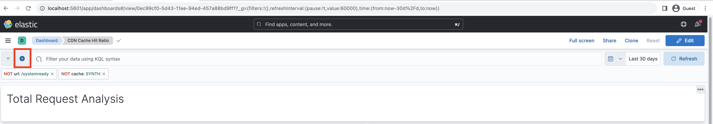
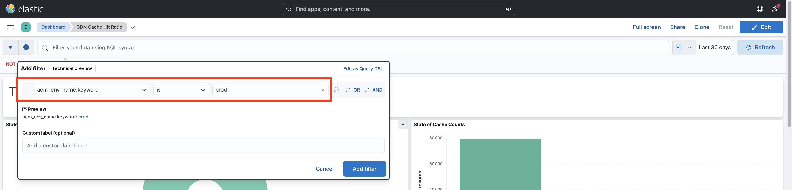
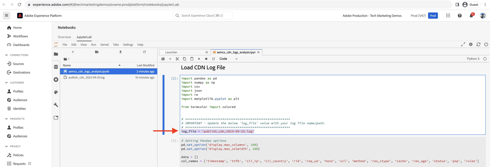

# Analys av träffgrad i CDN-cache

Cachelagrat innehåll på CDN minskar den fördröjning som webbplatsanvändare upplever, som inte behöver vänta på att en begäran ska skickas tillbaka till Apache/Dispatcher eller AEM-publicering. Med detta i åtanke är det värt att optimera CDN-cache-träffkvoten för att maximera mängden innehåll som kan cachas vid CDN.

Lär dig hur du analyserar de **CDN-loggar** som tillhandahålls av AEM as a Cloud Service och får insikter som **cache-träffgrad** och **högsta URL:er för _MISS_ och _PASS_ cache-typer**, för optimeringsändamål.

CDN-loggarna är tillgängliga i JSON-format, som innehåller olika fält, bland annat `url`, `cache`. Mer information finns i [CDN-loggformatet](https://experienceleague.adobe.com/docs/experience-manager-cloud-service/content/implementing/developing/logging.html?lang=sv-SE#cdn-log:~:text=Toggle%20Text%20Wrapping-,Log%20Format,-The%20CDN%20logs). Fältet `cache` innehåller information om _cache_ och dess möjliga värden är HIT, MISS eller PASS. Vi granskar detaljerna om möjliga värden.

| Tillstånd för cache  , möjligt värde | Beskrivning |
|------------------------------------|:-----------------------------------------------------:|
| TRYCK | Begärda data _hittades i CDN-cachen och kräver inte att en hämtningsbegäran_ görs till AEM-servern. |
| MISS | Begärda data _hittades inte i CDN-cachen och måste begäras_ från AEM-servern. |
| PASS | Begärda data är _uttryckligen inställda på att inte cachelagras_ och hämtas alltid från AEM-servern. |

I den här självstudiekursen distribueras [AEM WKND-projektet](https://github.com/adobe/aem-guides-wknd) till AEM as a Cloud Service-miljön och ett litet prestandatest aktiveras med [Apache JMeter](https://jmeter.apache.org/).

Den här självstudiekursen är utformad för att ta dig igenom följande process:

1. Hämta CDN-loggar via Cloud Manager
1. Analysera dessa CDN-loggar kan utföras med två metoder: en lokalt installerad instrumentpanel eller en fjärransluten Splunk- eller Jupityer-anteckningsbok (för dem som licensierar Adobe Experience Platform)
1. Optimerar CDN-cachekonfiguration

## Hämta CDN-loggar

Så här hämtar du CDN-loggarna:

1. Logga in på Cloud Manager på [my.cloudmanager.adobe.com](https://my.cloudmanager.adobe.com/) och välj organisation och program.

1. Om du vill ha en AEMCS-miljö väljer du **Hämta loggar** på ellipsmenyn.

   {width="500" zoomable="yes"}

1. I dialogrutan **Hämta loggar** väljer du tjänsten **Publicera** i listrutan och klickar sedan på nedladdningsikonen bredvid raden **CDN** .

   {width="500" zoomable="yes"}

Om den hämtade loggfilen kommer från _idag_ är filtillägget `.log`, annars är filtillägget `.log.gz` för tidigare loggfiler.

## Analysera hämtade CDN-loggar

Analysera CDN-loggfilen om du vill få insikter om till exempel cacheminnets träffgrad och de översta URL:erna för MISS- och PASS-cachetyperna. Dessa insikter hjälper till att optimera [CDN-cachekonfigurationen](https://experienceleague.adobe.com/sv/docs/experience-manager-cloud-service/content/implementing/content-delivery/caching) och förbättra platsens prestanda.

I den här självstudiekursen visas tre alternativ för att analysera CDN-loggarna:

1. **Elasticsearch, Logstash och Kibana (ELK)**: [ELK-instrumentpanelsverktyget](https://github.com/adobe/AEMCS-CDN-Log-Analysis-Tooling/blob/main/ELK/README.md) kan installeras lokalt.
1. **Splunk**: Verktyget [Splunk-kontrollpanelen](https://github.com/adobe/AEMCS-CDN-Log-Analysis-Tooling/blob/main/Splunk/README.md) kräver åtkomst till Splunk och [AEMCS-loggvidarebefordran aktiverad](https://experienceleague.adobe.com/sv/docs/experience-manager-cloud-service/content/implementing/developing/logging#splunk-logs) för att kunna importera CDN-loggarna.
1. **Jupyter-anteckningsbok**: Den kan nås via fjärråtkomst som en del av [Adobe Experience Platform](https://experienceleague.adobe.com/sv/docs/experience-platform/data-science-workspace/jupyterlab/analyze-your-data) utan att ytterligare programvara installeras, för kunder som har licensierat Adobe Experience Platform.

### Alternativ 1: Använda verktygen på ELK-kontrollpanelen

[ELK-stacken](https://www.elastic.co/elastic-stack) är en uppsättning verktyg som ger en skalbar lösning för att söka, analysera och visualisera data. Det består av Elasticsearch, Logstash och Kibana.

Om du vill identifiera nyckeldetaljerna använder du projektet [AEMCS-CDN-Log-Analysis-Tooling](https://github.com/adobe/AEMCS-CDN-Log-Analysis-Tooling). Det här projektet innehåller en Docker-behållare för ELK-stacken och en förkonfigurerad Kibana-kontrollpanel för analys av CDN-loggarna.

1. Följ stegen från [Så här konfigurerar du ELK Docker-behållaren](https://github.com/adobe/AEMCS-CDN-Log-Analysis-Tooling/blob/main/ELK/README.md#how-to-set-up-the-elk-docker-containerhow-to-setup-the-elk-docker-container) och kontrollerar att du importerar **CDN-cacheträffrekvensen** på Kibana-instrumentpanelen.

1. Följ de här stegen för att identifiera CDN-cachens träfffrekvens och övre URL:er:

   1. Kopiera de hämtade CDN-loggfilerna i den miljöspecifika loggmappen, till exempel `ELK/logs/stage`.

   1. Öppna instrumentpanelen **Träffrekvens för CDN-cache** genom att klicka på det övre vänstra hörnet _Navigeringsmeny > Analys > Kontrollpanel > Träffrekvens för CDN-cache_.

      {width="500" zoomable="yes"}

   1. Välj önskat tidsintervall i det övre högra hörnet.

      {width="500" zoomable="yes"}

   1. Instrumentpanelen **CDN Cache Hit Ratio** är självförklarande.

   1. Avsnittet _Analys av totalt antal begäranden_ innehåller följande information:
      - Cacheproportioner efter cachetyp
      - Cacheantal per cachetyp

      {width="500" zoomable="yes"}

   1. _Analys efter begäran eller Mime-typer_ visar följande information:
      - Cacheproportioner efter cachetyp
      - Cacheantal per cachetyp
      - MEST SAKNAS- och PASS-URL:er

      {width="500" zoomable="yes"}

#### Filtrera efter miljönamn eller program-ID

Följ stegen nedan för att filtrera de kapslade loggarna efter miljönamn:

1. Klicka på ikonen **Lägg till filter** på kontrollpanelen Träffrekvens i CDN-cache.

   {width="500" zoomable="yes"}

1. I **Lägg till filter** modal väljer du fältet `aem_env_name.keyword` i listrutan, operatorn `is` och det önskade miljönamnet för nästa fält och klickar slutligen på _Lägg till filter_.

   {width="500" zoomable="yes"}

#### Filtrera efter värdnamn

Följ stegen nedan för att filtrera de kapslade loggarna efter värdnamn:

1. Klicka på ikonen **Lägg till filter** på kontrollpanelen Träffrekvens i CDN-cache.

   {width="500" zoomable="yes"}

1. I **Lägg till filter** modal väljer du fältet `host.keyword` i listrutan och operatorn `is` och önskat värdnamn för nästa fält. Klicka sedan på _Lägg till filter_.

   {width="500" zoomable="yes"}

Lägg också till fler filter på kontrollpanelen baserat på analyskraven.

### Alternativ 2: Använda Splunk Dashboard-verktyg

[Splunk](https://www.splunk.com/) är ett populärt logganalysverktyg som hjälper dig att samla, analysera loggar och skapa visualiseringar för övervakning och felsökning.

Om du vill identifiera nyckeldetaljerna använder du projektet [AEMCS-CDN-Log-Analysis-Tooling](https://github.com/adobe/AEMCS-CDN-Log-Analysis-Tooling). Det här projektet innehåller en Splunk-kontrollpanel som analyserar CDN-loggarna.

1. Följ stegen från [Splunk-instrumentpaneler för AEMCS CDN-logganalys](https://github.com/adobe/AEMCS-CDN-Log-Analysis-Tooling/blob/main/Splunk/README.md) och se till att importera **CDN-cache-träff**-kontrollpanelen.
1. Om det behövs uppdaterar du filtervärdena _Index, Source Type och andra_ på kontrollpanelen Splunk.

   {width="500" zoomable="yes"}

>[!NOTE]
>
>Gränssnittet och diagrammen i den överordnade kontrollpanelen skiljer sig från ELK-kontrollpanelen, men nyckeldetaljerna är desamma.

### Alternativ 3: Använda Jupyter-anteckningsbok

För dem som inte vill installera programvaran lokalt (dvs. ELK-kontrollpanelsverktyget från föregående avsnitt) finns det ett annat alternativ, men det krävs en licens för Adobe Experience Platform.

[Jupyter-anteckningsboken](https://jupyter.org/) är ett webbprogram med öppen källkod där du kan skapa dokument som innehåller kod, text och visualisering. Det används för datatransformering, visualisering och statistisk modellering. Den kan nås via fjärranslutning [ som en del av Adobe Experience Platform](https://experienceleague.adobe.com/sv/docs/experience-platform/data-science-workspace/jupyterlab/analyze-your-data).

#### Hämtar den interaktiva Python-anteckningsboksfilen

Hämta först filen [AEM-as-CloudService - CDN-logganalys - Jupyter-anteckningsbok](./assets/cdn-logs-analysis/aemcs_cdn_logs_analysis.ipynb) som kan användas i CDN-logganalysen. Den här&quot;interaktiva Python Notebook&quot;-filen är självförklarande, men huvudinnehållet i varje avsnitt är:

- **Installera ytterligare bibliotek**: installerar `termcolor` - och `tabulate` Python-biblioteken.
- **Läs in CDN-loggar**: läser in CDN-loggfilen med hjälp av variabelvärdet `log_file`. Se till att uppdatera värdet. CDN-loggen transformeras också till [Pandas DataFrame](https://pandas.pydata.org/docs/reference/frame.html).
- **Utför analys**: Det första kodblocket är _Resultat av visningsanalys för Total-, HTML-, JS-/CSS- och bildbegäranden_. Det ger cacheträffprocent, stapel- och cirkeldiagram.
Det andra kodblocket är _Top 5 MISS and PASS Request URLs for HTML, JS/CSS, and Image_; det visar URL:er och deras antal i tabellformat.

#### Kör Jupyter-anteckningsboken

Kör sedan Jupyter Notebook i Adobe Experience Platform enligt följande:

1. Logga in på [Adobe Experience Cloud](https://experience.adobe.com/), på hemsidan > **Snabbåtkomst** > klicka på **Experience Platform**

   {width="500" zoomable="yes"}

1. Klicka på menyalternativet **Anteckningsböcker** på Adobe Experience Platform hemsida > Datavetenskap >. Klicka på fliken **JupyterLab** för att starta Jupyter-miljön för anteckningsböcker.

   {width="500" zoomable="yes"}

1. Ladda upp CDN-loggfilen och `aemcs_cdn_logs_analysis.ipynb` -filen med ikonen **Överför filer** på JupyterLab-menyn.

   {width="500" zoomable="yes"}

1. Öppna filen `aemcs_cdn_logs_analysis.ipynb` genom att dubbelklicka.

1. Uppdatera värdet `log_file` i avsnittet **Läs in CDN-loggfil** i anteckningsboken.

   {width="500" zoomable="yes"}

1. Klicka på ikonen **Spela upp** om du vill köra den markerade cellen och gå framåt.

   {width="500" zoomable="yes"}

1. När du har kört kodcellen **Visningsanalysresultat för totalt, HTML, JS/CSS och Bildbegäranden** visas cache-träff i procent, staplar och cirkeldiagram i utdata.

   {width="500" zoomable="yes"}

1. När du har kört kodcellen **Top 5 MISS and PASS Request URLs for HTML, JS/CSS, and Image** visas de fem vanligaste URL:erna för MISS och PASS Request.

   {width="500" zoomable="yes"}

Du kan förbättra Jupyter-anteckningsboken för att analysera CDN-loggarna utifrån dina behov.

## Optimerar CDN-cachekonfiguration

När du har analyserat CDN-loggarna kan du optimera CDN-cachekonfigurationen för att förbättra platsens prestanda. AEM bästa metod är att ha en cache-träfffrekvens på 90 % eller mer.

Mer information finns i [Optimera CDN-cachekonfiguration](https://experienceleague.adobe.com/sv/docs/experience-manager-cloud-service/content/implementing/content-delivery/caching).

AEM WKND-projektet har en referens-CDN-konfiguration. Mer information finns i [CDN-konfiguration](https://github.com/adobe/aem-guides-wknd/blob/main/dispatcher/src/conf.d/available_vhosts/wknd.vhost#L137-L190) från filen `wknd.vhost`.
