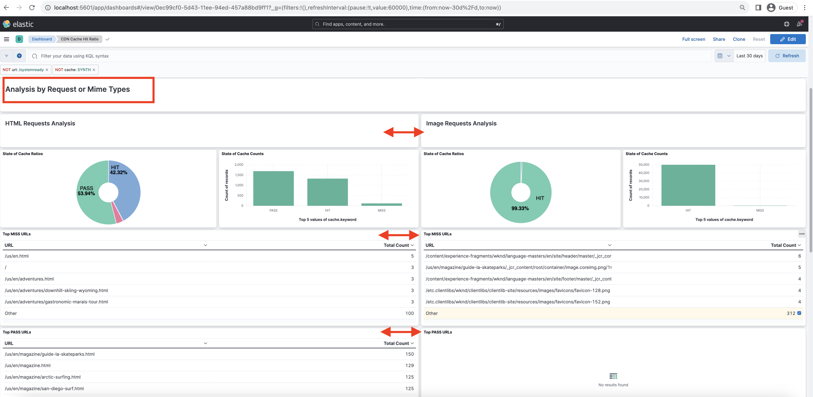

# Analys av träffgrad i CDN-cache

Lär dig hur du analyserar den AEM as a Cloud Service **CDN-loggar** och få insikter som **träffgrad för cache** och **de översta URL:erna för _MISS_ och _PASS_ cachetyper** för optimeringsändamål.

CDN-loggarna är tillgängliga i JSON-format, som innehåller olika fält, bland annat `url`, `cache`finns i [CDN-loggformat](https://experienceleague.adobe.com/docs/experience-manager-cloud-service/content/implementing/developing/logging.html?lang=en#cdn-log:~:text=Toggle%20Text%20Wrapping-,Log%20Format,-The%20CDN%20logs). The `cache` fält innehåller information om _cachestatus_ och dess möjliga värden är HIT, MISS eller PASS. Vi granskar detaljerna om möjliga värden.

| Status för cache   Möjligt värde | Beskrivning |
|------------------------------------|:-----------------------------------------------------:|
| TRYCK | Begärda data är _hittades i CDN-cachen och kräver inte någon hämtning_ begäran till AEM. |
| MISS | Begärda data är _hittades inte i CDN-cachen och måste begäras_ från AEM. |
| PASS | Begärda data är _explicit inställd på att inte cachelagras_ och alltid hämtas från AEM. |

I det här självstudiekursen [AEM WKND-projekt](https://github.com/adobe/aem-guides-wknd) distribueras till den AEM as a Cloud Service miljön och ett litet prestandatest aktiveras med [Apache JMeter](https://jmeter.apache.org/).

## Hämta CDN-loggar

Så här hämtar du CDN-loggarna:

1. Logga in i Cloud Manager på [my.cloudmanager.adobe.com](https://my.cloudmanager.adobe.com/) och väljer organisation och program.

1. För önskad AEMCS-miljö väljer du **Hämta loggar** på ellipsmenyn.

   {width="200" zoomable="yes"}

1. I **Hämta loggar** väljer du **Publicera** Tjänst från listrutan och klicka sedan på nedladdningsikonen bredvid **cdn** rad.

   {width="200" zoomable="yes"}

Om den hämtade loggfilen kommer från _idag_ filtillägget är `.log` annars är tillägget för tidigare loggfiler `.log.gz`.

## Analysera hämtade CDN-loggar

Analysera CDN-loggfilen för att få insikter som till exempel cacheminnets träffgrad och de översta URL:erna för cachetyperna MISS och PASS. Dessa insikter hjälper till att optimera [Konfiguration av CDN-cache](https://experienceleague.adobe.com/docs/experience-manager-cloud-service/content/implementing/content-delivery/caching.html) och förbättra webbplatsens prestanda.

I den här artikeln används **Elasticsearch, Logstash och Kibana (ELK)** [kontrollpanelsverktyg](https://github.com/adobe/AEMCS-CDN-Log-Analysis-ELK-Tool) och [Jupyter Notebook](https://jupyter.org/).

### Använda kontrollpanelsverktyg

The [ELK-stack](https://www.elastic.co/elastic-stack) är en uppsättning verktyg som ger en skalbar lösning för att söka, analysera och visualisera data. Den består av Elasticsearch, Logstash och Kibana.

Om du vill identifiera nyckeldetaljerna använder du [AEMCS-CDN-Log-Analysis-ELK-Tool](https://github.com/adobe/AEMCS-CDN-Log-Analysis-ELK-Tool) verktygsprojekt för kontrollpanelen. Det här projektet innehåller en Docker-behållare för ELK-stacken och en förkonfigurerad Kibana-kontrollpanel för analys av CDN-loggarna.

1. Följ stegen från [Så här konfigurerar du ELK Docker-behållaren](https://github.com/adobe/AEMCS-CDN-Log-Analysis-ELK-Tool#how-to-set-up-the-elk-docker-container) och se till att importera **CDN-cacheträffrekvens** Kibanans kontrollpanel.

1. Följ de här stegen för att identifiera CDN-cachens träfffrekvens och övre URL:er:

   1. Kopiera de hämtade CDN-loggfilerna i den miljöspecifika mappen.

   1. Öppna **CDN-cacheträffrekvens** genom att klicka på Hamburger-menyn > Analytics (Analyser) > Dashboard > CDN Cache Hit Ratio (Träff-förhållande för CDN-cache).

      {width="200" zoomable="yes"}

   1. Välj önskat tidsintervall i det övre högra hörnet.

      {width="200" zoomable="yes"}

   1. The **CDN-cacheträffrekvens** Instrumentpanelen är självförklarande.

   1. The _Analys av totalt begärande_ visas följande information:
      - Cacheproportioner efter cachetyp
      - Cacheantal per cachetyp

      {width="200" zoomable="yes"}

   1. The _Analys efter begäran eller MIME-typer_ visar följande information:
      - Cacheproportioner efter cachetyp
      - Cacheantal per cachetyp
      - MEST SAKNAS- och PASS-URL:er

      {width="200" zoomable="yes"}

#### Filtrera efter miljönamn eller program-ID

Följ stegen nedan för att filtrera de kapslade loggarna efter miljönamn:

1. Klicka på knappen **Lägg till filter** -ikon.

   {width="200" zoomable="yes"}

1. I **Lägg till filter** modal, välj `aem_env_name.keyword` fält från den nedrullningsbara menyn och `is` operator och önskat miljönamn för nästa fält och klicka slutligen på _Lägg till filter_.

   {width="200" zoomable="yes"}

#### Filtrera efter värdnamn

Följ stegen nedan för att filtrera de kapslade loggarna efter värdnamn:

1. Klicka på knappen **Lägg till filter** -ikon.

   {width="200" zoomable="yes"}

1. I **Lägg till filter** modal, välj `host.keyword` fält från den nedrullningsbara menyn och `is` operator och önskat värdnamn för nästa fält och klicka slutligen på _Lägg till filter_.

   {width="200" zoomable="yes"}

Lägg också till fler filter på kontrollpanelen baserat på analyskraven.

### Använda Jupyter Notebook

The [Jupyter Notebook](https://jupyter.org/) är ett webbprogram med öppen källkod som gör att du kan skapa dokument som innehåller kod, text och visualisering. Det används för datatransformering, visualisering och statistisk modellering.

Om du vill snabba upp CDN-logganalysen hämtar du [AEM-som-molntjänst - CDN-logganalys - Jupyter-anteckningsbok](./assets/cdn-logs-analysis/aemcs_cdn_logs_analysis.ipynb) -fil.

Hämtade `aemcs_cdn_logs_analysis.ipynb` &quot;Interactive Python Notebook&quot;-filen är självförklarande, men huvudinnehållet i varje avsnitt är:

- **Installera ytterligare bibliotek**: installerar `termcolor` och `tabulate` Python-bibliotek.
- **Läs in CDN-loggfil**: läser in CDN-loggfilen med `log_file` måste du uppdatera variabelvärdet. CDN-loggen omvandlas också till [Pandor DataFrame](https://pandas.pydata.org/docs/reference/frame.html).
- **Utför analys**: det första kodblocket är _Visa analysresultat för totalt, HTML, JS/CSS och bildbegäranden_, ger den cache-träff i procent, bar och cirkeldiagram.
Det andra kodblocket är _De fem vanligaste URL:erna för MISS- och PASS-begäranden för HTML, JS/CSS och Image_, visas URL:er och deras antal i tabellformat.

#### Kör Jupyter-anteckningsboken i Experience Platform

>[!IMPORTANT]
>
>Om du använder eller har licens för Experience Platform kan du köra Jupyter Notebook utan att installera någon extra programvara.

Så här kör du Jupyter Notebook i Experience Platform:

1. Logga in på [Adobe Experience Cloud](https://experience.adobe.com/), på startsidan > **Snabb åtkomst** > klicka på **Experience Platform**

   {width="200" zoomable="yes"}

1. På Adobe Experience Platform hemsida > Datavetenskap > klickar du på **Bärbara datorer** menyalternativ. Starta Jupyter Notebooks-miljön genom att klicka på **JupyterLab** -fliken.

   {width="200" zoomable="yes"}

1. På JupyterLab-menyn använder du **Överför filer** överför CDN-loggfilen och `aemcs_cdn_logs_analysis.ipynb` -fil.

   {width="200" zoomable="yes"}

1. Öppna `aemcs_cdn_logs_analysis.ipynb` genom att dubbelklicka.

1. I **Läs in CDN-loggfil** i anteckningsboken, uppdatera `log_file` värde.

   {width="200" zoomable="yes"}

1. Om du vill köra den markerade cellen och gå framåt klickar du på **Spela upp** -ikon.

   {width="200" zoomable="yes"}

1. När du har kört **Visa analysresultat för totalt, HTML, JS/CSS och bildbegäranden** i kodcellen visas cache-träff i procent, staplar och cirkeldiagram.

   {width="200" zoomable="yes"}

1. När du har kört **De fem vanligaste URL:erna för MISS- och PASS-begäranden för HTML, JS/CSS och Image** i kodcellen visas de fem vanligaste URL:erna för MISS- och PASS-begäranden.

   {width="200" zoomable="yes"}

Du kan förbättra Jupyter-anteckningsboken för att analysera CDN-loggarna utifrån dina behov.

## Optimera CDN-cachekonfigurationen

När du har analyserat CDN-loggarna kan du optimera CDN-cachekonfigurationen för att förbättra platsens prestanda. Det AEM bästa sättet är att ha en cacheträffkvot på 90 % eller mer.

Mer information finns i [Optimera CDN-cachekonfiguration](https://experienceleague.adobe.com/docs/experience-manager-cloud-service/content/implementing/content-delivery/caching.html#caching).

AEM WKND-projektet har en referens-CDN-konfiguration. Mer information finns i [CDN-konfiguration](https://github.com/adobe/aem-guides-wknd/blob/main/dispatcher/src/conf.d/available_vhosts/wknd.vhost#L137-L190) från `wknd.vhost` -fil.
