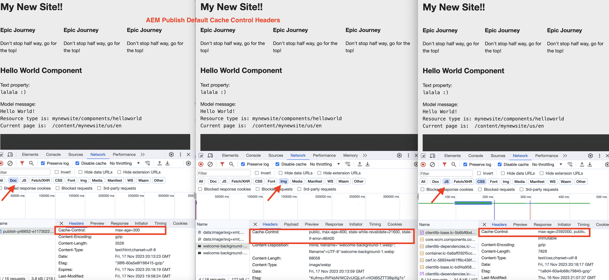

# Aktivera CDN-cachning

Lär dig hur du aktiverar cachelagring av HTTP-svar i AEM as a Cloud Service CDN. Cachelagringen av svar styrs av `Cache-Control`, `Surrogate-Control` eller `Expires` cachehuvuden för HTTP-svar.

Dessa cacherubriker ställs vanligtvis in i AEM Dispatcher värdkonfigurationer med `mod_headers`, men kan även ställas in i anpassad Java™-kod som körs i AEM Publish.

## Standardbeteende för cachelagring

När det INTE finns några anpassade konfigurationer används standardvärdena. På följande skärmbild kan du se standardbeteendet för cachelagring för AEM Publish och Author när ett [AEM Project Archetype](https://github.com/adobe/aem-project-archetype) -baserat `mynewsite` AEM-projekt distribueras.

{width="800" zoomable="yes"}

Granska [AEM Publish - standardcachetid](https://experienceleague.adobe.com/docs/experience-manager-learn/cloud-service/caching/publish.html#cdn-cache-life) och [AEM Author - standardcachetid](https://experienceleague.adobe.com/docs/experience-manager-learn/cloud-service/caching/author.html?#default-cache-life) för mer information.

Sammanfattningsvis cachelagrar AEM as a Cloud Service de flesta innehållstyperna (HTML, JSON, JS, CSS och Assets) i AEM Publish och några innehållstyper (JS, CSS) i AEM Author.

## Aktivera cachelagring

Om du vill ändra standardbeteendet för cachning kan du uppdatera cacherubrikerna på två sätt.

1. **Dispatcher-värdkonfiguration:** Endast tillgänglig för AEM Publish.
1. **Anpassad Java™-kod:** Tillgänglig för både AEM Publish och Author.

Låt oss titta närmare på de här alternativen.

### Dispatcher-värdkonfiguration

Det här alternativet är det rekommenderade sättet att aktivera cachelagring, men det är bara tillgängligt för AEM Publish. Om du vill uppdatera cacherubrikerna använder du direktivet `mod_headers` module och `<LocationMatch>` i Apache HTTP Server-serverns värdfil. Den allmänna syntaxen är följande:

```
<LocationMatch "$URL$ || $URL_REGEX$">
    # Removes the response header of this name, if it exists. If there are multiple headers of the same name, all will be removed.
    Header unset Cache-Control
    Header unset Surrogate-Control
    Header unset Expires

    # Instructs the web browser and CDN to cache the response for 'max-age' value (XXX) seconds. The 'stale-while-revalidate' and 'stale-if-error' attributes controls the stale state treatment at CDN layer.
    Header set Cache-Control "max-age=XXX,stale-while-revalidate=XXX,stale-if-error=XXX"
    
    # Instructs the CDN to cache the response for 'max-age' value (XXX) seconds. The 'stale-while-revalidate' and 'stale-if-error' attributes controls the stale state treatment at CDN layer.
    Header set Surrogate-Control "max-age=XXX,stale-while-revalidate=XXX,stale-if-error=XXX"
    
    # Instructs the web browser and CDN to cache the response until the specified date and time.
    Header set Expires "Sun, 31 Dec 2023 23:59:59 GMT"
</LocationMatch>
```

Följande sammanfattar syftet med varje **header** och tillämpliga **attribut** för rubriken.

|                     | Webbläsare | CDN | Beskrivning |
|---------------------|:-----------:|:---------:|:-----------:|
| Cache-Control | ✔ | ✔ | Det här huvudet styr webbläsarens och CDN-cachetid. |
| Surrogate-kontroll | ✘ | ✔ | Den här rubriken styr CDN-cacheperioden. |
| Upphör | ✔ | ✔ | Det här huvudet styr webbläsarens och CDN-cachetid. |


- **max-age**: Det här attributet styr TTL-värdet eller&quot;time to live&quot; för svarsinnehållet i sekunder.
- **inaktuell-while-revalidate**: Det här attributet kontrollerar _inaktuell status_-behandlingen av svarsinnehållet i CDN-lagret när begäran tas emot inom den angivna perioden i sekunder. _Inaktuellt läge_ är tidsperioden efter att TTL har upphört att gälla och innan svaret har validerats på nytt.
- **stale-if-error**: Det här attributet kontrollerar _inaktuell status_-behandlingen av svarsinnehållet i CDN-lagret när den ursprungliga servern inte är tillgänglig och den mottagna begäran är inom den angivna perioden i sekunder.

Granska informationen om [stolthet och omvalidering](https://developer.fastly.com/learning/concepts/edge-state/cache/stale/) om du vill ha mer information.

#### Exempel

Följ de här stegen för att öka livslängden för webbläsaren och CDN-cachen för **HTML-innehållstypen** till _10 minuter_ utan att behandlas med inaktivt läge:

1. Leta reda på önskad värdfil från katalogen `dispatcher/src/conf.d/available_vhosts` i ditt AEM-projekt.
1. Uppdatera Vhost-filen (t.ex. `wknd.vhost`) enligt följande:

   ```
   <LocationMatch "^/content/.*\.(html)$">
       # Removes the response header if present
       Header unset Cache-Control
   
       # Instructs the web browser and CDN to cache the response for max-age value (600) seconds.
       Header set Cache-Control "max-age=600"
   </LocationMatch>
   ```

   Värdfilerna i katalogen `dispatcher/src/conf.d/enabled_vhosts` är **symlinks** till filerna i katalogen `dispatcher/src/conf.d/available_vhosts`, så se till att du skapar symboler om sådana inte finns.
1. Distribuera värdändringarna till önskad AEM as a Cloud Service-miljö med [Cloud Manager - konfigurationspipeline för webbnivå](https://experienceleague.adobe.com/docs/experience-manager-cloud-service/content/implementing/using-cloud-manager/cicd-pipelines/introduction-ci-cd-pipelines.html?#web-tier-config-pipelines) eller [RDE-kommandon](https://experienceleague.adobe.com/docs/experience-manager-learn/cloud-service/developing/rde/how-to-use.html?lang=en#deploy-apache-or-dispatcher-configuration).

Om du vill ha olika värden för webbläsarens och CDN-cacheperioden kan du använda rubriken `Surrogate-Control` i ovanstående exempel. Du kan också använda rubriken `Expires` om du vill att cachen ska förfalla vid ett visst datum och en viss tid. Med attributen `stale-while-revalidate` och `stale-if-error` kan du dessutom styra hanteringen av svarsinnehållet i inaktivt läge. AEM WKND-projektet har en [referens till inaktuell tillståndsbehandling](https://github.com/adobe/aem-guides-wknd/blob/main/dispatcher/src/conf.d/available_vhosts/wknd.vhost#L150-L155) CDN-cachekonfiguration.

På samma sätt kan du även uppdatera cacherubrikerna för andra innehållstyper (JSON, JS, CSS och Assets).

### Anpassad Java™-kod

Det här alternativet är tillgängligt för både AEM Publish och Author. Du bör dock inte aktivera cachelagring i AEM Author och behålla standardbeteendet för cachelagring.

Om du vill uppdatera cacherubrikerna använder du objektet `HttpServletResponse` i anpassad Java™-kod (Sling-servlet, Sling-serverletsfilter). Den allmänna syntaxen är följande:

```java
// Instructs the web browser and CDN to cache the response for 'max-age' value (XXX) seconds. The 'stale-while-revalidate' and 'stale-if-error' attributes controls the stale state treatment at CDN layer.
response.setHeader("Cache-Control", "max-age=XXX,stale-while-revalidate=XXX,stale-if-error=XXX");

// Instructs the CDN to cache the response for 'max-age' value (XXX) seconds. The 'stale-while-revalidate' and 'stale-if-error' attributes controls the stale state treatment at CDN layer.
response.setHeader("Surrogate-Control", "max-age=XXX,stale-while-revalidate=XXX,stale-if-error=XXX");

// Instructs the web browser and CDN to cache the response until the specified date and time.
response.setHeader("Expires", "Sun, 31 Dec 2023 23:59:59 GMT");
```
