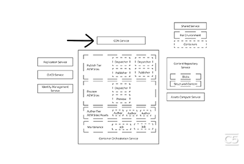

# Cloud 5

## Introduktion

Välkommen till Cloud 5 Series från AEM Engineering. Ett av de största problemen i en produkts implementeringsfas är att den har tillräckligt många kodexempel och/eller live-demonstrationer av dessa exempel, verktyg eller API:er. Målet med den här serien är att tillhandahålla användbar information om AEM as a Cloud Service på 5 minuter eller mindre.

Besök [Förslagsruta](https://forms.office.com/r/74P5Xz4UH0) för att skicka in ämnesförslag.

## Säsong 1

Varje säsong varierar i längd och kommer att släppas enligt ett fast schema. Ämnen som hör till den första säsongen bygger i första hand på tidigare förfrågningar som vi har stött på i våra dagliga kontakter med kunder och partner. Besök den här sidan om du vill ha uppdateringar varje vecka eller följ oss på det sociala nätverk du väljer.

<table>
  <tr>
   <td>
      
      

         <a href="./cloud5-aem-cdn-part1.md"><strong>AEM CDN Deep Dive (del 1)</strong></a>         
          <em>med Darin Kuntze &amp; James Talbot, Senior Cloud Architects</em>
      

      

         
         Del 1 är en titt på AEM as a Cloud Service CDN och hur du använder det i implementeringen.
      

     </td>   
     <td>
      
      

         <a href="./cloud5-aem-cdn-part2.md"><strong>AEM CDN Deep Dive (del 2)</strong></a>
          <em>med Darin Kuntze &amp; James Talbot, Senior Cloud Architects</em>
      

      

         
         Del 2 är en fortsättning på vår AEM as a Cloud Service CDN. Vi besvarar några av de vanligaste frågorna och myterna om vilka funktioner du får med nya CDN.
      

   </td>
     <td>
        
      

         <a href="./cloud5-aem-log-files.md"><strong>Loggfiler och loggning</strong></a>
          <em>med Darin Kuntze &amp; James Talbot, Senior Cloud Architects</em>
      

      

         
         Här får du en snabb inblick i hur du kommer åt loggar på AEM as a Cloud Service, inklusive hur du kommer åt dem via användargränssnittet och API:er.
      

   </td> 
  </tr>
  <tr>
   <td>
        
      

        <a href="./cloud5-getting-login-token-integrations.md"><strong>Integrera med åtkomsttoken</strong></a>        
          <em>med Darin Kuntze &amp; James Talbot, Senior Cloud Architects</em>
      

      

         
         En snabb översikt och demo av interaktion med inloggningstoken för integrering i molntjänstmiljöer.
      

     </td>   
     <td>
        
      

        <a href="./cloud5-aem-dispatcher-cloud.md"><strong>Dispatcher i molnet</strong></a>
          <em>med Darin Kuntze &amp; James Talbot, Senior Cloud Architects</em>
      

      

         
        Darin och James diskuterar Dispatcher i AEM Cloud, inklusive några metodtips och skillnader från AMS/On-Prem. 
      

   </td>
     <td>
      
      

         <strong>Migrering (del 1)</strong>
          <em>med Darin Kuntze &amp; James Talbot, Senior Cloud Architects &amp; Special Guest</em>
      

      

         
         Kommer 8 april 2022
      

   </td> 
  </tr>
<tr>
   <td>
      
      

        <strong>Migrering (del 2)</strong>        
          <em>med Darin Kuntze &amp; James Talbot, Senior Cloud Architects</em>
      

      

         
         Kommer 14 april 2022
      

     </td>   
     <td>
      
      

         <strong>Dispatcher Validator</strong>
          <em>med Darin Kuntze &amp; James Talbot, Senior Cloud Architects</em>
      

      

         
         Kommer den 22 april 2022
      

   </td>
     <td>
      
      

         <strong>Indexerings- och söktips</strong>
          <em>med Darin Kuntze &amp; James Talbot, Senior Cloud Architects</em>
      

      

         
         Kommer den 29 april 2022
      

   </td> 
  </tr>
    <tr>
        <td>
            
            

                <strong>Adobe App Builder</strong>         
                <em>med Darin Kuntze &amp; James Talbot, Senior Cloud Architects &amp; Special Guest</em>
            

            
 
                Kommer 6 maj 2022
            

        </td>
        <td></td>
        <td></td>
    </tr>
</table>