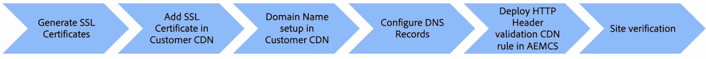

# Anpassat domännamn med kundhanterat CDN

Lär dig hur du lägger till ett anpassat domännamn på en AEM as a Cloud Service-webbplats som använder ett **kundhanterat CDN**.

I den här självstudiekursen har varumärket för exempelwebbplatsen [AEM WKND](https://github.com/adobe/aem-guides-wknd) förbättrats genom att ett anpassat domännamn `wkndviaawscdn.enablementadobe.com` med HTTPS-adresserbart läggs till med TLS (Transport Layer Security) med ett kundhanterat CDN. I den här självstudien används AWS CloudFront som kundhanterat CDN, men alla CDN-leverantörer bör vara kompatibla med AEM as a Cloud Service.

>[!VIDEO](https://video.tv.adobe.com/v/3432561?quality=12&learn=on)

Stegen på hög nivå är:

{width="800" zoomable="yes"}

## Förutsättningar

>[!VIDEO](https://video.tv.adobe.com/v/3432562?quality=12&learn=on)

- [OpenSSL](https://www.openssl.org/) och [dig](https://www.isc.org/blogs/dns-checker/) är installerade på din lokala dator.
- Tillgång till tredjepartstjänster:
   - Certifikatutfärdare (CA) - att begära det signerade certifikatet för din webbplatsdomän, som [DigitCert](https://www.digicert.com/)
   - Customer CDN - för att konfigurera kundens CDN och lägga till SSL-certifikat och domäninformation, som AWS CloudFront, Azure CDN eller Akamai.
   - DNS-värdtjänst (Domain Name System) - för att lägga till DNS-poster för din anpassade domän, som Azure DNS eller AWS Route 53.
- Åtkomst till [Adobe Cloud Manager](https://my.cloudmanager.adobe.com/) för att distribuera CDN-regeln för HTTP Header-validering till AEM as a Cloud Service-miljön.
- Exempelwebbplatsen [AEM WKND](https://github.com/adobe/aem-guides-wknd) har distribuerats till AEM as a Cloud Service-miljön av typen [production program](https://experienceleague.adobe.com/en/docs/experience-manager-cloud-service/content/implementing/using-cloud-manager/programs/introduction-production-programs).

Om du inte har tillgång till tredjepartstjänster kan du _samarbeta med ditt säkerhets- eller värdteam för att slutföra stegen_.

## Generera SSL-certifikat

>[!VIDEO](https://video.tv.adobe.com/v/3427908?quality=12&learn=on)

Du har två alternativ:

1. Med kommandoradsverktyget `openssl` kan du skapa en privat nyckel och en CSR (Certificate Signing Request) för din webbplatsdomän. Om du vill begära ett signerat certifikat skickar du CSR till en certifikatutfärdare (CA).
1. Ditt värdteam tillhandahåller den privata nyckel och det signerade certifikat som krävs för din webbplats.

Vi går igenom stegen för det första alternativet.

Om du vill generera en privat nyckel och en CSR kör du följande kommandon och anger nödvändig information när du uppmanas till det:

```bash
# Generate a private key and a CSR
$ openssl req -newkey rsa:2048 -keyout <YOUR-SITE-NAME>.key -out <YOUR-SITE-NAME>.csr -nodes
```

Om du vill begära ett signerat certifikat tillhandahåller du den genererade CSR-koden till certifikatutfärdaren genom att följa deras dokumentation. När certifikatutfärdaren har signerat CSR-koden får du den signerade certifikatfilen.

### Granska signerat certifikat

Det är bra att granska det signerade certifikatet innan du lägger till det i Cloud Manager. Du kan granska certifikatinformationen med följande kommando:

```bash
# Review the certificate details
$ openssl crl2pkcs7 -nocrl -certfile <YOUR-SIGNED-CERT>.crt | openssl pkcs7 -print_certs -noout
```

Det signerade certifikatet kan innehålla certifikatkedjan, som innehåller rot- och mellanliggande certifikat tillsammans med slutentitetscertifikatet.

Adobe Cloud Manager godkänner slutentitetscertifikatet och certifikatkedjan _i separata formulärfält_, så du måste extrahera slutentitetscertifikatet och certifikatkedjan från det signerade certifikatet.

I den här självstudien används det [DigitCert](https://www.digicert.com/)-signerade certifikatet som utfärdats mot domänen `*.enablementadobe.com` som exempel. Slutentiteten och certifikatkedjan extraheras genom att det signerade certifikatet öppnas i en textredigerare och innehållet mellan markörerna `-----BEGIN CERTIFICATE-----` och `-----END CERTIFICATE-----` kopieras.

## Konfigurera kundhanterad CDN

>[!VIDEO](https://video.tv.adobe.com/v/3432563?quality=12&learn=on)

Konfigurera kund-CDN, som AWS CloudFront, Azure CDN eller Akamai, och lägg till SSL-certifikatet och domäninformation. I den här självstudiekursen används AWS CloudFront som exempel. Beroende på din CDN-leverantör kan dock stegen variera. De viktigaste pratbubblorna är:

- Lägg till SSL-certifikatet i CDN.
- Lägg till det anpassade domännamnet i CDN.
- Konfigurera CDN för att cachelagra innehållet, som bilder, CSS och JavaScript-filer.
- Lägg till HTTP-huvudet `X-Forwarded-Host` i CDN-inställningarna så att ditt CDN inkluderar den här rubriken i alla begäranden som skickas till AEMCD-startpunkten.
- Kontrollera att rubrikvärdet `Host` är inställt på AEM as a Cloud Service standarddomän som innehåller program- och miljö-ID och slutar med `adobeaemcloud.com`. HTTP-värdhuvudets värde som skickas från kundens CDN till Adobe CDN måste vara AEM as a Cloud Service standarddomän. Alla andra värden resulterar i ett feltillstånd.

## Konfigurera DNS-poster

>[!VIDEO](https://video.tv.adobe.com/v/3432564?quality=12&learn=on)

Så här konfigurerar du DNS-posten för din anpassade domän:

1. Lägg till en CNAME-post för den anpassade domänen som pekar på CDN-domännamnet.

I den här självstudien läggs en CNAME-post till i Azure DNS för den anpassade domänen `wkndviaawscdn.enablementadobe.com` och den pekar på distributionsdomännamnet för AWS CloudFront.

### Platsverifiering

Verifiera det anpassade domännamnet genom att gå till platsen med det anpassade domännamnet.
Det kanske inte fungerar beroende på värdkonfigurationen i AEM as a Cloud Service-miljön.

Ett viktigt säkerhetssteg är att distribuera CDN-regeln för HTTP Header-validering till AEM as a Cloud Service-miljön. Regeln säkerställer att begäran kommer från kundens CDN och inte från någon annan källa.

## Aktuellt arbetstillstånd utan CDN-regel för HTTP-huvudvalidering

>[!VIDEO](https://video.tv.adobe.com/v/3432565?quality=12&learn=on)

Utan CDN-regeln för validering av HTTP-huvud anges rubrikvärdet `Host` till AEM as a Cloud Service standarddomän som innehåller program- och miljö-ID och slutar med `adobeaemcloud.com`. Adobe CDN omvandlar rubrikvärdet `Host` till värdet för `X-Forwarded-Host` som tagits emot från kundens CDN endast om CDN-regeln för HTTP-huvudvalidering har distribuerats. Annars skickas rubrikvärdet `Host` som det är i AEM as a Cloud Service-miljön och rubriken `X-Forwarded-Host` används inte.

### Exempel på serverkod för att skriva ut värdrubrikens värde

Följande serverletkod skriver ut HTTP-rubrikvärdena `Host`, `X-Forwarded-*`, `Referer` och `Via` i JSON-svaret.

```java
package com.adobe.aem.guides.wknd.core.servlets;

import java.io.IOException;
import java.util.Enumeration;

import javax.servlet.Servlet;
import javax.servlet.ServletException;

import org.apache.sling.api.SlingHttpServletRequest;
import org.apache.sling.api.SlingHttpServletResponse;
import org.apache.sling.api.resource.ResourceResolverFactory;
import org.apache.sling.api.servlets.HttpConstants;
import org.apache.sling.api.servlets.ServletResolverConstants;
import org.apache.sling.api.servlets.SlingSafeMethodsServlet;
import org.osgi.service.component.annotations.Component;
import org.osgi.service.component.annotations.Reference;

@Component(service = Servlet.class, property = {
        ServletResolverConstants.SLING_SERVLET_PATHS + "=/bin/verify-headers",
        ServletResolverConstants.SLING_SERVLET_METHODS + "=" + HttpConstants.METHOD_GET
})
public class VerifyHeadersServlet extends SlingSafeMethodsServlet {

    @Reference
    private ResourceResolverFactory resourceResolverFactory;

    @Override
    protected void doGet(SlingHttpServletRequest request, SlingHttpServletResponse response)
            throws ServletException, IOException {
        response.setContentType("application/json");
        response.setCharacterEncoding("UTF-8");

        // Create JSON response
        StringBuilder jsonResponse = new StringBuilder();
        jsonResponse.append("{");

        Enumeration<String> headerNames = request.getHeaderNames();
        boolean firstHeader = true;

        while (headerNames.hasMoreElements()) {
            String headerName = headerNames.nextElement();

            if (headerName.startsWith("X-Forwarded-") || headerName.startsWith("Host")
                    || headerName.startsWith("Referer") || headerName.startsWith("Via")) {
                if (!firstHeader) {
                    jsonResponse.append(",");
                }
                jsonResponse.append("\"").append(headerName).append("\": \"").append(request.getHeader(headerName))
                        .append("\"");
                firstHeader = false;
            }
        }

        jsonResponse.append("}");

        response.getWriter().write(jsonResponse.toString());
    }
}
```

Uppdatera filen `../dispatcher/src/conf.dispatcher.d/filters/filters.any` med följande konfiguration om du vill testa servleten. Kontrollera också att CDN är konfigurerad till **NOT cache** för sökvägen `/bin/*`.

```plaintext
# Testing purpose bin
/0300 { /type "allow" /extension "json" /path "/bin/*"}
/0301 { /type "allow" /path "/bin/*"}
/0302 { /type "allow" /url "/bin/*"}
```

## Konfigurera och distribuera CDN-regel för HTTP Header-validering

>[!VIDEO](https://video.tv.adobe.com/v/3432566?quality=12&learn=on)

Så här konfigurerar och distribuerar du CDN-regeln för HTTP-huvudvalidering:

- Lägg till CDN-regel för verifiering av HTTP-huvud i filen `cdn.yaml`, ett exempel ges nedan.

  ```yaml
  kind: "CDN"
  version: "1"
  metadata:
  envTypes: ["prod"]
  data:
  authentication:
      authenticators:
      - name: edge-auth
          type: edge
          edgeKey1: ${{CDN_EDGEKEY_080124}}
          edgeKey2: ${{CDN_EDGEKEY_110124}}
      rules:
      - name: edge-auth-rule
          when: { reqProperty: tier, equals: "publish" }
          action:
          type: authenticate
          authenticator: edge-auth
  ```

- Skapa miljövariabler av hemlig typ (CDN_EDGEKEY_080124, CDN_EDGEKEY_110124) med Cloud Manager-gränssnittet.
- Distribuera CDN-regeln för HTTP Header-validering till AEM as a Cloud Service-miljön med Cloud Manager pipeline.

## Skicka hemlighet i HTTP-huvudet X-AEM-Edge-Key

>[!VIDEO](https://video.tv.adobe.com/v/3432567?quality=12&learn=on)

Uppdatera kundens CDN så att hemligheten skickas i HTTP-huvudet `X-AEM-Edge-Key`. Hemligheten används av Adobe CDN för att validera att begäran kommer från kundens CDN och transformera rubrikvärdet `Host` till värdet för `X-Forwarded-Host` som tas emot från kundens CDN.

## Avsluta video

Du kan också titta på en video från början till slut som demonstrerar ovanstående steg för att lägga till ett anpassat domännamn med ett kundhanterat CDN på en webbplats som hanteras av AEM as a Cloud Service.

>[!VIDEO](https://video.tv.adobe.com/v/3432568?quality=12&learn=on)
