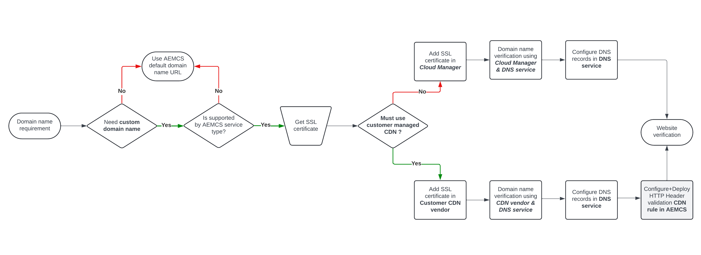

# Alternativ för anpassade domännamn

Lär dig hur du hanterar och implementerar domännamn för din värdbaserade AEM as a Cloud Service-webbplats.

>[!VIDEO](https://video.tv.adobe.com/v/3432632?quality=12&learn=on)

## Innan du börjar

Innan du börjar implementera anpassade domännamn måste du förstå följande koncept:

### Vad är ett domännamn?

Ett domännamn är det användarvänliga namnet på en webbplats, t.ex. adobe.com, som pekar på en viss plats (t.ex. 170.2.14.16) på Internet.

### Standarddomännamn i AEM as a Cloud Service

Som standard har AEM as a Cloud Service etablerats med ett standarddomännamn som slutar på `*.adobeaemcloud.com`. Det SSL-certifikat med jokertecken som utfärdas mot `*.adobeaemcloud.com` används automatiskt i alla miljöer och det här jokertecknet är Adobe-ansvar.

Standarddomännamnen har formatet `https://<SERVICE-TYPE>-p<PROGRAM-ID>-e<ENVIRONMENT-ID>.adobeaemcloud.com`.

- `<SERVICE-TYPE>` kan vara **author**, **publish** eller **preview**.
- `<PROGRAM-ID>` är den unika identifieraren för programmet. En organisation kan ha flera program.
- `<ENVIRONMENT-ID>` är den unika identifieraren för miljön och varje program innehåller fyra miljöer: **Rapid Development (RDE)**, **dev**, **stage** och **prod**. Varje miljö innehåller de tre ovannämnda tjänsttyperna, förutom **RDE** som inte har någon förhandsvisningsmiljö.

Sammanfattningsvis har du **11** (RDE har ingen förhandsvisningsmiljö) unika URL:er i kombination med standarddomännamnet när alla AEM as a Cloud Service-miljöer har etablerats.

### CDN hanterad av Adobe jämfört med kundhanterad CDN

För att minska latensen och förbättra webbplatsens prestanda är AEM as a Cloud Service integrerat med ett CDN-nätverk (Content Delivery Network) som hanteras av Adobe. CDN som hanteras av Adobe aktiveras automatiskt för alla miljöer. Mer information finns i [AEM as a Cloud Service-cachning](../caching/overview.md).

Men kunder kan också använda sitt eget CDN, som kallas **kundhanterad CDN**. Det är inte nödvändigt, men få kunder använder det av andra skäl. I det här fallet ansvarar kunden för att hantera CDN-konfigurationer och -inställningar.

### Anpassade domännamn

Anpassade domännamn är alltid att föredra framför standarddomännamn när det gäller branding, autenticitet och affärsutveckling. De kan dock bara tillämpas på tjänsttyperna **publish** och **preview** och inte på **author**.

När du lägger till anpassade domännamn måste du ange ett giltigt SSL-certifikat för den angivna anpassade domänen. SSL-certifikatet måste vara ett giltigt certifikat som signerats av en betrodd certifikatutfärdare (CA).

Normalt använder kunderna ett anpassat domännamn för Prod-miljöer (AEM as a Cloud Service webbplats) och ibland för lägre miljöer som **stage** eller **dev**.

| AEM | Stöder anpassad domän? |
|---------------------|:-----------------------:|
| Författare | ✘ |
| Förhandsgranska | ✔ |
| Publish | ✔ |

## Implementera domännamn

Om du vill implementera domännamn med hjälp av ett CDN som hanteras av Adobe eller en kundhanterad CDN guidar följande flödesschema dig genom processen:

{width="800" zoomable="yes"}

I följande tabell visas även var du ska hantera de specifika konfigurationerna:

| Anpassat domännamn med | Lägg till SSL-certifikat i | Lägg till domännamn i | Konfigurera DNS-poster på | Behöver du CDN-regel för HTTP-huvudvalidering? |
|---------------------|:-----------------------:|-----------------------:|-----------------------:|-----------------------:|
| CDN som hanteras av Adobe | Adobe Cloud Manager | Adobe Cloud Manager | DNS-värdtjänst | ✘ |
| Kundhanterad CDN | CDN-leverantör | CDN-leverantör | DNS-värdtjänst | ✔ |

### Stegvisa självstudiekurser

Nu när du har förstått processen för domännamnshantering kan du implementera anpassade domännamn för din AEM as a Cloud Service webbplats genom att följa självstudiekurserna nedan:

**[Anpassade domännamn med Adobe-hanterat CDN](./custom-domain-name-with-adobe-managed-cdn.md)**: I den här självstudiekursen lär du dig hur du lägger till ett eget domännamn på en **AEM as a Cloud Service-webbplats med Adobe-hanterat CDN**.
**[Anpassade domännamn med kundhanterat CDN](./custom-domain-names-with-customer-managed-cdn.md)**: I den här självstudiekursen får du lära dig hur du lägger till ett anpassat domännamn på en **AEM as a Cloud Service-webbplats med kundhanterat CDN**.

