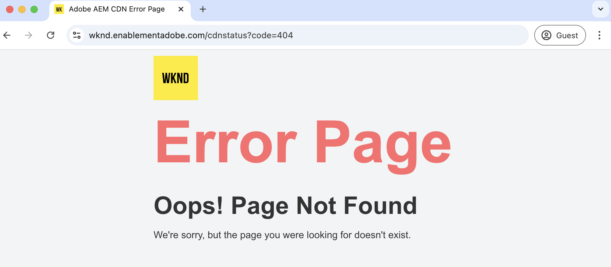

# Anpassade felsidor

Lär dig hur du implementerar anpassade felsidor för din värdbaserade AEM as a Cloud Service-webbplats.

I den här självstudiekursen lär du dig:

- Standardfelsidor
- Felsidor från
   - AEM - författare, publicera, förhandsgranska
   - CDN som hanteras av Adobe
- Alternativ för att anpassa felsidor
   - Direktivet ErrorDocument Apache
   - ACS AEM Commands - Felsidhanterare
   - CDN-felsidor

## Standardfelsidor

Låt oss granska när felsidor visas, standardfelsidor och varifrån de kommer.

Felsidor visas när:

- sidan finns inte (404)
- inte behörig att öppna en sida (403)
- serverfel (500) på grund av kodproblem eller att servern inte kan nås.

AEM as a Cloud Service tillhandahåller _standardfelsidor_ för ovanstående scenarier. Det är en allmän sida som inte matchar ert varumärke.

Standardfelsidan _hanteras_ från _AEM tjänsttyp_ (författare, publicera, förhandsgranska) eller från _Adobe-hanterat CDN_. Se tabellen nedan för mer information.

| Felsida från | Information |
|---------------------|:-----------------------:|
| AEM - författare, publicera, förhandsgranska | När sidbegäran hanteras av den AEM tjänsttypen visas felsidan från den AEM tjänsttypen. |
| CDN som hanteras av Adobe | När det Adobe-hanterade CDN _inte kan nå AEM tjänsttyp_ (ursprunglig server) visas felsidan från det CDN som hanteras av Adobe. **Det är en osannolik händelse men värt att nämna.** |

Du kan dock _anpassa både AEM och Adobe-hanterade_ CDN-felsidor så att de matchar ditt varumärke och ger en bättre användarupplevelse.

## Alternativ för att anpassa felsidor

Följande alternativ är tillgängliga för att anpassa felsidor:

| Gäller för | Alternativnamn | Beskrivning |
|---------------------|:-----------------------:|:-----------------------:|
| AEM - publicera och förhandsgranska | Direktivet ErrorDocument | Använd direktivet [ErrorDocument](https://httpd.apache.org/docs/2.4/custom-error.html) i konfigurationsfilen för Apache för att ange sökvägen till den anpassade felsidan. Gäller endast för AEM - publicera och förhandsgranska. |
| AEM - författare, publicera, förhandsgranska | Felsidhanterare för ACS AEM Commons | Använd [ACS AEM Commons felsidhanterare](https://adobe-consulting-services.github.io/acs-aem-commons/features/error-handler/index.html) för att anpassa felet för alla AEM tjänstetyper. |
| CDN som hanteras av Adobe | CDN-felsidor | Använd CDN-felsidorna för att anpassa felsidorna när den Adobe-hanterade CDN inte kan nå den AEM tjänsttypen (origin server). |


## Förutsättningar

I den här självstudiekursen får du lära dig hur du anpassar felsidor med direktivet _ErrorDocument_ , med alternativen _ACS AEM Commons Error Page Handler_ och _CDN Error Pages_ . Om du vill följa den här självstudiekursen behöver du:

- Den [lokala AEM utvecklingsmiljön](https://experienceleague.adobe.com/en/docs/experience-manager-learn/cloud-service/local-development-environment-set-up/overview) eller AEM as a Cloud Service-miljön. Alternativet _CDN-felsidor_ kan användas i AEM as a Cloud Service-miljön.

- [AEM WKND-projektet](https://github.com/adobe/aem-guides-wknd) för att anpassa felsidor.

## Konfigurera

- Klona och distribuera AEM WKND-projektet till den lokala AEM utvecklingsmiljön genom att följa stegen nedan:

  ```
  # For local AEM development environment
  $ git clone git@github.com:adobe/aem-guides-wknd.git
  $ cd aem-guides-wknd
  $ mvn clean install -PautoInstallSinglePackage -PautoInstallSinglePackagePublish
  ```

- I AEM as a Cloud Service-miljö distribuerar du AEM WKND-projektet genom att köra [pipelinen för fullständig stack](https://experienceleague.adobe.com/en/docs/experience-manager-cloud-service/content/implementing/using-cloud-manager/cicd-pipelines/introduction-ci-cd-pipelines#full-stack-pipeline), se exemplet med [icke-produktionspipeline](https://experienceleague.adobe.com/en/docs/experience-manager-learn/cloud-service/cloud-manager/cicd-non-production-pipeline).

- Kontrollera att WKND-webbplatssidorna återges korrekt.

## Direktivet ErrorDocument Apache för att anpassa felsidor{#errordocument-directive}

Vi ska granska hur [AEM WKND](https://github.com/adobe/aem-guides-wknd) -projektet använder Apache-direktivet `ErrorDocument` för att visa anpassade felsidor.

- Modulen `ui.content.sample` innehåller profilerade [felsidor](https://github.com/adobe/aem-guides-wknd/tree/main/ui.content.sample/src/main/content/jcr_root/content/wknd/language-masters/en/errors) @ `/content/wknd/language-masters/en/errors`. Granska dem i din [lokala AEM](http://localhost:4502/sites.html/content/wknd/language-masters/en/errors) - eller AEM as a Cloud Service `https://author-p<ID>-e<ID>.adobeaemcloud.com/ui#/aem/sites.html/content/wknd/language-masters/en/errors` -miljö.

- Filen `wknd.vhost` från modulen `dispatcher` innehåller:
   - Direktivet [ErrorDocument](https://github.com/adobe/aem-guides-wknd/blob/main/dispatcher/src/conf.d/available_vhosts/wknd.vhost#L139-L143) som pekar på de ovanstående [felsidorna](https://github.com/adobe/aem-guides-wknd/blob/main/dispatcher/src/conf.d/variables/custom.vars#L7-L8).
   - Värdet [DispatcherPassError](https://github.com/adobe/aem-guides-wknd/blob/main/dispatcher/src/conf.d/available_vhosts/wknd.vhost#L133) är satt till 1, så att Apache kan hantera alla fel.

  ```
  ...
  # ErrorDocument directive in wknd.vhost file
  ErrorDocument 404 ${404_PAGE}
  ErrorDocument 500 ${500_PAGE}
  ErrorDocument 502 ${500_PAGE}
  ErrorDocument 503 ${500_PAGE}
  ErrorDocument 504 ${500_PAGE}
  
  ...
  # DispatcherPassError value in wknd.vhost file
  <IfModule disp_apache2.c>
      ...
      DispatcherPassError        1
  </IfModule>
  
  # Custom error pages path in custom.vars file
  Define 404_PAGE /content/wknd/us/en/errors/404.html
  Define 500_PAGE /content/wknd/us/en/errors/500.html
  ...
  ```

- Granska WKND-platsens anpassade felsidor genom att ange ett felaktigt sidnamn eller en felaktig sökväg i miljön, till exempel [https://publish-p105881-e991000.adobeaemcloud.com/us/en/foo/bar.html](https://publish-p105881-e991000.adobeaemcloud.com/us/en/foo/bar.html).

## ACS AEM Commons-Error Page Handler för att anpassa felsidor{#acs-aem-commons-error-page-handler}

Om du vill anpassa felsidor med hjälp av ACS AEM Commons felsidhanterare går du igenom avsnittet [Använda](https://adobe-consulting-services.github.io/acs-aem-commons/features/error-handler/index.html#how-to-use).

## CDN-felsidor för att anpassa felsidor{#cdn-error-pages}

Låt oss implementera CDN-felsidor för att anpassa felsidor när den Adobe-hanterade CDN inte kan nå AEM (origin server).

>[!IMPORTANT]
>
> Observera att det CDN som hanteras av Adobe inte kan nå den AEM tjänstetypen (origin server) är en osannolik händelse men bör planera för.


### Översikt över CDN-felsidor

CDN-felsidan implementeras som ett Single Page-program (SPA) av det Adobe-hanterade CDN.

Det WKND-specifika varumärkesinnehållet måste genereras dynamiskt med JavaScript-filen. JavaScript-filen måste finnas på en offentlig plats. Följande statiska filer måste därför utvecklas och lagras på en allmänt tillgänglig plats:

1. **jsUrl**: Den absoluta URL:en för JavaScript-filen som återger felsidans innehåll genom att skapa HTML-element dynamiskt.
1. **cssUrl**: Den absoluta URL:en för CSS-filen som ska formatera felsidans innehåll.
1. **icoUrl**: Den absoluta URL:en för favoritikonen.

### Utveckla en anpassad felsida

Låt oss utveckla WKND-specifikt varumärkesspecifikt felsidinnehåll som ett Single Page Application (SPA).

I demosyfte kan vi använda [Reagera](https://react.dev/), men du kan använda vilket JavaScript-ramverk eller bibliotek som helst.

- Skapa ett nytt React-projekt genom att köra följande kommando:

  ```
  $ npx create-react-app aem-cdn-error-page
  ```

- Öppna projektet i din favoritkodredigerare och uppdatera filerna nedan:

   - `src/App.js`: Det är huvudkomponenten som återger felsidans innehåll.

     ```javascript
     import logo from "./wknd-logo.png";
     import "./App.css";
     
     function App() {
       return (
         <>
           <div className="App">
             <div className="container">
             
             </div>
           </div>
           <div className="container">
             <div className="error-code">CDN Error Page</div>
             <h1 className="error-message">Ruh-Roh! Page Not Found</h1>
             <p className="error-description">
               We're sorry, we are unable to fetch this page!
             </p>
           </div>
         </>
       );
     }
     
     export default App;
     ```

   - `src/App.css`: Formatera felsidans innehåll.

     ```css
         .App {
       text-align: left;
     }
     
     .App-logo {
       height: 14vmin;
       pointer-events: none;
     }
     
     
     body {
       margin-top: 0;
       padding: 0;
       font-family: Arial, sans-serif;
       background-color: #fff;
       color: #333;
       display: flex;
       justify-content: center;
       align-items: center;
     }
     
     .container {
       text-align: letf;
       padding-top: 10px;
     }
     
     .error-code {
       font-size: 4rem;
       font-weight: bold;
       color: #ff6b6b;
     }
     
     .error-message {
       font-size: 2.5rem;
       margin-bottom: 10px;
     }
     
     .error-description {
       font-size: 1rem;
       margin-bottom: 20px;
     }
     ```

   - Lägg till filen `wknd-logo.png` i mappen `src`. Kopiera [filen](https://github.com/adobe/aem-guides-wknd/blob/main/ui.frontend/src/main/webpack/resources/images/favicons/favicon-512.png) som `wknd-logo.png`.

   - Lägg till filen `favicon.ico` i mappen `public`. Kopiera [filen](https://github.com/adobe/aem-guides-wknd/blob/main/ui.frontend/src/main/webpack/resources/images/favicons/favicon-32.png) som `favicon.ico`.

   - Kontrollera innehållet på WKND-felsidan för CDN genom att köra projektet:

     ```
     $ npm start
     ```

     Öppna webbläsaren och gå till `http://localhost:3000/` för att visa innehållet på CDN-felsidan.

   - Skapa projektet för att generera statiska filer:

     ```
     $ npm run build
     ```

     De statiska filerna genereras i mappen `build`.


Du kan också hämta filen [aem-cdn-error-page.zip](./assets/aem-cdn-error-page.zip) som innehåller de ovannämnda React-projektfilerna.

Lägg sedan de statiska filerna ovan på en plats som är tillgänglig för alla.

### Värdstatiska filer som krävs för CDN-felsidan

Låt oss lagra de statiska filerna i Azure Blob Storage. Du kan dock använda vilken statisk filvärdtjänst som helst, till exempel [Netlify](https://www.netlify.com/), [Vercel](https://vercel.com/) eller [AWS S3](https://aws.amazon.com/s3/).

- Följ den officiella dokumentationen för [Azure Blob Storage](https://learn.microsoft.com/en-us/azure/storage/blobs/storage-quickstart-blobs-portal) för att skapa en behållare och överföra de statiska filerna.

  >[!IMPORTANT]
  >
  >Om du använder andra statiska filvärdtjänster följer du dokumentationen till dem för att lagra de statiska filerna.

- Kontrollera att de statiska filerna är tillgängliga för allmänheten. Mina WKND-demonstrationsspecifika lagringskontoinställningar är följande:

   - **Lagringskontonamn**: `aemcdnerrorpageresources`
   - **Behållarnamn**: `static-files`

  

- I behållaren ovanför `static-files` överförs filer under filerna från mappen `build`:

   - `error.js`: `build/static/js/main.<hash>.js`-filen har bytt namn till `error.js` och [offentligt tillgänglig](https://aemcdnerrorpageresources.blob.core.windows.net/static-files/error.js).
   - `error.css`: `build/static/css/main.<hash>.css`-filen har bytt namn till `error.css` och [offentligt tillgänglig](https://aemcdnerrorpageresources.blob.core.windows.net/static-files/error.css).
   - `favicon.ico`: Filen `build/favicon.ico` överförs som den är och [är tillgänglig för alla](https://aemcdnerrorpageresources.blob.core.windows.net/static-files/favicon.ico).

Konfigurera sedan CDN-regeln (errorPages) och referera till de statiska filerna ovan.

### Konfigurera CDN-regeln

Låt oss konfigurera `errorPages` CDN-regeln som använder de statiska filerna ovan för att återge innehållet på CDN-felsidan.

1. Öppna filen `cdn.yaml` från huvudmappen `config` i AEM. Exempel: filen cdn.yaml](https://github.com/adobe/aem-guides-wknd/blob/main/config/cdn.yaml) för [WKND-projektet.

1. Lägg till följande CDN-regel i filen `cdn.yaml`:

   ```yaml
   kind: "CDN"
   version: "1"
   metadata:
     envTypes: ["dev", "stage", "prod"]
   data:
     # The CDN Error Page configuration. 
     # The error page is displayed when the Adobe-managed CDN is unable to reach the origin server.
     # It is implemented as a Single Page Application (SPA) and WKND branded content must be generated dynamically using the JavaScript file 
     errorPages:
       spa:
         title: Adobe AEM CDN Error Page # The title of the error page
         icoUrl: https://aemcdnerrorpageresources.blob.core.windows.net/static-files/favicon.ico # The PUBLIC URL of the favicon
         cssUrl: https://aemcdnerrorpageresources.blob.core.windows.net/static-files/error.css # The PUBLIC URL of the CSS file
         jsUrl: https://aemcdnerrorpageresources.blob.core.windows.net/static-files/error.js # The PUBLIC URL of the JavaScript file
   ```

1. Spara, implementera och skicka ändringarna till databasen i det övre Adobe.

### Distribuera CDN-regeln

Distribuera slutligen den konfigurerade CDN-regeln till AEM as a Cloud Service-miljön med Cloud Manager pipeline.

1. I Cloud Manager går du till avsnittet **Pipelines**.

1. Skapa en ny pipeline eller välj den befintliga pipeline som endast distribuerar **Config**-filerna. Detaljerade steg finns i [Skapa en konfigurationspipeline](https://experienceleague.adobe.com/en/docs/experience-manager-learn/cloud-service/security/traffic-filter-and-waf-rules/how-to-setup#deploy-rules-through-cloud-manager).

1. Klicka på knappen **Kör** för att distribuera CDN-regeln.


### Testa CDN-felsidorna

Följ stegen nedan för att testa CDN-felsidorna:

- Öppna webbläsaren och gå till Publish-URL:en, lägg till `cdnstatus?code=404` i URL:en, till exempel [https://publish-p105881-e991000.adobeaemcloud.com/cdnstatus?code=404](https://publish-p105881-e991000.adobeaemcloud.com/cdnstatus?code=404) eller använd [URL:en för den anpassade domänen](https://wknd.enablementadobe.com/cdnstatus?code=404)

  

- Följande koder stöds: 403, 404, 406, 500 och 503.

- Kontrollera webbläsarens nätverksflik för att se de statiska filerna läses in från Azure Blob Storage. Det HTML-dokument som levereras av det Adobe-hanterade CDN innehåller det minsta tillåtna innehållet, och JavaScript-filen skapar dynamiskt det varumärkesanpassade felsidans innehåll.

  

## Sammanfattning

I den här självstudiekursen lärde du dig att implementera anpassade felsidor för din värdbaserade AEM as a Cloud Service-webbplats.

Du lärde dig också de detaljerade stegen för alternativet för CDN-felsidor när du vill anpassa felsidor när den Adobe-hanterade CDN inte kan nå den AEM tjänsttypen (ursprunglig server).


