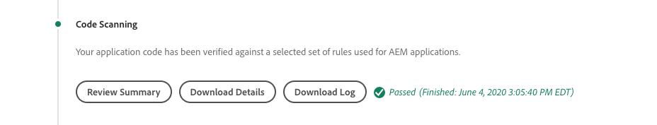

# Felsöka AEM as a Cloud Service byggen och driftsättningar

Adobe Cloud Manager underlättar kodbygget och driftsättningen av AEM as a Cloud Service. Fel kan uppstå under steg i byggprocessen, vilket kräver åtgärder för att åtgärda dem. Den här guiden går igenom hur man förstår vanliga fel i distributionen och hur man bäst hanterar dem.


## Validering

Valideringssteget säkerställer helt enkelt att grundläggande Cloud Manager-konfigurationer är giltiga. Vanliga valideringsfel:

### Miljön är i ett ogiltigt tillstånd

+ __Felmeddelande:__ Miljön är i ett ogiltigt tillstånd.
  
+ __Orsak:__ Pipelinens målmiljö är i ett övergångstillstånd där den inte kan ta emot nya byggen.
+ __Upplösning:__ Vänta på att tillståndet ska matchas till ett tillstånd som körs (eller som kan uppdateras). Om miljön tas bort kan du återskapa miljön eller välja en annan miljö att bygga på.

### Miljön som är associerad med pipelinen kan inte hittas

+ __Felmeddelande:__ Miljön har markerats som borttagen.
  
+ __Orsak:__ Miljön som pipelinen är konfigurerad att använda har tagits bort.
Även om en ny miljö med samma namn återskapas kommer Cloud Manager inte automatiskt att koppla pipelinen till den miljö med samma namn.
+ __Upplösning:__ Redigera pipelinekonfigurationen och välj den miljö som ska distribueras på nytt.

### Git-grenen som är associerad med pipelinen kan inte hittas

+ __Felmeddelande:__ Ogiltig pipeline: XXXXXX. Orsak=Förgrening=xxxx hittades inte i databasen.
  
+ __Orsak:__ Git-grenen som pipelinen är konfigurerad att använda har tagits bort.
+ __Upplösning:__ Återskapa den saknade Git-grenen med exakt samma namn, eller konfigurera om pipelinen så att den byggs från en annan befintlig gren.

## Build &amp; Unit Testing


Fasen Build and Unit Testing utför en Maven-bygge (`mvn clean package`) av projektet som är utcheckad från pipelinens konfigurerade Git-gren.

Fel som upptäcks i den här fasen bör kunna reproduceras lokalt, med följande undantag:

+ Ett maven-beroende som inte är tillgängligt för [Maven Central](https://search.maven.org/) används och Maven-databasen som innehåller beroendet är antingen:
   + Det går inte att nå från Cloud Manager, t.ex. en privat intern Maven-databas, eller Maven-databasen kräver autentisering och de felaktiga inloggningsuppgifterna har angetts.
   + Inte explicit registrerad i projektets `pom.xml`. Observera att Maven-databaser inte bör inkluderas eftersom byggtiden ökar.
+ Enhetstester misslyckas på grund av timingproblem. Detta kan inträffa när enhetstester är tidskänsliga. En stark indikator förlitar sig på `.sleep(..)` i testkoden.
+ Användning av Maven-plugin-program som inte stöds.

## Kodskanning



Kodskanning utför statisk kodanalys med en blandning av Java- och AEM-specifika metodtips.

Kodskanning resulterar i ett byggfel om det finns en allvarlig säkerhetslucka i koden. Mindre överträdelser kan åsidosättas, men vi rekommenderar att de åtgärdas. Observera att kodskanningen inte är perfekt och kan resultera i [falskt positiva ](https://experienceleague.adobe.com/docs/experience-manager-cloud-service/implementing/using-cloud-manager/test-results/overview-test-results.html#dealing-with-false-positives).

Lös problem med kodskanning genom att hämta den CSV-formaterade rapporten från Cloud Manager via knappen **Hämta information** och granska eventuella poster.

Mer information finns i AEM-specifika regler i Cloud Manager-dokumentations [anpassade AEM-specifika regler för kodskanning](https://experienceleague.adobe.com/docs/experience-manager-cloud-manager/using/how-to-use/custom-code-quality-rules.html).

## Skapa bilder


Bygge image-konfigurationer används för att kombinera de inbyggda kodartefakterna som skapas i steget Build &amp; Unit Testing med AEM Release och bilda en enda driftsättningsbar artefakt.

Det kan finnas problem med kodbygge och kompilering under Build &amp; Unit Testing, men det kan finnas konfigurationsproblem eller strukturella problem när du försöker kombinera den anpassade byggartefakten med AEM-versionen.

### Duplicera OSGi-konfigurationer

När flera OSGi-konfigurationer löses via körläge för AEM-målmiljön misslyckas steget Skapa bild med följande fel:

```
[ERROR] Unable to convert content-package [/tmp/packages/enduser.all-1.0-SNAPSHOT.zip]: 
Configuration 'com.example.ExampleComponent' already defined in Feature Model 'com.example.groupId:example.all:slingosgifeature:xxxxx:X.X', 
set the 'mergeConfigurations' flag to 'true' if you want to merge multiple configurations with same PID
```

#### Orsak 1

+ __Orsak:__ AEM-projektets hela paket innehåller flera kodpaket, och samma OSGi-konfiguration tillhandahålls av fler än ett av kodpaketen, vilket resulterar i en konflikt, vilket resulterar i att steget Build Image inte kan avgöra vilken som ska användas, vilket gör att bygget misslyckas. Observera att detta inte gäller OSGi-fabrikskonfigurationer, så länge de har unika namn.
+ __Upplösning:__ Granska alla kodpaket (inklusive eventuella inkluderade kodpaket från tredje part) som distribueras som en del av AEM-programmet, och sök efter duplicerade OSGi-konfigurationer som via körläge matchar målmiljön. Felmeddelandets vägledning om&quot;set the mergeConfigurations flag to true&quot; är inte möjlig i AEM som en molntjänst och bör ignoreras.

#### Orsak 2

+ __Orsak:__ AEM-projektets kod innehåller felaktigt samma kodpaket två gånger, vilket resulterar i duplicering av alla OSGi-konfigurationer som ingår i det paketet.
+ __Upplösning:__ Granska alla pom.xml-paket som är inbäddade i hela projektet och kontrollera att de har `filevault-package-maven-plugin` [configuration](https://experienceleague.adobe.com/docs/experience-manager-cloud-service/implementing/developing/aem-project-content-package-structure.html#cloud-manager-target) inställd på `<cloudManagerTarget>none</cloudManagerTarget>`.

### Felformaterat ompekningsskript

Repoinit-skript definierar baslinjeinnehåll, användare, åtkomstkontrollistor osv. I AEM as a Cloud Service tillämpas repoinit-skript under Build Image (Byggbild), men vid lokal snabbstart för AEM SDK används de när OSGi-repopoint-fabrikskonfigurationen aktiveras. På grund av detta kan Repoinit-skript i tysthet misslyckas (med loggning) på AEM SDK lokala snabbstart, men det kan leda till att steget Skapa bild misslyckas och distributionen avbryts.

+ __Orsak:__ Ett ompekningsskript har fel format. Detta kan lämna databasen i ett ofullständigt tillstånd eftersom eventuella repoinit-skript efter att det misslyckade skriptet inte körs mot databasen.
+ __Upplösning:__ Granska den lokala snabbstarten för AEM SDK när ompekningsskriptets OSGi-konfiguration distribueras för att avgöra om och vilka fel som finns.

### Otillfredsställd återpeka innehållsberoende

Repoinit-skript definierar baslinjeinnehåll, användare, åtkomstkontrollistor osv. I AEM SDK lokala snabbstart används repoinit-skript när repoden OSGi-fabrikskonfigurationen aktiveras, med andra ord efter att databasen är aktiv och kan ha fått innehållsändringar direkt eller via innehållspaket. I AEM as a Cloud Service tillämpas repoinit-skript under Build Image (Skapa bild) mot en databas som kanske inte innehåller innehåll som poinit-skriptet är beroende av.

+ __Orsak:__ Ett ompekningsskript är beroende av innehåll som inte finns.
+ __Upplösning:__ Kontrollera att innehållet som pekskriptet är beroende av finns. Detta visar ofta på ett otillräckligt definierat repoinitskript som saknar direktiv som definierar de saknade, men nödvändiga, innehållsstrukturerna. Detta kan reproduceras lokalt genom att ta bort AEM, packa upp JAR-filen och lägga till den OSGi-konfiguration för repoinit som innehåller repoinit-skriptet i installationsmappen och starta AEM. Felet visas i felkoden i AEM SDK local quickstart.log.


### Programmets Core Components-version är större än den distribuerade versionen

_Det här problemet påverkar endast icke-produktionsmiljöer som INTE automatiskt uppdaterar till den senaste AEM-versionen._

AEM as a Cloud Service inkluderar automatiskt den senaste Core Components-versionen i alla AEM-utgåvor, vilket innebär att när en AEM as a Cloud Service-miljö har uppdaterats automatiskt eller manuellt har den senaste versionen av Core Components distribuerats till den.

Går att genomföra om steget Skapa bild inte fungerar när:

+ Distributionsprogrammet uppdaterar Core Components maven-beroendeversionen i `core`-projektet (OSGi bundle)
+ Distribueringsprogrammet distribueras sedan till en sandlådemiljö (icke-produktionsmiljö) i AEM as a Cloud Service som inte har uppdaterats för att använda en AEM-version som innehåller den nya Core Components-versionen.

För att förhindra detta fel ska du, när en uppdatering av AEM as a Cloud Service-miljön är tillgänglig, inkludera uppdateringen som en del av nästa build/deploy och alltid se till att uppdateringarna inkluderas efter att Core Components-versionen har ökats i programkodbasen.

+ __Symtomen:__
Steget Skapa bild misslyckas med en FELrapportering om att `com.adobe.cq.wcm.core.components...` -paket i specifika versionsintervall inte kan importeras av `core` -projektet.

  ```
  [ERROR] Bundle com.example.core:0.0.3-SNAPSHOT is importing package(s) Package com.adobe.cq.wcm.core.components.models;version=[12.13,13) in start level 20 but no bundle is exporting these for that start level in the required version range.
  [ERROR] Analyser detected errors on feature 'com.adobe.granite:aem-ethos-app-image:slingosgifeature:aem-runtime-application-publish-dev:1.0.0-SNAPSHOT'. See log output for error messages.
  [INFO] ------------------------------------------------------------------------
  [INFO] BUILD FAILURE
  [INFO] ------------------------------------------------------------------------
  ```

+ __Orsak:__ Programmets OSGi-paket (som definieras i `core` -projektet) importerar Java-klasser från kärnberoendet för kärnkomponenter, på en annan versionsnivå än den som distribueras till AEM as a Cloud Service.
+ __Upplösning:__
   + Använd Git för att återgå till en fungerande implementering som finns före den inkrementella versionen av Core Component. Överför implementeringen till en Cloud Manager Git-gren och utför en miljöuppdatering från den här grenen. Detta kommer att uppgradera AEM as a Cloud Service till den senaste AEM-versionen, som kommer att innehålla den senare Core Components-versionen. När AEM as a Cloud Service har uppdaterats till den senaste AEM-versionen, som har den senaste Core Components-versionen, distribuerar du den kod som misslyckades.
   + För att återskapa problemet lokalt måste du se till att AEM SDK-versionen är samma version som AEM as a Cloud Service-miljön använder.


### Skapa ett Adobe Support-ärende

Om ovanstående felsökningsmetoder inte löser problemet skapar du ett Adobe Support-ärende via:

+ [Adobe Admin Console](https://adminconsole.adobe.com) > fliken Support > Skapa ärende

  _Om du är medlem i flera Adobe-organisationer måste du se till att den Adobe-organisation som har misslyckad pipeline är markerad i Adobe Orgs-växlaren innan du skapar ärendet._

## Distribuera till

Steget Distribuera till ansvarar för att ta kodartefakten som genereras i Build Image, startar nya AEM Author- och Publish-tjänster som använder den och tar sedan bort alla gamla AEM Author- och Publish-tjänster när du lyckas. Även paket och index med ändringsbart innehåll installeras och uppdateras i det här steget.

Bekanta dig med [AEM as a Cloud Service-loggar](./logs.md) innan du felsöker Distribuera till steg. Loggen `aemerror` innehåller information om start och avstängning av poder som kan vara relevant för distribution av utgåvor. Observera att loggen som är tillgänglig via knappen Hämtningslogg i steget Cloud Manager Deploy to inte är loggen `aemerror` och inte innehåller detaljerad information om hur du startar program.


De tre främsta anledningarna till varför Distribuera till steg kan misslyckas:

### Cloud Manager pipeline innehåller en gammal AEM-version

+ __Orsak:__ En Cloud Manager-pipeline innehåller en äldre version av AEM än vad som distribueras till målmiljön. Detta kan inträffa när en pipeline återanvänds och pekas på en ny miljö som kör en senare version av AEM. Du kan identifiera detta genom att kontrollera om miljöns AEM-version är större än pipeline:s AEM-version.
  
+ __Upplösning:__
   + Om målmiljön har en tillgänglig uppdatering väljer du Uppdatera från miljöns åtgärder och kör sedan bygget igen.
   + Om målmiljön inte har en tillgänglig uppdatering innebär det att den kör den senaste versionen av AEM. Lös detta genom att ta bort pipelinen och återskapa den.


### Cloud Manager timeout

Kod som körs när den nydistribuerade AEM-tjänsten startas tar så lång tid att Cloud Manager hinner vänta innan distributionen kan slutföras. I dessa fall kan distributionen eventuellt lyckas, även om Cloud Manager-status rapporterades som Misslyckad.

+ __Orsak:__ Anpassad kod kan köra åtgärder, till exempel stora frågor eller innehållsgenomgångar, som aktiveras tidigt i OSGi-paketet eller komponentlivscykler, vilket avsevärt försenar starttiden för AEM.
+ __Upplösning:__ Granska implementeringen av kod som körs tidigt i OSGi Bundles livscykel och granska `aemerror` loggarna för AEM Author and Publish services vid tidpunkten för felet (loggtid i GMT) enligt Cloud Manager, och sök efter loggmeddelanden som indikerar eventuella egna loggprocesser som körs.

### Inkompatibel kod eller konfiguration

De flesta kod- och konfigurationsfel fångas upp tidigare i bygget, men det är möjligt att anpassad kod eller konfiguration inte är kompatibel med AEM as a Cloud Service och inte upptäcks förrän den körs i behållaren.

+ __Orsak:__ Anpassad kod kan anropa långsamma åtgärder, som stora frågor eller innehållsgenomgångar, som aktiveras tidigt i OSGi-paketet eller komponentlivscykler, vilket avsevärt försenar starttiden för AEM.
+ __Upplösning:__ Granska `aemerror` loggarna för AEM Author och Publish services vid tidpunkten (loggtid i GMT) för felet enligt Cloud Manager.
   1. Granska loggarna efter eventuella FEL som genererats av Java-klasserna i det anpassade programmet. Lös eventuella problem, tryck på den fasta koden och bygg om pipeline.
   1. Granska loggarna för eventuella FEL som rapporterats av aspekter av AEM som du utökar/interagerar med i ditt anpassade program och ta reda på dessa. Dessa FEL kan eventuellt inte direkt tillskrivas Java-klasser. Lös eventuella problem, tryck på den fasta koden och bygg om pipeline.

### Inkludera /var i innehållspaketet

`/var` kan inte ändras och innehåller en mängd övergående körningsinnehåll. Inkluderar `/var` i innehållspaket (t.ex. `ui.content`) som distribueras via Cloud Manager kan göra att distributionen misslyckas.

Det här problemet är svårt att identifiera eftersom det inte leder till ett fel i den initiala distributionen, bara i efterföljande distributioner. Exempel på märkbara symtom är:

+ Den initiala distributionen lyckas, oavsett hur nytt eller ändrat innehåll som kan ändras, som är en del av distributionen, verkar inte finnas i AEM Publish-tjänsten.
+ Aktivering/inaktivering av innehåll i AEM Author är blockerad
+ Efterföljande distributioner misslyckas i steget Distribuera till, med felet Distribuera till efter cirka 60 minuter.

Så här validerar du problemet:

1. Kontrollerar att minst ett innehållspaket som ingår i distributionen skriver till `/var`.
1. Kontrollera att den primära (fetstilta) distributionskön är blockerad på:
   + AEM Author > Tools > Deployment > Distribution
     
1. Om efterföljande distribution misslyckas hämtar du Cloud Manager Distribuera till-loggar med knappen Hämtningslogg:

   

   ... och verifiera att det finns ungefär 60 minuter mellan loggsatserna:

   ```
   2020-01-01T01:01:02+0000 Begin deployment in aem-program-x-env-y-dev [CorrelationId: 1234]
   ```

   ... och ...

   ```
   2020-01-01T02:04:10+0000 Failed deployment in aem-program-x-env-y-dev
   ```

   Observera att loggen inte innehåller dessa indikatorer för de initiala distributionerna som rapporterar att de lyckades, och endast för efterföljande misslyckade distributioner.

+ __Orsak:__ Den användare av AEM replikeringstjänst som används för att distribuera innehållspaket till tjänsten AEM Publish kan inte skriva till `/var` i AEM Publish. Detta leder till att distributionen av innehållspaketet till AEM Publish-tjänsten misslyckas.
+ __Lösning:__ Följande sätt att lösa problemet visas i prioritetsordning:
   1. Om resurserna för `/var` inte behövs tar du bort resurser under `/var` från innehållspaket som distribueras som en del av programmet.
   2. Om `/var`-resurserna är nödvändiga definierar du nodstrukturerna med [repoinit](https://experienceleague.adobe.com/docs/experience-manager-cloud-service/implementing/deploying/overview.html#repoinit). Repoinit-skript kan riktas mot AEM Author, AEM Publish eller båda, via OSGi-runmodes.
   3. Om `/var`-resurserna bara krävs av AEM-författaren och inte kan modelleras med [repoinit](https://experienceleague.adobe.com/docs/experience-manager-cloud-service/implementing/deploying/overview.html#repoinit) kan du flytta dem till ett diskret innehållspaket, som bara installeras på AEM Author genom att [bädda in](https://experienceleague.adobe.com/docs/experience-manager-cloud-service/implementing/developing/aem-project-content-package-structure.html#embeddeds) det i `all`-paketet i en AEM Author-körningsmapp (`<target>/apps/example-packages/content/install.author</target>`).
   4. Ange lämpliga åtkomstkontrollistor till tjänstanvändaren `sling-distribution-importer` enligt beskrivningen i denna [Adobe KB](https://helpx.adobe.com/in/experience-manager/kb/cm/cloudmanager-deploy-fails-due-to-sling-distribution-aem.html).

### Skapa ett Adobe Support-ärende

Om ovanstående felsökningsmetoder inte löser problemet skapar du ett Adobe Support-ärende via:

+ [Adobe Admin Console](https://adminconsole.adobe.com) > fliken Support > Skapa ärende

  _Om du är medlem i flera Adobe-organisationer måste du se till att den Adobe-organisation som har misslyckad pipeline är markerad i Adobe Orgs-växlaren innan du skapar ärendet._
