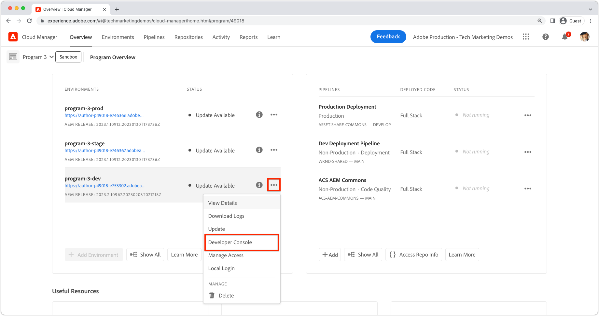

# Felsökning AEM as a Cloud Service med Developer Console

AEM as a Cloud Service tillhandahåller en Developer Console för varje miljö som visar olika detaljer om AEM som körs och som är till hjälp vid felsökning.

Varje AEM as a Cloud Service miljö har en egen Developer Console.

## Navigera till Developer Console

Developer Console är tillgänglig per AEM as a Cloud Service miljö via Cloud Manager.

1. Navigera till __[Cloud Manager](https://my.cloudmanager.adobe.com/)__
2. Öppna __Program__ som innehåller den AEM as a Cloud Service miljön för att öppna Developer Console.
3. Leta reda på __Miljö__ och väljer `...`.
4. Välj __Developer Console__ i listrutan.

## Åtkomst till Developer Console

För att få tillgång till och använda Developer Console måste utvecklarens Adobe ID ha följande behörigheter via [Adobe Admin Console](https://adminconsole.adobe.com).

1. Se till att du i Adobe Org-växlaren kan se Adobe-organisationen som hör till de miljöer du vill inspektera i Developer Console.
1. För att kunna logga in på Developer Console måste utvecklaren vara medlem i någon av följande roller:
   + [Cloud Manager Product&#39;s __Utvecklare - Cloud Service__ Produktprofil](https://experienceleague.adobe.com/docs/experience-manager-cloud-service/content/onboarding/journey/assign-profiles-cloud-manager.html#assign-developer): I det här fallet ser utvecklaren den fullständiga listan över miljöer som är tillgängliga under den valda URL:en för utvecklarkonsolen. Om en utvecklingsmiljö eller RDE har valts i Cloud Manager kan andra utvecklingsmiljöer eller RDE:er i samma program visas.
   + [__AEM administratörer__ Produktprofil på __AEM__](https://experienceleague.adobe.com/docs/experience-manager-cloud-service/content/onboarding/journey/assign-profiles-aem.html#aem-product-profiles): I det här fallet kommer listan över miljöer som beskrivs i föregående punkt att begränsas till de relaterade produktprofiler där rollen tilldelas.
1. Utvecklaren måste vara medlem i [__AEM__ eller __AEM administratörer__ Produktprofil för AEM författare och/eller publicering](https://experienceleague.adobe.com/docs/experience-manager-cloud-service/content/onboarding/journey/assign-profiles-aem.html#aem-product-profiles).
   + Om det här medlemskapet inte finns [status](#status) dumpar timeout med 401 Unauthorized error error.

### Felsökning: Developer Console-åtkomst

#### När jag loggar in ser jag inte den miljö jag letar efter

Kontrollera följande:

+ Du har valt rätt webbadress för utvecklarkonsolen genom att klicka på de tre punkterna för den valda miljön via Cloud Manager och välja Utvecklarkonsol.
+ Du har [Cloud Manager Product&#39;s __Utvecklare - Cloud Service__ Produktprofil](https://experienceleague.adobe.com/docs/experience-manager-cloud-service/content/onboarding/journey/assign-profiles-cloud-manager.html#assign-developer) för att se hela listan med miljöer eller för att du är en del av [__AEM administratörer__ Produktprofil på __AEM__](https://experienceleague.adobe.com/docs/experience-manager-cloud-service/content/onboarding/journey/assign-profiles-aem.html#aem-product-profiles) för den miljö du inte hittar.

#### 401 Otillåtet fel vid dumpningens status

Om någon status dumpas och 401 ett obehörigt fel rapporteras innebär det att användaren inte finns med de nödvändiga behörigheterna i AEM as a Cloud Service eller att inloggningstoken inte används eller har gått ut.

Så här löser du det 401 obehöriga problemet:

1. Se till att din användare är medlem i rätt Adobe IMS-produktprofil (AEM administratörer eller AEM användare) för Developer Console AEM as a Cloud Service produktinstans.
   + Kom ihåg att Developer Console har tillgång till två Adobe IMS-produktinstanser, AEM as a Cloud Service Author och Publish produktinstanser, så att rätt produktprofiler används beroende på vilken tjänstnivå som kräver åtkomst via Developer Console.
1. Logga in på AEM as a Cloud Service (Författare eller Publicera) och kontrollera att användare och grupper har synkroniserats korrekt till AEM.
   + Developer Console kräver att din användarpost skapas i motsvarande AEM tjänstenivå för att den ska kunna autentiseras till den tjänstnivån.
1. Rensa dina webbläsares cookies och programtillstånd (lokal lagring) och logga in på Developer Console igen, så att åtkomsttoken Developer Console används korrekt och inte har gått ut.

## Pod

AEM as a Cloud Service redigerings- och publiceringstjänster består av flera instanser för att hantera trafikvariationer och rullande uppdateringar utan driftavbrott. De här instanserna kallas Pods. Markering av rutor i Developer Console definierar omfattningen av de data som ska visas via de andra kontrollerna.

+ En pod är en diskret instans som ingår i en AEM (författare eller publicera)
+ Poängen är övergående, vilket innebär AEM as a Cloud Service skapar och förstör dem vid behov
+ Endast poder som är en del av den associerade AEM as a Cloud Service miljön visas i Developer Console&#39;s Pod Switcher.
+ Längst ned i Pod Switcher kan du välja Pods efter tjänstetyp:
   + Alla författare
   + Alla utgivare
   + Alla förekomster

## Status

Status innehåller alternativ för att skriva ut ett specifikt AEM körningstillstånd i text eller JSON-utdata. Developer Console innehåller liknande information som AEM SDK:s lokala snabbstartswebbkonsol OSGi, med den markerade skillnaden att Developer Console är skrivskyddad.

### Paket

Paketen innehåller alla OSGi-paket i AEM. Den här funktionen liknar [AEM SDK&#39;s local quickstart&#39;s OSGi Bundles](http://localhost:4502/system/console/bundles) på `/system/console/bundles`.

Paket hjälper dig att felsöka genom att:

+ Lista alla OSGi-paket som distribuerats till AEM som en tjänst
+ En lista över varje OSGi-paketstatus, inklusive om de är aktiva eller inte
+ Tillhandahåller information om olösta beroenden som gör att OSGi-paket inte blir aktiva

### Komponenter

Komponenterna listar alla OSGi-komponenter i AEM. Den här funktionen liknar [AEM SDK:s lokala snabbstartsprogram OSGi Components](http://localhost:4502/system/console/components) på `/system/console/components`.

Komponenterna hjälper till vid felsökning genom att:

+ Lista alla OSGi-komponenter som distribuerats till AEM as a Cloud Service
+ Tillhandahålla varje OSGi-komponents tillstånd, inklusive om de är aktiva eller missnöjda
+ Om du anger information i ej tillfredsställande tjänstreferenser kan det leda till att OSGi-komponenter blir aktiva
+ En lista över OSGi-egenskaper och deras värden som är bundna till OSGi-komponenten.
   + Detta visar faktiska värden som injicerats via [OSGi-miljökonfigurationsvariabler](https://experienceleague.adobe.com/docs/experience-manager-cloud-service/content/implementing/deploying/configuring-osgi.html#environment-specific-configuration-values).

### Konfigurationer

Konfigurationer visar alla OSGi-komponentens konfigurationer (OSGi-egenskaper och -värden). Den här funktionen liknar [AEM SDK&#39;s local quickstart&#39;s OSGi Configuration Manager](http://localhost:4502/system/console/configMgr) på `/system/console/configMgr`.

Konfigurationer hjälper dig att felsöka genom att:

+ Lista OSGi-egenskaper och deras värden med OSGi-komponenten
   + Detta visar INTE faktiska värden som injicerats via [OSGi-miljökonfigurationsvariabler](https://experienceleague.adobe.com/docs/experience-manager-cloud-service/content/implementing/deploying/configuring-osgi.html#environment-specific-configuration-values). Se [Komponenter](#components) ovan, för de injicerade värdena.
+ Hitta och identifiera felkonfigurerade egenskaper

### Oak Index

Oak Indexes innehåller en dump av de noder som definieras under `/oak:index`. Tänk på att detta inte visar sammanfogade index, som inträffar när ett AEM ändras.

Ta hjälp av index när du felsöker genom att:

+ En lista över alla indexdefinitioner för eko som ger insikter om hur sökfrågor körs i AEM. Tänk på att ändringar i AEM inte återspeglas här. Den här vyn är bara användbar för index som endast tillhandahålls av AEM, eller enbart av den anpassade koden.

### OSGi Services

Komponenterna listar alla OSGi-tjänster. Den här funktionen liknar [AEM SDK&#39;s local quickstart&#39;s OSGi Services](http://localhost:4502/system/console/services) på `/system/console/services`.

OSGi Services hjälper dig att felsöka genom att:

+ En lista över alla OSGi-tjänster i AEM, tillsammans med det tillhörande OSGi-paketet och alla OSGi-paket som använder det

### Försäljningsjobb

Sling Jobs visar alla kön för Sling Jobs. Den här funktionen liknar [AEM SDK:s lokala snabbstartsjobb](http://localhost:4502/system/console/slingevent) på `/system/console/slingevent`.

Sling Jobs hjälper till vid felsökning genom att:

+ Lista över Sling-jobbköer och deras konfigurationer
+ Ge insikter om antalet aktiva, köade och bearbetade Sling-jobb, vilket är praktiskt vid felsökning av arbetsflöden, övergångsarbetsflöden och annat arbete som utförs av Sling-jobb i AEM.

## Java-paket

Med Java-paket kan du kontrollera om ett Java-paket, och version, är tillgängligt för användning i AEM as a Cloud Service. Den här funktionen är densamma som [AEM SDK:s lokala snabbstartfunktion Dependency Finder](http://localhost:4502/system/console/depfinder) på `/system/console/depfinder`.

Java-paket används för att förhindra att bildpaket startas på grund av olösta importer eller olösta klasser i skript (HTL, JSP osv.). Om Java Packages rapporterar att inga paket exporterar ett Java-paket (eller om versionen inte matchar den som importeras av ett OSGi-paket):

+ Kontrollera att projektets AEM API-maven-beroende version matchar miljöns version AEM Release (och uppdatera om möjligt allt till den senaste).
+ Om extra Maven-beroenden används i Maven-projektet
   + Kontrollera om ett alternativt API från AEM SDK API-beroende kan användas i stället.
   + Om det extra beroendet krävs kontrollerar du att det är ett OSGi-paket (i stället för en vanlig Jar) och att det är inbäddat i projektets kodpaket, (`ui.apps`), på samma sätt som OSGi Bundle-kärnan är inbäddad i `ui.apps` paket.

## Servlets

Servlets används för att ge insikt i hur AEM löser en URL till en Java-server eller ett Java-skript (HTL, JSP) som slutligen hanterar begäran. Den här funktionen är densamma som [AEM SDK:s lokala snabbstart Sling Servlet Resolver](http://localhost:4502/system/console/servletresolver) på `/system/console/servletresolver`.

Servlets hjälper dig att felsöka:

+ Hur en URL delas upp i adresserbara delar (resurs, väljare, tillägg).
+ Vilken server eller vilket skript en URL löser, vilket hjälper till att identifiera felformaterade URL:er eller felregistrerade servrar/skript.

## Frågor

Frågor ger insikt i vad och hur sökfrågor körs på AEM. Den här funktionen är densamma som  [AEM SDK:s lokala snabbstartsverktyg > Frågeprestanda](http://localhost:4502/libs/granite/operations/content/diagnosistools/queryPerformance.html) konsol.

Frågar fungerar bara när en viss ruta har valts, eftersom den öppnar den pods webbkonsol för frågeprestanda, som kräver att utvecklaren har åtkomst till AEM.

Frågor hjälper dig att felsöka genom att:

+ Förklara hur frågor tolkas, analyseras och körs av Oak. Detta är mycket viktigt när du ska spåra varför en fråga är långsam och förstå hur den kan snabbas upp.
+ Visar de vanligaste frågorna som körs i AEM, med möjlighet att förklara dem.
+ Visar de långsammaste frågorna som körs i AEM, med möjlighet att förklara dem.
