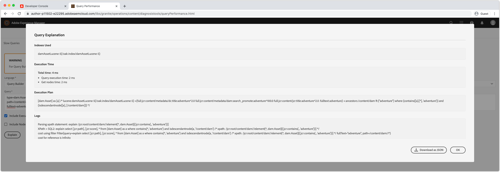

# Felsöka AEM som en Cloud Service med Developer Console

AEM som Cloud Service tillhandahåller en Developer Console för varje miljö som visar olika detaljer om den AEM som körs och som är till hjälp vid felsökning.

Varje AEM som en Cloud Service har sin egen Developer Console.

## Åtkomst till Developer Console

För att få tillgång till och använda Developer Console måste följande behörigheter anges till utvecklarens Adobe ID via [Adobe Admin Console](https://adminconsole.adobe.com).

1. Se till att den Adobe-organisation som har aktiverat Cloud Manager och AEM som Cloud Service är aktiv i Adobe Org-växlaren.
1. Utvecklaren måste vara medlem i Cloud Manager Product&#39;s __Developer - Cloud Service__ Product Profile.
   + Om det här medlemskapet inte finns kan utvecklaren inte logga in på Developer Console.
1. Utvecklaren måste vara medlem i __AEM Users__ eller __AEM Administrators__ produktprofil på AEM Author and/or Publish.
   + Om det här medlemskapet inte finns kommer dumparna [status](#status) att timeout med ett 401 oauktoriserat fel.

### Felsökning: Developer Console-åtkomst

#### 401 Otillåtet fel vid dumpningens status

Om någon status dumpas innebär det att 401 Oauktoriserat fel har rapporterats, vilket innebär att användaren inte finns med de nödvändiga behörigheterna i AEM eftersom en Cloud Service eller att inloggningstoken är ogiltig eller har gått ut.

Så här löser du det 401 obehöriga problemet:

1. Se till att din användare är medlem i rätt Adobe IMS-produktprofil (AEM administratörer eller AEM användare) för den utvecklarkonsols associerade AEM som produktinstans för Cloud Service.
   + Kom ihåg att Developer Console har tillgång till två Adobe IMS-produktinstanser; AEM som Cloud Service Author och Publish, så att rätt produktprofiler används beroende på vilket tjänstskikt som kräver åtkomst via Developer Console.
1. Logga in på AEM som en Cloud Service (författare eller publicera) och kontrollera att användare och grupper har synkroniserats korrekt till AEM.
   + Developer Console kräver att din användarpost skapas i motsvarande AEM tjänstenivå för att den ska kunna autentiseras till den tjänstnivån.
1. Rensa dina webbläsares cookies och programtillstånd (lokal lagring) och logga in på Developer Console igen, så att åtkomsttoken Developer Console används korrekt och inte har gått ut.

## Pod

AEM som Cloud Service Author och Publish består av flera instanser för att hantera trafikvariationer och rullande uppdateringar utan driftavbrott. De här instanserna kallas Pods. Markering av rutor i Developer Console definierar omfattningen av de data som ska visas via de andra kontrollerna.

+ En pod är en diskret instans som ingår i en AEM (författare eller publicera)
+ Poängen är övergående, vilket betyder AEM när en Cloud Service skapar och förstör dem vid behov
+ Endast poder som är en del av det associerade AEM som en Cloud Service-miljö visas i den miljöns Developer Console&#39;s Pod-väljare.
+ Längst ned i Pod Switcher kan du med bekväma alternativ välja Pods efter tjänstetyp:
   + Alla författare
   + Alla utgivare
   + Alla förekomster

## Status

Status innehåller alternativ för att skriva ut ett specifikt AEM körningstillstånd i text eller JSON-utdata. Developer Console innehåller liknande information som AEM SDK:s lokala snabbstartswebbkonsol OSGi, med den markerade skillnaden att Developer Console är skrivskyddad.

### Paket

Paketen innehåller alla OSGi-paket i AEM. Den här funktionaliteten liknar [AEM SDK:s lokala snabbstartsOSGi Bundles](http://localhost:4502/system/console/bundles) `/system/console/bundles`.

Paket hjälper dig att felsöka genom att:

+ Lista alla OSGi-paket som distribuerats till AEM som en tjänst
+ En lista över varje OSGi-paketstatus; inklusive om de är aktiva eller inte
+ Tillhandahåller information om olösta beroenden som gör att OSGi-paket inte blir aktiva

### Komponenter

Komponenterna listar alla OSGi-komponenter i AEM. Den här funktionaliteten liknar [AEM SDK:s lokala snabbstartsprogram OSGi Components](http://localhost:4502/system/console/components) på `/system/console/components`.

Komponenterna hjälper till vid felsökning genom att:

+ Lista alla OSGi-komponenter som distribuerats till AEM som en Cloud Service
+ tillhandahålla varje OSGi-komponentstatus, inklusive om de är aktiva eller missnöjda
+ Om du anger information i ej tillfredsställande tjänstreferenser kan det leda till att OSGi-komponenter blir aktiva
+ Visar OSGi-egenskaper och deras värden som är bundna till OSGi-komponenten

### Konfigurationer

Konfigurationer visar alla OSGi-komponentens konfigurationer (OSGi-egenskaper och -värden). Den här funktionaliteten liknar [AEM SDK:s lokala snabbstartsOSGi Configuration Manager](http://localhost:4502/system/console/configMgr) `/system/console/configMgr`.

Konfigurationer hjälper dig att felsöka genom att:

+ Lista OSGi-egenskaper och deras värden med OSGi-komponenten
+ Hitta och identifiera felkonfigurerade egenskaper

### Oak Index

Oak Indexes är en dump av noderna som definieras under `/oak:index`. Tänk på att detta inte visar sammanfogade index, som inträffar när ett AEM ändras.

Ta hjälp av index:

+ En lista över alla indexdefinitioner för eko som ger insikter om hur sökfrågor körs i AEM. Tänk på att ändringar i AEM inte återspeglas här. Den här vyn är bara användbar för index som endast tillhandahålls av AEM, eller enbart av den anpassade koden.

### OSGi Services

Komponenterna listar alla OSGi-tjänster. Den här funktionaliteten liknar [AEM SDK:s lokala snabbstartsprogram OSGi Services](http://localhost:4502/system/console/services) `/system/console/services`.

OSGi Services hjälper dig att felsöka genom att:

+ En lista över alla OSGi-tjänster i AEM, tillsammans med det tillhörande OSGi-paketet och alla OSGi-paket som använder det

### Försäljningsjobb

Sling Jobs visar alla kön för Sling Jobs. Den här funktionaliteten liknar [AEMSDK:s lokala snabbstartjobb](http://localhost:4502/system/console/slingevent) `/system/console/slingevent`.

Sling Jobs hjälper till vid felsökning genom att:

+ Lista över Sling-jobbköer och deras konfigurationer
+ Ge insikter om antalet aktiva, köade och bearbetade Sling-jobb, vilket är praktiskt vid felsökning av arbetsflöden, övergångsarbetsflöden och annat arbete som utförs av Sling-jobb i AEM.

## Java-paket

Med Java-paket kan du kontrollera om ett Java-paket, och version, är tillgängligt för användning i AEM som Cloud Service. Den här funktionaliteten är densamma som [AEM SDK:s lokala snabbstartssökare](http://localhost:4502/system/console/depfinder) på `/system/console/depfinder`.

Java-paket används för att förhindra att bildpaket startas på grund av olösta importer eller olösta klasser i skript (HTL, JSP osv.). Om Java Packages rapporterar att inga paket exporterar ett Java-paket (eller om versionen inte matchar den som importeras av ett OSGi-paket):

+ Kontrollera att projektets AEM API-maven-beroende version matchar miljöns version AEM Release (och uppdatera om möjligt allt till den senaste).
+ Om extra Maven-beroenden används i Maven-projektet
   + Kontrollera om ett alternativt API från AEM SDK API-beroende kan användas i stället.
   + Om det extra beroendet krävs kontrollerar du att det är ett OSGi-paket (i stället för ett vanligt Jar) och att det är inbäddat i projektets kodpaket (`ui.apps`), på samma sätt som OSGi-kärnpaketet är inbäddat i `ui.apps`-paketet.

## Servlets

Servlets används för att ge insikt i hur AEM löser en URL till en Java-server eller ett Java-skript (HTL, JSP) som slutligen hanterar begäran. Den här funktionaliteten är densamma som [AEM SDK:s lokala snabbstartsverktyg Sling Servlet Resolver](http://localhost:4502/system/console/servletresolver) `/system/console/servletresolver`.

Servlets hjälper dig att felsöka:

+ Hur en URL delas upp i adresserbara delar (resurs, väljare, tillägg).
+ Vilken server eller vilket skript en URL löser, vilket hjälper till att identifiera felformaterade URL:er eller felregistrerade servrar/skript.

## Frågor

Frågor ger insikt i vad och hur sökfrågor körs på AEM. Den här funktionaliteten är densamma som [AEM SDK:s lokala snabbstartskonsol Verktyg > Frågeprestanda ](http://localhost:4502/libs/granite/operations/content/diagnosistools/queryPerformance.html).

Frågar fungerar bara när en viss ruta har valts, eftersom den öppnar den pods webbkonsol för frågeprestanda, som kräver att utvecklaren har åtkomst till AEM.

Frågor hjälper dig att felsöka genom att:

+ Förklara hur frågor tolkas, analyseras och körs av Oak. Detta är mycket viktigt när du ska spåra varför en fråga är långsam och förstå hur den kan snabbas upp.
+ Visar de vanligaste frågorna som körs i AEM, med möjlighet att förklara dem.
+ Visar de långsammaste frågorna som körs i AEM, med möjlighet att förklara dem.
