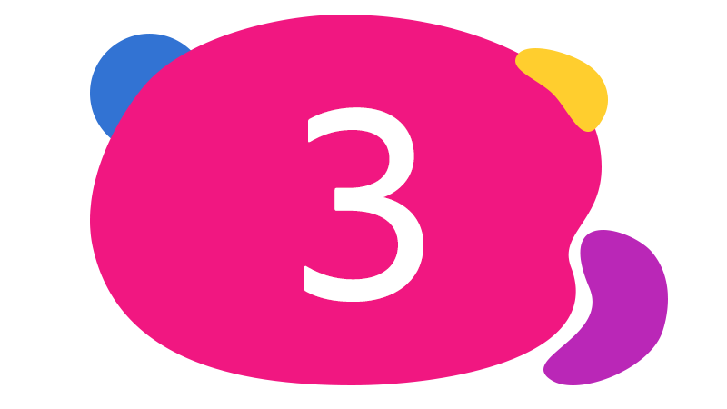
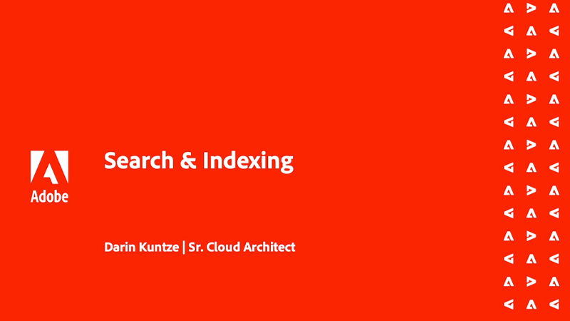

# Traversal-varningar

>[!TIP]
>Bokmärk den här sidan för framtida referens.

_Vad är genomgångsvarningar?_

Traversal-varningar är __aemerror__-loggsatser som anger att fel frågor körs i AEM Publish-tjänsten. Traversal-varningar visas vanligtvis i AEM på två sätt:

1. __Långsamma frågor__ som inte använder index, vilket ger långsamma svarstider.
1. __Misslyckade frågor__, som utlöser en `RuntimeNodeTraversalException`, vilket resulterar i en trasig upplevelse.

Om du tillåter att spårningsvarningar avmarkeras försämras AEM prestanda och kan resultera i trasiga upplevelser för dina användare.

## Lösa genomgångsvarningar

Du kan åtgärda genomgångsvarningar i tre enkla steg: analysera, justera och verifiera. Förvänta dig flera iterationer av justering och verifiering innan du identifierar de optimala justeringarna.

<div class="columns is-multiline">

<!-- Analyze -->
<div class="column is-half-tablet is-half-desktop is-one-third-widescreen" aria-label="Analyze" tabindex="0">
   <div class="x-card">
       <div class="card-image">
           <figure class="image is-16by9">
               <a href="#analyze" title="Analysera" tabindex="-1">
                   
               </a>
           </figure>
       </div>
       <div class="card-content is-padded-small">
           <div class="content">
                <p class="headline is-size-5 has-text-weight-bold">Analysera problemet</p>
               <p class="is-size-6">Identifiera och förstå vilka frågor som går igenom.</p>
               <a href="#analyze" class="spectrum-Button spectrum-Button--outline spectrum-Button--primary spectrum-Button--sizeM">
                   <span class="spectrum-Button-label has-no-wrap has-text-weight-bold"> Analysera </span>
               </a>
           </div>
       </div>
   </div>
</div>

<!-- Adjust -->
<div class="column is-half-tablet is-half-desktop is-one-third-widescreen" aria-label="Adjust" tabindex="0">
   <div class="x-card">
       <div class="card-image">
           <figure class="image is-16by9">
               <a href="#adjust" title="Justera" tabindex="-1">
                   
               </a>
           </figure>
       </div>
       <div class="card-content is-padded-small">
           <div class="content">
                <p class="headline is-size-5 has-text-weight-bold">Justera koden eller konfigurationen</p>
               <p class="is-size-6">Uppdatera frågor och index för att undvika frågematerial.</p>
               <a href="#adjust" class="spectrum-Button spectrum-Button--outline spectrum-Button--primary spectrum-Button--sizeM">
                   <span class="spectrum-Button-label has-no-wrap has-text-weight-bold">Justera</span>
               </a>
           </div>
       </div>
   </div>
</div>

<!-- Verify -->
<div class="column is-half-tablet is-half-desktop is-one-third-widescreen" aria-label="Verify" tabindex="0">
   <div class="x-card">
       <div class="card-image">
           <figure class="image is-16by9">
               <a href="#verify" title="Verifiera" tabindex="-1">
                   
               </a>
           </figure>
       </div>
       <div class="card-content is-padded-small">
           <div class="content">
                <p class="headline is-size-5 has-text-weight-bold">Verifiera justeringarna</p>                       
               <p class="is-size-6">Verifiera ändringar i frågor och index för att ta bort traversals.</p>
               <a href="#verify" class="spectrum-Button spectrum-Button--outline spectrum-Button--primary spectrum-Button--sizeM">
                   <span class="spectrum-Button-label has-no-wrap has-text-weight-bold">Verifiera</span>
               </a>
           </div>
       </div>
   </div>
</div>

</div>

## &#x200B;1. Analysera{#analyze}

Börja med att identifiera vilka AEM Publish-tjänster som har resvägsvarningar. Det gör du genom att [hämta `aemerror` loggar](https://experienceleague.adobe.com/docs/experience-manager-learn/cloud-service/debugging/debugging-aem-as-a-cloud-service/logs.html?lang=sv-SE#cloud-manager){target="_blank"} från Cloud Manager från alla miljöer (Dev, Stage och Production) de senaste __tre dagarna__.


Öppna loggfilerna och sök efter Java™-klassen `org.apache.jackrabbit.oak.plugins.index.Cursors$TraversingCursor`. Loggen som innehåller traversal-varningar innehåller en serie satser som ser ut ungefär som:

```log
24.05.2022 14:18:46.146 [cm-p123-e456-aem-author-9876-edcba] *WARN* [192.150.10.214 [1653401908419] GET /content/wknd/us/en/example.html HTTP/1.1] 
org.apache.jackrabbit.oak.plugins.index.Cursors$TraversingCursor Traversed 5000 nodes with filter 
Filter(query=select [jcr:path], [jcr:score], * from [nt:base] as a where [xyz] = 'abc' and isdescendantnode(a, '/content') 
/* xpath: /jcr:root/content//element(*, nt:base)[(@xyz = 'abc')] */, path=/content//*, property=[xyz=[abc]]) 
called by apps.wknd.components.search.example__002e__jsp._jspService; 
consider creating an index or changing the query
```

Beroende på sammanhanget för frågans körning kan loggsatserna innehålla användbar information om frågeförfattaren:

+ URL för HTTP-begäran som är associerad med frågekörning

   + Exempel: `GET /content/wknd/us/en/example.html HTTP/1.1`

+ Oak-frågesyntax

   + Exempel: `select [jcr:path], [jcr:score], * from [nt:base] as a where [xyz] = 'abc' and isdescendantnode(a, '/content')`

+ XPath-fråga

   + Exempel: `/jcr:root/content//element(*, nt:base)[(@xyz = 'abc')] */, path=/content//*, property=[xyz=[abc]])`

+ Kod som kör frågan

   + Exempel: `apps.wknd.components.search.example__002e__jsp._jspService` → `/apps/wknd/components/search/example.html`

__Misslyckade frågor__ följs upp av en `RuntimeNodeTraversalException`-sats, som liknar:

```log
24.05.2022 14:18:47.240 [cm-p123-e456-aem-author-9876-edcba] *WARN* [192.150.10.214 [1653401908419] GET /content/wknd/us/en/example.html HTTP/1.1] 
org.apache.jackrabbit.oak.query.FilterIterators The query read or traversed more than 100000 nodes.
org.apache.jackrabbit.oak.query.RuntimeNodeTraversalException: 
    The query read or traversed more than 100000 nodes. To avoid affecting other tasks, processing was stopped.
    ...
```

## &#x200B;2. Justera{#adjust}

När de felaktiga frågorna och deras anropande kod har identifierats måste justeringar göras. Det finns två typer av justeringar som kan användas för att minska genomströmningsvarningar:

### Justera frågan

__Ändra frågan__ om du vill lägga till nya frågebegränsningar som kan tolkas som befintliga indexbegränsningar. Om det är möjligt bör du helst ändra frågan till att ändra index.

+ [Lär dig att justera frågeprestanda](https://experienceleague.adobe.com/docs/experience-manager-65/developing/bestpractices/troubleshooting-slow-queries.html?lang=sv-SE#query-performance-tuning){target="_blank"}

### Justera indexvärdet

__Ändra (eller skapa) ett AEM-index__ så att befintliga frågebegränsningar kan matchas mot indexuppdateringarna.

+ [Lär dig hur du trimmar befintliga index](https://experienceleague.adobe.com/docs/experience-manager-65/developing/bestpractices/troubleshooting-slow-queries.html?lang=sv-SE#query-performance-tuning){target="_blank"}
+ [Lär dig skapa index](https://experienceleague.adobe.com/docs/experience-manager-65/developing/bestpractices/troubleshooting-slow-queries.html?lang=sv-SE#create-a-new-index){target="_blank"}

## &#x200B;3. Verifiera{#verify}

Justeringar av frågor, index eller båda måste verifieras för att säkerställa att de minskar varningarna.


Om bara [justeringar av frågan](#adjust-the-query) görs kan frågan testas direkt på AEM as a Cloud Service via Developer Console [Förklara fråga](https://experienceleague.adobe.com/docs/experience-manager-learn/cloud-service/debugging/debugging-aem-as-a-cloud-service/developer-console.html?lang=sv-SE#queries){target="_blank"}. Förklara fråga körs mot AEM Author-tjänsten, men eftersom indexdefinitionerna är desamma i alla Skapat av- och Publiceringstjänster räcker det att validera frågor mot AEM Author-tjänsten.

Om [ändringar görs i index](#adjust-the-index) måste indexet distribueras till AEM as a Cloud Service. När indexjusteringarna har distribuerats kan Developer Console [Förklara fråga](https://experienceleague.adobe.com/docs/experience-manager-learn/cloud-service/debugging/debugging-aem-as-a-cloud-service/developer-console.html?lang=sv-SE#queries){target="_blank"} användas för att köra och finjustera frågan ytterligare.

I slutänden genomförs alla ändringar (fråga och kod) i Git och distribueras till AEM as a Cloud Service med Cloud Manager. Testa kodsökvägarna som är kopplade till de ursprungliga genomgångsvarningarna och kontrollera att genomgångsvarningarna inte längre visas i `aemerror`-loggen när du distribuerat dem.

## Andra resurser

Här hittar du andra användbara resurser för att förstå AEM index, sökningar och varningar.

<div class="columns is-multiline">

<!-- Cloud 5 - Search &amp; Indexing -->
<div class="column is-half-tablet is-half-desktop is-one-third-widescreen" aria-label="Cloud 5 - Search &amp; Indexing" tabindex="0">
   <div class="card">
       <div class="card-image">
           <figure class="image is-16by9">
               <a href="https://experienceleague.adobe.com/docs/experience-manager-learn/cloud-service/expert-resources/cloud-5/cloud5-aem-search-and-indexing.html?lang=sv-SE" title="Cloud 5 - sökning och indexering" tabindex="-1"></a>
           </figure>
       </div>
       <div class="card-content is-padded-small">
           <div class="content">
               <p class="headline is-size-6 has-text-weight-bold"><a href="https://experienceleague.adobe.com/docs/experience-manager-learn/cloud-service/expert-resources/cloud-5/cloud5-aem-search-and-indexing.html?lang=sv-SE" title="Cloud 5 - sökning och indexering">Cloud 5 - sökning och indexering</a></p>
               <p class="is-size-6">I Cloud 5-teamet utforskas allt om sökning och indexering i AEM as a Cloud Service.</p>
               <a href="https://experienceleague.adobe.com/docs/experience-manager-learn/cloud-service/expert-resources/cloud-5/cloud5-aem-search-and-indexing.html?lang=sv-SE" class="spectrum-Button spectrum-Button--outline spectrum-Button--primary spectrum-Button--sizeM">
                   <span class="spectrum-Button-label has-no-wrap has-text-weight-bold">Läs mer</span>
               </a>
           </div>
       </div>
   </div>
</div>

<!-- Content Search and Indexing -->
<div class="column is-half-tablet is-half-desktop is-one-third-widescreen" aria-label="Content Search and Indexing
" tabindex="0">
   <div class="card">
       <div class="card-image">
           <figure class="image is-16by9">
               <a href="https://experienceleague.adobe.com/docs/experience-manager-cloud-service/content/operations/indexing.html?lang=sv-SE" title="Innehållssökning och indexering" tabindex="-1">
                   
               </a>
           </figure>
       </div>
       <div class="card-content is-padded-small">
           <div class="content">
               <p class="headline is-size-6 has-text-weight-bold"><a href="https://experienceleague.adobe.com/docs/experience-manager-cloud-service/content/operations/indexing.html?lang=sv-SE" title="Innehållssökning och indexering">Dokumentation för innehållssökning och indexering</a></p>
               <p class="is-size-6">Lär dig skapa och hantera index i AEM as a Cloud Service.</p>
               <a href="https://experienceleague.adobe.com/docs/experience-manager-cloud-service/content/operations/indexing.html?lang=sv-SE" class="spectrum-Button spectrum-Button--outline spectrum-Button--primary spectrum-Button--sizeM">
                   <span class="spectrum-Button-label has-no-wrap has-text-weight-bold">Läs mer</span>
               </a>
           </div>
       </div>
   </div>
</div>

<!-- Modernizing your Oak indexes -->
<div class="column is-half-tablet is-half-desktop is-one-third-widescreen" aria-label="Modernizing your Oak indexes" tabindex="0">
   <div class="card">
       <div class="card-image">
           <figure class="image is-16by9">
               <a href="https://experienceleague.adobe.com/docs/experience-manager-learn/cloud-service/migration/moving-to-aem-as-a-cloud-service/search-and-indexing.html?lang=sv-SE" title="Modernisera dina Oak-index" tabindex="-1">
                   
               </a>
           </figure>
       </div>
       <div class="card-content is-padded-small">
           <div class="content">
               <p class="headline is-size-6 has-text-weight-bold"><a href="https://experienceleague.adobe.com/docs/experience-manager-learn/cloud-service/migration/moving-to-aem-as-a-cloud-service/search-and-indexing.html?lang=sv-SE" title="Modernisera dina Oak-index">Modernisera dina Oak-index</a></p>
               <p class="is-size-6">Lär dig hur du konverterar AEM 6 Oak indexdefinitioner till AEM as a Cloud Service-kompatibla och behåller index som fortsätter framåt.</p>
               <a href="https://experienceleague.adobe.com/docs/experience-manager-learn/cloud-service/migration/moving-to-aem-as-a-cloud-service/search-and-indexing.html?lang=sv-SE" class="spectrum-Button spectrum-Button--outline spectrum-Button--primary spectrum-Button--sizeM">
                   <span class="spectrum-Button-label has-no-wrap has-text-weight-bold">Läs mer</span>
               </a>
           </div>
       </div>
   </div>
</div>

<!-- Index definition documentation -->
<div class="column is-half-tablet is-half-desktop is-one-third-widescreen" aria-label="Index definition documentation" tabindex="0">
   <div class="card">
       <div class="card-image">
           <figure class="image is-16by9">
               <a href="https://jackrabbit.apache.org/oak/docs/query/lucene.html" title="Dokumentation för indexdefinition" tabindex="-1">
                   
               </a>
           </figure>
       </div>
       <div class="card-content is-padded-small">
           <div class="content">
               <p class="headline is-size-6 has-text-weight-bold"><a href="https://jackrabbit.apache.org/oak/docs/query/lucene.html" title="Dokumentation för indexdefinition">Dokumentation för Lucene-index</a></p>
               <p class="has-ellipsis is-size-6">Indexreferensen för Apache Oak Jackrabbit Lucene som dokumenterar alla Lucene-indexkonfigurationer som stöds.</p>
               <a href="https://jackrabbit.apache.org/oak/docs/query/lucene.html" class="spectrum-Button spectrum-Button--outline spectrum-Button--primary spectrum-Button--sizeM">
                   <span class="spectrum-Button-label has-no-wrap has-text-weight-bold">Läs mer</span>
               </a>
           </div>
       </div>
   </div>
</div>

</div>
