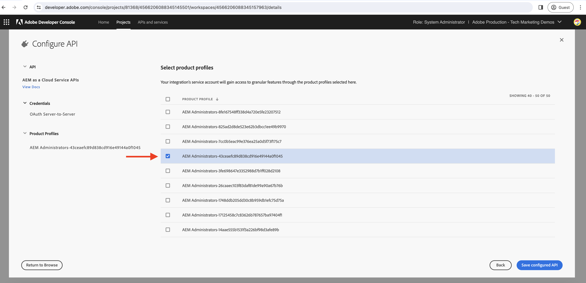

# Generera åtkomsttoken för server-till-server i App Builder-åtgärden

App Builder-åtgärder kan behöva interagera med Adobe API:er som stöder **OAuth Server-till-Server-autentiseringsuppgifter** och som är kopplade till Adobe Developer Console-projekt som App Builder-appen är distribuerad till.

I den här guiden beskrivs hur du skapar en åtkomsttoken med hjälp av _OAuth Server-to-Server-inloggningsuppgifter_ som kan användas i en App Builder-åtgärd.

>[!IMPORTANT]
>
> JWT-autentiseringsuppgifterna (Service Account) har ersatts med autentiseringsuppgifterna för OAuth Server-till-Server. Det finns dock fortfarande vissa Adobe-API:er som bara stöder JWT-referenser (Service Account) och migrering till OAuth Server-till-Server pågår. Läs Adobe API-dokumentationen för att ta reda på vilka autentiseringsuppgifter som stöds.

## Adobe Developer Console projektkonfigurationer

När du lägger till önskat Adobe-API i Adobe Developer Console-projektet väljer du autentiseringstypen **OAuth Server-till-Server** i steget _Konfigurera API_ .


Välj önskad produktprofil om du vill tilldela det ovan automatiskt skapade integrationstjänstkontot. Det innebär att tjänstkontots behörigheter styrs via produktprofilen.



## .env-fil

Lägg till anpassade nycklar för Adobe Developer Console-projektets OAuth Server-till-Server-autentiseringsuppgifter i App Builder-projektets `.env`-fil. Autentiseringsvärdena för OAuth Server-till-Server kan hämtas från Adobe Developer Console-projektets __Credentials__ > __OAuth Server-till-Server__ för en angiven arbetsyta.


```
...
OAUTHS2S_CLIENT_ID=58b23182d80a40fea8b12bc236d71167
OAUTHS2S_CLIENT_SECRET=p8e-EIRF6kY6EHLBSdw2b-pLUWKodDqJqSz3
OAUTHS2S_CECREDENTIALS_METASCOPES=AdobeID,openid,ab.manage,additional_info.projectedProductContext,read_organizations,read_profile,account_cluster.read
```

Värdena för `OAUTHS2S_CLIENT_ID`, `OAUTHS2S_CLIENT_SECRET`, `OAUTHS2S_CECREDENTIALS_METASCOPES` kan kopieras direkt från Adobe Developer Console-projektets inloggningsskärm OAuth Server-to-Server.

## Indatamappning

Med autentiseringsuppgiftsvärdet OAuth Server-to-Server angivet i filen `.env` måste de mappas till åtgärdsindata i AppBuilder så att de kan läsas i själva åtgärden. Det gör du genom att lägga till poster för varje variabel i `ext.config.yaml`-åtgärden `inputs` i formatet: `PARAMS_INPUT_NAME: $ENV_KEY`.

Till exempel:

```yaml
operations:
  view:
    - type: web
      impl: index.html
actions: actions
runtimeManifest:
  packages:
    dx-excshell-1:
      license: Apache-2.0
      actions:
        generic:
          function: actions/generic/index.js
          web: 'yes'
          runtime: nodejs:16
          inputs:
            LOG_LEVEL: debug
            OAUTHS2S_CLIENT_ID: $OAUTHS2S_CLIENT_ID
            OAUTHS2S_CLIENT_SECRET: $OAUTHS2S_CLIENT_SECRET
            OAUTHS2S_CECREDENTIALS_METASCOPES: $OAUTHS2S_CECREDENTIALS_METASCOPES
          annotations:
            require-adobe-auth: false
            final: true
```

Nycklarna som definieras under `inputs` är tillgängliga för objektet `params` som tillhandahålls för App Builder-åtgärden.

## OAuth Server-till-Server-autentiseringsuppgifter för att komma åt token

I App Builder-åtgärden är autentiseringsuppgifterna för OAuth Server-till-Server tillgängliga i objektet `params`. Med dessa autentiseringsuppgifter kan åtkomsttoken genereras med [OAuth 2.0-bibliotek](https://oauth.net/code/). Du kan också använda biblioteket [Nodhämtning](https://www.npmjs.com/package/node-fetch) för att göra en POST-begäran till Adobe IMS-tokenslutpunkten för att hämta åtkomsttoken.

I följande exempel visas hur du använder biblioteket `node-fetch` för att göra en POST-begäran till Adobe IMS-tokenslutpunkten för att hämta åtkomsttoken.

```javascript
const fetch = require("node-fetch");
const { Core } = require("@adobe/aio-sdk");
const { errorResponse, stringParameters, checkMissingRequestInputs } = require("../utils");

async function main(params) {
  const logger = Core.Logger("main", { level: params.LOG_LEVEL || "info" });

  try {
    // Perform any necessary input error checking
    const systemErrorMessage = checkMissingRequestInputs(params, ["OAUTHS2S_CLIENT_ID", "OAUTHS2S_CLIENT_SECRET", "OAUTHS2S_CECREDENTIALS_METASCOPES"], []);

    // The Adobe IMS token endpoint URL
    const adobeIMSV3TokenEndpointURL = 'https://ims-na1.adobelogin.com/ims/token/v3';

    // The POST request options
    const options = {
        method: 'POST',
        headers: {
        'Content-Type': 'application/x-www-form-urlencoded',
        },
        body: `grant_type=client_credentials&client_id=${params.OAUTHS2S_CLIENT_ID}&client_secret=${params.OAUTHS2S_CLIENT_SECRET}&scope=${params.OAUTHS2S_CECREDENTIALS_METASCOPES}`,
    };

    // Make a POST request to the Adobe IMS token endpoint to get the access token
    const tokenResponse = await fetch(adobeIMSV3TokenEndpointURL, options);
    const tokenResponseJSON = await tokenResponse.json();

    // The 24-hour IMS Access Token is used to call the AEM Data Service API
    // Can look at caching this token for 24 hours to reduce calls
    const accessToken = tokenResponseJSON.access_token;

    // Invoke an AEM Data Service API using the access token
    const aemDataResponse = await fetch(`https://api.adobeaemcloud.com/adobe/stats/statistics/contentRequestsQuota?imsOrgId=${IMS_ORG_ID}&current=true`, {
      headers: {
        'X-Adobe-Accept-Experimental': '1',
        'x-gw-ims-org-id': IMS_ORG_ID,
        'X-Api-Key': params.OAUTHS2S_CLIENT_ID,
        Authorization: `Bearer ${access_token}`, // The 24-hour IMS Access Token
      },
      method: "GET",
    });

    if (!aemDataResponse.ok) { throw new Error("Request to API failed with status code " + aemDataResponse.status);}

    // API data
    let data = await aemDataResponse.json();

    const response = {
      statusCode: 200,
      body: data,
    };

    return response;
  } catch (error) {
    logger.error(error);
    return errorResponse(500, "server error", logger);
  }
}

exports.main = main;
```
