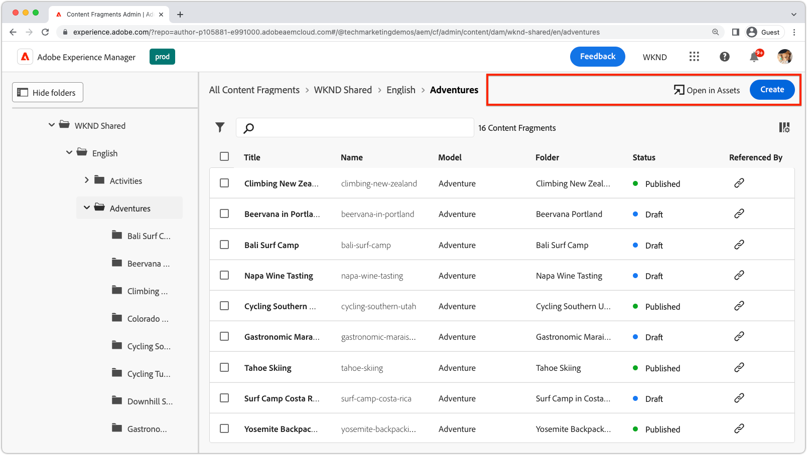
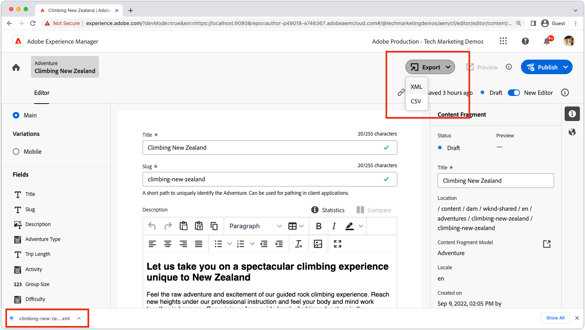

# AEM Content Fragments extensibility

Gränssnittet AEM innehållsfragment är ett kraftfullt, utbyggbart gränssnitt för att hantera, skapa, hantera och redigera innehållsfragment. Det finns flera tilläggspunkter som du kan använda för att anpassa användargränssnittet efter dina behov. Olika tilläggspunkter är tillgängliga, baserat på vilket gränssnitt du utökar.

## Tilläggspunkter för konsoltillägg för innehållsfragment

Content Fragment Console i AEM (Adobe Experience Manager) är ett användargränssnitt som är en central plats för hantering och organisering av innehållsfragment. Det innehåller en omfattande uppsättning verktyg och funktioner för att skapa, redigera, publicera och spåra innehållsfragment, vilket gör det möjligt för användare att effektivt hantera strukturerat innehåll över olika kanaler och kontaktytor.

[AEM Content Fragments Console](https://experienceleague.adobe.com/docs/experience-manager-cloud-service/content/sites/administering/content-fragments/content-fragments-console.html) är ett utbyggbart gränssnitt för att lista och hantera innehållsfragment. [AEM Content Fragment Console-tillägg skapas](https://developer.adobe.com/uix/docs/services/aem-cf-console-admin/code-generation) med `@adobe/aem-cf-admin-ui-ext-tpl` App Builder-mall.

Följande utökningspunkter för Content Fragments Console är tillgängliga:

      

        

          

            <figure class="image is-16by9">
              
            </figure>
          

          

            

              
<a href="https://developer.adobe.com/uix/docs/services/aem-cf-console-admin/api/action-bar/" title="Åtgärdsfält" target="_blank" rel="referrer">Åtgärdsfält</a>

              
Anpassa åtgärder för när en eller flera innehållsfragment är markerade.

              <a href="https://developer.adobe.com/uix/docs/services/aem-cf-console-admin/api/action-bar/" class="spectrum-Button spectrum-Button--outline spectrum-Button--primary spectrum-Button--sizeM" target="_blank" rel="referrer">
                Visa dokumenten
              </a>
            

          

        

      

  

    

      

        <figure class="image is-16by9">
          
        </figure>
      

      

        

          
<a href="https://developer.adobe.com/uix/docs/services/aem-cf-console-admin/api/grid-columns/" title="Stödrasterkolumner" target="_blank" rel="referrer">Stödrasterkolumner</a>

          
Anpassa de data som visas i listan Innehållsfragment.

          <a href="https://developer.adobe.com/uix/docs/services/aem-cf-console-admin/api/grid-columns/" class="spectrum-Button spectrum-Button--outline spectrum-Button--primary spectrum-Button--sizeM" target="_blank" rel="referrer">
            Visa dokumenten
          </a>
        

      

    

  

  

    

      

        <figure class="image is-16by9">
          
        </figure>
      

      

        

          
<a href="https://developer.adobe.com/uix/docs/services/aem-cf-console-admin/api/header-menu/" title="Sidhuvudsmenyn" target="_blank" rel="referrer">Sidhuvudsmenyn</a>

          
Anpassa åtgärder för när inga innehållsfragment är markerade.

          <a href="https://developer.adobe.com/uix/docs/services/aem-cf-console-admin/api/header-menu/" class="spectrum-Button spectrum-Button--outline spectrum-Button--primary spectrum-Button--sizeM" target="_blank" rel="referrer">
            Visa dokumenten
          </a>
        

      

    

  
  

## Tilläggspunkter för Content Fragments Editor

Innehållsfragmentsredigeraren i AEM (Adobe Experience Manager) är en användargränssnittskomponent som gör att användare kan skapa, redigera och hantera innehållsfragment. Det är en visuellt intuitiv och användarvänlig miljö för att arbeta med strukturerat innehåll, där användarna kan definiera och ordna innehållselement, använda mallar, hantera variationer och förhandsgranska hur innehållet ser ut i olika kanaler. Med Content Fragment Editor effektiviseras processen att skapa återanvändbart och modulärt innehåll som enkelt kan distribueras och publiceras i flera digitala upplevelser.

AEM Content Fragments Editor är ett utbyggbart gränssnitt för redigering av innehållsfragment. [AEM tillägg för innehållsfragmentredigeraren skapas](https://developer.adobe.com/uix/docs/services/aem-cf-editor/code-generation/) med `@adobe/aem-cf-editor-ui-ext-tpl` App Builder-mall.

Följande tilläggspunkter för Content Fragments Editor är tillgängliga:

    

      

        

          <figure class="image is-16by9">
            
          </figure>
        

        

          

            
<a href="https://developer.adobe.com/uix/docs/services/aem-cf-editor/api/header-menu/" title="Sidhuvudsmenyn" target="_blank" rel="referrer">Sidhuvudsmenyn</a>

            
Anpassa åtgärder på rubrikmenyn i Content Fragment Editor.

            <a href="https://developer.adobe.com/uix/docs/services/aem-cf-editor/api/header-menu" class="spectrum-Button spectrum-Button--outline spectrum-Button--primary spectrum-Button--sizeM" target="_blank" rel="referrer">
              Visa dokumenten
            </a>
          

        

      

    

  

    

      

        <figure class="image is-16by9">
          
        </figure>
      

      

        

          
<a href="https://developer.adobe.com/uix/docs/services/aem-cf-editor/api/rte-toolbar/" title="Verktygsfältet för textredigeraren"  target="_blank" rel="referrer">Verktygsfältet för textredigeraren</a>

          
Lägg till en anpassad knapp i RTE (Rich Text Editor) i Content Fragment Editor.

          <a href="https://developer.adobe.com/uix/docs/services/aem-cf-editor/api/rte-toolbar/" class="spectrum-Button spectrum-Button--outline spectrum-Button--primary spectrum-Button--sizeM" target="_blank" rel="referrer">
            Visa dokumenten
          </a>
        

      

    

  

    

      

        <figure class="image is-16by9">
          
        </figure>
      

      

        

          
<a href="https://developer.adobe.com/uix/docs/services/aem-cf-editor/api/rte-widgets/" title="RTF-redigeringswidgetar" target="_blank" rel="referrer">RTF-redigeringswidgetar</a>

          
Anpassa åtgärder i RTE som är bundna till tangenttryckningar.

          <a href="https://developer.adobe.com/uix/docs/services/aem-cf-editor/api/rte-widgets/" class="spectrum-Button spectrum-Button--outline spectrum-Button--primary spectrum-Button--sizeM" target="_blank" rel="referrer">
            Visa dokumenten
          </a>
        

      

    

  

  

    

      

        <figure class="image is-16by9">
          
        </figure>
      

      

        

          
<a href="https://developer.adobe.com/uix/docs/services/aem-cf-editor/api/rte-badges/ " title="Märken för textredigerare" target="_blank" rel="referrer">Märken för textredigerare</a>

          
Anpassa icke-redigerbara formaterade block inuti RTE.

          <a href="https://developer.adobe.com/uix/docs/services/aem-cf-editor/api/rte-badges/" class="spectrum-Button spectrum-Button--outline spectrum-Button--primary spectrum-Button--sizeM" target="_blank" rel="referrer">
            Visa dokumenten
          </a>
        

      

    

  

## Exempel på tillägg

Välkommen till en samling AEM exempel på utökningskod för användargränssnitt! Resursen är utformad för att ge dig praktiska demonstrationer och insikter om hur du utökar Adobe Experience Manager (AEM) användargränssnitt. Oavsett om du är utvecklare och vill förbättra funktionaliteten hos AEM kan dessa kodexempel vara en värdefull referens.

  

    

      

        <figure class="image is-16by9">
          
        </figure>
      

      

        

          
<a href="./examples/console-bulk-property-update.md" title="Uppdatering av massegenskap">Egenskapsuppdatering för massinnehåll</a>

          
Ett tillägg till åtgärdsfältet för Content Fragment Console med modal- och Adobe I/O Runtime-åtgärd.

          <a href="./examples/console-bulk-property-update.md" class="spectrum-Button spectrum-Button--outline spectrum-Button--primary spectrum-Button--sizeM">
            Visa exemplet
          </a>
        

      

    

  

  

        

            

                <figure class="image is-16by9">
                    
                </figure>
            

            

                

                    
<a href="./examples/console-image-generation-and-image-upload.md" title="OpenAI-baserad bildgenerering och överföring till AEM">Generering av OpenAPI-bilder</a>

                    
Utforska ett exempel på ett åtgärdsfälttillägg som genererar en bild med OpenAI, överför den till AEM och uppdaterar bildegenskapen för det valda innehållsfragmentet.

                    <a href="./examples/console-image-generation-and-image-upload.md" class="spectrum-Button spectrum-Button--outline spectrum-Button--primary spectrum-Button--sizeM">
                        Visa exemplet
                    </a>
                

            

        

    
    
  

    

      

        <figure class="image is-16by9">
          
        </figure>
      

      

        

          
<a href="./examples/custom-grid-columns.md" title="Anpassade kolumner">Anpassade kolumner</a>

          
Lägg till en anpassad kolumn i konsolen för innehållsfragment.

          <a href="./examples/custom-grid-columns.md" class="spectrum-Button spectrum-Button--outline spectrum-Button--primary spectrum-Button--sizeM">
            Visa exemplet
          </a>
        

      

    

  
    
  

    

      

        <figure class="image is-16by9">
          
        </figure>
      

      

        

          
<a href="./examples/editor-export-to-xml.md" title="Exportera till XML">Exportera till XML</a>

          
Exportera ett innehållsfragment som XML från Content Fragment Editor.

          <a href="./examples/editor-export-to-xml.md" class="spectrum-Button spectrum-Button--outline spectrum-Button--primary spectrum-Button--sizeM">
            Visa exemplet
          </a>
        

      

    

  
    
  

    

      

        <figure class="image is-16by9">
          
        </figure>
      

      

        

          
<a href="./examples/editor-rte-toolbar.md" title="RTF-redigerare (verktygsfältsknapp)">RTF-redigerare (verktygsfältsknapp)</a>

          
Lägg till anpassade verktygsfältsknappar i RTE-fält i Content Fragment Editor.

          <a href="./examples/editor-rte-toolbar.md" class="spectrum-Button spectrum-Button--outline spectrum-Button--primary spectrum-Button--sizeM">
            Visa exemplet
          </a>
        

      

    

  
   
  

    

      

        <figure class="image is-16by9">
          
        </figure>
      

      

        

          
<a href="./examples/editor-rte-toolbar.md" title="Widget för textredigeraren">Widget för textredigeraren</a>

          
Lägg till widgetar i RTF-redigeraren i Content Fragment Editor.

          <a href="./examples/editor-rte-widget.md" class="spectrum-Button spectrum-Button--outline spectrum-Button--primary spectrum-Button--sizeM">
            Visa exemplet
          </a>
        

      

    

  
   
  

    

      

        <figure class="image is-16by9">
          
        </figure>
      

      

        

          
<a href="./examples/editor-rte-badges.md" title="Rich Text Editor Badge">Rich Text Editor Badge</a>

          
Lägg till märken i RTF-redigeraren i Content Fragment Editor.

          <a href="./examples/editor-rte-badges.md" class="spectrum-Button spectrum-Button--outline spectrum-Button--primary spectrum-Button--sizeM">
            Visa exemplet
          </a>
        

      

    

  

    

      

        <figure class="image is-16by9">
          
        </figure>
      

      

        

          
<a href="./examples/editor-custom-field.md" title="Anpassade fält">Anpassade fält</a>

          
Skapa anpassade fält för innehållsfragment.

          <a href="./examples/editor-custom-field.md" class="spectrum-Button spectrum-Button--outline spectrum-Button--primary spectrum-Button--sizeM">
            Visa exemplet
          </a>
        

      

    

  
 

