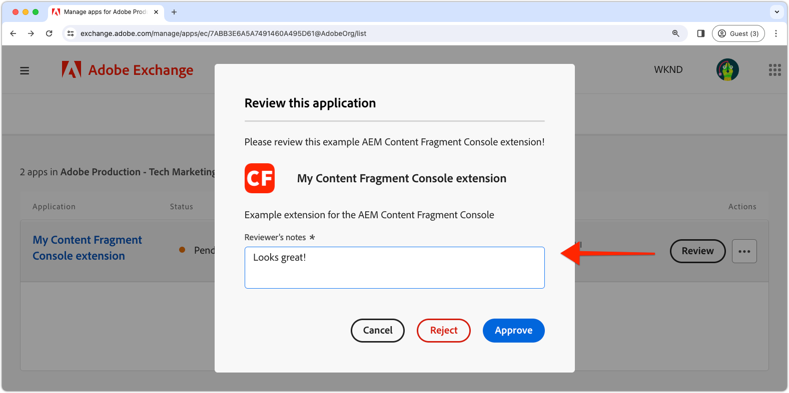

# Distribuera ett tillägg

För användning i AEM as a Cloud Service miljöer måste appen App Builder distribueras och godkännas.

{align="center"}

Det finns flera saker att tänka på när du distribuerar tillägg till App Builder-program:

+ Tillägg distribueras till projektarbetsytan i Adobe Developer Console. Standardarbetsytorna är:
   + __Produktion__ arbetsytan innehåller tilläggsdistributioner som är tillgängliga på alla AEM as a Cloud Service.
   + __Scen__ fungerar som en utvecklararbetsyta. Tillägg som distribueras till scenarbetsytan är inte tillgängliga i AEM as a Cloud Service.
Adobe Developer Console-arbetsytorna har ingen direkt korrelation med AEM as a Cloud Service miljötyper.
+ Ett tillägg som distribueras till arbetsytan Produktion visas i alla AEM as a Cloud Service miljöer i Adobe-organisationen som tillägget finns i.
Ett tillägg kan inte begränsas till de miljöer som det är registrerat med genom att lägga till [villkorlig logik som kontrollerar AEM as a Cloud Service värdnamnet](https://developer.adobe.com/uix/docs/guides/publication/#enabling-extension-only-on-specific-aem-environments).
+ Flera tillägg kan användas på AEM as a Cloud Service. Adobe rekommenderar att appen App Builder används för att uppnå ett enda affärsmål. En enda app i App Builder kan dock implementera flera tilläggspunkter som stöder ett gemensamt affärsmål.

## Inledande distribution

För att ett tillägg ska vara tillgängligt i AEM as a Cloud Service miljöer måste det distribueras till Adobe Developer Console.

Distributionsprocessen delas upp i två logiska steg:

1. Distribution av appen App Builder till Adobe Developer Console av en utvecklare.
1. Godkännande av tillägget av en driftsättningschef eller affärsägare.

### Distribuera tillägget

Distribuera tillägget till arbetsytan Produktion. Tillägg som distribueras till arbetsytan Produktion läggs automatiskt till i alla AEM as a Cloud Service redigeringstjänster i Adobe Org som tillägget distribueras till.

1. Öppna en kommandorad i roten för den uppdaterade appen App Builder.
1. Kontrollera att arbetsytan Produktion är aktiv

   ```shell
   $ aio app use -w Production
   ```

   Sammanfoga alla ändringar i `.env` och `.aio`.

1. Distribuera den uppdaterade appen App Builder.

   ```shell
   $ aio app deploy
   ```

#### Begär godkännande av distribution

{align="center"}

1. Logga in på [Adobe Developer Console](https://developer.adobe.com)
1. Välj __Konsol__
1. Navigera till __Projekt__
1. Välj det projekt som är associerat med tillägget
1. Välj __Produktion__ arbetsyta
1. Välj __Skicka för godkännande__
1. Fyll i och skicka formuläret och uppdatera fälten efter behov.

### Godkännande av distribution

{align="center"}

1. Logga in på [Adobe Exchange](https://exchange.adobe.com/)
2. Navigera till __Hantera__ > __Experience Cloud-program__
3. __Granska__ appen App Builder
4. Om tilläggets ändringar är godtagbara __Acceptera__ granskningen. Då läggs tillägget omedelbart in på alla AEM as a Cloud Service redigeringstjänster i Adobe Org.

När tilläggsbegäran har godkänts aktiveras tillägget omedelbart i AEM as a Cloud Service författartjänster.

## Uppdatera ett tillägg

Uppdatering och tillägg av appen App Builder följer samma process som [initial distribution](#initial-deployment), med avvikelsen att den befintliga tilläggsdistributionen först måste återkallas.

### Återkalla tillägget

Om du vill distribuera en ny version av ett tillägg måste det först återkallas (eller tas bort). Tillägget återkallas men är inte tillgängligt i AEM.

1. Logga in på [Adobe Exchange](https://exchange.adobe.com/)
1. Navigera till __Hantera__ > __Experience Cloud-program__
1. __Återkalla__ det tillägg som ska uppdateras

### Distribuera tillägget

Distribuera tillägget till arbetsytan Produktion. Tillägg som distribueras till arbetsytan Produktion läggs automatiskt till i alla AEM as a Cloud Service redigeringstjänster i Adobe Org som tillägget distribueras till.

1. Öppna en kommandorad i roten för den uppdaterade appen App Builder.
1. Kontrollera att arbetsytan Produktion är aktiv

   ```shell
   $ aio app use -w Production
   ```

   Sammanfoga alla ändringar i `.env` och `.aio`.

1. Distribuera den uppdaterade appen App Builder.

   ```shell
   $ aio app deploy
   ```

#### Begär godkännande av distribution

{align="center"}

1. Logga in på [Adobe Developer Console](https://developer.adobe.com)
1. Välj __Konsol__
1. Navigera till __Projekt__
1. Välj det projekt som är associerat med tillägget
1. Välj __Produktion__ arbetsyta
1. Välj __Skicka för godkännande__
1. Fyll i och skicka formuläret och uppdatera fälten efter behov.

#### Godkänn distributionsbegäran

{align="center"}

1. Logga in på [Adobe Exchange](https://exchange.adobe.com/)
1. Navigera till __Hantera__ > __Experience Cloud-program__
1. __Granska__ appen App Builder
1. Om tilläggets ändringar är godtagbara __Acceptera__ granskningen. Då läggs tillägget omedelbart in på alla AEM as a Cloud Service redigeringstjänster i Adobe Org.

När tilläggsbegäran har godkänts aktiveras tillägget omedelbart i AEM as a Cloud Service författartjänster.

## Ta bort ett tillägg


Om du vill ta bort ett tillägg återkallar (eller tar bort) du det från Adobe Exchange. När tillägget återkallas tas det bort från alla AEM as a Cloud Service redigeringstjänster.

1. Logga in på [Adobe Exchange](https://exchange.adobe.com/)
1. Navigera till __Hantera__ > __Experience Cloud-program__
1. __Återkalla__ tillägget som ska tas bort
