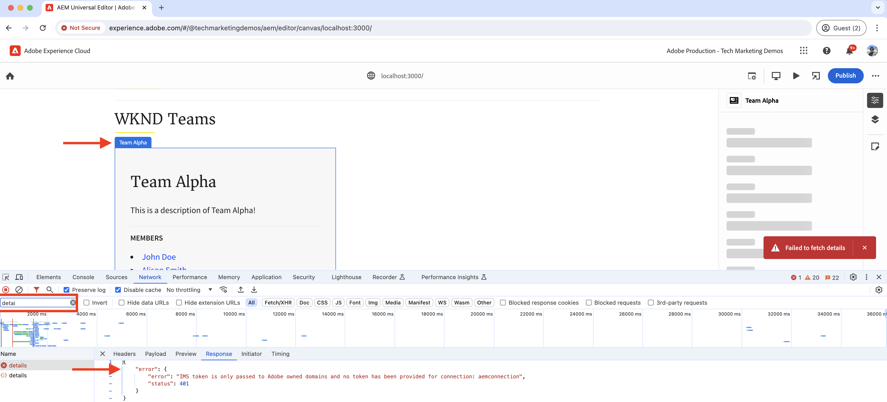
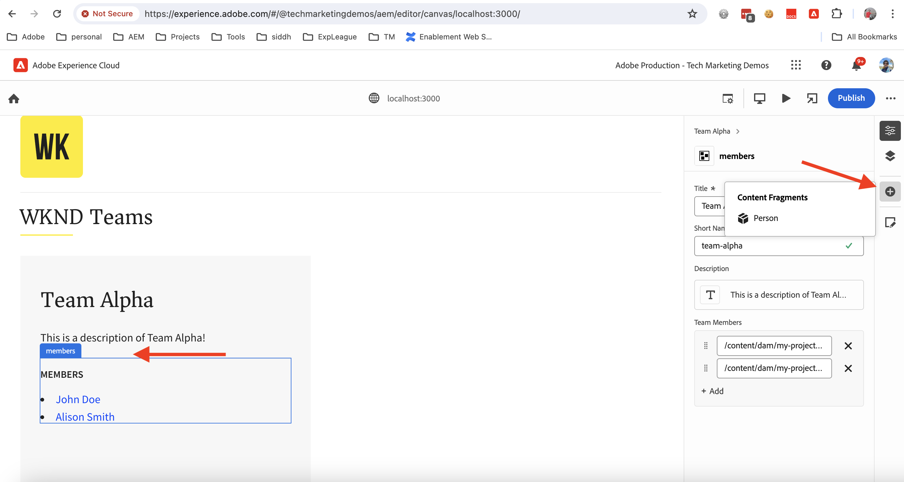

# Instrument React-app för att redigera innehåll med Universal Editor

Lär dig hur du instrumenterar React-appen för att redigera innehållet med Universal Editor.

## Förutsättningar

Du har konfigurerat den lokala utvecklingsmiljön enligt beskrivningen i det föregående [konfigurationssteget för lokal utveckling](./local-development-setup.md).

## Inkludera grundbiblioteket för Universal Editor

Vi börjar med att ta med huvudbiblioteket Universal Editor i appen WKND Teams React. Det är ett JavaScript-bibliotek som innehåller kommunikationslagret mellan den redigerade appen och den universella redigeraren.

Det finns två sätt att inkludera huvudbiblioteket Universal Editor i React-appen:

1. Nodmodulens beroende från nPM-registret finns i [@adobe/universal-editor-cors](https://www.npmjs.com/package/@adobe/universal-editor-cors).
1. Skripttagg (`<script>`) i HTML-filen.

I den här självstudiekursen ska vi använda metoden Script-tagg.

1. Installera paketet `react-helmet-async` om du vill hantera taggen `<script>` i React-appen.

   ```bash
   $ npm install react-helmet-async
   ```

1. Uppdatera filen `src/App.js` i WKND Teams React-appen så att den innehåller huvudbiblioteket för Universal Editor.

   ```javascript
   ...
   import { Helmet, HelmetProvider } from "react-helmet-async";
   
   function App() {
   return (
       <HelmetProvider>
           <div className="App">
               <Helmet>
                   {/* AEM Universal Editor :: CORE Library
                     Loads the LATEST Universal Editor library
                   */}
                   <script
                       src="https://universal-editor-service.adobe.io/cors.js"
                       async
                   />
               </Helmet>
               <Router>
                   <header>
                       <Link to={"/"}>
                       
                       </Link>
                       <hr />
                   </header>
                   <Routes>
                       <Route path="/" element={<Home />} />
                       <Route path="/person/:fullName" element={<Person />} />
                   </Routes>
               </Router>
           </div>
       </HelmetProvider>
   );
   }
   
   export default App;
   ```

## Lägg till metadata - innehållskälla

Om du vill ansluta appen _WKND Teams React med innehållskällan_ för redigering måste du ange anslutningsmetadata. Tjänsten Universal Editor använder dessa metadata för att upprätta en anslutning till innehållskällan.

Anslutningens metadata lagras som `<meta>`-taggar i HTML-filen. Syntaxen för anslutningsmetadata är följande:

```html
<meta name="urn:adobe:aue:<category>:<referenceName>" content="<protocol>:<url>">
```

Låt oss lägga till anslutningsmetadata i WKND Teams React-appen i komponenten `<Helmet>`. Uppdatera filen `src/App.js` med följande `<meta>`-tagg. I detta exempel är innehållskällan en lokal AEM-instans som körs på `https://localhost:8443`.

```javascript
...
function App() {
return (
    <HelmetProvider>
        <div className="App">
            <Helmet>
                {/* AEM Universal Editor :: CORE Library
                    Loads the LATEST Universal Editor library
                */}
                <script
                    src="https://universal-editor-service.adobe.io/cors.js"
                    async
                />
                {/* AEM Universal Editor :: Connection metadata 
                    Connects to local AEM instance
                */}
                <meta
                    name="urn:adobe:aue:system:aemconnection"
                    content={`aem:https://localhost:8443`}
                />
            </Helmet>
            ...
    </HelmetProvider>
);
}

export default App;
```

`aemconnection` innehåller ett kort namn på innehållskällan. Den efterföljande instrumenteringen använder det korta namnet för att referera till innehållskällan.

## Lägg till metadata - lokal konfiguration för Universal Editor-tjänsten

Istället för Adobe universella redigeringstjänst används en lokal kopia av den universella redigeringstjänsten för lokal utveckling. Den lokala tjänsten binder den universella redigeraren och AEM SDK, så vi lägger till den lokala tjänsten Universal Editor i appen WKND Teams React.

Dessa konfigurationsinställningar lagras också som `<meta>`-taggar i HTML-filen. Syntaxen för den lokala Universal Editor-tjänstens metadata är följande:

```html
<meta name="urn:adobe:aue:config:service" content="<url>">
```

Låt oss lägga till anslutningsmetadata i WKND Teams React-appen i komponenten `<Helmet>`. Uppdatera filen `src/App.js` med följande `<meta>`-tagg. I det här exemplet körs den lokala tjänsten Universal Editor på `https://localhost:8001`.

```javascript
...

function App() {
  return (
    <HelmetProvider>
      <div className="App">
        <Helmet>
          {/* AEM Universal Editor :: CORE Library
              Loads the LATEST Universal Editor library
          */}
          <script
            src="https://universal-editor-service.adobe.io/cors.js"
            async
          />
          {/* AEM Universal Editor :: Connection metadata 
              Connects to local AEM instance
          */}
          <meta
            name="urn:adobe:aue:system:aemconnection"
            content={`aem:https://localhost:8443`}
          />
          {/* AEM Universal Editor :: Configuration for Service
              Using locally running Universal Editor service
          */}
          <meta
            name="urn:adobe:aue:config:service"
            content={`https://localhost:8001`}
          />
        </Helmet>
        ...
    </HelmetProvider>
);
}
export default App;
```

## Instrument för React-komponenterna

Om du vill redigera innehållet i WKND Teams React-appen, t.ex. _teamets titel och teambeskrivning_, måste du mäta React-komponenterna. Instrumentationen innebär att relevanta dataattribut (`data-aue-*`) läggs till i de HTML-element som du vill göra ändringsbara med den universella redigeraren. Mer information om dataattribut finns i [Attribut och typer](https://experienceleague.adobe.com/en/docs/experience-manager-cloud-service/content/implementing/developing/universal-editor/attributes-types).

### Definiera redigerbara element

Vi börjar med att definiera elementen som du vill redigera med den universella redigeraren. I appen WKND Teams React lagras teamets titel och beskrivning i teamets innehållsfragment i AEM, vilket är de bästa kandidaterna för redigering.

Låt oss instrumentera komponenten `Teams` React för att göra teamets titel och beskrivning redigerbar.

1. Öppna filen `src/components/Teams.js` i appen WKND Teams React.
1. Lägg till attributet `data-aue-prop`, `data-aue-type` och `data-aue-label` i teamets rubrik- och beskrivningselement.

   ```javascript
   ...
   function Teams() {
       const { teams, error } = useAllTeams();
       ...
   
       return (
           <div className="team">
               // AEM Universal Editor :: Instrumentation using data-aue-* attributes
               <h2 className="team__title" data-aue-prop="title" data-aue-type="text" data-aue-label="title">{title}</h2>
               <p className="team__description" data-aue-prop="description" data-aue-type="richtext" data-aue-label="description">{description.plaintext}</p>
               ...
           </div>
       );
   }
   
   export default Teams;
   ```

1. Uppdatera sidan Universal Editor i webbläsaren som läser in appen WKND Teams React. Nu kan du se att teamets titel- och beskrivningselement är redigerbara.

   

1. Om du försöker redigera teamets titel eller beskrivning med hjälp av infogad redigering eller egenskapsfältet visas en inläsningsrotationsruta, men du kan inte redigera innehållet. Eftersom den universella redigeraren inte känner till AEM resursinformation för att läsa in och spara innehållet.

   

Sammanfattningsvis markerar ändringarna ovan teamets titel- och beskrivningselement som redigerbara i den universella redigeraren. **Du kan dock inte redigera (via intern- eller egenskapsfältet) och spara ändringarna än**. Därför måste du lägga till AEM-resursinformation med attributet `data-aue-resource`. Låt oss göra det i nästa steg.

### Definiera resursinformation för AEM

Om du vill spara det redigerade innehållet till AEM och även läsa in innehållet i egenskapsfältet måste du ange AEM resursinformation till den universella redigeraren.

I det här fallet är AEM-resursen sökvägen för teaminnehållsfragment, så vi lägger till resursinformationen i `Teams`-komponenten på den översta `<div>` -elementet.

1. Uppdatera filen `src/components/Teams.js` om du vill lägga till attributen `data-aue-resource`, `data-aue-type` och `data-aue-label` i elementet på den översta nivån `<div>`.

   ```javascript
   ...
   function Teams() {
       const { teams, error } = useAllTeams();
       ...
   
       // Render single Team
       function Team({ _path, title, shortName, description, teamMembers }) {
           // Must have title, shortName and at least 1 team member
           if (!_path || !title || !shortName || !teamMembers) {
               return null;
           }
   
         return (
           // AEM Universal Editor :: Instrumentation using data-aue-* attributes
           <div className="team" data-aue-resource={`urn:aemconnection:${_path}/jcr:content/data/master`} data-aue-type="reference" data-aue-label={title}>
           ...
           </div>
       );
       }
   }
   export default Teams;
   ```

   Värdet för attributet `data-aue-resource` är AEM-resurssökvägen för teaminnehållsfragmentet. Prefixet `urn:aemconnection:` använder det korta namnet på innehållskällan som definieras i anslutningsmetadata.

1. Uppdatera sidan Universal Editor i webbläsaren som läser in appen WKND Teams React. Du kan nu se att det översta teamelementet är redigerbart, men egenskapsfältet läser fortfarande inte in innehållet. På webbläsarens nätverksflik kan du se felet 401 Obehörig för den `details`-begäran som läser in innehållet. Den försöker använda IMS-token för autentisering, men den lokala AEM SDK stöder inte IMS-autentisering.

   

1. Om du vill åtgärda det obehöriga felet 401 måste du ange den lokala autentiseringsinformationen för AEM SDK till den universella redigeraren med alternativet **Autentiseringsrubriker** i den universella redigeraren. Som lokal AEM SDK anger du värdet `Basic YWRtaW46YWRtaW4=` för `admin:admin`-autentiseringsuppgifter.

   

1. Uppdatera sidan Universal Editor i webbläsaren som läser in appen WKND Teams React. Du kan nu se att egenskapsfältet läser in innehållet och du kan redigera teamtiteln och beskrivningen inline eller använda egenskapsfältet.

   

#### Under huven

Egenskapslisten läser in innehåll från AEM-resursen med hjälp av den lokala tjänsten Universella redigerare. Med hjälp av webbläsarens nätverksflik kan du se POST-begäran till den lokala Universal Editor-tjänsten (`https://localhost:8001/details`) för inläsning av innehållet.

När du redigerar innehållet med hjälp av den infogade redigerings- eller egenskapslisten sparas ändringarna tillbaka till AEM-resursen med hjälp av den lokala universella redigeringstjänsten. På webbläsarens nätverksflik kan du se POST-begäran till den lokala Universal Editor-tjänsten (`https://localhost:8001/update` eller `https://localhost:8001/patch`) för att spara innehållet.


JSON-objektet för nyttolast för begäran innehåller nödvändig information som innehållsservern (`connections`), resurssökvägen (`target`) och det uppdaterade innehållet (`patch`).


### Expandera det redigerbara innehållet

Låt oss expandera det redigerbara innehållet och tillämpa instrumenteringen på **teammedlemmarna** så att du kan redigera teammedlemmarna med egenskapsfältet.

Som ovan kan vi lägga till de relevanta `data-aue-*`-attributen till teammedlemmarna i komponenten `Teams` React.

1. Uppdatera filen `src/components/Teams.js` om du vill lägga till dataattribut i elementet `<li key={index} className="team__member">`.

   ```javascript
   ...
   function Teams() {
       const { teams, error } = useAllTeams();
       ...
   
       <div>
           <h4 className="team__members-title">Members</h4>
           <ul className="team__members">
               {/* Render the referenced Person models associated with the team */}
               {teamMembers.map((teamMember, index) => {
                   return (
                       // AEM Universal Editor :: Instrumentation using data-aue-* attributes
                       <li key={index} className="team__member" data-aue-resource={`urn:aemconnection:${teamMember?._path}/jcr:content/data/master`} data-aue-type="component" data-aue-label={teamMember.fullName}>
                       <Link to={`/person/${teamMember.fullName}`}>
                           {teamMember.fullName}
                       </Link>
                       </li>
                   );
               })}
           </ul>
       </div>
       ...
   }
   export default Teams;
   ```

   Värdet för attributet `data-aue-type` är `component` eftersom teammedlemmarna lagras som `Person` innehållsfragment i AEM och hjälper till att indikera flyttbara/borttagbara delar av innehållet.

1. Uppdatera sidan Universal Editor i webbläsaren som läser in appen WKND Teams React. Nu kan du se att teammedlemmarna kan redigeras med egenskapsfältet.

   

#### Under huven

Precis som ovan hämtas och sparas innehåll av den lokala tjänsten Universal Editor. `/details`-, `/update`- eller `/patch`-begäranden görs till den lokala tjänsten Universal Editor för att läsa in och spara innehållet.

### Definiera tillägg och borttagning av innehåll

Hittills har du gjort det befintliga innehållet redigerbart, men vad gör du om du vill lägga till nytt innehåll? Låt oss lägga till eller ta bort teammedlemmar i WKND-teamet med den universella redigeraren. Innehållsförfattarna behöver alltså inte gå till AEM för att lägga till eller ta bort teammedlemmar.

Men som en snabb sammanfattning lagras WKND-teammedlemmarna som `Person`-innehållsfragment i AEM och är associerade med teaminnehållsfragmentet med egenskapen `teamMembers`. Om du vill granska modelldefinitionen i AEM går du till [mitt projekt](http://localhost:4502/libs/dam/cfm/models/console/content/models.html/conf/my-project).

1. Skapa först komponentdefinitionsfilen `/public/static/component-definition.json`. Den här filen innehåller komponentdefinitionen för innehållsavsnittet `Person`. Med plugin-programmet `aem/cf` kan du infoga innehållsfragment baserat på en modell och en mall som innehåller de standardvärden som ska användas.

   ```json
   {
       "groups": [
           {
           "title": "Content Fragments",
           "id": "content-fragments",
           "components": [
               {
               "title": "Person",
               "id": "person",
               "plugins": {
                   "aem": {
                       "cf": {
                           "name": "person",
                           "cfModel": "/conf/my-project/settings/dam/cfm/models/person",
                           "cfFolder": "/content/dam/my-project/en",
                           "title": "person",
                           "template": {
                               "fullName": "New Person",
                               "biographyText": "This is biography of new person"
                               }
                           }
                       }
                   }
               }
           ]
           }
       ]
   }
   ```

1. Se sedan komponentdefinitionsfilen i `index.html` i WKND Team React App. Uppdatera `public/index.html`-avsnittet för filen `<head>` så att den innehåller komponentdefinitionsfilen.

   ```html
   ...
   <script
       type="application/vnd.adobe.aue.component+json"
       src="/static/component-definition.json"
   ></script>
   <title>WKND App - Basic GraphQL Tutorial</title>
   </head>
   ...
   ```

1. Uppdatera slutligen filen `src/components/Teams.js` om du vill lägga till dataattribut. Avsnittet **MEDLEMMAR** som fungerar som en behållare för gruppmedlemmarna. Vi lägger till attributen `data-aue-prop`, `data-aue-type` och `data-aue-label` i elementet `<div>`.

   ```javascript
   ...
   function Teams() {
       const { teams, error } = useAllTeams();
       ...
   
       {/* AEM Universal Editor :: Team Members as container */}
       <div data-aue-prop="teamMembers" data-aue-type="container" data-aue-label="members">
           <h4 className="team__members-title">Members</h4>
           <ul className="team__members">
           {/* Render the referenced Person models associated with the team */}
           {teamMembers.map((teamMember, index) => {
               return (
               // AEM Universal Editor :: Instrumentation using data-aue-* attributes
               <li key={index} className="team__member" data-aue-resource={`urn:aemconnection:${teamMember?._path}/jcr:content/data/master`} data-aue-type="component" data-aue-label={teamMember.fullName}>
                   <Link to={`/person/${teamMember.fullName}`}>
                   {teamMember.fullName}
                   </Link>
               </li>
               );
           })}
           </ul>
       </div>
       ...
   }
   export default Teams;
   ```

1. Uppdatera sidan Universal Editor i webbläsaren som läser in appen WKND Teams React. Du kan nu se att avsnittet **MEDLEMMAR** fungerar som en behållare. Du kan infoga nya teammedlemmar med hjälp av egenskapsfältet och ikonen **+** .

   

1. Om du vill ta bort en teammedlem markerar du teammedlemmen och klickar på ikonen **Ta bort** .

   

#### Under huven

Åtgärder för att lägga till och ta bort innehåll utförs av den lokala tjänsten Universell redigerare. POST-begäran till `/add` eller `/remove` med en detaljerad nyttolast görs till den lokala Universal Editor-tjänsten för att lägga till eller ta bort innehåll i AEM.

## Lösningsfiler

Om du vill verifiera implementeringsändringarna eller om du inte kan få WKND Teams React-appen att fungera med Universal Editor läser du [lösningsgrenen ](https://github.com/adobe/aem-guides-wknd-graphql/tree/solution/basic-tutorial-instrumented-for-UE) som bygger på grundläggande självstudiekurser för UE.

Fil-för-fil-jämförelse med den **grundläggande självstudiekursen** som fungerar finns [här](https://github.com/adobe/aem-guides-wknd-graphql/compare/solution/basic-tutorial...solution/basic-tutorial-instrumented-for-UE?expand=1).

## Grattis

Du har nu instrumenterat WKND Teams React-appen för att lägga till, redigera och ta bort innehållet med den universella redigeraren. Du har lärt dig att ta med huvudbiblioteket, lägga till anslutning och metadata för den lokala tjänsten Universal Editor och instrumentera komponenten React med olika dataattribut (`data-aue-*`).
