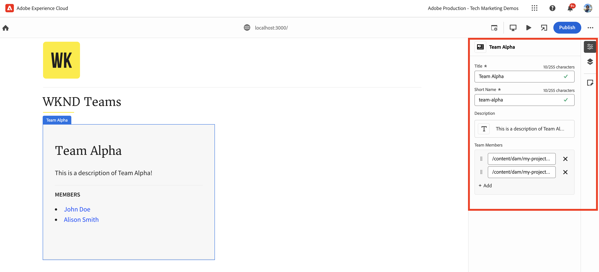
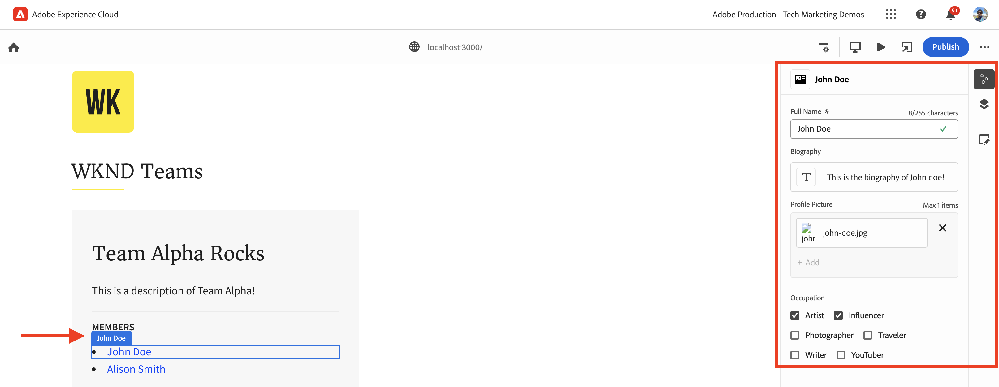

# Instrument React-app för att redigera innehåll med Universal Editor

Lär dig hur du instrumenterar React-appen för att redigera innehållet med Universal Editor.

## Förutsättningar

Du har konfigurerat den lokala utvecklingsmiljön enligt beskrivningen i föregående [Lokal utvecklingskonfiguration](./local-development-setup.md) steg.

## Inkludera grundbiblioteket för Universal Editor

Vi börjar med att ta med huvudbiblioteket Universal Editor i appen WKND Teams React. Det är ett JavaScript-bibliotek som innehåller kommunikationslagret mellan den redigerade appen och den universella redigeraren.

Det finns två sätt att inkludera huvudbiblioteket Universal Editor i React-appen:

1. Nodmodulens beroende från npm-registret finns i [@adobe/universal-editor-cors](https://www.npmjs.com/package/@adobe/universal-editor-cors).
1. Script-tagg (`<script>`) i filen HTML.

I den här självstudiekursen ska vi använda metoden Script-tagg.

1. Installera `react-helmet-async` paket för att hantera `<script>` i React-appen.

   ```bash
   $ npm install react-helmet-async
   ```

1. Uppdatera `src/App.js` filen i WKND Teams React-appen som ska innehålla Universal Editor Core-biblioteket.

   ```javascript
   ...
   import { Helmet, HelmetProvider } from "react-helmet-async";
   
   function App() {
   return (
       <HelmetProvider>
           <div className="App">
               <Helmet>
                   {/* AEM Universal Editor :: CORE Library
                     Loads the LATEST Universal Editor library
                   */}
                   <script
                       src="https://universal-editor-service.experiencecloud.live/corslib/LATEST"
                       async
                   />
               </Helmet>
               <Router>
                   <header>
                       <Link to={"/"}>
                       
                       </Link>
                       <hr />
                   </header>
                   <Routes>
                       <Route path="/" element={<Home />} />
                       <Route path="/person/:fullName" element={<Person />} />
                   </Routes>
               </Router>
           </div>
       </HelmetProvider>
   );
   }
   
   export default App;
   ```

## Lägg till metadata - innehållskälla

Ansluta appen WKND Teams React _med innehållskällan_ för redigering måste du ange anslutningsmetadata. Tjänsten Universal Editor använder dessa metadata för att upprätta en anslutning till innehållskällan.

Anslutningens metadata lagras som `<meta>` -taggar i filen HTML. Syntaxen för anslutningsmetadata är följande:

```html
<meta name="urn:adobe:aue:<category>:<referenceName>" content="<protocol>:<url>">
```

Låt oss lägga till anslutningsmetadata i appen WKND Teams React i `<Helmet>` -komponenten. Uppdatera `src/App.js` med följande `<meta>` -tagg. I det här exemplet är innehållskällan en lokal AEM som körs på `https://localhost:8443`.

```javascript
...
function App() {
return (
    <HelmetProvider>
        <div className="App">
            <Helmet>
                {/* AEM Universal Editor :: CORE Library
                    Loads the LATEST Universal Editor library
                */}
                <script
                    src="https://universal-editor-service.experiencecloud.live/corslib/LATEST"
                    async
                />
                {/* AEM Universal Editor :: Connection metadata 
                    Connects to local AEM instance
                */}
                <meta
                    name="urn:adobe:aue:system:aemconnection"
                    content={`aem:https://localhost:8443`}
                />
            </Helmet>
            ...
    </HelmetProvider>
);
}

export default App;
```

The `aemconnection` innehåller ett kort namn på innehållskällan. Den efterföljande instrumenteringen använder det korta namnet för att referera till innehållskällan.

## Lägg till metadata - lokal konfiguration för Universal Editor-tjänsten

I stället för den universella redigeringstjänsten som finns på Adobe används en lokal kopia av den universella redigeringstjänsten för lokal utveckling. Den lokala tjänsten binder Universal Editor och AEM SDK, så vi lägger till den lokala Universal Editor-tjänstens metadata i WKND Teams React-appen.

Dessa konfigurationsinställningar lagras också som `<meta>` -taggar i filen HTML. Syntaxen för den lokala Universal Editor-tjänstens metadata är följande:

```html
<meta name="urn:adobe:aue:config:service" content="<url>">
```

Låt oss lägga till anslutningsmetadata i appen WKND Teams React i `<Helmet>` -komponenten. Uppdatera `src/App.js` med följande `<meta>` -tagg. I det här exemplet körs den lokala tjänsten Universal Editor på `https://localhost:8001`.

```javascript
...

function App() {
  return (
    <HelmetProvider>
      <div className="App">
        <Helmet>
          {/* AEM Universal Editor :: CORE Library
              Loads the LATEST Universal Editor library
          */}
          <script
            src="https://universal-editor-service.experiencecloud.live/corslib/LATEST"
            async
          />
          {/* AEM Universal Editor :: Connection metadata 
              Connects to local AEM instance
          */}
          <meta
            name="urn:adobe:aue:system:aemconnection"
            content={`aem:https://localhost:8443`}
          />
          {/* AEM Universal Editor :: Configuration for Service
              Using locally running Universal Editor service
          */}
          <meta
            name="urn:adobe:aue:config:service"
            content={`https://localhost:8001`}
          />
        </Helmet>
        ...
    </HelmetProvider>
);
}
export default App;
```

## Instrument för React-komponenterna

Redigera innehållet i WKND Teams React-appen, till exempel _teamets titel och teambeskrivning_ måste du mäta Reaktionskomponenterna. Instrumentet innebär att man lägger till relevanta dataattribut (`data-aue-*`) till de element i HTML som du vill göra redigerbara med den universella redigeraren. Mer information om dataattribut finns i [Attribut och typer](https://experienceleague.adobe.com/en/docs/experience-manager-cloud-service/content/implementing/developing/universal-editor/attributes-types).

### Definiera redigerbara element

Vi börjar med att definiera elementen som du vill redigera med den universella redigeraren. I appen WKND Teams React lagras teamets titel och beskrivning i teamets innehållsfragment i AEM, vilket är de bästa kandidaterna för redigering.

Låt oss instrumentera `Teams` Reagera-komponent för att göra teamets titel och beskrivning redigerbar.

1. Öppna `src/components/Teams.js` filen i appen WKND Teams React.
1. Lägg till `data-aue-prop`, `data-aue-type` och `data-aue-label` attribut till teamets titel- och beskrivningselement.

   ```javascript
   ...
   function Teams() {
       const { teams, error } = useAllTeams();
       ...
   
       return (
           <div className="team">
               // AEM Universal Editor :: Instrumentation using data-aue-* attributes
               <h2 className="team__title" data-aue-prop="title" data-aue-type="text" data-aue-label="title">{title}</h2>
               <p className="team__description" data-aue-prop="description" data-aue-type="richtext" data-aue-label="description">{description.plaintext}</p>
               ...
           </div>
       );
   }
   
   export default Teams;
   ```

1. Uppdatera sidan Universal Editor i webbläsaren som läser in appen WKND Teams React. Nu kan du se att teamets titel- och beskrivningselement är redigerbara.

   

1. Om du försöker redigera teamets titel eller beskrivning med hjälp av infogad redigering eller egenskapsfältet visas en inläsningsrotationsruta, men du kan inte redigera innehållet. Eftersom den universella redigeraren inte känner till AEM resursinformation för att läsa in och spara innehållet.

   

Sammanfattningsvis markerar ändringarna ovan teamets titel- och beskrivningselement som redigerbara i den universella redigeraren. Men **du inte kan redigera (via intern- eller egenskapsfältet) och spara ändringarna än** så att du måste lägga till AEM resursinformation med `data-aue-resource` -attribut. Låt oss göra det i nästa steg.

### Definiera AEM resursinformation

Om du vill spara tillbaka det redigerade innehållet till AEM och även läsa in innehållet i egenskapsfältet måste du ange AEM resursinformation till den universella redigeraren.

I det här fallet är den AEM resursen sökvägen för teaminnehållsfragment, så vi lägger till resursinformationen i `Teams` Reaktionskomponent på översta nivån `<div>` -element.

1. Uppdatera `src/components/Teams.js` filen som ska läggas till `data-aue-resource`, `data-aue-type` och `data-aue-label` attribut till den översta nivån `<div>` -element.

   ```javascript
   ...
   function Teams() {
       const { teams, error } = useAllTeams();
       ...
   
       // Render single Team
       function Team({ _path, title, shortName, description, teamMembers }) {
           // Must have title, shortName and at least 1 team member
           if (!_path || !title || !shortName || !teamMembers) {
               return null;
           }
   
         return (
           // AEM Universal Editor :: Instrumentation using data-aue-* attributes
           <div className="team" data-aue-resource={`urn:aemconnection:${_path}/jcr:content/data/master`} data-aue-type="reference" data-aue-label={title}>
           ...
           </div>
       );
       }
   }
   export default Teams;
   ```

   Värdet för `data-aue-resource` är AEM resurssökväg för teaminnehållsfragmentet. The `urn:aemconnection:` -prefixet använder det korta namnet på innehållskällan som definieras i anslutningsmetadata.

1. Uppdatera sidan Universal Editor i webbläsaren som läser in appen WKND Teams React. Du kan nu se att det översta teamelementet är redigerbart, men egenskapsfältet läser fortfarande inte in innehållet. På webbläsarens nätverksflik visas felmeddelandet 401 Unauthorized för `details` som läser in innehållet. Det försöker använda IMS-token för autentisering, men den lokala AEM SDK saknar stöd för IMS-autentisering.

   

1. Om du vill åtgärda det obehöriga felet 401 måste du ange den lokala AEM SDK-autentiseringsinformationen till den universella redigeraren med **Autentiseringsrubriker** i Universal Editor. Ange värdet som lokal AEM SDK `Basic YWRtaW46YWRtaW4=` for `admin:admin` autentiseringsuppgifter.

   

1. Uppdatera sidan Universal Editor i webbläsaren som läser in appen WKND Teams React. Du kan nu se att egenskapsfältet läser in innehållet och du kan redigera teamtiteln och beskrivningen inline eller använda egenskapsfältet.

   

#### Under huven

Egenskapsfältet läser in innehållet från AEM med hjälp av den lokala tjänsten Universal Editor. På webbläsarens nätverksflik kan du se POSTENS begäran till den lokala tjänsten Universal Editor (`https://localhost:8001/details`) för att läsa in innehållet.

När du redigerar innehållet med hjälp av den infogade redigerings- eller egenskapslisten sparas ändringarna i den AEM resursen med hjälp av den lokala tjänsten Universell redigerare. På webbläsarens nätverksflik kan du se POSTENS begäran till den lokala tjänsten Universal Editor (`https://localhost:8001/update` eller `https://localhost:8001/patch`) för att spara innehållet.


JSON-objektet för nyttolast för begäran innehåller nödvändig information, t.ex. innehållsservern (`connections`), resurssökväg (`target`) och det uppdaterade innehållet (`patch`).


### Expandera det redigerbara innehållet

Låt oss expandera det redigerbara innehållet och använda instrumenteringen på **teammedlemmar** så att du kan redigera teammedlemmarna med hjälp av egenskapsfältet.

Som ovan kan vi lägga till de relevanta `data-aue-*` attribut till teammedlemmarna i `Teams` Reaktionskomponent.

1. Uppdatera `src/components/Teams.js` fil för att lägga till dataattribut i `<li key={index} className="team__member">` -element.

   ```javascript
   ...
   function Teams() {
       const { teams, error } = useAllTeams();
       ...
   
       <div>
           <h4 className="team__members-title">Members</h4>
           <ul className="team__members">
               {/* Render the referenced Person models associated with the team */}
               {teamMembers.map((teamMember, index) => {
                   return (
                       // AEM Universal Editor :: Instrumentation using data-aue-* attributes
                       <li key={index} className="team__member" data-aue-resource={`urn:aemconnection:${teamMember?._path}/jcr:content/data/master`} data-aue-type="component" data-aue-label={teamMember.fullName}>
                       <Link to={`/person/${teamMember.fullName}`}>
                           {teamMember.fullName}
                       </Link>
                       </li>
                   );
               })}
           </ul>
       </div>
       ...
   }
   export default Teams;
   ```

   Värdet för `data-aue-type` attributet är `component` som teammedlemmarna lagras som `Person` Innehållsfragment i AEM och hjälper till att ange de flyttbara/borttagbara delarna av innehållet.

1. Uppdatera sidan Universal Editor i webbläsaren som läser in appen WKND Teams React. Nu kan du se att teammedlemmarna kan redigeras med egenskapsfältet.

   

#### Under huven

Precis som ovan hämtas och sparas innehåll av den lokala tjänsten Universal Editor. The `/details`, `/update` eller `/patch` begär att få läsa in och spara innehållet i den lokala Universal Editor-tjänsten.

### Definiera tillägg och borttagning av innehåll

Hittills har du gjort det befintliga innehållet redigerbart, men vad gör du om du vill lägga till nytt innehåll? Låt oss lägga till eller ta bort teammedlemmar i WKND-teamet med den universella redigeraren. Innehållsförfattarna behöver alltså inte gå till AEM för att lägga till eller ta bort teammedlemmar.

Men som en snabb sammanfattning lagras WKND-teammedlemmarna som `Person` Innehållsfragment i AEM och är kopplade till teaminnehållsfragment med hjälp av `teamMembers` -egenskap. Om du vill granska modelldefinitionen i AEM går du till [mitt projekt](http://localhost:4502/libs/dam/cfm/models/console/content/models.html/conf/my-project).

1. Skapa först komponentdefinitionsfilen `/public/static/component-definition.json`. Den här filen innehåller komponentdefinitionen för `Person` Innehållsfragment. The `aem/cf` Med plugin-programmet kan du infoga innehållsfragment, baserat på en modell och en mall som innehåller de standardvärden som ska användas.

   ```json
   {
       "groups": [
           {
           "title": "Content Fragments",
           "id": "content-fragments",
           "components": [
               {
               "title": "Person",
               "id": "person",
               "plugins": {
                   "aem": {
                       "cf": {
                           "name": "person",
                           "cfModel": "/conf/my-project/settings/dam/cfm/models/person",
                           "cfFolder": "/content/dam/my-project/en",
                           "title": "person",
                           "template": {
                               "fullName": "New Person",
                               "biographyText": "This is biography of new person"
                               }
                           }
                       }
                   }
               }
           ]
           }
       ]
   }
   ```

1. Se sedan komponentdefinitionsfilen i `index.html` i WKND Team React App. Uppdatera `public/index.html` fil `<head>` -avsnittet för att inkludera komponentdefinitionsfilen.

   ```html
   ...
   <script
       type="application/vnd.adobe.aue.component+json"
       src="/static/component-definition.json"
   ></script>
   <title>WKND App - Basic GraphQL Tutorial</title>
   </head>
   ...
   ```

1. Till sist uppdaterar du `src/components/Teams.js` fil för att lägga till dataattribut. The **LEDAMÖTER** -avsnittet som ska fungera som behållare för teammedlemmarna, lägger vi till `data-aue-prop`, `data-aue-type`och `data-aue-label` attribut till `<div>` -element.

   ```javascript
   ...
   function Teams() {
       const { teams, error } = useAllTeams();
       ...
   
       {/* AEM Universal Editor :: Team Members as container */}
       <div data-aue-prop="teamMembers" data-aue-type="container" data-aue-label="members">
           <h4 className="team__members-title">Members</h4>
           <ul className="team__members">
           {/* Render the referenced Person models associated with the team */}
           {teamMembers.map((teamMember, index) => {
               return (
               // AEM Universal Editor :: Instrumentation using data-aue-* attributes
               <li key={index} className="team__member" data-aue-resource={`urn:aemconnection:${teamMember?._path}/jcr:content/data/master`} data-aue-type="component" data-aue-label={teamMember.fullName}>
                   <Link to={`/person/${teamMember.fullName}`}>
                   {teamMember.fullName}
                   </Link>
               </li>
               );
           })}
           </ul>
       </div>
       ...
   }
   export default Teams;
   ```

1. Uppdatera sidan Universal Editor i webbläsaren som läser in appen WKND Teams React. Nu kan du se att **LEDAMÖTER** -avsnittet fungerar som en behållare. Du kan infoga nya teammedlemmar med hjälp av egenskapsfältet och **+** -ikon.

   

1. Om du vill ta bort en teammedlem markerar du teammedlemmen och klickar på **Ta bort** -ikon.

   

#### Under huven

Åtgärder för att lägga till och ta bort innehåll utförs av den lokala tjänsten Universell redigerare. POSTEN begär att `/add` eller `/remove` med en detaljerad nyttolast görs till den lokala tjänsten Universal Editor för att lägga till eller ta bort innehållet i AEM.

## Lösningsfiler

Om du vill verifiera implementeringsändringarna eller om du inte kan få WKND Teams React-appen att fungera med Universal Editor, se [grundläggande självstudiekurs-instrumented-for-UE](https://github.com/adobe/aem-guides-wknd-graphql/tree/solution/basic-tutorial-instrumented-for-UE) lösningsgren.

Jämför fil för fil med **självstudiekurs** grenen är tillgänglig [här](https://github.com/adobe/aem-guides-wknd-graphql/compare/solution/basic-tutorial...solution/basic-tutorial-instrumented-for-UE?expand=1).

## Grattis

Du har nu instrumenterat WKND Teams React-appen för att lägga till, redigera och ta bort innehållet med den universella redigeraren. Du har lärt dig att ta med huvudbiblioteket, lägga till anslutning och metadata för den lokala tjänsten Universal Editor, och att mäta React-komponenten med olika data (`data-aue-*`).
