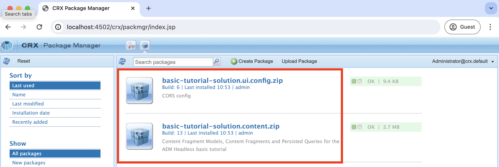
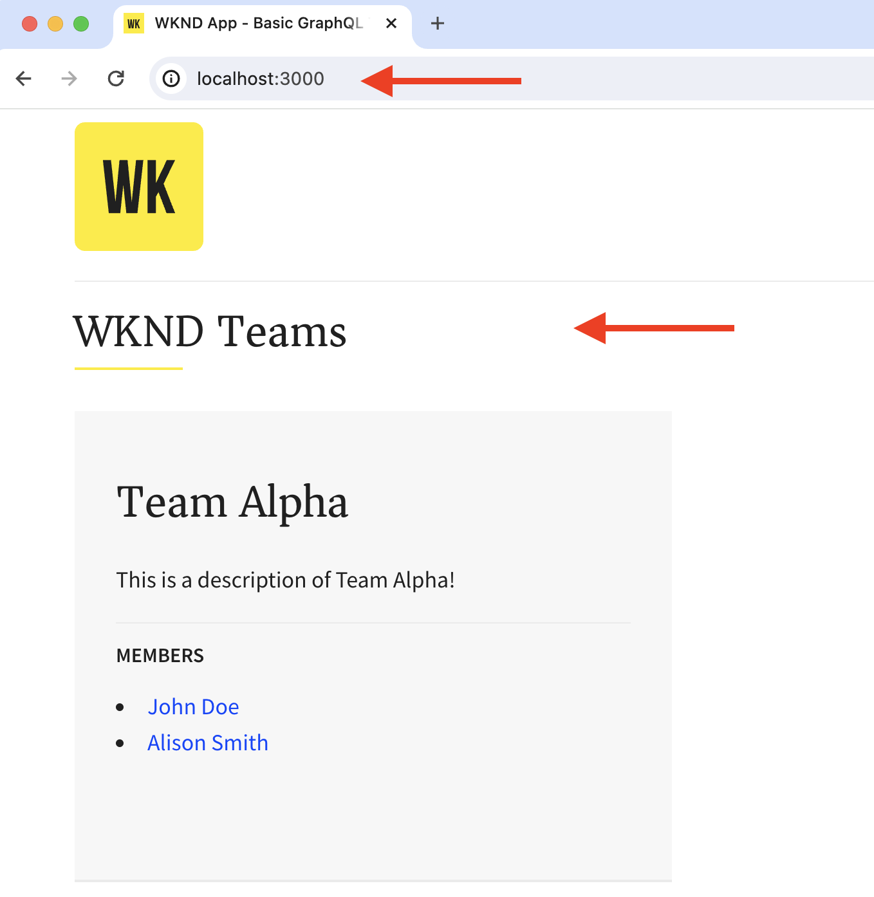

# Lokal utvecklingskonfiguration

Lär dig hur du konfigurerar en lokal utvecklingsmiljö för att redigera innehållet i en React-app med AEM Universal Editor.

## Förutsättningar

Du måste följa den här självstudiekursen på följande sätt:

- HTML och JavaScript grundläggande färdigheter.
- Följande verktyg måste installeras lokalt:
   - [Node.js](https://nodejs.org/en/download/)
   - [Git](https://git-scm.com/downloads)
   - En IDE- eller kodredigerare, till exempel [Visual Studio Code](https://code.visualstudio.com/)
- Hämta och installera följande:
   - [AEM as a Cloud Service SDK](https://experienceleague.adobe.com/en/docs/experience-manager-learn/cloud-service/local-development-environment-set-up/aem-runtime#download-the-aem-as-a-cloud-service-sdk): Den innehåller den QuickStart Jar som används för att köra AEM Author och publicera lokalt för utvecklingsändamål.
   - [Universal Editor-tjänsten](https://experienceleague.adobe.com/en/docs/experience-cloud/software-distribution/home): En lokal kopia av Universal Editor-tjänsten har en delmängd av funktioner och kan hämtas från Software Distribution Portal.
   - [local-ssl-proxy](https://www.npmjs.com/package/local-ssl-proxy#local-ssl-proxy): En enkel lokal SSL HTTP-proxy som använder ett självsignerat certifikat för lokal utveckling. AEM Universal Editor kräver HTTPS-URL:en för React-appen för att läsa in den i redigeraren.

## Lokal installation

Följ stegen nedan för att konfigurera den lokala utvecklingsmiljön:

### AEM SDK

Installera följande paket i den lokala AEM SDK om du vill ange innehåll för appen WKND Teams React.

- [WKND-team - Innehållspaket](./assets/basic-tutorial-solution.content.zip): Innehåller modeller för innehållsfragment, innehållsfragment och beständiga GraphQL-frågor.
- [WKND-team - konfigurationspaket](./assets/basic-tutorial-solution.ui.config.zip): Innehåller CORS-konfigurationer (Cross-Origin Resource Sharing) och hanterare för tokenautentisering. CORS underlättar för andra webbegenskaper än AEM att göra webbläsarbaserade klientanrop till AEM GraphQL API:er och Token Authentication Handler används för att autentisera varje begäran till AEM.

  

### Reagera-app

Följ stegen nedan för att konfigurera appen WKND Teams React:

1. Klona appen [WKND Teams React](https://github.com/adobe/aem-guides-wknd-graphql/tree/solution/basic-tutorial) från lösningsgrenen `basic-tutorial`.

   ```bash
   $ git clone -b solution/basic-tutorial git@github.com:adobe/aem-guides-wknd-graphql.git
   ```

1. Navigera till katalogen `basic-tutorial` och öppna den i kodredigeraren.

   ```bash
   $ cd aem-guides-wknd-graphql/basic-tutorial
   $ code .
   ```

1. Installera beroendena och starta React-appen.

   ```bash
   $ npm install
   $ npm start
   ```

1. Öppna appen WKND Teams React i webbläsaren på [http://localhost:3000](http://localhost:3000). Här visas en lista med teammedlemmar och deras information. Innehållet för React-appen tillhandahålls av den lokala AEM SDK med GraphQL-API:er (`/graphql/execute.json/my-project/all-teams`), som du kan verifiera via webbläsarens nätverksflik.

   

### Universell redigeringstjänst

Följ stegen nedan för att konfigurera **den lokala**-tjänsten för universell redigering:

1. Hämta den senaste versionen av Universal Editor-tjänsten från [Software Distribution Portal](https://experience.adobe.com/downloads).

   

1. Extrahera den hämtade ZIP-filen och kopiera filen `universal-editor-service.cjs` till en ny katalog med namnet `universal-editor-service`.

   ```bash
   $ unzip universal-editor-service-vproduction-<version>.zip
   $ mkdir universal-editor-service
   $ cp universal-editor-service.cjs universal-editor-service
   ```

1. Skapa filen `.env` i katalogen `universal-editor-service` och lägg till följande miljövariabler:

   ```bash
   # The port on which the Universal Editor service runs
   UES_PORT=8000
   # Disable SSL verification
   UES_TLS_REJECT_UNAUTHORIZED=false
   ```

1. Starta den lokala tjänsten Universal Editor.

   ```bash
   $ cd universal-editor-service
   $ node universal-editor-service.cjs
   ```

Ovanstående kommando startar tjänsten Universal Editor på port `8000` och du bör se följande utdata:

```bash
Either no private key or certificate was set. Starting as HTTP server
Universal Editor Service listening on port 8000 as HTTP Server
```

### Lokal SSL HTTP-proxy

AEM Universal Editor kräver att React-appen serveras via HTTPS. Låt oss skapa en lokal SSL HTTP-proxy som använder ett självsignerat certifikat för lokal utveckling.

Följ stegen nedan för att konfigurera den lokala SSL HTTP-proxyn och använda AEM SDK och Universal Editor via HTTPS:

1. Installera paketet `local-ssl-proxy` globalt.

   ```bash
   $ npm install -g local-ssl-proxy
   ```

1. Starta två instanser av den lokala SSL HTTP-proxyn för följande tjänster:

   - AEM SDK lokala SSL HTTP-proxy på port `8443`.
   - Universell redigeringstjänst lokal SSL HTTP-proxy på port `8001`.

   ```bash
   # AEM SDK local SSL HTTP proxy on port 8443
   $ local-ssl-proxy --source 8443 --target 4502
   
   # Universal Editor service local SSL HTTP proxy on port 8001
   $ local-ssl-proxy --source 8001 --target 8000
   ```

### Uppdatera React-appen för att använda HTTPS

Följ stegen nedan för att aktivera HTTPS för appen WKND Teams React:

1. Stoppa Reaktionen genom att trycka på `Ctrl + C` i terminalen.
1. Uppdatera filen `package.json` så att den innehåller miljövariabeln `HTTPS=true` i skriptet `start`.

   ```json
   "scripts": {
       "start": "HTTPS=true react-scripts start",
       ...
   }
   ```

1. Uppdatera `REACT_APP_HOST_URI` i filen `.env.development` så att HTTPS-protokollet och den lokala SSL HTTP-proxyporten i AEM SDK används.

   ```bash
   REACT_APP_HOST_URI=https://localhost:8443
   ...
   ```

1. Uppdatera filen `../src/proxy/setupProxy.auth.basic.js` om du vill använda avspända SSL-inställningar med alternativet `secure: false`.

   ```javascript
   ...
   module.exports = function(app) {
   app.use(
       ['/content', '/graphql'],
       createProxyMiddleware({
       target: REACT_APP_HOST_URI,
       changeOrigin: true,
       secure: false, // Ignore SSL certificate errors
       // pass in credentials when developing against an Author environment
       auth: `${REACT_APP_BASIC_AUTH_USER}:${REACT_APP_BASIC_AUTH_PASS}`
       })
   );
   };
   ```

1. Starta React-appen.

   ```bash
   $ npm start
   ```

## Verifiera installationen

När du har konfigurerat den lokala utvecklingsmiljön med hjälp av stegen ovan, måste du kontrollera inställningarna.

### Lokal verifiering

Kontrollera att följande tjänster körs lokalt via HTTPS. Du kan behöva godkänna säkerhetsvarningen i webbläsaren för det självsignerade certifikatet:

1. WKND Teams React-app på [https://localhost:3000](https://localhost:3000)
1. AEM SDK på [https://localhost:8443](https://localhost:8443)
1. Universell redigeringstjänst på [https://localhost:8001](https://localhost:8001)

### Läs in appen WKND Teams React i Universal Editor

Vi läser in appen WKND Teams React i Universal Editor för att verifiera konfigurationen:

1. Öppna den universella redigeraren https://experience.adobe.com/#/aem/editor i webbläsaren. Logga in med din Adobe ID om du uppmanas att göra det.

1. Ange WKND Teams React-app-URL:en i det universella redigeringsprogrammets URL-inmatningsfält och klicka på `Open`.

   

1. Appen WKND Teams React läses in i den universella redigeraren **men du kan inte redigera innehållet ännu**. Du måste mäta upp React-appen för att kunna aktivera innehållsredigering med den universella redigeraren.

   


## Nästa steg

Lär dig hur du [instrumenterar React-appen för att redigera innehållet](./instrument-to-edit-content.md).
