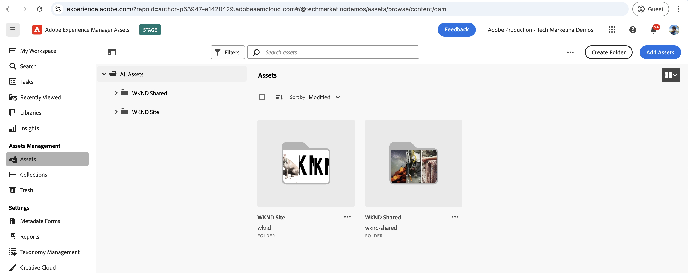
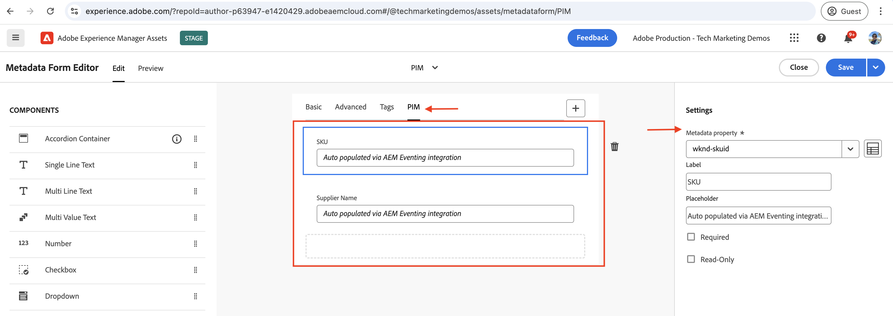

# AEM Assets event for PIM integration

>[!IMPORTANT]
>
>I den här självstudien används OpenAPI-baserade AEM API:er. De är tillgängliga som en del av ett program för tidig åtkomst, och om du är intresserad av att få tillgång till dem bör du skicka ett e-postmeddelande till [aem-apis@adobe.com](mailto:aem-apis@adobe.com) med en beskrivning av ditt användningsfall.

Lär dig hur du tar emot en AEM-händelse och agerar på den för att uppdatera innehållstillståndet i AEM med det OpenAPI-baserade API:t för Assets Author.

Hur den mottagna händelsen behandlas beror på företagets behov. Händelsedata kan till exempel användas för att uppdatera tredjepartssystemet, eller AEM, eller båda.

I det här exemplet visas hur ett tredjepartssystem, t.ex. ett PIM-system (Product Information Management), kan integreras med AEM as a Cloud Service Assets. När du får en AEM Assets-händelse bearbetas den för att hämta ytterligare metadata från PIM-systemet och uppdatera metadata för resursen i AEM. De uppdaterade metadata för mediefilen kan innehålla ytterligare information som SKU, leverantörsnamn eller annan produktinformation.

Om du vill ta emot och bearbeta AEM Assets-händelsen används [Adobe I/O Runtime](https://developer.adobe.com/runtime/docs/guides/overview/what_is_runtime/), en serverlös plattform. Andra händelsehanteringssystem, som Webkrok i tredjepartssystem eller Amazon EventBridge, kan också användas.

Integreringen sker på följande höga nivå:


1. AEM Author-tjänsten utlöser en _händelse om att resursbearbetningen har slutförts_ när en resursöverföring har slutförts och alla resursbearbetningsaktiviteter också har slutförts. Om du väntar på att bearbetningen av mediefilerna ska slutföras ser du till att all körklar bearbetning, till exempel extrahering av metadata, har slutförts.
1. Händelsen skickas till tjänsten [Adobe I/O Events](https://developer.adobe.com/events/).
1. Adobe I/O Events-tjänsten skickar händelsen till [Adobe I/O Runtime-åtgärden](https://developer.adobe.com/runtime/docs/guides/using/creating_actions/) för bearbetning.
1. Adobe I/O Runtime Action anropar PIM-systemets API för att hämta ytterligare metadata som SKU, leverantörsinformation eller annan information.
1. De ytterligare metadata som hämtas från PIM uppdateras sedan i AEM Assets med det OpenAPI-baserade [Assets Author API](https://developer.adobe.com/experience-cloud/experience-manager-apis/api/experimental/assets/author/) .

## Förutsättningar

För att kunna genomföra den här självstudiekursen behöver du:

- AEM as a Cloud Service-miljö med [AEM Eventing aktiverat](https://developer.adobe.com/experience-cloud/experience-manager-apis/guides/events/#enable-aem-events-on-your-aem-cloud-service-environment). Dessutom måste exempelprojektet [WKND Sites](https://github.com/adobe/aem-guides-wknd?#aem-wknd-sites-project) distribueras till det.

- Åtkomst till [Adobe Developer Console](https://developer.adobe.com/developer-console/docs/guides/getting-started).

- [Adobe Developer CLI](https://developer.adobe.com/runtime/docs/guides/tools/cli_install/) är installerat på din lokala dator.

## Utvecklingssteg

Utvecklingsstegen på hög nivå är följande:

1. [Modernisering av AEM as a Cloud Service-miljön](https://experienceleague.adobe.com/en/docs/experience-manager-learn/cloud-service/aem-apis/invoke-openapi-based-aem-apis#modernization-of-aem-as-a-cloud-service-environment)
1. [Aktivera åtkomst till AEM API:er](https://experienceleague.adobe.com/en/docs/experience-manager-learn/cloud-service/aem-apis/invoke-openapi-based-aem-apis#enable-aem-apis-access)
1. [Skapa ett projekt i Adobe Developer Console (ADC)](./runtime-action.md#Create-project-in-Adobe-Developer-Console)
1. [Initiera projektet för lokal utveckling](./runtime-action.md#initialize-project-for-local-development)
1. Konfigurera projektet i ADC
1. Konfigurera AEM Author-tjänsten för att aktivera ADC-projektkommunikation
1. Utveckla en runtime-åtgärd för att samordna
   1. hämta metadata från PIM-systemet
   1. metadatauppdatering i AEM Assets med Assets Author API
1. Skapa och tillämpa metadatamatchemat för resurser
1. Verifiering av överföring av resurser och uppdatering av metadata

Mer information om steg 1-2 finns i handboken [Invoke OpenAPI-baserade AEM API:er](https://experienceleague.adobe.com/en/docs/experience-manager-learn/cloud-service/aem-apis/invoke-openapi-based-aem-apis) och för steg 3-4 finns i exemplet [Adobe I/O Runtime Action och AEM Events](./runtime-action.md#) . För steg 5-9, se följande avsnitt.

### Konfigurera projektet i Adobe Developer Console (ADC)

Om du vill ta emot AEM Assets Events och köra Adobe I/O Runtime Action som skapades i föregående steg konfigurerar du projektet i ADC.

- I ADC navigerar du till det [projekt](https://developer.adobe.com/console/projects) som du skapade i steg-3. Välj arbetsytan `Stage` i det projektet där körningsåtgärden distribueras när du kör `aio app deploy` som en del av steg 4-instruktionerna.

- Klicka på knappen **Lägg till tjänst** och välj alternativet **Händelse** . I dialogrutan **Lägg till händelser** väljer du **Experience Cloud** > **AEM Assets** och klickar på **Nästa**.
  

- I steget **Konfigurera händelseregistrering** väljer du önskad AEMCS-instans, _Resursbearbetning slutförd_ och autentiseringstypen OAuth Server-till-server.

  

- I steget **Så här tar du emot händelser** expanderar du alternativet **Körningsåtgärd** och väljer den _generiska_ åtgärden som skapades i föregående steg. Klicka på **Spara konfigurerade händelser**.

  

- Klicka på knappen **Lägg till tjänst** och välj alternativet **API** . I **Lägg till ett API** modal väljer du **Experience Cloud** > **AEM Assets Author API** och klickar på **Next**.

  

- Välj sedan **OAuth Server-to-Server** som autentiseringstyp och klicka på **Nästa**.

- Välj sedan rätt **produktprofil** som är associerad med den AEM Assets-miljö som händelsen skapas från och som har tillräcklig åtkomst för att uppdatera resurser där. Klicka slutligen på knappen **Spara konfigurerad API** .

  

  I det här fallet har produktprofilen _AEM Administrators - författare - Program XXX - Miljö YY_ valts. **AEM Assets API Users**-tjänsten är aktiverad.

  

## Konfigurera AEM-instans för att aktivera ADC-projektkommunikation

Om du vill att ADC-projektets klient-ID för OAuth Server-till-Server-autentiseringsuppgifter ska kunna kommunicera med AEM-instansen måste du konfigurera AEM-instansen.

Det görs genom att definiera konfigurationen i filen `api.yaml` i AEM Project. Distribuera sedan filen `api.yaml` med Config Pipeline i Cloud Manager.

- Leta reda på eller skapa filen `api.yaml` från mappen `config` i AEM Project.

  

- Lägg till följande konfiguration i filen `api.yaml`.

  ```yaml
  kind: "API"
  version: "1.0"
  metadata: 
      envTypes: ["dev", "stage", "prod"]
  data:
      allowedClientIDs:
          author:
          - "<ADC Project's OAuth Server-to-Server credential ClientID>"
  ```

  Ersätt `<ADC Project's OAuth Server-to-Server credential ClientID>` med det faktiska klient-ID:t för ADC-projektets autentiseringsuppgifter för OAuth Server-till-Server.

  >[!CAUTION]
  >
  > För demoändamål används samma ClientID för alla miljöer. Vi rekommenderar att du använder ett separat ClientID per miljö (dev, stage, prod) för bättre säkerhet och kontroll.


- Bekräfta konfigurationsändringarna i Git-databasen och skicka ändringarna till fjärrdatabasen.

- Distribuera ovanstående ändringar med Config Pipeline i Cloud Manager. Observera att filen `api.yaml` också kan installeras i en RDE med kommandoradsverktyg.

  

### Åtgärd vid utveckling av körning

Om du vill hämta och uppdatera metadata börjar du med att uppdatera den automatiskt skapade _generiska_ åtgärdskoden i mappen `src/dx-excshell-1/actions/generic`.

Se den bifogade filen [WKND-Assets-PIM-Integration.zip](../assets/examples/assets-pim-integration/WKND-Assets-PIM-Integration.zip) för den fullständiga koden och i avsnittet nedan markeras nyckelfilerna.

- Filen `src/dx-excshell-1/actions/generic/mockPIMCommunicator.js` kopplar PIM API-anropet för att hämta ytterligare metadata som SKU och leverantörsnamn. Den här filen används för demoändamål. När du har arbetsflödet från början till slut ersätter du den här funktionen med ett anrop till ditt riktiga PIM-system för att hämta metadata för resursen.

  ```javascript
  /**
   * Mock PIM API to get the product data such as SKU, Supplier, etc.
   *
   * In a real-world scenario, this function would call the PIM API to get the product data.
   * For this example, we are returning mock data.
   *
   * @param {string} assetId - The assetId to get the product data.
   */
  module.exports = {
      async getPIMData(assetId) {
          if (!assetId) {
          throw new Error('Invalid assetId');
          }
          // Mock response data for demo purposes
          const data = {
          SKUID: 'MockSKU 123',
          SupplierName: 'mock-supplier',
          // ... other product data
          };
          return data;
      },
  };
  ```

- Filen `src/dx-excshell-1/actions/generic/aemCommunicator.js` uppdaterar metadata för resursen i AEM med hjälp av [Assets Author API](https://developer.adobe.com/experience-cloud/experience-manager-apis/api/experimental/assets/author/).

  ```javascript
  const fetch = require('node-fetch');
  ...
  /**
  *  Get IMS Access Token using Client Credentials Flow
  *
  * @param {*} clientId - IMS Client ID from ADC project's OAuth Server-to-Server Integration
  * @param {*} clientSecret - IMS Client Secret from ADC project's OAuth Server-to-Server Integration
  * @param {*} scopes - IMS Meta Scopes from ADC project's OAuth Server-to-Server Integration as comma separated strings
  * @returns {string} - Returns the IMS Access Token
  */
  async function getIMSAccessToken(clientId, clientSecret, scopes) {
    const adobeIMSV3TokenEndpointURL = 'https://ims-na1.adobelogin.com/ims/token/v3';
    const options = {
      method: 'POST',
      headers: {
        'Content-Type': 'application/x-www-form-urlencoded',
      },
      body: `grant_type=client_credentials&client_id=${clientId}&client_secret=${clientSecret}&scope=${scopes}`,
    };
    const response = await fetch(adobeIMSV3TokenEndpointURL, options);
    const responseJSON = await response.json();
    return responseJSON.access_token;
  }    
  async function updateAEMAssetMetadata(metadataDetails, aemAssetEvent, params) {
    ...
    // Transform the metadata details to JSON Patch format,
    // see https://developer.adobe.com/experience-cloud/experience-manager-apis/api/experimental/assets/author/#operation/patchAssetMetadata
    const transformedMetadata = Object.keys(metadataDetails).map((key) => ({
      op: 'add',
      path: `wknd-${key.toLowerCase()}`,
      value: metadataDetails[key],
    }));
    ...
    // Get ADC project's OAuth Server-to-Server Integration credentials
    const clientId = params.ADC_CECREDENTIALS_CLIENTID;
    const clientSecret = params.ADC_CECREDENTIALS_CLIENTSECRET;
    const scopes = params.ADC_CECREDENTIALS_METASCOPES;
    // Get IMS Access Token using Client Credentials Flow
    const access_token = await getIMSAccessToken(clientId, clientSecret, scopes);
    // Call AEM Author service to update the metadata using Assets Author API
    // See https://developer.adobe.com/experience-cloud/experience-manager-apis/api/experimental/assets/author/
    const res = await fetch(`${aemAuthorHost}/adobe/assets/${assetId}/metadata`, {
      method: 'PATCH',
      headers: {
        'Content-Type': 'application/json-patch+json',
        'If-Match': '*',
        'X-Adobe-Accept-Experimental': '1',
        'X-Api-Key': 'aem-assets-management-api', // temporary value
        Authorization: `Bearer ${access_token}`,
      },
      body: JSON.stringify(transformedMetadata),
    });
    ...
  }
  module.exports = { updateAEMAssetMetadata };
  ```

  Filen `.env` lagrar ADC-projektets autentiseringsuppgifter för OAuth Server-till-Server, och de skickas som parametrar till åtgärden med hjälp av filen `ext.config.yaml`. Mer information om hur du hanterar hemligheter och åtgärdsparametrar finns i [App Builder konfigurationsfiler](https://developer.adobe.com/app-builder/docs/guides/configuration/).
- Mappen `src/dx-excshell-1/actions/model` innehåller `aemAssetEvent.js`- och `errors.js`-filer, som används av åtgärden för att tolka den mottagna händelsen och hantera fel.
- Filen `src/dx-excshell-1/actions/generic/index.js` använder de ovannämnda modulerna för att ordna hämtning och uppdatering av metadata.

  ```javascript
  ...
  let responseMsg;
  // handle the challenge probe request, they are sent by I/O to verify the action is valid
  if (params.challenge) {
    logger.info('Challenge probe request detected');
    responseMsg = JSON.stringify({ challenge: params.challenge });
  } else {
    logger.info('AEM Asset Event request received');
    // create AEM Asset Event object from request parameters
    const aemAssetEvent = new AEMAssetEvent(params);
    // Call mock PIM API to get the product data such as SKU, Supplier, etc.
    const mockPIMData = await mockPIMAPI.getPIMData(
      aemAssetEvent.getAssetName(),
    );
    logger.info('Mock PIM API response', mockPIMData);
    // Update PIM received data in AEM as Asset metadata
    const aemUpdateStatus = await updateAEMAssetMetadata(
      mockPIMData,
      aemAssetEvent,
      params,
    );
    logger.info('AEM Asset metadata update status', aemUpdateStatus);
    if (aemUpdateStatus) {
      // create response message
      responseMsg = JSON.stringify({
        message:
          'AEM Asset Event processed successfully, updated the asset metadata with PIM data.',
        assetdata: {
          assetName: aemAssetEvent.getAssetName(),
          assetPath: aemAssetEvent.getAssetPath(),
          assetId: aemAssetEvent.getAssetId(),
          aemHost: aemAssetEvent.getAEMHost(),
          pimdata: mockPIMData,
        },
      });
    } 
    // response object
    const response = {
      statusCode: 200,
      body: responseMsg,
    };
    // Return the response to the caller
    return response;
    ...
  }
  ```

- Distribuera den uppdaterade åtgärden till Adobe I/O Runtime med följande kommando:

  ```bash
  $ aio app deploy
  ```

### Skapa och tillämpa metadatamatchemat för resurser

Som standard har WKND Sites-projektet inte objektets metadataram för att visa PIM-specifika metadata som SKU, leverantörsnamn osv. Låt oss skapa och använda metadatamatchemat för resurser i AEM-instansen.

1. Logga in på instansen av AEM as a Cloud Service-resursen och var i [resursvyn](https://experienceleague.adobe.com/en/docs/experience-manager-learn/assets/authoring/switch-views).

   

1. Navigera till alternativet **Inställningar** > **Metadata Forms** från den vänstra listen och klicka på **Skapa** . Ange följande information i dialogrutan **Skapa metadataformulär** och klicka på **Skapa**.
   - Namn: `PIM`
   - Använd befintlig formulärstruktur som mall: `Check`
   - Välj bland: `default`

   

1. Klicka på ikonen **+** för att lägga till en ny **PIM**-flik och lägga till **enkelradstext** i den.

   

   I följande tabell visas metadataegenskaperna och deras motsvarande fält.

   | Etikett | Platshållare | Metadataegenskap |
   | --- | --- | --- |
   | SKU | Automatiskt ifylld via AEM Eventing-integrering | `wknd-skuid` |
   | Leverantörsnamn | Automatiskt ifylld via AEM Eventing-integrering | `wknd-suppliername` |

1. Klicka på **Spara** och **Stäng** för att spara metadataformuläret.

1. Till sist använder du metadatamateschemat **PIM** i mappen **PIM**.

   

Med stegen ovan kan resurserna i mappen **Adventures** visa PIM-specifika metadata som SKU, leverantörsnamn osv.

### Tillgångsuppladdning och metadataverifiering

Om du vill verifiera integreringen mellan AEM Assets och PIM överför du en resurs till mappen **Adventures** i AEM Assets. Fliken PIM på sidan med tillgångsinformation ska visa metadata för SKU- och leverantörsnamn.


## Koncept och viktiga arbetsmoment

Synkronisering av metadata för tillgångar mellan AEM och andra system som PIM krävs ofta i företaget. Med AEM Eventing kan man uppnå sådana krav.

- Koden för hämtning av metadata om mediematerial körs utanför AEM, så att belastningen på tjänsten AEM Author undviks, vilket är en händelsestyrd arkitektur som kan skalas oberoende av varandra.
- Det nya API:t för Assets Author används för att uppdatera metadata för resurser i AEM.
- API-autentiseringen använder OAuth server-till-server (kallas klientinloggningsflöde), se [Implementeringsguiden för OAuth Server-till-server-autentiseringsuppgifter](https://developer.adobe.com/developer-console/docs/guides/authentication/ServerToServerAuthentication/implementation).
- I stället för Adobe I/O Runtime Actions kan andra webhooks eller Amazon EventBridge användas för att ta emot händelsen AEM Assets och bearbeta metadatauppdateringen.
- Tillgångshändelser via AEM Eventing ger företag möjlighet att automatisera och effektivisera kritiska processer och öka effektiviteten och enhetligheten i hela innehållets ekosystem.
