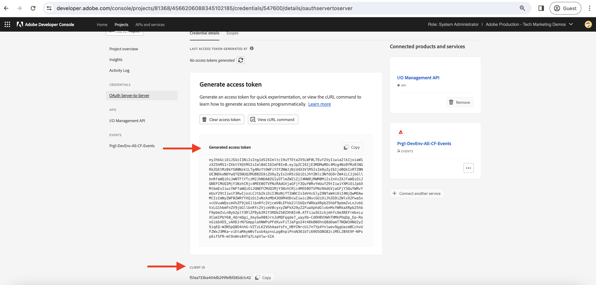

# Journalföring och AEM

Lär dig hur du hämtar den första uppsättningen AEM händelser från journalen och utforskar detaljer om varje händelse.

Journalföring är en pull-metod för att förbruka AEM händelser, och en journal är en ordnad lista över händelser. Med hjälp av API:t för Adobe I/O Events-journalföring kan du hämta AEM händelser från journalen och bearbeta dem i ditt program. Med den här metoden kan du hantera händelser baserat på en viss gräns och effektivt bearbeta dem flera gånger. Se [Journalföring](https://developer.adobe.com/events/docs/guides/journaling_intro/) för djupgående insikter, inklusive viktiga överväganden som kvarhållningsperioder, sidnumrering med mera.

I Adobe Developer Console-projektet aktiveras automatiskt alla händelseregistreringar för journalföring, vilket möjliggör smidig integrering.

I det här exemplet används en Adobe _webbprogram_ Med kan du hämta den första gruppen AEM händelser från journalen utan att behöva konfigurera programmet. Webbprogrammet som tillhandahålls av Adobe finns på [Glitch](https://glitch.com/), en plattform som är känd för att erbjuda en webbaserad miljö som underlättar utveckling och driftsättning av webbprogram. Alternativet att använda ditt eget program är dock tillgängligt om du vill.

## Förutsättningar

För att kunna genomföra den här självstudiekursen behöver du:

- AEM as a Cloud Service miljö med [AEM Eventing aktiverad](https://developer.adobe.com/experience-cloud/experience-manager-apis/guides/events/#enable-aem-events-on-your-aem-cloud-service-environment).

- [Adobe Developer Console-projekt konfigurerat för AEM](https://developer.adobe.com/experience-cloud/experience-manager-apis/guides/events/#how-to-subscribe-to-aem-events-in-the-adobe-developer-console).

## Åtkomst till webbprogram

Följ de här stegen för att få åtkomst till webbprogrammet som tillhandahålls av Adobe:

- Kontrollera att du har åtkomst till [Glitch - webbapplikation som värd](https://indigo-speckle-antler.glitch.me/) på en ny flik i webbläsaren.

  

## Samla in projektinformation för Adobe Developer Console

Om du vill hämta AEM händelser från journalen, autentiseringsuppgifter som _IMS-organisations-ID_, _Klient-ID_ och _Åtkomsttoken_ krävs. Så här samlar du in autentiseringsuppgifterna:

- I [Adobe Developer Console](https://developer.adobe.com)navigera till projektet och klicka för att öppna det.

- Under **Referenser** klickar du på **OAuth Server-till-server** länk för att öppna **Information om autentiseringsuppgifter** -fliken.

- Klicka på **Generera åtkomsttoken** för att generera åtkomsttoken.

  

- Kopiera **Genererad åtkomsttoken**, **KLIENT-ID** och **ORGANISATIONS-ID**. Du behöver dem senare i kursen.

  

- Alla händelseregistreringar aktiveras automatiskt för journalföring. För att få _unik journalslut-API-slutpunkt_ Klicka på det händelsekort som du prenumererar på AEM. Från **Registreringsinformation** -fliken, kopiera **JOURNALING UNIQUE API ENDPOINT**.

  

## Läs in AEM händelsejournal

För att hålla saker och ting enkla hämtar det här värdbaserade webbprogrammet bara den första gruppen AEM händelser från journalen. Det här är äldsta tillgängliga händelser i journalen. Mer information finns i [första omgången händelser](https://developer.adobe.com/events/docs/guides/api/journaling_api/#fetching-your-first-batch-of-events-from-the-journal).

- I [Glitch - webbapplikation som värd](https://indigo-speckle-antler.glitch.me/), anger **IMS-organisations-ID**, **Klient-ID** och **Åtkomsttoken** du kopierade tidigare från Adobe Developer Console-projektet och sedan klicka **Skicka**.

- När det är klart visas AEM händelseregistreringsdata i tabellkomponenten.

  

- Dubbelklicka på raden om du vill visa hela händelsens nyttolast. Du kan se att informationen om AEM har all information som krävs för att bearbeta händelsen i webkroken. Händelsetypen (`type`), händelsekälla (`source`), händelse-id (`event_id`), händelsetid (`time`) och händelsedata (`data`).

  

## Ytterligare resurser

- [Källkod för webbkrok med fel](https://glitch.com/edit/#!/indigo-speckle-antler) finns att referera till. Det är ett enkelt React-program som använder [Adobe React Spectrum](https://react-spectrum.adobe.com/react-spectrum/index.html) för att återge användargränssnittet.

- [Adobe I/O Events Journaling API](https://developer.adobe.com/events/docs/guides/api/journaling_api/) innehåller detaljerad information om API:t, som den första, nästa och sista omgången händelser, sidnumrering och mycket annat.
