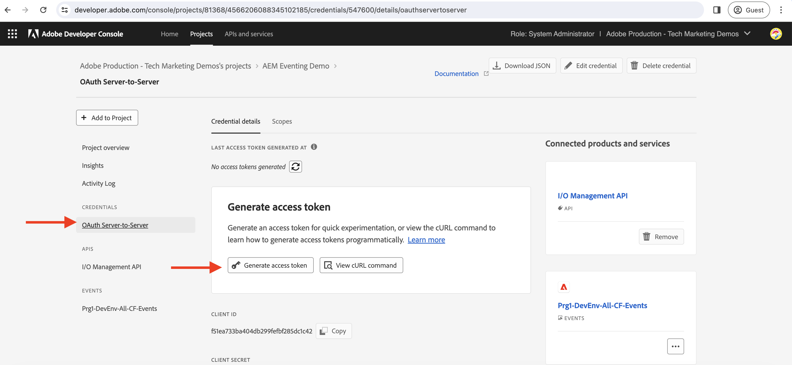

# Journalföring och AEM-event

Lär dig hur du hämtar den första uppsättningen AEM Events från tidskriften och utforskar information om varje händelse.

>[!VIDEO](https://video.tv.adobe.com/v/3427052?quality=12&learn=on)

Journalföring är ett sätt att förbruka AEM Events, och en journal är en ordnad lista över händelser. Med Adobe I/O Events Journaling API kan du hämta AEM Events från journalen och bearbeta dem i ditt program. Med den här metoden kan du hantera händelser baserat på en viss gräns och effektivt bearbeta dem flera gånger. Se [Journalföringen](https://developer.adobe.com/events/docs/guides/journaling_intro/) för ingående insikter, inklusive viktiga överväganden som kvarhållningsperioder, sidnumrering med mera.

Inom Adobe Developer Console-projektet aktiveras automatiskt alla händelseregistreringar för journalföring, vilket möjliggör smidig integrering.

>[!IMPORTANT]
>
>Slutpunkterna för live-demo i den här självstudiekursen fanns tidigare på [Glitch](https://glitch.com/). Från juli 2025 har Glitch upphört med sin värdtjänst och slutpunkterna är inte längre tillgängliga.
>&#x200B;>Vi arbetar aktivt med att migrera demos till en alternativ plattform. Självstudieinnehållet är korrekt och uppdaterade länkar kommer snart.
>&#x200B;>Tack för din förståelse och ditt tålamod.

Använd ditt eget program tills live-demonstrationsslutpunkterna blir tillgängliga igen.

## Förutsättningar

För att kunna genomföra den här självstudiekursen behöver du:

- AEM as a Cloud Service-miljö med [AEM Eventing aktiverat](https://developer.adobe.com/experience-cloud/experience-manager-apis/guides/events/#enable-aem-events-on-your-aem-cloud-service-environment).

- [Adobe Developer Console-projekt konfigurerat för AEM Events](https://developer.adobe.com/experience-cloud/experience-manager-apis/guides/events/#how-to-subscribe-to-aem-events-in-the-adobe-developer-console).

## Åtkomst till webbprogram

Följ de här stegen för att få åtkomst till webbprogrammet som tillhandahålls av Adobe:

- Kontrollera att du har åtkomst till [Glitch - webbprogrammet ](https://indigo-speckle-antler.glitch.me/) på en ny webbläsarflik.

  

## Samla in projektinformation om Adobe Developer Console

Om du vill hämta AEM-händelser från journalen krävs autentiseringsuppgifter som _IMS-organisations-ID_, _klient-ID_ och _åtkomsttoken_. Så här samlar du in autentiseringsuppgifterna:

- Gå till ditt projekt i [Adobe Developer Console](https://developer.adobe.com) och klicka för att öppna det.

- Klicka på länken **OAuth-server-till-server** under avsnittet **Autentiseringsuppgifter** för att öppna fliken **Information om autentiseringsuppgifter**.

- Klicka på knappen **Generera åtkomsttoken** för att generera åtkomsttoken.

  

- Kopiera **genererad åtkomsttoken**, **KLIENT-ID** och **ORGANISATIONS-ID**. Du behöver dem senare i kursen.

  

- Alla händelseregistreringar aktiveras automatiskt för journalföring. Om du vill hämta den _unika journalskrifts-API-slutpunkten_ för din händelseregistrering klickar du på det händelsekort som prenumererar på AEM Events. Kopiera **JOURNALING UNIQUE API ENDPOINT** från fliken **Registreringsinformation**.

  

## Läs in AEM Events-journal

För att förenkla allt hämtar det här webbprogrammet bara den första gruppen AEM Events från tidskriften. Det här är äldsta tillgängliga händelser i journalen. Mer information finns i [den första gruppen med händelser](https://developer.adobe.com/events/docs/guides/api/journaling_api/#fetching-your-first-batch-of-events-from-the-journal).

- I webbprogrammet [Glitch - hosted](https://indigo-speckle-antler.glitch.me/) anger du det **IMS Organization ID**, **Client ID** och **Access Token** som du kopierade tidigare från Adobe Developer Console-projektet och klickar på **Submit**.

- Tabellkomponenten visar AEM Events Journal-data.

  

- Dubbelklicka på raden om du vill visa hela händelsens nyttolast. Du ser att informationen om AEM-händelsen innehåller all information som krävs för att händelsen ska kunna bearbetas i webkroken. Händelsetypen (`type`), händelsekällan (`source`), händelse-ID (`event_id`), händelsetypen (`time`) och händelsedata (`data`).

  

## Ytterligare resurser

- [API för Adobe I/O Events-journalföring](https://developer.adobe.com/events/docs/guides/api/journaling_api/) innehåller detaljerad information om API:t, till exempel första, nästa och sista gruppbearbetning av händelser, sidnumrering och annat.
