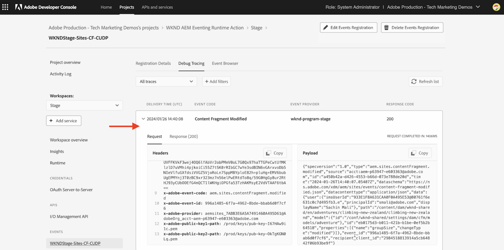

# Adobe I/O Runtime Action och AEM Events

Lär dig hur du tar emot AEM-händelser med åtgärden [Adobe I/O Runtime](https://developer.adobe.com/runtime/docs/guides/overview/what_is_runtime/) och granskar händelseinformation som nyttolast, huvuden och metadata.

>[!VIDEO](https://video.tv.adobe.com/v/3427053?quality=12&learn=on)

Adobe I/O Runtime är en serverlös plattform som tillåter exekvering av kod som svar på Adobe I/O Events. Detta hjälper dig att bygga händelsestyrda program utan att behöva bekymra dig om infrastrukturen.

I det här exemplet skapar du en [åtgärd](https://developer.adobe.com/runtime/docs/guides/using/creating_actions/) från Adobe I/O Runtime som tar emot AEM Events och loggar händelseinformationen.
https://developer.adobe.com/runtime/docs/guides/overview/what_is_runtime/

Stegen på hög nivå är:

- Skapa projekt i Adobe Developer Console
- Initiera projekt för lokal utveckling
- Konfigurera projekt i Adobe Developer Console
- Utlös AEM Event och verifiera åtgärdskörning

## Förutsättningar

För att kunna genomföra den här självstudiekursen behöver du:

- AEM as a Cloud Service-miljö med [AEM Eventing aktiverat](https://developer.adobe.com/experience-cloud/experience-manager-apis/guides/events/#enable-aem-events-on-your-aem-cloud-service-environment).

- Åtkomst till [Adobe Developer Console](https://developer.adobe.com/developer-console/docs/guides/getting-started).

- [Adobe Developer CLI](https://developer.adobe.com/runtime/docs/guides/tools/cli_install/) är installerat på din lokala dator.

## Skapa projekt i Adobe Developer Console

Så här skapar du ett projekt i Adobe Developer Console:

- Navigera till [Adobe Developer Console](https://developer.adobe.com/) och klicka på knappen **Konsol** .

- Klicka på **Skapa projekt från mall** i avsnittet **Snabbstart**. I dialogrutan **Bläddra bland mallar** väljer du sedan mallen **App Builder**.

- Uppdatera projekttitel, appnamn och Lägg till arbetsyta om det behövs. Klicka sedan på **Spara**.

  


## Initiera projekt för lokal utveckling

Om du vill lägga till Adobe I/O Runtime Action i projektet måste du initiera projektet för lokal utveckling. Navigera till den plats där du vill initiera projektet på den lokala datorn och följ dessa steg:

- Initiera projekt genom att köra

  ```bash
  aio app init
  ```

- Markera `Organization`, `Project` som du skapade i föregående steg och arbetsytan. Välj alternativet `All Templates` i steget `What templates do you want to search for?`.

  

- Välj alternativet `@adobe/generator-app-excshell` i listan Mallar.

  

- Öppna projektet i din favoritutvecklingsmiljö, till exempel VSCode.

- Den valda _utökningsmallen_ (`@adobe/generator-app-excshell`) innehåller en allmän körningsåtgärd, koden finns i filen `src/dx-excshell-1/actions/generic/index.js`. Låt oss uppdatera den så att den blir enkel, logga händelseinformationen och returnera ett svar om att åtgärden lyckades. I nästa exempel förbättras dock bearbetningen av mottagna AEM Events.

  ```javascript
  const fetch = require("node-fetch");
  const { Core } = require("@adobe/aio-sdk");
  const {
  errorResponse,
  getBearerToken,
  stringParameters,
  checkMissingRequestInputs,
  } = require("../utils");
  
  // main function that will be executed by Adobe I/O Runtime
  async function main(params) {
  // create a Logger
  const logger = Core.Logger("main", { level: params.LOG_LEVEL || "info" });
  
  try {
      // 'info' is the default level if not set
      logger.info("Calling the main action");
  
      // log parameters, only if params.LOG_LEVEL === 'debug'
      logger.debug(stringParameters(params));
  
      const response = {
      statusCode: 200,
      body: {
          message: "Received AEM Event, it will be processed in next example",
      },
      };
  
      // log the response status code
      logger.info(`${response.statusCode}: successful request`);
      return response;
  } catch (error) {
      // log any server errors
      logger.error(error);
      // return with 500
      return errorResponse(500, "server error", logger);
  }
  }
  
  exports.main = main;
  ```

- Distribuera slutligen den uppdaterade åtgärden på Adobe I/O Runtime genom att köra.

  ```bash
  aio app deploy
  ```

## Konfigurera projekt i Adobe Developer Console

Om du vill ta emot AEM Events och köra Adobe I/O Runtime Action som skapades i föregående steg konfigurerar du projektet i Adobe Developer Console.

- I Adobe Developer Console går du till det [projekt](https://developer.adobe.com/console/projects) som skapades i föregående steg och klickar för att öppna det. Välj arbetsytan `Stage`, det är här åtgärden distribuerades.

- Klicka på knappen **Lägg till tjänst** och välj alternativet **API** . I **Lägg till ett API** modal väljer du **Adobe-tjänster** > **I/O-hanterings-API** och klickar på **Nästa**, följer ytterligare konfigurationssteg och klickar på **Spara konfigurerat API**.

  

- Klicka på knappen **Lägg till tjänst** och välj alternativet **Händelse**. I dialogrutan **Lägg till händelser** väljer du **Experience Cloud** > **AEM Sites** och klickar på **Nästa**. Följ ytterligare konfigurationssteg, välj AEMCS-instans, händelsetyper och annan information.

- I steget **Så här tar du emot händelser** expanderar du alternativet **Körningsåtgärd** och väljer den _generiska_ åtgärden som skapades i föregående steg. Klicka på **Spara konfigurerade händelser**.

  

- Granska informationen om händelseregistrering, även fliken **Felsökningsspårning**, och verifiera **Utfrågningsavsökningen** - förfrågan och svar.

  


## Utlös AEM-event

Så här utlöser du AEM-händelser från din AEM as a Cloud Service-miljö som har registrerats i ovanstående Adobe Developer Console-projekt:

- Få åtkomst till och logga in i AEM as a Cloud Service redigeringsmiljö via [Cloud Manager](https://my.cloudmanager.adobe.com/).

- Beroende på dina **Prenumererade händelser** kan du skapa, uppdatera, ta bort, publicera eller avpublicera ett innehållsfragment.

## Granska händelseinformation

När du är klar med ovanstående steg bör du se hur AEM Events levereras till den allmänna åtgärden.

Du kan granska händelseinformationen på fliken **Felsökningsspårning** i informationen om händelseregistrering.




## Nästa steg

I nästa exempel ska vi förbättra den här åtgärden för att bearbeta AEM Events, ringa AEM författartjänst för att få innehållsinformation, lagra information i Adobe I/O Runtime-lagring och visa dem via Single Page Application (SPA).
