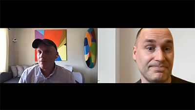

# 5 säsongen 2 i molnet

>[!VIDEO](https://video.tv.adobe.com/v/346567?quality=12&learn=on)

## Introduktion

Välkommen till tvåårens Cloud 5 Series från AEM Engineering. Ett av de största problemen i en produkts implementeringsfas är att den har tillräckligt många kodexempel och/eller live-demonstrationer av dessa exempel, verktyg eller API:er. Målet med den här serien är att tillhandahålla användbar information om AEM as a Cloud Service på 5 minuter eller mindre.

## Förslagsruta

Besök [Förslagsruta](https://forms.office.com/r/74P5Xz4UH0) för att skicka in ämnesförslag.

## Säsong 2

Varje säsong varierar i längd och släpps enligt ett fast schema. Ämnen för andra säsongen bygger i första hand på tidigare förfrågningar som vi har stött på i våra dagliga kontakter med kunder och partner. Besök den här sidan om du vill ha uppdateringar varje vecka eller följ oss på det sociala nätverk du väljer.

<table>
    <tr>
        <td>
            
            

                <a href="season-2/cloud5-experience-v-content-fragments.md"><strong>Fragment</strong></a>        
                 <em>med Darin Kuntze &amp; James Talbot, Senior Cloud Architects</em>
            

            

                 
                En färgstark ton när det gäller skillnaderna mellan upplevelse och innehållsfragment. Spoiler: alla vinner.
            

        </td>   
         <td>
            
            

                <a href="season-2/cloud5-repo-modernizer.md"><strong>Databasmodernisering</strong></a> 
                <em>med Darin Kuntze &amp; James Talbot, Senior Cloud Architects</em>
            

            

                 
                Snabb insikt i hur man använder databasuppdateraren för att strukturera om befintliga projektpaket till diskreta paket som är kompatibla med AEM som en molntjänst.
            

         </td>
         <td>
            
            

                  <a href="season-2/cloud5-admin-console.md"><strong>Admin Console</strong></a>
                <em>med Darin Kuntze &amp; James Talbot, Senior Cloud Architects</em>
            

            

             
               Darin och James diskuterar några vanliga saker som folk bör känna till om Admin Console, etablering och åtkomst.
            

         </td> 
  </tr>
  <tr>
         <td>
            
            

                  <a href="season-2/cloud5-sling-job-scheduler.md"><strong>Försäljningsjobb</strong></a>
                <em>med Darin Kuntze &amp; James Talbot, Senior Cloud Architects</em>
            

            

             
               Darin och James diskuterar saker och ting att se ut för jobbplanering och förbrukning i AEM som en molntjänst.
            

         </td> 
         <td>
            
            

                  <a href="season-2/cloud5-repoinit.md"><strong>Sling-databasinitierare</strong></a>
                <em>med Darin Kuntze &amp; James Talbot, Senior Cloud Architects</em>
            

            

             
              Lär dig några knep för att utnyttja Sling Repository Initializer, en repoinit.
            

         </td>   
     <td>
            
      

         <a href="season-2/cloud5-fix-your-cache.md"><strong>Korrigera... Cache</strong></a>
          <em>med Damian Langsweirdt och James Talbot, Senior Cloud Architects</em>
      

      

          
             Utforska områden för att optimera cacheminnet och få webbplatsen att fungera snabbare på AEM as a Cloud Service.
      

   </td> 
  </tr>
<tr>
   <td>
           
      

            <a href="season-2/cloud5-fix-your-rewrites.md"><strong>Korrigera... Skriver om</strong></a>
          <em>med Darin Kuntze &amp; James Talbot, Senior Cloud Architects</em>
      

      

         
         Snabb inblick i saker som kan snabba upp skrivningen och optimeringen på AEM as a Cloud Service.
      

     </td>   
     <td>
            
      

            <a href="season-2/cloud5-mocm-experience-audit.md"><strong>Mysteries of Cloud Manager.. Experience Audit</strong></a>
          <em>med Darin Kuntze, Senior Cloud Architect</em>
      

      

         
        Utforska grunderna i Cloud Manager och dess Experience Audit-funktioner.
      

   </td>
     <td>
            
      

            <a href="season-2/cloud5-mocm-unit-tests.md"><strong>Mysteries of Cloud Manager.. Enhetstester</strong></a>
          <em>med Darin Kuntze &amp; Bryan Stopp, Senior Cloud Architects</em>
      

      

         
        Darin och Bryan diskuterar hur Cloud Manager integrerar körning av enhetstester och rapportering av kodtäckning i sin CI/CD-pipeline för att uppmuntra och främja bästa praxis för enhetstestning AEM kod.
      

   </td> 
  </tr>
    <tr>
        <td>
               
            

                <a href="season-2/cloud5-mocm-functional-tests.md"><strong>Mysteries of Cloud Manager.. Funktionstester</strong> </a>        
                <em>med Darin Kuntze &amp; Bryan Stopp, Senior Cloud Architects</em>
            

            
 
                Darin och Bryan diskuterar olika typer av funktionstestning som är inbyggda i den AEM as a Cloud Service distributionsprocessen för att säkerställa kvaliteten och tillförlitligheten i koden.
            

        </td>
        <td></td>
        <td></td>
    </tr>
</table>
