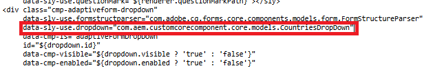

# Skapa strukturen för komponenten countries

Logga in på din AEM Forms-instans och följ de här stegen för att skapa en ny komponent baserat på den färdiga listrutan:

1. Navigera till /apps//components/adaptiveForm/dropdown i CRXDE Lite.
2. Kopiera den nedrullningsbara komponenten och klistra in den på samma katalognivå.
3. Byt namn på den kopierade komponenten till länder.
4. Uppdatera egenskapen jcr:title för cq:template-noden till countries.
5. Spara ändringarna.

Nu har du en ny komponent som heter countries, som är en exakt kopia av den färdiga listrutan. Detta är grunden för ytterligare anpassning.

## Skapa HTML-filen

Så här skapar du en HTML-fil för komponenten countries:

1. Navigera till mappen countries i crx-databasen
2. Skapa en ny fil med namnet countries.html.
3. Öppna /apps/core/fd/components/form/dropdown/v1/dropdown/dropdown.html i crx-databasen och kopiera dess innehåll.
4. Klistra in det kopierade innehållet i countries.html.
5. Ändra koden så att den använder den nya sling-modellen som visas på skärmbilden
6. Spara ändringarna.

Synka slutligen projektet med dessa uppdateringar för att säkerställa att ändringarna i CRX-databasen återspeglas i ditt AEM-projekt.

## Nästa steg

[Skapa cq-dialog](./dialog.md)
