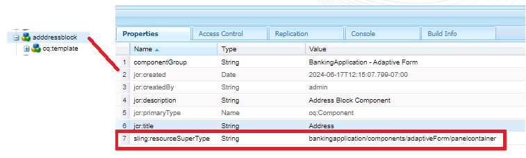

# Skapa adresskomponent

Logga in på CRXDE för din lokala molnförberedda instans av AEM Forms.

Skapa en kopia av noden ``/apps/bankingapplication/components/adaptiveForm/button`` och byt namn på den till adressblocket. Markera adressblocksnoden och ange dess egenskaper enligt nedan.

>[!NOTE]
>
> ``bankingapplication`` är det appId som angavs när Maven-projektet skapades. Detta appId kan vara ett annat i din miljö. Du kan skapa en kopia av vilken komponent som helst. Jag råkade bara göra en kopia av knappkomponenten

## cq-template-nodegenskaper

Markera noden ``cq-template`` under noden ``addressblock`` och ange dess egenskaper enligt nedan. Observera att fieldType är inställd på panel

## Lägg till noder under cq-template

Lägg till följande noder av typen ``nt:unstructured`` under ``cq-template``

* streetaddress
* stad
* zip
* läge

Dessa noder representerar fälten i adressblockskomponenten. Fälten för gatuadress, ort och postnummer kommer att vara ett textinmatningsfält och tillståndsfältet kommer att vara ett nedrullningsbart fält.

## Ange egenskaperna för en gatuadressnod

>[!NOTE]
>
> **_bankingapplication_** i sökvägen refererar till appId för maven-projektet. Det här kan vara annorlunda i din miljö

Markera noden ``streetaddress`` och ange dess egenskaper enligt nedan.

## Ange egenskaper för stadsnod

Markera noden ``city`` och ange dess egenskaper enligt nedan.

## Ange postnodens egenskaper

Markera noden ``zip`` och ange dess egenskaper enligt nedan.

## Ange egenskaper för lägesnod

Markera noden ``state`` och ange dess egenskaper enligt nedan. Observera tillstånd fieldType - det är inställt på en listruta

## Ange standardvärden för tillståndsfältet

Markera noden ``state`` och lägg till följande egenskaper.

| Namn | Typ | Värde |
|----------|----------|---------------------|
| enum | Sträng[] | CA,NY |
| enumNames | Sträng[] | California,New York |

Komponenten för det sista adressblocket ser ut så här

## Nästa steg

[Distribuera projektet](./deploy-your-project.md)
