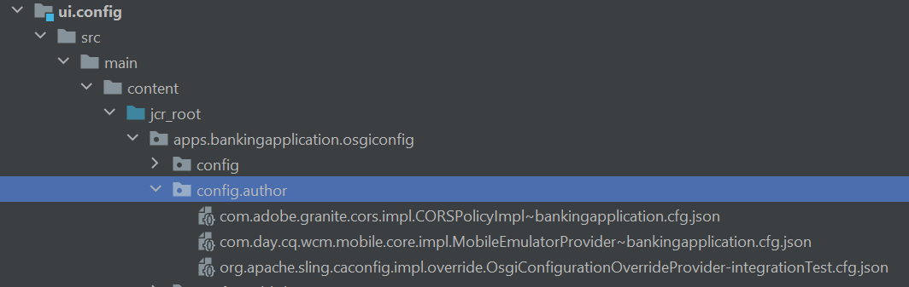

# Context Aware Cloud-konfigurationer

När du skapar en molnkonfiguration i din lokala miljö och vill testa utan fel bör du använda samma molnkonfiguration i dina överordnade miljöer, men utan att behöva ändra slutpunkt, hemlig nyckel/lösenord och användarnamn. För att uppnå detta har AEM Forms på Cloud Service introducerat möjligheten att definiera sammanhangsberoende molnkonfigurationer.
Till exempel kan molnkonfigurationen för Azure-lagringskontot återanvändas i dev-, stage- och produktionsmiljöer genom att använda olika anslutningssträngar och nycklar för.

Följande steg krävs för att skapa kontextuell molnkonfiguration

## Skapa miljövariabler

Standardmiljövariabler kan konfigureras och hanteras via Cloud Manager. De tillhandahålls körtidsmiljön och kan användas i OSGi-konfigurationer. [Miljövariabler kan vara antingen miljöspecifika värden eller miljöhemligheter, baserat på vad som ändras.](https://experienceleague.adobe.com/docs/experience-manager-cloud-service/content/implementing/using-cloud-manager/environment-variables.html?lang=sv-SE)


I följande skärmbild visas de definierade miljövariablerna azure_key och azure_connection_string


Dessa miljövariabler kan sedan anges i konfigurationsfilerna som ska användas i lämplig miljö
Om du till exempel vill att alla författarinstanser ska använda dessa miljövariabler definierar du konfigurationsfilen i mappen config.author enligt nedan

## Skapa konfigurationsfil

Öppna projektet i IntelliJ. Navigera till config.author och skapa en fil med namnet

```java
org.apache.sling.caconfig.impl.override.OsgiConfigurationOverrideProvider-integrationTest.cfg.json
```



Kopiera följande text till filen som du skapade i föregående steg. Koden i den här filen åsidosätter värdet för egenskaperna accountName och accountKey med miljövariablerna **azure_connection_string** och **azure_key**.

```json
{
  "enabled":true,
  "description":"dermisITOverrideConfig",
  "overrides":[
   "cloudconfigs/azurestorage/FormsCSAndAzureBlob/accountName=\"$[env:azure_connection_string]\"",
   "cloudconfigs/azurestorage/FormsCSAndAzureBlob/accountKey=\"$[secret:azure_key]\""

  ]
}
```

>[!NOTE]
>
>Den här konfigurationen gäller för alla författarmiljöer i din molntjänstinstans. Om du vill använda konfigurationen för publiceringsmiljöer måste du placera samma konfigurationsfil i mappen config.publish i ditt IntelliJ-projekt
>[!NOTE]
> Kontrollera att egenskapen som åsidosätts är en giltig egenskap i molnkonfigurationen. Navigera till molnkonfigurationen för att hitta den egenskap som du vill åsidosätta enligt nedan.


För REST-baserade molnkonfigurationer med grundläggande autentisering vill du vanligtvis skapa miljövariabler för egenskaperna serviceEndPoint, userName och password.

## Nästa steg

[Flytta ditt AEM-projekt till molnhanteraren](./push-project-to-cloud-manager-git.md)
