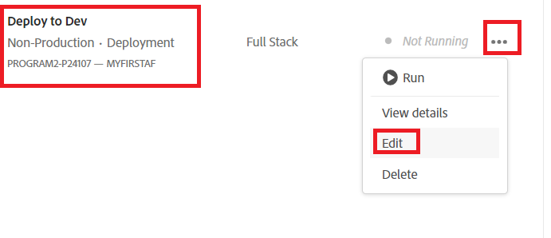

# Distribuera till utvecklingsmiljö

I föregående steg har vi flyttat huvudgrenen från vår lokala Git-databas till MyFirstAF-grenen i molnhanterarens databas.

Nästa steg är att distribuera koden till utvecklingsmiljön.
Logga in på molnhanteraren och välj ditt program

Välj Distribuera till utveckling enligt nedan

Välj distributionspipeline så som visas

Välj källkod och lämplig Git-gren

Se till att du uppdaterar ändringarna

Kör pipeline

När koden har distribuerats bör du se ändringarna i din molntjänstinstans av AEM Forms.

## Nästa steg

[Uppdaterar projekt av typen mardegarkityp](./updating-project-archetype.md)
