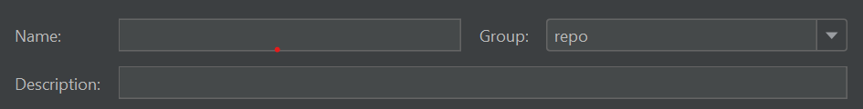
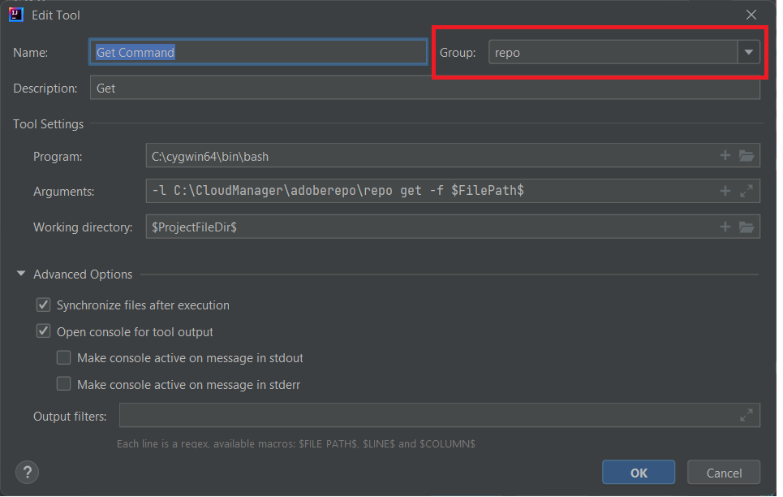

# Installerar Cygwin

Cygwin är en POSIX-kompatibel programmerings- och körningsmiljö som kan köras i Microsoft Windows.
Installera [Cygwin](https://www.cygwin.com/). Jag har installerat i mappen C:\cygwin64
>[!NOTE]
> Kontrollera att du har installerat paket för zip, uppzip, bläddring och synkronisering med cygwin-installationen

Skapa en mapp med namnet adoberepo under c:\cloudmanager.

[Installera repo-verktyget](https://github.com/Adobe-Marketing-Cloud/tools/tree/master/repo) Att installera repo-verktyget är bara att kopiera repo-filen och placera den i mappen c:\cloudmanger\adoberepo.

Lägg till följande i miljövariabeln Path C:\cygwin64\bin;C:\CloudManager\adoberepo;

## Konfigurera externa verktyg

* Starta IntelliJ
* Tryck på Ctrl+Alt+S för att öppna inställningsfönstret.
* Välj Verktyg ->Externa verktyg och klicka sedan på plustecknet (+) och ange följande som visas på skärmbilden.
  
* Se till att du skapar en grupp med namnet repo genom att skriva&quot;repo&quot; i listrutan Grupp och alla kommandon du skapar tillhör **repo** grupp

**Placera kommando**
**Program**: C:\cygwin64\bin\bash
**Argument**: -l C:\CloudManager\adoberepo\repo put -f \$FilePath\$
**Arbetsflöde**: \$ProjectFileDir\$

**Hämta kommando**
**Program**: C:\cygwin64\bin\bash
**Argument**: -l C:\CloudManager\adoberepo\repo get -f \$FilePath\$
**Arbetsflöde**: \$ProjectFileDir\$

**Statuskommando**
**Program**: C:\cygwin64\bin\bash
**Argument**: -l C:\CloudManager\adoberepo\repo st -f \$FilePath\$
**Arbetsflöde**: \$ProjectFileDir\$

**Diff-kommando**
**Program**: C:\cygwin64\bin\bash
**Argument**: -l C:\CloudManager\adoberepo\repo diff -f $FilePath$
**Arbetsflöde**: \$ProjectFileDir\$

Extrahera .repo-filen från [repo.zip](assets/repo.zip) och placera den i AEM projektrotmapp. (C:\CloudManager\aem-banking-application). Öppna .repo-filen och kontrollera att server- och inloggningsinställningarna matchar din miljö.
Öppna .gitignore-filen och lägg till följande längst ned i filen och spara ändringarna \# repo .repo

Välj ett projekt i ett aem-Banking-applikationsprojekt, till exempel ui.content, och högerklicka så ser du repoalternativet och under repoalternativet ser du de fyra kommandona vi lade till tidigare.

## AEM författarinstans{#set-up-aem-author-instance}

Följande steg kan följas för att snabbt konfigurera en molnklar instans på ditt lokala system.
* [Ladda ned AEM SDK](https://experience.adobe.com/#/downloads/content/software-distribution/en/aemcloud.html)

* [Ladda ned den senaste AEM Forms-appen](https://experience.adobe.com/#/downloads/content/software-distribution/en/aemcloud.html)

* Skapa följande mappstruktur c:\aemformscs\aem-sdk\author

* Extrahera filen aem-sdk-quickstart-xxxxxxx.jar från AEM SDK zip-filen och placera den i mappen c:\aemformscs\aem-sdk\author.Byt namn på filen jar till aem-author-p4502.jar

* Öppna kommandotolken och gå till \aemformscs\aem-sdk\author här kommandot java -jar aem-author-p4502.jar -gui. Detta startar installationen av AEM.
* Logga in med administratörs-/administratörsbehörighet
* Stoppa AEM
* Skapa följande mappstruktur.C:\aemformscs\aem-sdk\author\crx-quickstart\install
* Kopiera aem-forms-addon-xxxxxx.far till installationsmappen
* Öppna kommandotolken och gå till \aemformscs\aem-sdk\author här kommandot java -jar aem-author-p4502.jar -gui. Detta distribuerar formulären som läggs till i paketet i AEM.

## Nästa steg

[Synkronisera AEM formulär och mallar med AEM projekt](./deploy-your-first-form.md)
