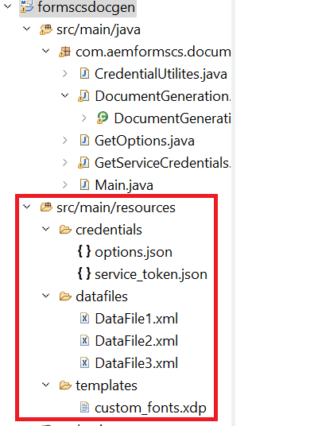

# Importera Eclipse-projekt

Ladda ned och zippa upp [zip-fil](./assets/aem-forms-cs-doc-gen.zip)

Starta Eclipse och importera projektet till Eclipse Projektet innehåller följande filer i resursmappen:

* DataFile1,DataFile2 och DataFile3 - Exempel på xml-datafiler som ska sammanfogas med mallen för att skapa den slutliga PDF-filen
* custom_fonts.xdp - XDP-mall.
* service_token.json - Du måste ersätta innehållet i den här filen med dina kontospecifika autentiseringsuppgifter
* options.json - De alternativ som anges i den här filen används för att ange egenskaperna för den PDF-fil som genereras av API:t

## Testa lösningen

* Kopiera och klistra in dina inloggningsuppgifter i tjänstens_token.json-resursfil i projektet.
* Öppna filen DocumentGeneration.java och ange i vilken mapp du vill spara de genererade PDF-filerna
* Öppna Main.java. Ange värdet för variabeln postURL så att det pekar på instansen.
* Kör Main.java som java-programmet

>[!NOTE]
> Första gången du kör java-programmet får du ett HTTP 403-fel. För att komma förbi detta måste du [lämplig behörighet för den tekniska kontoanvändaren i AEM](https://experienceleague.adobe.com/docs/experience-manager-learn/getting-started-with-aem-headless/authentication/service-credentials.html?lang=en#configure-access-in-aem).

**AEM Forms-användare** Det är den roll jag har använt för den här kursen.
